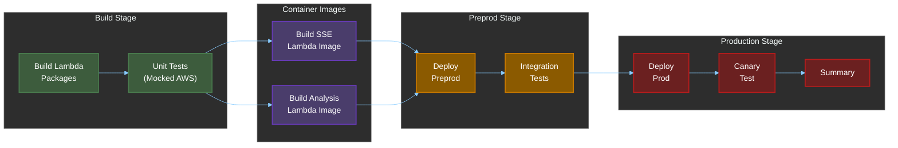
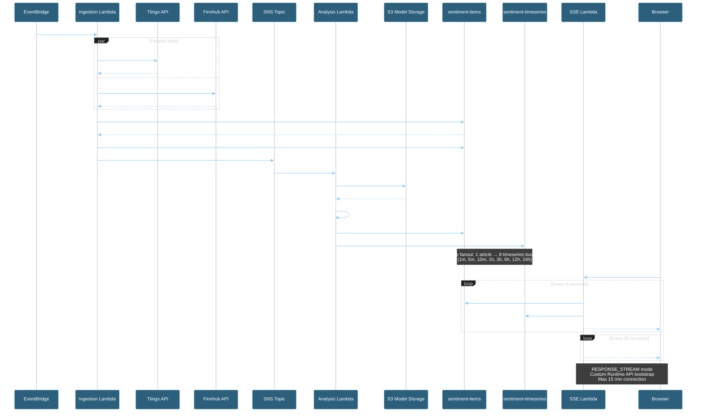
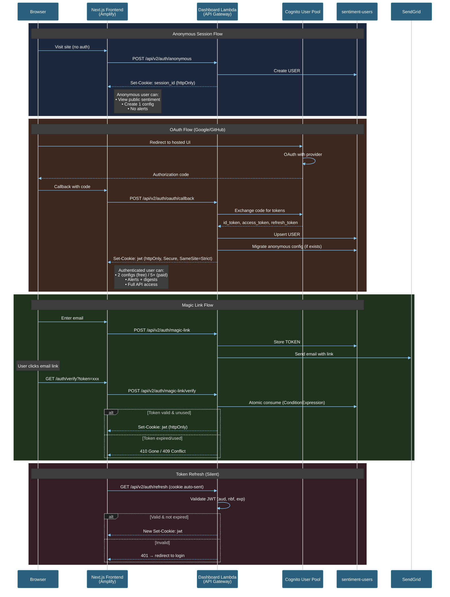

# sentiment-analyzer-gsk

[](./SECURITY.md)
[](https://www.python.org/downloads/)
[](./pyproject.toml)
[](./LICENSE)
[](https://github.com/psf/black)
[](https://www.terraform.io/)
[](https://aws.amazon.com/)

A cloud-hosted Sentiment Analyzer service built with serverless AWS architecture (Lambda, DynamoDB, EventBridge, SNS/SQS). Features dev/preprod/prod promotion pipeline with automated testing and deployment gates.

## CI/CD Pipeline Status

[](https://github.com/traylorre/sentiment-analyzer-gsk/actions/workflows/pr-checks.yml)
[](https://github.com/traylorre/sentiment-analyzer-gsk/actions/workflows/deploy.yml)


```mermaid
%%{init: {"theme": "dark", "themeVariables": {"primaryColor": "#4A90A4", "tertiaryColor": "#2d2d2d", "lineColor": "#88CCFF", "primaryTextColor": "#FFFFFF", "clusterBkg": "#2d2d2d", "clusterBorder": "#555555"}, "flowchart": {"curve": "basis", "nodeSpacing": 50, "rankSpacing": 60}}}%%
flowchart LR
    subgraph Build["Build Stage"]
        build["Build Lambda<br/>Packages"]
        test["Unit Tests<br/>(Mocked AWS)"]
    end

    subgraph Images["Container Images"]
        sse_img["Build SSE<br/>Lambda Image"]
        analysis_img["Build Analysis<br/>Lambda Image"]
    end

    subgraph Preprod["Preprod Stage"]
        deploy_preprod["Deploy<br/>Preprod"]
        test_preprod["Integration<br/>Tests"]
    end

    subgraph Prod["Production Stage"]
        deploy_prod["Deploy<br/>Prod"]
        canary["Canary<br/>Test"]
        summary["Summary"]
    end

    build --> test
    test --> sse_img
    test --> analysis_img
    sse_img --> deploy_preprod
    analysis_img --> deploy_preprod
    deploy_preprod --> test_preprod
    test_preprod --> deploy_prod
    deploy_prod --> canary
    canary --> summary

    classDef buildNode fill:#3D5C3D,stroke:#4a7c4e,stroke-width:2px,color:#FFFFFF
    classDef imageNode fill:#4A3D6B,stroke:#673ab7,stroke-width:2px,color:#FFFFFF
    classDef preprodNode fill:#8B5A00,stroke:#c77800,stroke-width:2px,color:#FFFFFF
    classDef prodNode fill:#6B2020,stroke:#b71c1c,stroke-width:2px,color:#FFFFFF

    class build,test buildNode
    class sse_img,analysis_img imageNode
    class deploy_preprod,test_preprod preprodNode
    class deploy_prod,canary,summary prodNode
```

**Quick Actions:**
```bash
# View pipeline status (automatic on push to main)
gh run list --workflow=deploy.yml --limit 5

# Watch latest pipeline run
gh run watch

# View detailed pipeline visualization
open https://github.com/traylorre/sentiment-analyzer-gsk/actions/workflows/deploy.yml
```

---

## Table of Contents

- [Quick Start](#quick-start)
- [Project Overview](#project-overview)
  - [What This Service Does](#what-this-service-does)
  - [Architecture](#architecture)
  - [Key Features](#key-features)
- [Architecture Diagrams](#architecture-diagrams)
- [Demo: Interactive Dashboard](#demo-interactive-dashboard)
- [Getting Started](#getting-started)
  - [Prerequisites](#prerequisites)
  - [Local Development Setup](#local-development-setup)
  - [Verify Your Setup](#verify-your-setup)
- [Development Workflow](#development-workflow)
  - [Git Hooks](#git-hooks-pre-commit-framework)
  - [Standard Workflow](#standard-workflow-for-contributors)
- [Deployment](#deployment)
  - [Environment Promotion Flow](#environment-promotion-flow)
  - [Deployment Commands](#deployment-commands)
- [On-Call & Operations](#on-call--operations)
  - [For On-Call Engineers](#for-on-call-engineers)
  - [Monitoring](#monitoring)
  - [Quick Diagnostics](#quick-diagnostics)
- [Project Structure](#project-structure)
- [Contributing](#contributing)
- [Security](#security)
- [Documentation](#documentation)
- [Project Status](#project-status)
- [License](#license)

---

## Quick Start

**For new contributors - complete setup in 10 minutes:**

```bash
# 1. Clone repository
git clone https://github.com/traylorre/sentiment-analyzer-gsk.git
cd sentiment-analyzer-gsk

# 2. Run bootstrap (checks prerequisites, fetches secrets, creates environment)
./scripts/bootstrap-workspace.sh

# 3. Verify setup
./scripts/verify-dev-environment.sh

# 4. Run tests
source .venv/bin/activate
source .env.local
pytest

# 5. Create feature branch
git checkout -b feature/your-feature-name
```

**You're ready to contribute!** See [Development Workflow](#development-workflow) for next steps.

> **New to the project?** See [docs/setup/WORKSPACE_SETUP.md](docs/setup/WORKSPACE_SETUP.md) for comprehensive setup instructions including WSL2, pyenv, and AWS configuration.

---

## Project Overview

### What This Service Does

Ingests financial news from external sources (Tiingo, Finnhub) and returns sentiment analysis:
- **Sentiment labels**: positive/neutral/negative
- **Confidence scores**: 0.0-1.0 range
- **Real-time & batch processing**: EventBridge scheduler + Lambda processors
- **Deduplication**: Avoids reprocessing duplicate items
- **Live dashboard**: Lambda Powertools + SSE for real-time sentiment streaming

### Architecture

- **Frontend**: AWS Amplify (Next.js SSR) with API Gateway backend
- **Compute**: AWS Lambda (Python 3.13) - 6 functions (Ingestion, Analysis, Dashboard, SSE-Streaming, Notification, Metrics)
- **Real-time**: SSE Lambda with custom Runtime API bootstrap for RESPONSE_STREAM mode
- **Orchestration**: EventBridge, SNS, SQS
- **Storage**: DynamoDB (on-demand capacity), S3 (static assets, ML models)
- **Sentiment Model**: DistilBERT (fine-tuned for social media)
- **Infrastructure**: Terraform with S3 backend and S3 native locking
- **CI/CD**: GitHub Actions → Dev → Preprod → Prod promotion pipeline

**Detailed Architecture Diagrams**: See [docs/diagrams/](./docs/diagrams/README.md)

### Key Features

✅ **Serverless & auto-scaling** - No manual capacity management

✅ **Cost-optimized** - Pay-per-use with budget alerts

✅ **Security-first** - Least-privilege IAM, secrets in AWS Secrets Manager

✅ **Observable** - CloudWatch dashboards, alarms, DLQ monitoring

✅ **Multi-environment** - Isolated dev/preprod/prod environments

✅ **Promotion pipeline** - Automated artifact promotion with validation gates

✅ **Real-time streaming** - SSE Lambda with Lambda Function URL (RESPONSE_STREAM mode)

✅ **Amplify-hosted UI** - Interview Dashboard served via AWS Amplify (Next.js SSR)

---

## Architecture Diagrams

[](https://mermaid.live/view#pako:eNqVWG1z4zYO_iscddLJXpXGL3F213PtjF-zuSbZrOU2H843GVqibTUS6aOkZN11_vsBJCWRtuu9KDMORYAACIAPIH7zQhExr-udnHyLeZx3ybeZl69YymZel8y8iMqnmecTM_kHlTGdJyxDKnCuZZxSuRmIREi94IeL3sdG70KvyVgoeLTDMO70LlttI5TJPN6htyL80_Qk5samffgwGIzHmmZ0T9nX3BGvnh39x5hKG47xcHDSMTqLluyGzlnSp-HTUoqCR4arrR7NFSZFBtr6T8sDWy2JQkasVNFRz8x7RYZFIl7CFZW58X1YyGcTpTnN4qy2NFjTMOZKyWUDJyXlT9Zks9F4fX09OZnxSiaZ9mecwJMV86Wk6xUZfQVrOE3-PfPKIQmYfI5DjP5_NDc-0xjECmDTA9K7v_7nXJ7_Oo455WEMy-7Yi7sESHxVzGGNGVWLbiHfWE6GNKfOis-9Il_dS_Ecg3cyWKgmSDWjFl8JsUyYT67i_FMxr9YzCAbf3d0z43lfxhA3ENZL6V-C25OO8iBcsahIkLMckgn8KKWnHZLG_N1Rbb10ncSLzXikdKkxGUvBc2S2NRlib722OOFNabqDBPz5z4wEwUS9gwfEWcTWidiQhRTp_7Nv8PMVzdkL3aCC-2ti3lwrgOkB6JNRMK0iM_g8CbqEJpAxj6FkEbgKYpv9kstCO2IiipxlJBfkhqbziB61o9w9ujSneRwe9kfQRoY26RchpIVScw1ckIXsBZIkW80FldHxHUOe4F7hH5ocgjII9elALAHuxDtHnZkEdjMiv2dMknshEqVbJV2XuHlm8nYJe7iJ-ZN6_dfDlPyZx2TJOJNK41EbtcPQyofAvJBxwUNc6J6ca75kGU4DczU2S5TmTrN12yfncPD1mbBymuQyXi4RXOxYw7neAHqgcjO0xTUbrQslr23kBXfBQTlVMEBQNT5mWJlc5CcVIjV3Ttfx-XPr_B9EqmRSk_e_DUY-GQSTsQ8AlGV7PgkCPFfw-x1195_vgtFjMJ2MerdVlJ5pEkduhPC5ZbDJEL1iRo5TWh8cn9g-bgIYaEflkLPXOUszkioRjvw7kccLk4ygxH61NbU6l3ve_8nGKT0LOXUFr4SlNE6yo6kW5EJSBXqIseWrG8oNp6kY9pHHDJWaDM9PCj9nMW7LTSMI4VR1BtYqNUv0tJIwK1qNVosICvOPGZx7wItTHd9OSqbTm3c2W4pn6hFagKfHXDwxDrzN1R5XZlKCnL6PFNHNDQZYlaNRZkRuKYcNS42gkH6_sU1WZsNjMBpMRtOjDrwFfWAYX6rcMGNX512A-iBUU7GOQyWcmrN1Jtl_Czi1rveGN19wxZcAR7p4QiBZZJSx4yG9FQhV0phUvZAfSS-B3sZVNUhEET3QPERQrF-U0huxzGCVyXg3vgmVaeYsMXP6RDQBO_kiXhZQGY4ai4CKctR_R0VfiheYBNoDm5dvh2SdnGhYnmhXkjGUJHL6HNOyfCKk1KXtnV5lBJKzs1-3n6bT-2BrVVvNUr8rLlOYaJZB3myhFu0LQjUh1EQgq6Jp5OBQ0WdeBWkzb2tVrD1JNWeWS0ZTxQ-YZm16p4Tpba8ojzBT5huyC7tm4_U06tF9E0QplizMt2XJ06xl1asZcXNz6Gm3Ox2Y5nfn1DJ9Uo_IRdB9iUE01Mc9j7i2IjIQBRNbC2AOceryi1BBSgOOLygLyff4alDYlliyx_azkpefDYR4ilkXnLuQLFtp0FLH41Oerz_zZIMFDNp2aB0CmrIAYPSXO8Fhd2W218FW6FxXeAy2plUdKJo31ZV4W3NqJtOKI4vbhu9xlg249mLVfO_xlfBZZj3A5h5Pba4-PkIyoirgtqophxjvi3kSZ6stAqed7mU7Yu0dMNXZdsnjkjV4bhFMzYEsRSH19zXU-78xzN7lLXxJJQbWbE21geCG2jY3b74UTG6OSa98aJ2ASjL2MoGCAcRxa_8wrzwmkuQ8CCnf04AMKh_Vat0pZIfyy21r_i6_sJsp271tVRi41SHVuwUIUjW9yMhVcL1rmc2-1xptrbJk2XigKzqQDKrI1UbaizSjI0ZlAIJuAqe1WO-aucdb9VYQsG31UWw7siq4h3IbS6q7u718PMziptNhnjIdDlNtjx_m2NvsYTar5FuHD6FTNQB23uabBDP2DMyXAMV4ZaTB_mUFYEdy-ILVzGECZXXIFoSVdwuLOEm6P3zoX35sXvhQAwE8u-auyLyevcQRfH611l_9EO9huuUVjCsx0Ymi5bX6nfH7QSVPX069TV6mW2QjsD287LeHlcD3o2G71XybwLTsGqs9X3Sa7UrksNFoNftvFFl3fVrmRR8NrWR-bDTb49HbZIYRN8Jwx53aiaOPzdHlG4OyMF_3VVgu-5Z5jUZ_MHxjWPAbonJge2jFZDzutDqtt0lb6l6xCrLjvfa40-x3vivQEmkKsG-qq7_TKLEKRuoVFW74JTr4FQb4cNJ9c55959TqZLfllHjm142NXxYek8o2O6CoD3WyTkqbWJ98X591K9EcIe0qwM5y0_ZhqOx53R8bl8-453spk_DpGnndb_qe2euqm2eguNfOyGDfOQOfOdPA6t42I0nDB0qx75mRom9egVLdMOOsvl6G2d27ZSVEPUB0LoMtyuur78FWRbDhodfFezHfK1SzMYwpfP2k5eSactzIV6_b8L0N_MLCv4QAetP3pCiWK6-7oEnGXv8H4aGzKw)

> Click the badge above to view the full system architecture in an interactive pan/zoom viewer.

### High-Level System Architecture


```mermaid
%%{init: {"theme": "dark", "themeVariables": {"primaryColor": "#4A90A4", "tertiaryColor": "#2d2d2d", "lineColor": "#88CCFF", "primaryTextColor": "#FFFFFF", "clusterBkg": "#2d2d2d", "clusterBorder": "#555555"}, "flowchart": {"curve": "basis", "nodeSpacing": 50, "rankSpacing": 60}}}%%
graph TB
    subgraph External["External Sources"]
        Tiingo[Tiingo API<br/>Financial News]
        Finnhub[Finnhub API<br/>Market Data]
        SendGrid[SendGrid<br/>Email Delivery]
    end

    subgraph Users["Users"]
        Browser[Web Browser]
    end

    subgraph AWS["AWS Cloud"]
        subgraph AuthLayer["Authentication Layer"]
            Cognito[Cognito<br/>User Pool]
            Secrets[Secrets Manager<br/>API Keys + JWT Secret]
        end

        subgraph EdgeLayer["Frontend Layer"]
            Amplify[Amplify<br/>Next.js SSR]
        end

        subgraph IngestionLayer["Ingestion Layer"]
            EB[EventBridge<br/>5 min schedule]
            Ingestion[Ingestion Lambda<br/>512MB · 60s]
        end

        subgraph ProcessingLayer["Processing Layer"]
            SNS[SNS Topic<br/>analysis-requests]
            Analysis[Analysis Lambda<br/>DistilBERT · 2048MB]
            S3Model[S3<br/>ML Models]
        end

        subgraph APILayer["API Layer"]
            APIGW[API Gateway<br/>REST /api/*]
            Dashboard[Dashboard Lambda<br/>1024MB]
            SSELambda[SSE Lambda<br/>RESPONSE_STREAM<br/>900s timeout]
            Notification[Notification Lambda<br/>Alerts + Digests]
        end

        subgraph StorageLayer["Storage Layer ── 5 Tables"]
            DDBItems[(sentiment-items<br/>News + Scores<br/>TTL: 30d)]
            DDBUsers[(sentiment-users<br/>Configs · Alerts<br/>Sessions)]
            DDBTimeseries[(sentiment-timeseries<br/>Multi-Resolution<br/>1m→24h buckets)]
            DDBOhlc[(ohlc-cache<br/>Price Data)]
            DLQ[SQS DLQ<br/>Failed Messages]
        end

        subgraph MonitoringLayer["Monitoring"]
            EBMetrics[EventBridge<br/>1 min schedule]
            Metrics[Metrics Lambda<br/>Stuck Items]
            CW[CloudWatch<br/>Logs · Alarms · RUM]
        end
    end

    %% User flows - thicker lines for primary paths (via API Gateway)
    Browser ==>|Static| Amplify
    Browser ==>|/api/*| APIGW
    Browser ==>|/api/v2/stream*| SSELambda
    Browser -.->|OAuth| Cognito

    %% Auth flows
    Cognito -.->|JWT validation| Dashboard
    Cognito -.->|JWT validation| SSELambda
    Secrets -.->|API keys| Ingestion
    Secrets -.->|JWT secret| Dashboard

    %% Ingestion pipeline
    EB -->|Trigger| Ingestion
    Tiingo -->|News articles| Ingestion
    Finnhub -->|Market news| Ingestion
    Ingestion ==>|Publish| SNS
    Ingestion -->|Store raw| DDBItems

    %% Analysis pipeline
    SNS ==>|Subscribe| Analysis
    Analysis -->|Load model| S3Model
    Analysis ==>|Store scores| DDBItems
    Analysis -->|Fanout| DDBTimeseries
    Analysis -.->|Failed| DLQ

    %% API Layer
    APIGW ==>|Invoke| Dashboard
    Dashboard ==>|Query| DDBItems
    Dashboard -->|User data| DDBUsers
    Dashboard -->|OHLC| DDBOhlc
    SSELambda ==>|Poll 5s| DDBItems
    SSELambda -->|Timeseries| DDBTimeseries
    SSELambda -.->|Stream| Browser

    %% Notifications
    Notification -->|Send| SendGrid
    Notification -->|Read configs| DDBUsers

    %% Monitoring
    EBMetrics -->|Trigger| Metrics
    Metrics -->|by_status GSI| DDBItems
    Metrics -->|Emit| CW

    %% Logging (dotted = async)
    Ingestion -.->|Logs| CW
    Analysis -.->|Logs| CW
    Dashboard -.->|Logs| CW
    SSELambda -.->|Logs| CW

    %% Styles - Dark theme with white text
    classDef layerBox fill:#2d2d2d,stroke:#555555,stroke-width:2px,color:#FFFFFF
    classDef lambdaStyle fill:#2B5F7C,stroke:#4A90A4,stroke-width:2px,color:#FFFFFF
    classDef storageStyle fill:#3D6B3D,stroke:#7ED321,stroke-width:2px,color:#FFFFFF
    classDef messagingStyle fill:#4A3D6B,stroke:#673ab7,stroke-width:2px,color:#FFFFFF
    classDef monitoringStyle fill:#8B5A00,stroke:#c77800,stroke-width:2px,color:#FFFFFF
    classDef externalStyle fill:#6B2020,stroke:#b71c1c,stroke-width:2px,color:#FFFFFF
    classDef edgeStyle fill:#8B4513,stroke:#ff5722,stroke-width:2px,color:#FFFFFF
    classDef authStyle fill:#5C3D6B,stroke:#8e24aa,stroke-width:2px,color:#FFFFFF

    class External,AWS,AuthLayer,EdgeLayer,IngestionLayer,ProcessingLayer,APILayer,StorageLayer,MonitoringLayer,Users layerBox
    class Ingestion,Analysis,Dashboard,SSELambda,Metrics,Notification lambdaStyle
    class DDBItems,DDBUsers,DDBTimeseries,DDBOhlc,DLQ,S3Model storageStyle
    class SNS messagingStyle
    class CW,EBMetrics,EB monitoringStyle
    class Tiingo,Finnhub,SendGrid,Browser externalStyle
    class Amplify,APIGW edgeStyle
    class Cognito,Secrets authStyle
```

**Legend:**
- **Solid thick lines (==>)**: Primary data paths
- **Solid thin lines (-->)**: Secondary data paths
- **Dotted lines (-.->)**: Async/logging flows
- **Purple nodes**: Lambda functions (6 total)
- **Green nodes**: Data stores (5 DynamoDB tables + S3 + DLQ)
- **Orange nodes**: Edge/CDN layer

### Environment Promotion Pipeline


```mermaid
%%{init: {"theme": "dark", "themeVariables": {"primaryColor": "#4A90A4", "tertiaryColor": "#2d2d2d", "lineColor": "#88CCFF", "primaryTextColor": "#FFFFFF", "clusterBkg": "#2d2d2d", "clusterBorder": "#555555"}, "flowchart": {"curve": "basis", "nodeSpacing": 50, "rankSpacing": 60}}}%%
graph LR
    subgraph Source["Source"]
        Code[Feature Branch]
    end

    subgraph Build["Build & Test"]
        GHA[GitHub Actions<br/>Build & Unit Test]
        Artifact[Lambda Packages<br/>SHA-versioned]
    end

    subgraph PreprodEnv["Preprod Environment"]
        PreprodDeploy[Deploy Preprod]
        PreprodTest[Integration Tests<br/>E2E + Playwright]
        PreprodApprove{Tests Pass?}
    end

    subgraph ProdEnv["Prod Environment"]
        ProdDeploy[Deploy Prod]
        Canary[Canary Test]
        ProdMonitor[Production<br/>Monitoring]
    end

    Code --> GHA
    GHA --> Artifact
    Artifact --> PreprodDeploy
    PreprodDeploy --> PreprodTest
    PreprodTest --> PreprodApprove

    PreprodApprove -->|Pass| ProdDeploy
    PreprodApprove -->|Fail| Code

    ProdDeploy --> Canary
    Canary --> ProdMonitor

    classDef sourceNode fill:#4A3D6B,stroke:#673ab7,stroke-width:2px,color:#FFFFFF
    classDef buildNode fill:#3D5C3D,stroke:#4a7c4e,stroke-width:2px,color:#FFFFFF
    classDef preprodNode fill:#8B5A00,stroke:#c77800,stroke-width:2px,color:#FFFFFF
    classDef prodNode fill:#6B2020,stroke:#b71c1c,stroke-width:2px,color:#FFFFFF
    classDef gateStyle fill:#8B4500,stroke:#e65100,stroke-width:2px,color:#FFFFFF

    class Code sourceNode
    class GHA,Artifact buildNode
    class PreprodDeploy,PreprodTest preprodNode
    class ProdDeploy,Canary,ProdMonitor prodNode
    class PreprodApprove gateStyle
```

### Data Flow: Real-Time Sentiment Processing


```mermaid
%%{init: {"theme": "dark", "themeVariables": {"primaryColor": "#4A90A4", "lineColor": "#88CCFF", "primaryTextColor": "#FFFFFF", "actorTextColor": "#FFFFFF", "actorBkg": "#2B5F7C", "actorBorder": "#4A90A4", "signalColor": "#88CCFF", "signalTextColor": "#FFFFFF", "noteBkgColor": "#3D3D3D", "noteTextColor": "#FFFFFF", "activationBkgColor": "#2d2d2d"}}}%%
sequenceDiagram
    participant EB as EventBridge
    participant Ing as Ingestion Lambda
    participant Tiingo as Tiingo API
    participant Finnhub as Finnhub API
    participant SNS as SNS Topic
    participant Ana as Analysis Lambda
    participant S3 as S3 Model Storage
    participant Items as sentiment-items
    participant TS as sentiment-timeseries
    participant SSE as SSE Lambda
    participant User as Browser

    EB->>Ing: Trigger (every 5 min)

    par Parallel fetch
        Ing->>Tiingo: GET /news (primary)
        Tiingo-->>Ing: Articles JSON
    and
        Ing->>Finnhub: GET /news (secondary)
        Finnhub-->>Ing: Articles JSON
    end

    Ing->>Items: Check dedup (SHA256 key)
    Items-->>Ing: Existing items

    Ing->>Items: Store new articles (status=pending)
    Ing->>SNS: Publish batch (max 10)

    SNS->>Ana: Trigger (per message)
    Ana->>S3: Load DistilBERT (cached)
    S3-->>Ana: model weights
    Ana->>Ana: Inference (<100ms warm)
    Ana->>Items: UpdateItem (status=analyzed)
    Ana->>TS: Fanout to 8 resolutions

    Note over Items,TS: Write fanout: 1 article → 8 timeseries buckets<br/>(1m, 5m, 10m, 1h, 3h, 6h, 12h, 24h)

    User->>SSE: EventSource connect

    loop Every 5 seconds
        SSE->>Items: Poll by_status GSI
        SSE->>TS: Query buckets
        SSE-->>User: SSE event (sentiment_update)
    end

    loop Every 30 seconds
        SSE-->>User: SSE event (heartbeat)
    end

    Note over SSE,User: RESPONSE_STREAM mode<br/>Custom Runtime API bootstrap<br/>Max 15 min connection
```

### DynamoDB Table Design

This service uses **5 DynamoDB tables** with single-table design patterns:

#### Table 1: `sentiment-items` (News & Scores)

| Attribute | Type | Key | Description |
|-----------|------|-----|-------------|
| `source_id` | String | PK | Composite: `{source}#{article_id}` |
| `timestamp` | String | SK | ISO8601 ingestion time |
| `status` | String | — | `pending` → `analyzed` |
| `sentiment` | String | — | `positive` / `neutral` / `negative` |
| `score` | Number | — | Confidence 0.0-1.0 |
| `matched_tags` | StringSet | — | Matched tickers/tags |
| `ttl_timestamp` | Number | TTL | Auto-delete after 30 days |

**GSIs:** `by_sentiment`, `by_tag`, `by_status`

---

#### Table 2: `sentiment-users` (Single-Table Design)

| PK Pattern | SK Pattern | Entity | Description |
|------------|------------|--------|-------------|
| `USER#{id}` | `PROFILE` | User | Email, preferences, created_at |
| `USER#{id}` | `CONFIG#{id}` | Config | Watch list (up to 5 tickers) |
| `USER#{id}` | `ALERT#{id}` | Alert | Threshold rules |
| `USER#{id}` | `SESSION#{id}` | Session | JWT refresh tokens (httpOnly) |
| `TOKEN#{id}` | `TOKEN` | MagicLink | One-time tokens (TTL: 15min) |

**GSIs:** `by_email`, `by_cognito_sub`, `by_entity_status`

---

#### Table 3: `sentiment-timeseries` (Multi-Resolution Buckets)

| PK Pattern | SK Pattern | Data | TTL |
|------------|------------|------|-----|
| `{ticker}#1m` | ISO8601 | Aggregated score | 6 hours |
| `{ticker}#5m` | ISO8601 | Aggregated score | 12 hours |
| `{ticker}#1h` | ISO8601 | Aggregated score | 7 days |
| `{ticker}#1d` | ISO8601 | Aggregated score | 90 days |

**Write fanout:** Each analyzed article creates 8 bucket updates.

---

#### Table 4: `ohlc-cache` (Price Data)

| PK Pattern | SK Pattern | Data |
|------------|------------|------|
| `{ticker}#tiingo` | `{resolution}#{timestamp}` | OHLC candles |

**No TTL** - Historical price data preserved permanently.

---

#### Table 5: `chaos-experiments` (Chaos Engineering)

| Attribute | Type | Key | Description |
|-----------|------|-----|-------------|
| `experiment_id` | String | PK | Unique experiment identifier |
| `created_at` | String | SK | ISO8601 creation time |
| `type` | String | — | Experiment type (latency, error, etc.) |
| `target` | String | — | Target component |
| `status` | String | — | `scheduled` / `running` / `completed` |
| `results` | Map | — | Experiment results and metrics |

**GSIs:** `by_status`, `by_type`

---

### Authentication Flow (Target State)

Post-Phase 0 security hardening with httpOnly cookies:


```mermaid
%%{init: {"theme": "dark", "themeVariables": {"primaryColor": "#4A90A4", "lineColor": "#88CCFF", "primaryTextColor": "#FFFFFF", "actorTextColor": "#FFFFFF", "actorBkg": "#2B5F7C", "actorBorder": "#4A90A4", "signalColor": "#88CCFF", "signalTextColor": "#FFFFFF", "noteBkgColor": "#3D3D3D", "noteTextColor": "#FFFFFF", "activationBkgColor": "#2d2d2d"}}}%%
sequenceDiagram
    participant Browser
    participant Frontend as Next.js Frontend<br/>(Amplify)
    participant Dashboard as Dashboard Lambda<br/>(API Gateway)
    participant Cognito as Cognito User Pool
    participant Users as sentiment-users

    rect rgb(30, 40, 60)
        Note over Browser,Users: Anonymous Session Flow
        Browser->>Frontend: Visit site (no auth)
        Frontend->>Dashboard: POST /api/v2/auth/anonymous
        Dashboard->>Users: Create USER#{uuid}
        Dashboard-->>Frontend: Set-Cookie: session_id (httpOnly)
        Note right of Frontend: Anonymous user can:<br/>• View public sentiment<br/>• Create 1 config<br/>• No alerts
    end

    rect rgb(60, 40, 30)
        Note over Browser,Users: OAuth Flow (Google/GitHub)
        Browser->>Cognito: Redirect to hosted UI
        Cognito->>Cognito: OAuth with provider
        Cognito-->>Browser: Authorization code
        Browser->>Frontend: Callback with code
        Frontend->>Dashboard: POST /api/v2/auth/oauth/callback
        Dashboard->>Cognito: Exchange code for tokens
        Cognito-->>Dashboard: id_token, access_token, refresh_token
        Dashboard->>Users: Upsert USER#{cognito_sub}
        Dashboard->>Users: Migrate anonymous config (if exists)
        Dashboard-->>Frontend: Set-Cookie: jwt (httpOnly, Secure, SameSite=Strict)
        Note right of Frontend: Authenticated user can:<br/>• 2 configs (free) / 5+ (paid)<br/>• Alerts + digests<br/>• Full API access
    end

    rect rgb(30, 50, 30)
        Note over Browser,Users: Magic Link Flow
        Browser->>Frontend: Enter email
        Frontend->>Dashboard: POST /api/v2/auth/magic-link
        Dashboard->>Users: Store TOKEN#{random_256bit} (TTL: 15min)
        Dashboard->>SendGrid: Send email with link
        Note over Browser: User clicks email link
        Browser->>Frontend: GET /auth/verify?token=xxx
        Frontend->>Dashboard: POST /api/v2/auth/magic-link/verify
        Dashboard->>Users: Atomic consume (ConditionExpression)
        alt Token valid & unused
            Dashboard-->>Frontend: Set-Cookie: jwt (httpOnly)
        else Token expired/used
            Dashboard-->>Frontend: 410 Gone / 409 Conflict
        end
    end

    rect rgb(50, 30, 35)
        Note over Browser,Users: Token Refresh (Silent)
        Frontend->>Dashboard: GET /api/v2/auth/refresh (cookie auto-sent)
        Dashboard->>Dashboard: Validate JWT (aud, nbf, exp)
        alt Valid & not expired
            Dashboard-->>Frontend: New Set-Cookie: jwt
        else Invalid
            Dashboard-->>Frontend: 401 → redirect to login
        end
    end
```

**Security Boundaries (Post-Phase 0):**
- ❌ No tokens in localStorage (XSS protection)
- ❌ No X-User-ID header fallback (impersonation protection)
- ✅ httpOnly cookies only (CSRF mitigated via SameSite=Strict)
- ✅ JWT claims: `aud`, `nbf`, `exp`, `roles` validated
- ✅ Magic links: Random 256-bit tokens, atomic consumption

---

## Demo: Interactive Dashboard

**Current Feature**: Real-time sentiment analysis with live dashboard

### Quick Links

| Document | Purpose |
|----------|---------|
| [SPEC.md](./SPEC.md) | Complete technical specification |
| [DEPLOYMENT.md](./docs/deployment/DEPLOYMENT.md) | Deployment procedures |
| [TROUBLESHOOTING.md](./docs/operations/TROUBLESHOOTING.md) | Common issues and solutions |
| [FAILURE_RECOVERY_RUNBOOK.md](./docs/operations/FAILURE_RECOVERY_RUNBOOK.md) | Incident response procedures |

### Running Locally

```bash
# 1. Create virtual environment
python -m venv venv
source venv/bin/activate  # Windows: venv\Scripts\activate

# 2. Install dependencies
pip install -r requirements-dev.txt

# 3. Run tests
pytest

# 4. Run linting
black --check src/ tests/
ruff check src/ tests/
```

---

## Getting Started

### Prerequisites

**Required tools** (install before proceeding):

| Tool | Version | Purpose | Install Link |
|------|---------|---------|--------------|
| **AWS CLI** | v2.x | AWS resource management | [Install Guide](https://docs.aws.amazon.com/cli/latest/userguide/getting-started-install.html) |
| **Terraform** | ≥1.5.0 | Infrastructure as code | [Install Guide](https://developer.hashicorp.com/terraform/downloads) |
| **Python** | 3.13+ | Lambda function development | [Download](https://www.python.org/downloads/) |
| **Git** | ≥2.30 | Version control | [Download](https://git-scm.com/downloads) |
| **jq** | Latest | JSON processing (optional) | [Download](https://jqlang.github.io/jq/download/) |

**Verify installations:**

```bash
aws --version          # Should show: aws-cli/2.x.x
terraform --version    # Should show: Terraform v1.5.x+
python --version       # Should show: Python 3.13.x
git --version          # Should show: git version 2.30+
```

---

### Local Development Setup

**Step 1: Clone and navigate**

```bash
git clone https://github.com/traylorre/sentiment-analyzer-gsk.git
cd sentiment-analyzer-gsk
```

**Step 2: Set up Python environment**

```bash
# Create virtual environment
python -m venv .venv
source .venv/bin/activate  # On Windows: .venv\Scripts\activate

# Install development dependencies
pip install -r requirements-dev.txt

# Install git hooks (runs tests before push, formatting before commit)
pre-commit install
pre-commit install --hook-type pre-push
```

**Step 3: Review project documentation**

```bash
# Read in this order:
1. SPEC.md              # Complete technical specification
2. CONTRIBUTING.md      # Collaboration guidelines
3. SECURITY.md          # Security policy
4. docs/deployment/DEPLOYMENT.md   # Deployment procedures
```

---

### Verify Your Setup

Run this verification checklist:

```bash
# ✅ Python environment
python --version
# Should show Python 3.13+

# ✅ Dependencies installed
pytest --version
black --version
ruff --version

# ✅ Git configured
git config user.name && git config user.email
# Should show your name and email

# ✅ Pre-commit hooks installed
pre-commit --version
# Should show pre-commit version
```

**All checks passed?** You're ready to contribute! 🎉

---

## Development Workflow

### Git Hooks (Pre-commit Framework)

This project uses the [pre-commit](https://pre-commit.com/) framework for git hooks.

**One-time setup after cloning:**

```bash
pip install pre-commit
pre-commit install
pre-commit install --hook-type pre-push
```

**What happens automatically:**

- **On commit**: Formatting (black), linting (ruff), Terraform fmt, security checks
- **On push**: Full test suite runs before code is pushed

**Manual commands:**

```bash
# Run all hooks on all files
pre-commit run --all-files

# Update hooks to latest versions
pre-commit autoupdate

# Skip hooks (NOT recommended)
git commit --no-verify
```

This ensures code quality before it reaches CI/CD, saving time and preventing failures.

### Standard Workflow for Contributors

**1. Always work on a feature branch:**

```bash
# Create branch from main
git checkout main
git pull origin main
git checkout -b feature/your-feature-name

# Branch naming convention:
# - feature/enhance-tiingo-integration
# - fix/scheduler-timeout
# - docs/update-readme
```

**2. Make your changes:**

```bash
# Edit files
# Run local tests
pytest

# Ensure code follows project conventions
black src/ tests/
ruff check src/ tests/
```

**3. Commit with clear messages:**

```bash
git add <changed-files>
git commit -m "feat: Add RSS feed parser with XML validation

- Implement feedparser-based RSS ingestion
- Add XXE attack prevention
- Add unit tests for malformed feeds

Addresses: #123"
```

**Commit message format:**
- `feat:` New feature
- `fix:` Bug fix
- `docs:` Documentation only
- `test:` Adding/updating tests
- `refactor:` Code refactoring
- `chore:` Maintenance tasks

**4. Push and create Pull Request:**

```bash
# Push to your branch
git push origin feature/your-feature-name

# GitHub will show link to create PR
# Or go to: https://github.com/traylorre/sentiment-analyzer-gsk/pulls
```

**5. PR Review Process:**

⚠️ **CRITICAL:** All PRs require approval from @traylorre before merge

- ✅ Automated checks run (linting, tests, security scans)
- ✅ CODEOWNERS automatically assigns @traylorre as reviewer
- ✅ GitHub Actions enforces: "Require approval from @traylorre"
- ✅ Branch protection prevents direct push to `main`
- ❌ **Contributors CANNOT merge their own PRs**
- ❌ **Contributors CANNOT bypass review requirements**

---

## Deployment

### Environment Promotion Flow

Deployments follow an automated promotion pipeline triggered on push to `main`:

1. **Build** - Lambda packages built and SHA-versioned
2. **Preprod** - Automatically deployed and tested
3. **Production** - Deployed after preprod validation

**Key Features:**
- ✅ Automatic progression through stages
- ✅ SHA-based artifact versioning
- ✅ S3 native state locking (no DynamoDB dependency)
- ✅ Integrated validation gates

**Monitor Deployments:**
```bash
# View pipeline status
gh run list --workflow=deploy.yml --limit 5

# Watch active deployment
gh run watch

# View workflow details
gh run view <run-id> --log
```

See [DEPLOYMENT.md](docs/deployment/DEPLOYMENT.md) for detailed deployment procedures and rollback strategies.

---

## On-Call & Operations

### For On-Call Engineers

**Start here during incidents**: [FAILURE_RECOVERY_RUNBOOK.md](./docs/operations/FAILURE_RECOVERY_RUNBOOK.md)

12 documented scenarios with step-by-step CLI commands:
- SC-01: Service Degradation
- SC-03: Ingestion Failures
- SC-04: Analysis Failures
- SC-05: Dashboard Failures
- SC-07: API Rate Limiting (Tiingo/Finnhub)
- SC-08: Budget Alerts
- SC-09: DLQ Accumulation
- And more...

### Monitoring

11 CloudWatch alarms configured in `infrastructure/terraform/modules/monitoring/`:
- Lambda error rates
- Latency thresholds
- SNS delivery failures
- DLQ depth
- Budget alerts

### Quick Diagnostics

```bash
# Check Lambda errors
aws logs filter-log-events \
  --log-group-name /aws/lambda/dev-sentiment-ingestion \
  --filter-pattern "ERROR" \
  --start-time $(date -d '30 minutes ago' +%s)000

# Check DynamoDB item count
aws dynamodb scan \
  --table-name dev-sentiment-items \
  --select COUNT

# Check active alarms
aws cloudwatch describe-alarms \
  --state-value ALARM \
  --alarm-name-prefix "dev-"
```

---

## Project Structure

```
sentiment-analyzer-gsk/
├── README.md                    # This file - start here
├── SPEC.md                      # Complete technical specification
├── CONTRIBUTING.md              # Contribution guidelines
├── SECURITY.md                  # Security policy and vulnerability reporting
├── LICENSE                      # MIT License
│
├── .specify/                    # GitHub Spec-Kit configuration
│   ├── memory/
│   │   └── constitution.md      # High-level project requirements
│   └── templates/               # Spec-Kit templates
│
├── infrastructure/              # Infrastructure as code
│   ├── terraform/               # Terraform root module
│   │   ├── modules/             # Reusable Terraform modules
│   │   │   ├── lambda/          # Lambda function module
│   │   │   ├── dynamodb/        # DynamoDB table module
│   │   │   ├── secrets/         # Secrets Manager module
│   │   │   ├── iam/             # IAM roles and policies
│   │   │   └── monitoring/      # CloudWatch alarms
│   │   ├── main.tf              # Root configuration
│   │   ├── variables.tf         # Input variables
│   │   └── outputs.tf           # Output values
│   └── scripts/                 # Helper scripts
│
├── src/                         # Lambda function source code
│   ├── lambdas/
│   │   ├── ingestion/           # Ingestion Lambda
│   │   ├── analysis/            # Analysis Lambda
│   │   ├── dashboard/           # Dashboard Lambda (REST API)
│   │   ├── sse_streaming/       # SSE Lambda (real-time streaming)
│   │   ├── metrics/             # Metrics Lambda (stuck item monitor)
│   │   └── shared/              # Shared Lambda utilities
│   └── lib/                     # Common library code
│
├── tests/                       # Test suites
│   ├── unit/                    # Unit tests
│   ├── integration/             # Integration tests
│   └── contract/                # Contract tests
│
├── docs/                        # Project documentation
│   ├── DEPLOYMENT.md            # Deployment guide
│   ├── DEMO_CHECKLIST.md        # Demo preparation
│   ├── TROUBLESHOOTING.md       # Common issues
│   ├── IAM_TERRAFORM_TROUBLESHOOTING.md  # IAM debugging guide
│   └── diagrams/                # Architecture diagrams
│       ├── README.md            # Diagram index and guidelines
│       ├── high-level-overview.mmd       # System overview
│       ├── security-flow.mmd             # Security zones
│       ├── sse-lambda-streaming.mmd      # SSE streaming flow
│       └── cloudfront-multi-origin.mmd   # CDN routing
│
├── specs/                       # Feature specifications
│   └── {feature-id}-{name}/     # Feature specifications
│       ├── spec.md              # Feature requirements
│       ├── plan.md              # Implementation plan
│       ├── tasks.md             # Task breakdown
│       └── quickstart.md        # Getting started guide
│
└── .github/                     # GitHub configuration
    ├── workflows/               # CI/CD workflows
    │   ├── pr-check-*.yml       # PR validation checks
    │   ├── deploy.yml           # Main deployment pipeline
    │   └── dependabot-auto-merge.yml  # Dependabot automation
    └── CODEOWNERS               # Review assignments
```

---

## Contributing

**Before contributing, you MUST read:**

📖 **[CONTRIBUTING.md](./CONTRIBUTING.md)** - Complete contribution guidelines including:
- Code of conduct
- Development workflow
- Testing requirements
- PR review process
- Security best practices

**Quick summary:**
- ✅ Contributors can: Create PRs, run tests, view documentation
- ❌ Contributors cannot: Merge PRs without approval, modify IAM directly

**All contributions require:**
- Passing tests (`pytest`)
- Code formatting (`black`, `ruff`)
- Security scans (automated via pre-commit)
- Review approval from @traylorre

---

## Security

🔒 **Security is paramount.** This project follows zero-trust principles.

### Reporting Vulnerabilities

**DO NOT create public issues for security vulnerabilities.**

Report privately to: @traylorre

Response time: 48 hours

See [SECURITY.md](./SECURITY.md) for full security policy.

### Security Posture

**Key security features:**
- Least-privilege IAM roles
- Secrets in AWS Secrets Manager (never in code)
- TLS 1.2+ enforcement
- Input validation on all external data
- NoSQL injection prevention (parameterized DynamoDB queries)
- Rate limiting and quota management
- Comprehensive audit logging (CloudTrail)
- Automated security scanning (pre-commit hooks)

---

## Documentation

### Primary Documents

| Document | Purpose | Audience |
|----------|---------|----------|
| **[README.md](./README.md)** | Getting started, onboarding | All contributors |
| **[SPEC.md](./SPEC.md)** | Complete technical specification | Developers, architects |
| **[CONTRIBUTING.md](./CONTRIBUTING.md)** | Collaboration guidelines | All contributors |
| **[SECURITY.md](./SECURITY.md)** | Security policy | Security researchers, contributors |
| **[DEPLOYMENT.md](./docs/deployment/DEPLOYMENT.md)** | Deployment procedures | DevOps, on-call |
| **[IAM_TERRAFORM_TROUBLESHOOTING.md](./docs/security/IAM_TERRAFORM_TROUBLESHOOTING.md)** | IAM debugging guide | DevOps, on-call |

### Architecture Diagrams

| Diagram | Purpose | File |
|---------|---------|------|
| **System Overview** | High-level architecture with all components | [high-level-overview.mmd](./docs/diagrams/high-level-overview.mmd) |
| **All Data Flows** | Complete data flow including auth (v3.0) | [dataflow-all-flows.mmd](./docs/diagrams/dataflow-all-flows.mmd) |
| **Security Flow** | Trust zones and data sanitization | [security-flow.mmd](./docs/diagrams/security-flow.mmd) |
| **Auth Use Cases** | Authentication flows (UC3) | [USE-CASE-DIAGRAMS.md](./docs/architecture/USE-CASE-DIAGRAMS.md#uc3-user-authentication-flow-v30) |
| **SSE Streaming** | Real-time event streaming architecture | [sse-lambda-streaming.mmd](./docs/diagrams/sse-lambda-streaming.mmd) |

### Operations Documentation

| Document | Purpose |
|----------|---------|
| [FAILURE_RECOVERY_RUNBOOK.md](./docs/operations/FAILURE_RECOVERY_RUNBOOK.md) | Incident response runbooks |
| [TROUBLESHOOTING.md](./docs/operations/TROUBLESHOOTING.md) | Common issues and solutions |
| [DEMO_CHECKLIST.md](./docs/operations/DEMO_CHECKLIST.md) | Demo day preparation |

---

## Project Status

**Current Phase:** Promotion Pipeline Setup 🔄

**Recent Milestones:**
1. ✅ Demo 1: Interactive Dashboard - **COMPLETE**
2. ✅ Dev Environment - **DEPLOYED**
3. 🔄 Preprod Environment - **IN PROGRESS**
4. ⏳ Prod Environment - **PENDING**

**Deployment Pipeline Status:**
- ✅ Build & Test - Automated
- ✅ Dev Deploy - Automated on merge to `main`
- 🔄 Preprod Deploy - Artifact promotion via workflow
- ⏳ Prod Deploy - Manual approval required

**Tracking:** See [GitHub Actions](https://github.com/traylorre/sentiment-analyzer-gsk/actions)

---

## License

MIT License - See [LICENSE](./LICENSE) file for details.

---

## Maintainers

**Project Owner & Security Admin:**
- @traylorre - All PR approvals, infrastructure deployments, credential management

**Contributors:**
_See [Contributors](https://github.com/traylorre/sentiment-analyzer-gsk/graphs/contributors)_

---

## Questions?

1. Check [SPEC.md](./SPEC.md) for technical details
2. Review [CONTRIBUTING.md](./CONTRIBUTING.md) for collaboration guidelines
3. Search [existing issues](https://github.com/traylorre/sentiment-analyzer-gsk/issues)
4. Ask in PR comments or create a new issue

**Welcome to the project!** 🚀
