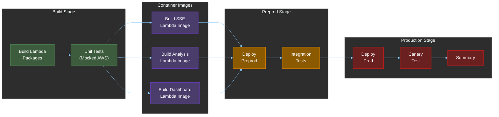
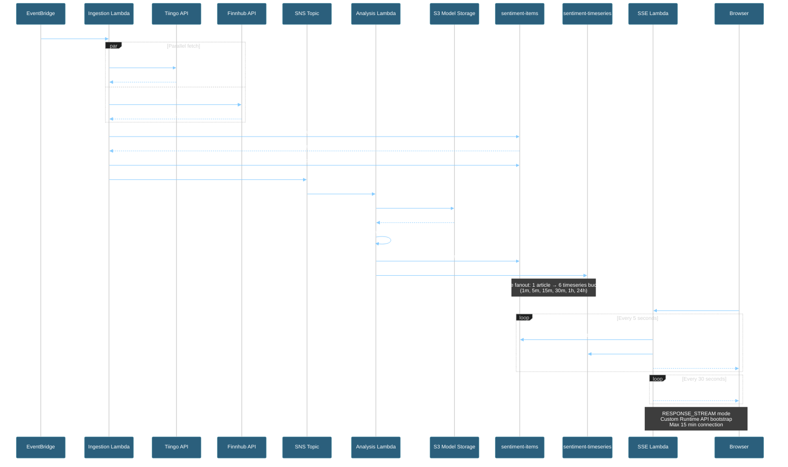

# sentiment-analyzer-gsk

[](./SECURITY.md)
[](https://www.python.org/downloads/)
[](./pyproject.toml)
[](./LICENSE)
[](https://github.com/astral-sh/ruff)
[](https://www.terraform.io/)
[](https://aws.amazon.com/)

Serverless sentiment analysis for financial news. Ingests articles from Tiingo and
Finnhub on a five-minute schedule, scores them with DistilBERT on Lambda, and streams
the results to a live dashboard over SSE. Preprod and prod environments promoted
through an automated pipeline with validation gates.

<!-- GRAPHIC STUB: hero banner (product screenshot or animated dashboard capture) -->

## Pipeline

[](https://github.com/traylorre/sentiment-analyzer-gsk/actions/workflows/pr-checks.yml)
[](https://github.com/traylorre/sentiment-analyzer-gsk/actions/workflows/deploy.yml)
[](https://github.com/traylorre/sentiment-analyzer-gsk/actions/workflows/nightly-e2e.yml)


```mermaid
%%{init: {"theme": "dark", "themeVariables": {"primaryColor": "#4A90A4", "tertiaryColor": "#2d2d2d", "lineColor": "#88CCFF", "primaryTextColor": "#FFFFFF", "clusterBkg": "#2d2d2d", "clusterBorder": "#555555"}, "flowchart": {"curve": "basis", "nodeSpacing": 50, "rankSpacing": 60}}}%%
flowchart LR
    subgraph Build["Build Stage"]
        build["Build Lambda<br/>Packages"]
        test["Unit Tests<br/>(Mocked AWS)"]
    end

    subgraph Images["Container Images"]
        sse_img["Build SSE<br/>Lambda Image"]
        analysis_img["Build Analysis<br/>Lambda Image"]
        dashboard_img["Build Dashboard<br/>Lambda Image"]
    end

    subgraph Preprod["Preprod Stage"]
        deploy_preprod["Deploy<br/>Preprod"]
        test_preprod["Integration<br/>Tests"]
    end

    subgraph Prod["Production Stage"]
        deploy_prod["Deploy<br/>Prod"]
        canary["Canary<br/>Test"]
        summary["Summary"]
    end

    build --> test
    test --> sse_img
    test --> analysis_img
    test --> dashboard_img
    sse_img --> deploy_preprod
    analysis_img --> deploy_preprod
    dashboard_img --> deploy_preprod
    deploy_preprod --> test_preprod
    test_preprod --> deploy_prod
    deploy_prod --> canary
    canary --> summary

    classDef buildNode fill:#3D5C3D,stroke:#4a7c4e,stroke-width:2px,color:#FFFFFF
    classDef imageNode fill:#4A3D6B,stroke:#673ab7,stroke-width:2px,color:#FFFFFF
    classDef preprodNode fill:#8B5A00,stroke:#c77800,stroke-width:2px,color:#FFFFFF
    classDef prodNode fill:#6B2020,stroke:#b71c1c,stroke-width:2px,color:#FFFFFF

    class build,test buildNode
    class sse_img,analysis_img,dashboard_img imageNode
    class deploy_preprod,test_preprod preprodNode
    class deploy_prod,canary,summary prodNode
```

```bash
gh run list --workflow=deploy.yml --limit 5   # pipeline status
gh run watch                                  # follow the active run
```

## What it does

- Fetches financial news from Tiingo and Finnhub in parallel, every 5 minutes
- Deduplicates on a SHA256 key so the same story is scored once
- Scores sentiment (positive / neutral / negative, confidence 0.0-1.0) with DistilBERT
- Fans each score out to six timeseries resolutions (1m through 24h)
- Streams updates to the browser over SSE, polling storage every 5 seconds
- Emails threshold alerts and digests through SendGrid

## How it works

Eight Lambda functions (ingestion, analysis, dashboard, SSE streaming, notification,
metrics, canary, chaos-restore), listed with their roles in
[docs/SERVICE-SHAPE.md](./docs/SERVICE-SHAPE.md). Python 3.13 throughout. EventBridge
schedules ingestion; SNS carries analysis requests; SQS is the dead-letter path.
Storage is six DynamoDB tables (on-demand) plus S3 for ML models and the ticker cache.
The frontend is Next.js SSR on AWS Amplify against an API Gateway REST backend; SSE
streams through CloudFront to a RESPONSE_STREAM Lambda with a custom Runtime API
bootstrap. Infrastructure is Terraform (pinned 1.9.8) with an S3 backend; state
locking is not configured, see
[docs/runbooks/terraform-state.md](./docs/runbooks/terraform-state.md).


```mermaid
%%{init: {"theme": "dark", "themeVariables": {"primaryColor": "#4A90A4", "tertiaryColor": "#2d2d2d", "lineColor": "#88CCFF", "primaryTextColor": "#FFFFFF", "clusterBkg": "#2d2d2d", "clusterBorder": "#555555"}, "flowchart": {"curve": "basis", "nodeSpacing": 50, "rankSpacing": 60}}}%%
graph TB
    subgraph External["External Sources"]
        Tiingo[Tiingo API<br/>Financial News]
        Finnhub[Finnhub API<br/>Market Data]
        SendGrid[SendGrid<br/>Email Delivery]
    end

    subgraph Users["Users"]
        Browser[Web Browser]
    end

    subgraph AWS["AWS Cloud"]
        subgraph AuthLayer["Authentication Layer"]
            Cognito[Cognito<br/>User Pool]
            Secrets[Secrets Manager<br/>API Keys + JWT Secret]
        end

        subgraph EdgeLayer["Frontend Layer"]
            Amplify[Amplify<br/>Next.js SSR]
        end

        subgraph IngestionLayer["Ingestion Layer"]
            EB[EventBridge<br/>5 min schedule]
            Ingestion[Ingestion Lambda<br/>512MB · 60s]
        end

        subgraph ProcessingLayer["Processing Layer"]
            SNS[SNS Topic<br/>analysis-requests]
            Analysis[Analysis Lambda<br/>DistilBERT · 2048MB]
            S3Model[S3<br/>ML Models]
        end

        subgraph APILayer["API Layer"]
            APIGW[API Gateway<br/>REST /api/*]
            Dashboard[Dashboard Lambda<br/>1024MB]
            SSELambda[SSE Lambda<br/>RESPONSE_STREAM<br/>900s timeout]
            Notification[Notification Lambda<br/>Alerts + Digests]
        end

        subgraph StorageLayer["Storage Layer ── 6 Tables"]
            DDBItems[(sentiment-items<br/>News + Scores<br/>TTL: 30d)]
            DDBUsers[(sentiment-users<br/>Configs · Alerts<br/>Sessions)]
            DDBTimeseries[(sentiment-timeseries<br/>Multi-Resolution<br/>1m→24h buckets)]
            DDBOhlc[(ohlc-cache<br/>Price Data)]
            DDBChaos[(chaos-experiments +<br/>chaos-reports)]
            DLQ[SQS DLQ<br/>Failed Messages]
        end

        subgraph MonitoringLayer["Monitoring"]
            EBMetrics[EventBridge<br/>1 min schedule]
            Metrics[Metrics Lambda<br/>Stuck Items]
            CW[CloudWatch<br/>Logs · Alarms · RUM]
        end
    end

    CloudFront[CloudFront<br/>WAF + Shield<br/>SSE Streaming]

    Browser ==>|Static| Amplify
    Browser ==>|/api/*| APIGW
    Browser ==>|/api/v2/stream*| CloudFront
    CloudFront ==>|OAC SigV4| SSELambda
    Browser -.->|OAuth| Cognito

    Cognito -.->|JWT validation| Dashboard
    Cognito -.->|JWT validation| SSELambda
    Secrets -.->|API keys| Ingestion
    Secrets -.->|JWT secret| Dashboard

    EB -->|Trigger| Ingestion
    Tiingo -->|News articles| Ingestion
    Finnhub -->|Market news| Ingestion
    Ingestion ==>|Publish| SNS
    Ingestion -->|Store raw| DDBItems

    SNS ==>|Subscribe| Analysis
    Analysis -->|Load model| S3Model
    Analysis ==>|Store scores| DDBItems
    Analysis -->|Fanout| DDBTimeseries
    Analysis -.->|Failed| DLQ

    APIGW ==>|Invoke| Dashboard
    Dashboard ==>|Query| DDBItems
    Dashboard -->|User data| DDBUsers
    Dashboard -->|OHLC| DDBOhlc
    SSELambda ==>|Poll 5s| DDBItems
    SSELambda -->|Timeseries| DDBTimeseries
    SSELambda -.->|Stream| Browser

    Notification -->|Send| SendGrid
    Notification -->|Read configs| DDBUsers

    EBMetrics -->|Trigger| Metrics
    Metrics -->|by_status GSI| DDBItems
    Metrics -->|Emit| CW

    Ingestion -.->|Logs| CW
    Analysis -.->|Logs| CW
    Dashboard -.->|Logs| CW
    SSELambda -.->|Logs| CW

    classDef layerBox fill:#2d2d2d,stroke:#555555,stroke-width:2px,color:#FFFFFF
    classDef lambdaStyle fill:#2B5F7C,stroke:#4A90A4,stroke-width:2px,color:#FFFFFF
    classDef storageStyle fill:#3D6B3D,stroke:#7ED321,stroke-width:2px,color:#FFFFFF
    classDef messagingStyle fill:#4A3D6B,stroke:#673ab7,stroke-width:2px,color:#FFFFFF
    classDef monitoringStyle fill:#8B5A00,stroke:#c77800,stroke-width:2px,color:#FFFFFF
    classDef externalStyle fill:#6B2020,stroke:#b71c1c,stroke-width:2px,color:#FFFFFF
    classDef edgeStyle fill:#8B4513,stroke:#ff5722,stroke-width:2px,color:#FFFFFF
    classDef authStyle fill:#5C3D6B,stroke:#8e24aa,stroke-width:2px,color:#FFFFFF

    class External,AWS,AuthLayer,EdgeLayer,IngestionLayer,ProcessingLayer,APILayer,StorageLayer,MonitoringLayer,Users layerBox
    class Ingestion,Analysis,Dashboard,SSELambda,Metrics,Notification lambdaStyle
    class DDBItems,DDBUsers,DDBTimeseries,DDBOhlc,DDBChaos,DLQ,S3Model storageStyle
    class SNS messagingStyle
    class CW,EBMetrics,EB monitoringStyle
    class Tiingo,Finnhub,SendGrid,Browser externalStyle
    class Amplify,APIGW,CloudFront edgeStyle
    class Cognito,Secrets authStyle
```

The article's path through the system, end to end:


```mermaid
%%{init: {"theme": "dark", "themeVariables": {"primaryColor": "#4A90A4", "lineColor": "#88CCFF", "primaryTextColor": "#FFFFFF", "actorTextColor": "#FFFFFF", "actorBkg": "#2B5F7C", "actorBorder": "#4A90A4", "signalColor": "#88CCFF", "signalTextColor": "#FFFFFF", "noteBkgColor": "#3D3D3D", "noteTextColor": "#FFFFFF", "activationBkgColor": "#2d2d2d"}}}%%
sequenceDiagram
    participant EB as EventBridge
    participant Ing as Ingestion Lambda
    participant Tiingo as Tiingo API
    participant Finnhub as Finnhub API
    participant SNS as SNS Topic
    participant Ana as Analysis Lambda
    participant S3 as S3 Model Storage
    participant Items as sentiment-items
    participant TS as sentiment-timeseries
    participant SSE as SSE Lambda
    participant User as Browser

    EB->>Ing: Trigger (every 5 min)

    par Parallel fetch
        Ing->>Tiingo: GET /news (primary)
        Tiingo-->>Ing: Articles JSON
    and
        Ing->>Finnhub: GET /news (secondary)
        Finnhub-->>Ing: Articles JSON
    end

    Ing->>Items: Check dedup (SHA256 key)
    Items-->>Ing: Existing items

    Ing->>Items: Store new articles (status=pending)
    Ing->>SNS: Publish batch (max 10)

    SNS->>Ana: Trigger (per message)
    Ana->>S3: Load DistilBERT (cached)
    S3-->>Ana: model weights
    Ana->>Ana: Inference (warm start)
    Ana->>Items: UpdateItem (status=analyzed)
    Ana->>TS: Fanout to 6 resolutions

    Note over Items,TS: Write fanout: 1 article → 6 timeseries buckets<br/>(1m, 5m, 15m, 30m, 1h, 24h)

    User->>SSE: EventSource connect

    loop Every 5 seconds
        SSE->>Items: Poll by_status GSI
        SSE->>TS: Query buckets
        SSE-->>User: SSE event (sentiment_update)
    end

    loop Every 30 seconds
        SSE-->>User: SSE event (heartbeat)
    end

    Note over SSE,User: RESPONSE_STREAM mode<br/>Custom Runtime API bootstrap<br/>Max 15 min connection
```

<!-- GRAPHIC STUB: dashboard screenshot strip (customer dashboard, live stream view) -->

## Why this is cool

- **Streaming without WebSockets.** A Lambda holds an SSE connection open for up to 15
  minutes in RESPONSE_STREAM mode, behind CloudFront with OAC SigV4. The custom Runtime
  API bootstrap propagates trace IDs per invocation, so streams stay observable
  ([docs/x-ray.md](./docs/x-ray.md)).
- **Six-resolution timeseries fanout.** One scored article lands in 1m through 24h
  buckets on write, so resolution switching reads pre-aggregated data
  ([docs/operations/PERFORMANCE_VALIDATION.md](./docs/operations/PERFORMANCE_VALIDATION.md)).
- **Fourteen caches, one strategy.** Every cache is cache-aside with write-around, from
  in-memory adapter caches to a DynamoDB OHLC layer ([docs/cache.md](./docs/cache.md)).
- **Chaos tooling with a kill switch.** Scripted fault injection against preprod with
  SSM snapshots, an andon cord, and an auditable experiment log
  ([docs/chaos.md](./docs/chaos.md)).
- **Serverless economics.** No idle compute, on-demand DynamoDB, budget alerts, and a
  coverage-gated (≥80%) test suite keeping the whole thing deployable.

## Documentation

| Start here | |
|---|---|
| [SERVICE.md](./SERVICE.md) | Documentation tree root |
| [PRODUCT.md](./PRODUCT.md) | Product intent and use cases |
| [docs/SERVICE-SHAPE.md](./docs/SERVICE-SHAPE.md) | Architecture, topology, what does not exist |
| [docs/setup/WORKSPACE_SETUP.md](./docs/setup/WORKSPACE_SETUP.md) | Getting started: prerequisites, bootstrap, verify |
| [CONTRIBUTING.md](./CONTRIBUTING.md) | Workflow, git hooks, review process, roles |
| [docs/operations.md](./docs/operations.md) | On-call: diagnosis, rollback, what actually alerts |
| [docs/OBSERVABILITY.md](./docs/OBSERVABILITY.md) | Metrics, alarms, dashboard privacy rules |
| [docs/MODELING.md](./docs/MODELING.md) | Output schema, retention, model versioning |
| [docs/authorization.md](./docs/authorization.md) | Auth flows and security boundaries |
| [SECURITY.md](./SECURITY.md) | Security policy and vulnerability reporting |
| [docs/diagrams/](./docs/diagrams/) | Full diagram set (system, security, SSE, data flows) |

## License

MIT, see [LICENSE](./LICENSE). Maintained by [@traylorre](https://github.com/traylorre);
all PRs require owner approval, see [CONTRIBUTING.md](./CONTRIBUTING.md).

> **CANON**: verified against code.
