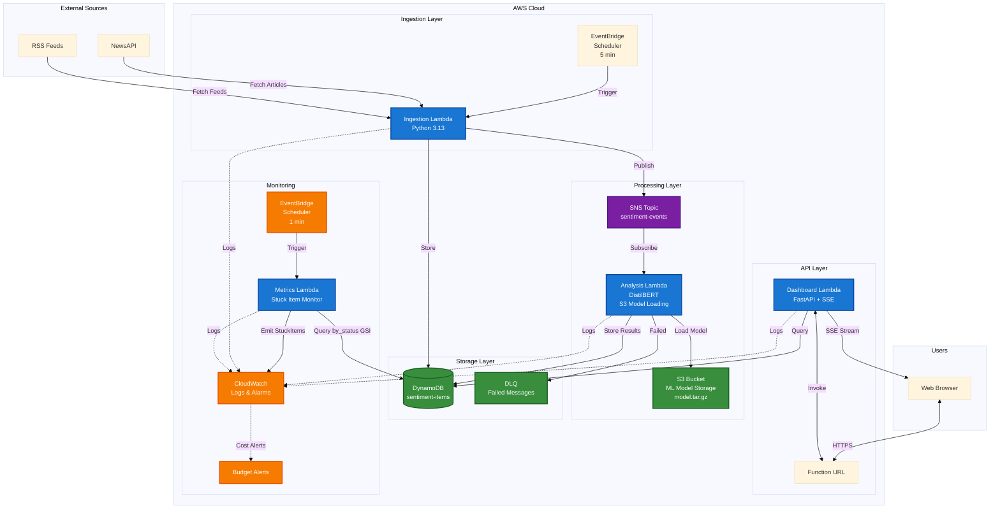
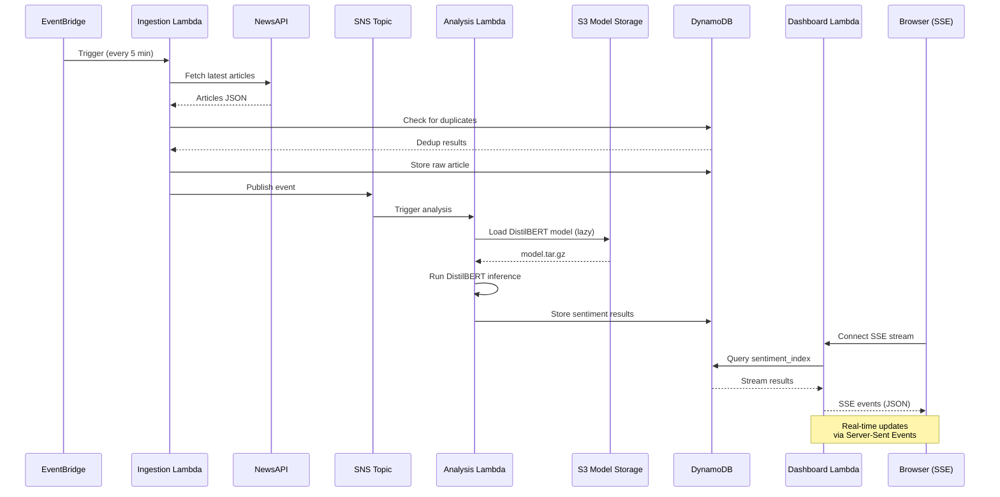

# sentiment-analyzer-gsk

[](./SECURITY.md)
[](https://www.python.org/downloads/)
[](./pyproject.toml)
[](./LICENSE)
[](https://github.com/psf/black)
[](https://www.terraform.io/)
[](https://aws.amazon.com/)

A cloud-hosted Sentiment Analyzer service built with serverless AWS architecture (Lambda, DynamoDB, EventBridge, SNS/SQS). Features dev/preprod/prod promotion pipeline with automated testing and deployment gates.

## CI/CD Pipeline Status

### PR Checks
[](https://github.com/traylorre/sentiment-analyzer-gsk/actions/workflows/pr-check-lint.yml)
[](https://github.com/traylorre/sentiment-analyzer-gsk/actions/workflows/pr-check-test.yml)
[](https://github.com/traylorre/sentiment-analyzer-gsk/actions/workflows/pr-check-security.yml)
[](https://github.com/traylorre/sentiment-analyzer-gsk/actions/workflows/pr-check-codeql.yml)

### Deployment Pipeline

```mermaid
%%{init: {'theme':'default', 'themeVariables': {'primaryColor':'#e3f2fd', 'primaryTextColor':'#1565c0', 'primaryBorderColor':'#1565c0', 'lineColor':'#424242', 'secondaryColor':'#fff3e0', 'tertiaryColor':'#e8f5e9', 'background':'#ffffff'}}}%%
flowchart LR
    subgraph Stage1["Build Stage"]
        Build["Build Lambda<br/>Packages"]
    end

    subgraph Stage2["Dev Stage"]
        DeployDev["Deploy Dev"]
        TestDev["Test Dev"]
    end

    subgraph Stage3["Preprod Stage"]
        DeployPreprod["Deploy Preprod"]
        TestPreprod["Test Preprod"]
    end

    subgraph Stage4["Prod Stage"]
        DeployProd["Deploy Prod"]
        CanaryTest["Canary Test"]
        Summary["Summary"]
    end

    Build --> DeployDev
    DeployDev --> TestDev
    TestDev --> DeployPreprod
    DeployPreprod --> TestPreprod
    TestPreprod --> DeployProd
    DeployProd --> CanaryTest
    CanaryTest --> Summary

    classDef buildStage fill:#c8e6c9,stroke:#2e7d32,stroke-width:2px,color:#1b5e20
    classDef devStage fill:#bbdefb,stroke:#1565c0,stroke-width:2px,color:#0d47a1
    classDef preprodStage fill:#ffe0b2,stroke:#ef6c00,stroke-width:2px,color:#e65100
    classDef prodStage fill:#ffcdd2,stroke:#c62828,stroke-width:2px,color:#b71c1c
    classDef summaryNode fill:#e1bee7,stroke:#7b1fa2,stroke-width:2px,color:#4a148c

    class Build buildStage
    class DeployDev,TestDev devStage
    class DeployPreprod,TestPreprod preprodStage
    class DeployProd,CanaryTest prodStage
    class Summary summaryNode
```

[](https://github.com/traylorre/sentiment-analyzer-gsk/actions/workflows/deploy.yml)



**Quick Actions:**
```bash
# View pipeline status (automatic on push to main)
gh run list --workflow=deploy.yml --limit 5

# Watch latest pipeline run
gh run watch

# View detailed pipeline visualization
open https://github.com/traylorre/sentiment-analyzer-gsk/actions/workflows/deploy.yml
```

---

## Table of Contents

- [Quick Start](#quick-start)
- [Project Overview](#project-overview)
  - [What This Service Does](#what-this-service-does)
  - [Architecture](#architecture)
  - [Key Features](#key-features)
- [Architecture Diagrams](#architecture-diagrams)
- [Demo: Interactive Dashboard](#demo-interactive-dashboard)
- [Getting Started](#getting-started)
  - [Prerequisites](#prerequisites)
  - [Local Development Setup](#local-development-setup)
  - [Verify Your Setup](#verify-your-setup)
- [Development Workflow](#development-workflow)
  - [Git Hooks](#git-hooks-pre-commit-framework)
  - [Standard Workflow](#standard-workflow-for-contributors)
- [Deployment](#deployment)
  - [Environment Promotion Flow](#environment-promotion-flow)
  - [Deployment Commands](#deployment-commands)
- [On-Call & Operations](#on-call--operations)
  - [For On-Call Engineers](#for-on-call-engineers)
  - [Monitoring](#monitoring)
  - [Quick Diagnostics](#quick-diagnostics)
- [Project Structure](#project-structure)
- [Contributing](#contributing)
- [Security](#security)
- [Documentation](#documentation)
- [Project Status](#project-status)
- [License](#license)

---

## Quick Start

**For new contributors - complete setup in 10 minutes:**

```bash
# 1. Clone repository
git clone https://github.com/traylorre/sentiment-analyzer-gsk.git
cd sentiment-analyzer-gsk

# 2. Install prerequisites (see Prerequisites section)
# Verify: aws --version, terraform --version, python --version

# 3. Set up Python environment
python -m venv .venv
source .venv/bin/activate  # Windows: .venv\Scripts\activate
pip install -r requirements-dev.txt

# 4. Install git hooks
pre-commit install
pre-commit install --hook-type pre-push

# 5. Run tests locally
pytest

# 6. Read project specification
cat SPEC.md  # or open in your editor

# 7. Review contribution guidelines
cat CONTRIBUTING.md

# 8. Create feature branch
git checkout -b feature/your-feature-name
```

**You're ready to contribute!** See [Development Workflow](#development-workflow) for next steps.

---

## Project Overview

### What This Service Does

Ingests text from external sources (NewsAPI, RSS feeds) and returns sentiment analysis:
- **Sentiment labels**: positive/neutral/negative
- **Confidence scores**: 0.0-1.0 range
- **Real-time & batch processing**: EventBridge scheduler + Lambda processors
- **Deduplication**: Avoids reprocessing duplicate items
- **Live dashboard**: FastAPI + SSE for real-time sentiment streaming

### Architecture

- **Compute**: AWS Lambda (Python 3.13)
- **Orchestration**: EventBridge, SNS, SQS
- **Storage**: DynamoDB (on-demand capacity)
- **Sentiment Model**: DistilBERT (fine-tuned for social media)
- **Infrastructure**: Terraform with S3 backend and S3 native locking
- **CI/CD**: GitHub Actions → Dev → Preprod → Prod promotion pipeline

### Key Features

✅ **Serverless & auto-scaling** - No manual capacity management
✅ **Cost-optimized** - Pay-per-use with budget alerts
✅ **Security-first** - Least-privilege IAM, secrets in AWS Secrets Manager
✅ **Observable** - CloudWatch dashboards, alarms, DLQ monitoring
✅ **Multi-environment** - Isolated dev/preprod/prod environments
✅ **Promotion pipeline** - Automated artifact promotion with validation gates

---

## Architecture Diagrams

### High-Level System Architecture



### Environment Promotion Pipeline

```mermaid
%%{init: {'theme':'base', 'themeVariables': {'fontSize':'14px'}}}%%
graph LR
    subgraph "Source"
        Code[Feature Branch]
    end

    subgraph "Build"
        GHA[GitHub Actions<br/>Build & Test]
        Artifact[Lambda Packages<br/>SHA-versioned]
    end

    subgraph "Dev Environment"
        DevDeploy[Deploy Dev]
        DevTest[Integration Tests]
        DevApprove{Tests Pass?}
    end

    subgraph "Preprod Environment"
        PreprodDeploy[Deploy Preprod]
        PreprodTest[Smoke Tests]
        PreprodApprove{Validation<br/>Gate}
    end

    subgraph "Prod Environment"
        ProdApprove{Manual<br/>Approval}
        ProdDeploy[Deploy Prod]
        ProdMonitor[Production<br/>Monitoring]
    end

    Code --> GHA
    GHA --> Artifact
    Artifact --> DevDeploy
    DevDeploy --> DevTest
    DevTest --> DevApprove

    DevApprove -->|✅ Pass| PreprodDeploy
    DevApprove -->|❌ Fail| Code

    PreprodDeploy --> PreprodTest
    PreprodTest --> PreprodApprove

    PreprodApprove -->|✅ Pass| ProdApprove
    PreprodApprove -->|❌ Fail| Code

    ProdApprove -->|✅ Approved| ProdDeploy
    ProdApprove -->|❌ Rejected| Code

    ProdDeploy --> ProdMonitor

    classDef gateStyle fill:#f57c00,stroke:#e65100,stroke-width:2px,color:#fff
    classDef criticalGate fill:#c62828,stroke:#b71c1c,stroke-width:2px,color:#fff
    classDef artifactStyle fill:#388e3c,stroke:#1b5e20,stroke-width:2px,color:#fff

    class DevApprove,PreprodApprove gateStyle
    class ProdApprove criticalGate
    class Artifact artifactStyle
```



### Data Flow: Real-Time Sentiment Processing



### DynamoDB Table Design

**Main Table:** `sentiment-items`

| Attribute | Type | Key Type | Description |
|-----------|------|----------|-------------|
| `item_id` | String | Partition Key (PK) | Unique identifier for each item |
| `source_type` | String | - | Source system (e.g., "newsapi", "rss") |
| `source_id` | String | - | External source identifier |
| `title` | String | - | Article/item title |
| `content` | String | - | Article text content |
| `ingested_at` | Timestamp | - | When item was ingested |
| `status` | String | - | Processing status ("pending", "analyzed") |
| `sentiment_score` | Float | - | Sentiment score (0.0-1.0) |
| `sentiment_label` | String | - | Sentiment classification (positive/neutral/negative) |
| `analyzed_at` | Timestamp | - | When sentiment analysis completed |
| `tags` | JSON | - | Associated tags for categorization |

**Global Secondary Indexes (GSI):**

1. **sentiment_index** - Query by sentiment
   - PK: `sentiment_label`
   - SK: `analyzed_at`
   - Use case: Fetch all positive/negative items sorted by time

2. **tag_index** - Query by tag
   - PK: `tag`
   - SK: `ingested_at`
   - Use case: Fetch all items for a specific tag

3. **status_index** - Query by processing status
   - PK: `status`
   - SK: `ingested_at`
   - Use case: Find pending items for processing

---

## Demo: Interactive Dashboard

**Current Feature**: Real-time sentiment analysis with live dashboard

### Quick Links

| Document | Purpose |
|----------|---------|
| [Quickstart Guide](./specs/001-interactive-dashboard-demo/quickstart.md) | Step-by-step deployment |
| [Implementation Plan](./specs/001-interactive-dashboard-demo/plan.md) | Architecture & design decisions |
| [Feature Spec](./specs/001-interactive-dashboard-demo/spec.md) | Requirements & acceptance criteria |
| [On-Call SOP](./specs/001-interactive-dashboard-demo/ON_CALL_SOP.md) | Incident response runbooks |

### Running Locally

```bash
# 1. Create virtual environment
python -m venv venv
source venv/bin/activate  # Windows: venv\Scripts\activate

# 2. Install dependencies
pip install -r requirements-dev.txt

# 3. Run tests
pytest

# 4. Run linting
black --check src/ tests/
ruff check src/ tests/
```

---

## Getting Started

### Prerequisites

**Required tools** (install before proceeding):

| Tool | Version | Purpose | Install Link |
|------|---------|---------|--------------|
| **AWS CLI** | v2.x | AWS resource management | [Install Guide](https://docs.aws.amazon.com/cli/latest/userguide/getting-started-install.html) |
| **Terraform** | ≥1.5.0 | Infrastructure as code | [Install Guide](https://developer.hashicorp.com/terraform/downloads) |
| **Python** | 3.13+ | Lambda function development | [Download](https://www.python.org/downloads/) |
| **Git** | ≥2.30 | Version control | [Download](https://git-scm.com/downloads) |
| **jq** | Latest | JSON processing (optional) | [Download](https://jqlang.github.io/jq/download/) |

**Verify installations:**

```bash
aws --version          # Should show: aws-cli/2.x.x
terraform --version    # Should show: Terraform v1.5.x+
python --version       # Should show: Python 3.13.x
git --version          # Should show: git version 2.30+
```

---

### Local Development Setup

**Step 1: Clone and navigate**

```bash
git clone https://github.com/traylorre/sentiment-analyzer-gsk.git
cd sentiment-analyzer-gsk
```

**Step 2: Set up Python environment**

```bash
# Create virtual environment
python -m venv .venv
source .venv/bin/activate  # On Windows: .venv\Scripts\activate

# Install development dependencies
pip install -r requirements-dev.txt

# Install git hooks (runs tests before push, formatting before commit)
pre-commit install
pre-commit install --hook-type pre-push
```

**Step 3: Review project documentation**

```bash
# Read in this order:
1. SPEC.md              # Complete technical specification
2. CONTRIBUTING.md      # Collaboration guidelines
3. SECURITY.md          # Security policy
4. docs/DEPLOYMENT.md   # Deployment procedures
```

---

### Verify Your Setup

Run this verification checklist:

```bash
# ✅ Python environment
python --version
# Should show Python 3.13+

# ✅ Dependencies installed
pytest --version
black --version
ruff --version

# ✅ Git configured
git config user.name && git config user.email
# Should show your name and email

# ✅ Pre-commit hooks installed
pre-commit --version
# Should show pre-commit version
```

**All checks passed?** You're ready to contribute! 🎉

---

## Development Workflow

### Git Hooks (Pre-commit Framework)

This project uses the [pre-commit](https://pre-commit.com/) framework for git hooks.

**One-time setup after cloning:**

```bash
pip install pre-commit
pre-commit install
pre-commit install --hook-type pre-push
```

**What happens automatically:**

- **On commit**: Formatting (black), linting (ruff), Terraform fmt, security checks
- **On push**: Full test suite runs before code is pushed

**Manual commands:**

```bash
# Run all hooks on all files
pre-commit run --all-files

# Update hooks to latest versions
pre-commit autoupdate

# Skip hooks (NOT recommended)
git commit --no-verify
```

This ensures code quality before it reaches CI/CD, saving time and preventing failures.

### Standard Workflow for Contributors

**1. Always work on a feature branch:**

```bash
# Create branch from main
git checkout main
git pull origin main
git checkout -b feature/your-feature-name

# Branch naming convention:
# - feature/add-rss-parser
# - fix/scheduler-timeout
# - docs/update-readme
```

**2. Make your changes:**

```bash
# Edit files
# Run local tests
pytest

# Ensure code follows project conventions
black src/ tests/
ruff check src/ tests/
```

**3. Commit with clear messages:**

```bash
git add <changed-files>
git commit -m "feat: Add RSS feed parser with XML validation

- Implement feedparser-based RSS ingestion
- Add XXE attack prevention
- Add unit tests for malformed feeds

Addresses: #123"
```

**Commit message format:**
- `feat:` New feature
- `fix:` Bug fix
- `docs:` Documentation only
- `test:` Adding/updating tests
- `refactor:` Code refactoring
- `chore:` Maintenance tasks

**4. Push and create Pull Request:**

```bash
# Push to your branch
git push origin feature/your-feature-name

# GitHub will show link to create PR
# Or go to: https://github.com/traylorre/sentiment-analyzer-gsk/pulls
```

**5. PR Review Process:**

⚠️ **CRITICAL:** All PRs require approval from @traylorre before merge

- ✅ Automated checks run (linting, tests, security scans)
- ✅ CODEOWNERS automatically assigns @traylorre as reviewer
- ✅ GitHub Actions enforces: "Require approval from @traylorre"
- ✅ Branch protection prevents direct push to `main`
- ❌ **Contributors CANNOT merge their own PRs**
- ❌ **Contributors CANNOT bypass review requirements**

---

## Deployment

### Environment Promotion Flow

Deployments follow an automated promotion pipeline triggered on push to `main`:

1. **Build** - Lambda packages built and SHA-versioned
2. **Preprod** - Automatically deployed and tested
3. **Production** - Deployed after preprod validation

**Key Features:**
- ✅ Automatic progression through stages
- ✅ SHA-based artifact versioning
- ✅ S3 native state locking (no DynamoDB dependency)
- ✅ Integrated validation gates

**Monitor Deployments:**
```bash
# View pipeline status
gh run list --workflow=deploy.yml --limit 5

# Watch active deployment
gh run watch

# View workflow details
gh run view <run-id> --log
```

See [DEPLOYMENT.md](docs/DEPLOYMENT.md) for detailed deployment procedures and rollback strategies.

---

## On-Call & Operations

### For On-Call Engineers

**Start here during incidents**: [ON_CALL_SOP.md](./specs/001-interactive-dashboard-demo/ON_CALL_SOP.md)

12 documented scenarios with step-by-step CLI commands:
- SC-01: Service Degradation
- SC-03: Ingestion Failures
- SC-04: Analysis Failures
- SC-05: Dashboard Failures
- SC-07: NewsAPI Rate Limiting
- SC-08: Budget Alerts
- SC-09: DLQ Accumulation
- And more...

### Monitoring

11 CloudWatch alarms configured in `infrastructure/terraform/modules/monitoring/`:
- Lambda error rates
- Latency thresholds
- SNS delivery failures
- DLQ depth
- Budget alerts

### Quick Diagnostics

```bash
# Check Lambda errors
aws logs filter-log-events \
  --log-group-name /aws/lambda/dev-sentiment-ingestion \
  --filter-pattern "ERROR" \
  --start-time $(date -d '30 minutes ago' +%s)000

# Check DynamoDB item count
aws dynamodb scan \
  --table-name dev-sentiment-items \
  --select COUNT

# Check active alarms
aws cloudwatch describe-alarms \
  --state-value ALARM \
  --alarm-name-prefix "dev-"
```

---

## Project Structure

```
sentiment-analyzer-gsk/
├── README.md                    # This file - start here
├── SPEC.md                      # Complete technical specification
├── CONTRIBUTING.md              # Contribution guidelines
├── SECURITY.md                  # Security policy and vulnerability reporting
├── LICENSE                      # MIT License
│
├── .specify/                    # GitHub Spec-Kit configuration
│   ├── memory/
│   │   └── constitution.md      # High-level project requirements
│   └── templates/               # Spec-Kit templates
│
├── infrastructure/              # Infrastructure as code
│   ├── terraform/               # Terraform root module
│   │   ├── modules/             # Reusable Terraform modules
│   │   │   ├── lambda/          # Lambda function module
│   │   │   ├── dynamodb/        # DynamoDB table module
│   │   │   ├── secrets/         # Secrets Manager module
│   │   │   ├── iam/             # IAM roles and policies
│   │   │   └── monitoring/      # CloudWatch alarms
│   │   ├── main.tf              # Root configuration
│   │   ├── variables.tf         # Input variables
│   │   └── outputs.tf           # Output values
│   └── scripts/                 # Helper scripts
│
├── src/                         # Lambda function source code
│   ├── lambdas/
│   │   ├── ingestion/           # Ingestion Lambda
│   │   ├── analysis/            # Analysis Lambda
│   │   ├── dashboard/           # Dashboard Lambda (FastAPI)
│   │   ├── metrics/             # Metrics Lambda (stuck item monitor)
│   │   └── shared/              # Shared Lambda utilities
│   └── lib/                     # Common library code
│
├── tests/                       # Test suites
│   ├── unit/                    # Unit tests
│   ├── integration/             # Integration tests
│   └── contract/                # Contract tests
│
├── docs/                        # Project documentation
│   ├── DEPLOYMENT.md            # Deployment guide
│   ├── DEMO_CHECKLIST.md        # Demo preparation
│   ├── TROUBLESHOOTING.md       # Common issues
│   └── IAM_TERRAFORM_TROUBLESHOOTING.md  # IAM debugging guide
│
├── specs/                       # Feature specifications
│   └── 001-interactive-dashboard-demo/
│       ├── spec.md              # Feature requirements
│       ├── plan.md              # Implementation plan
│       ├── tasks.md             # Task breakdown
│       ├── quickstart.md        # Getting started
│       └── ON_CALL_SOP.md       # Operations runbook
│
└── .github/                     # GitHub configuration
    ├── workflows/               # CI/CD workflows
    │   ├── pr-check-*.yml       # PR validation checks
    │   ├── deploy.yml           # Main deployment pipeline
    │   └── dependabot-auto-merge.yml  # Dependabot automation
    └── CODEOWNERS               # Review assignments
```

---

## Contributing

**Before contributing, you MUST read:**

📖 **[CONTRIBUTING.md](./CONTRIBUTING.md)** - Complete contribution guidelines including:
- Code of conduct
- Development workflow
- Testing requirements
- PR review process
- Security best practices

**Quick summary:**
- ✅ Contributors can: Create PRs, run tests, view documentation
- ❌ Contributors cannot: Merge PRs without approval, modify IAM directly

**All contributions require:**
- Passing tests (`pytest`)
- Code formatting (`black`, `ruff`)
- Security scans (automated via pre-commit)
- Review approval from @traylorre

---

## Security

🔒 **Security is paramount.** This project follows zero-trust principles.

### Reporting Vulnerabilities

**DO NOT create public issues for security vulnerabilities.**

Report privately to: @traylorre

Response time: 48 hours

See [SECURITY.md](./SECURITY.md) for full security policy.

### Security Posture

**Key security features:**
- Least-privilege IAM roles
- Secrets in AWS Secrets Manager (never in code)
- TLS 1.2+ enforcement
- Input validation on all external data
- NoSQL injection prevention (parameterized DynamoDB queries)
- Rate limiting and quota management
- Comprehensive audit logging (CloudTrail)
- Automated security scanning (pre-commit hooks)

---

## Documentation

### Primary Documents

| Document | Purpose | Audience |
|----------|---------|----------|
| **[README.md](./README.md)** | Getting started, onboarding | All contributors |
| **[SPEC.md](./SPEC.md)** | Complete technical specification | Developers, architects |
| **[CONTRIBUTING.md](./CONTRIBUTING.md)** | Collaboration guidelines | All contributors |
| **[SECURITY.md](./SECURITY.md)** | Security policy | Security researchers, contributors |
| **[DEPLOYMENT.md](./docs/DEPLOYMENT.md)** | Deployment procedures | DevOps, on-call |
| **[IAM_TERRAFORM_TROUBLESHOOTING.md](./docs/IAM_TERRAFORM_TROUBLESHOOTING.md)** | IAM debugging guide | DevOps, on-call |

### Operations Documentation

| Document | Purpose |
|----------|---------|
| [ON_CALL_SOP.md](./specs/001-interactive-dashboard-demo/ON_CALL_SOP.md) | Incident response runbooks |
| [TROUBLESHOOTING.md](./docs/TROUBLESHOOTING.md) | Common issues and solutions |
| [DEMO_CHECKLIST.md](./docs/DEMO_CHECKLIST.md) | Demo day preparation |

---

## Project Status

**Current Phase:** Promotion Pipeline Setup 🔄

**Recent Milestones:**
1. ✅ Demo 1: Interactive Dashboard - **COMPLETE**
2. ✅ Dev Environment - **DEPLOYED**
3. 🔄 Preprod Environment - **IN PROGRESS**
4. ⏳ Prod Environment - **PENDING**

**Deployment Pipeline Status:**
- ✅ Build & Test - Automated
- ✅ Dev Deploy - Automated on merge to `main`
- 🔄 Preprod Deploy - Artifact promotion via workflow
- ⏳ Prod Deploy - Manual approval required

**Tracking:** See [GitHub Actions](https://github.com/traylorre/sentiment-analyzer-gsk/actions)

---

## License

MIT License - See [LICENSE](./LICENSE) file for details.

---

## Maintainers

**Project Owner & Security Admin:**
- @traylorre - All PR approvals, infrastructure deployments, credential management

**Contributors:**
_See [Contributors](https://github.com/traylorre/sentiment-analyzer-gsk/graphs/contributors)_

---

## Questions?

1. Check [SPEC.md](./SPEC.md) for technical details
2. Review [CONTRIBUTING.md](./CONTRIBUTING.md) for collaboration guidelines
3. Search [existing issues](https://github.com/traylorre/sentiment-analyzer-gsk/issues)
4. Ask in PR comments or create a new issue

**Welcome to the project!** 🚀
