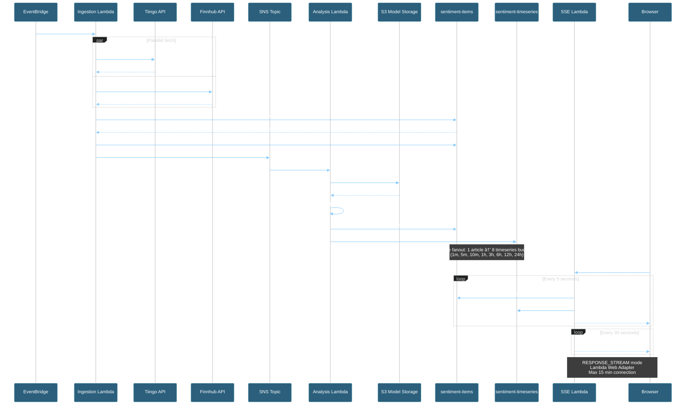

# sentiment-analyzer-gsk

[](./SECURITY.md)
[](https://www.python.org/downloads/)
[](./pyproject.toml)
[](./LICENSE)
[](https://github.com/psf/black)
[](https://www.terraform.io/)
[](https://aws.amazon.com/)

A cloud-hosted Sentiment Analyzer service built with serverless AWS architecture (Lambda, DynamoDB, EventBridge, SNS/SQS). Features dev/preprod/prod promotion pipeline with automated testing and deployment gates.

## CI/CD Pipeline Status

[](https://github.com/traylorre/sentiment-analyzer-gsk/actions/workflows/pr-checks.yml)
[](https://github.com/traylorre/sentiment-analyzer-gsk/actions/workflows/deploy.yml)


**Quick Actions:**
```bash
# View pipeline status (automatic on push to main)
gh run list --workflow=deploy.yml --limit 5

# Watch latest pipeline run
gh run watch

# View detailed pipeline visualization
open https://github.com/traylorre/sentiment-analyzer-gsk/actions/workflows/deploy.yml
```

---

## Table of Contents

- [Quick Start](#quick-start)
- [Project Overview](#project-overview)
  - [What This Service Does](#what-this-service-does)
  - [Architecture](#architecture)
  - [Key Features](#key-features)
- [Architecture Diagrams](#architecture-diagrams)
- [Demo: Interactive Dashboard](#demo-interactive-dashboard)
- [Getting Started](#getting-started)
  - [Prerequisites](#prerequisites)
  - [Local Development Setup](#local-development-setup)
  - [Verify Your Setup](#verify-your-setup)
- [Development Workflow](#development-workflow)
  - [Git Hooks](#git-hooks-pre-commit-framework)
  - [Standard Workflow](#standard-workflow-for-contributors)
- [Deployment](#deployment)
  - [Environment Promotion Flow](#environment-promotion-flow)
  - [Deployment Commands](#deployment-commands)
- [On-Call & Operations](#on-call--operations)
  - [For On-Call Engineers](#for-on-call-engineers)
  - [Monitoring](#monitoring)
  - [Quick Diagnostics](#quick-diagnostics)
- [Project Structure](#project-structure)
- [Contributing](#contributing)
- [Security](#security)
- [Documentation](#documentation)
- [Project Status](#project-status)
- [License](#license)

---

## Quick Start

**For new contributors - complete setup in 10 minutes:**

```bash
# 1. Clone repository
git clone https://github.com/traylorre/sentiment-analyzer-gsk.git
cd sentiment-analyzer-gsk

# 2. Run bootstrap (checks prerequisites, fetches secrets, creates environment)
./scripts/bootstrap-workspace.sh

# 3. Verify setup
./scripts/verify-dev-environment.sh

# 4. Run tests
source .venv/bin/activate
source .env.local
pytest

# 5. Create feature branch
git checkout -b feature/your-feature-name
```

**You're ready to contribute!** See [Development Workflow](#development-workflow) for next steps.

> **New to the project?** See [docs/setup/WORKSPACE_SETUP.md](docs/setup/WORKSPACE_SETUP.md) for comprehensive setup instructions including WSL2, pyenv, and AWS configuration.

---

## Project Overview

### What This Service Does

Ingests financial news from external sources (Tiingo, Finnhub) and returns sentiment analysis:
- **Sentiment labels**: positive/neutral/negative
- **Confidence scores**: 0.0-1.0 range
- **Real-time & batch processing**: EventBridge scheduler + Lambda processors
- **Deduplication**: Avoids reprocessing duplicate items
- **Live dashboard**: FastAPI + SSE for real-time sentiment streaming

### Architecture

- **Frontend**: AWS Amplify (Next.js SSR) with API Gateway backend
- **Compute**: AWS Lambda (Python 3.13) - 6 functions (Ingestion, Analysis, Dashboard, SSE-Streaming, Notification, Metrics)
- **Real-time**: SSE Lambda with Lambda Web Adapter for RESPONSE_STREAM mode
- **Orchestration**: EventBridge, SNS, SQS
- **Storage**: DynamoDB (on-demand capacity), S3 (static assets, ML models)
- **Sentiment Model**: DistilBERT (fine-tuned for social media)
- **Infrastructure**: Terraform with S3 backend and S3 native locking
- **CI/CD**: GitHub Actions → Dev → Preprod → Prod promotion pipeline

**Detailed Architecture Diagrams**: See [docs/diagrams/](./docs/diagrams/README.md)

### Key Features

✅ **Serverless & auto-scaling** - No manual capacity management

✅ **Cost-optimized** - Pay-per-use with budget alerts

✅ **Security-first** - Least-privilege IAM, secrets in AWS Secrets Manager

✅ **Observable** - CloudWatch dashboards, alarms, DLQ monitoring

✅ **Multi-environment** - Isolated dev/preprod/prod environments

✅ **Promotion pipeline** - Automated artifact promotion with validation gates

✅ **Real-time streaming** - SSE Lambda with Lambda Function URL (RESPONSE_STREAM mode)

✅ **Amplify-hosted UI** - Interview Dashboard served via AWS Amplify (Next.js SSR)

---

## Architecture Diagrams

[](https://mermaid.live/view#pako:eNqVWHtz2zYS_yoYdtxx7uhaD8tJNG2neia-2o4jKuc_qo4HImEJNQnoQNKOGvm7dxcASVBS5DM9I4PYF7CP34L45oUyYl7XOzr6xgXPuuTbzMuWLGEzr0tmXkTVw8zziZ38L1WczmOWIhU4V4onVK0HMpbKCPxw1nvf6J0ZmZSFUkRbDONO77zVtkqZyvgWvRXhn6HHXDCX9u7dYDAeG5q1PWVfs5p6_WzZP8RUrOEQjwAnHaKzaMEu6ZzFfRo-LJTMRWS52voxXGGcp2Ct_7DYs9WCKFXEChMd_cy8Z2S4j-VTuKQqs74Pc_VoozSnKU-rlQYrGnKhjZw3cFJR8eBMNhuN5-fno6OZKHWSaX8mCDxpPl8oulqS0VdYjaDxHzOvGJKAqUceYvT_NNz4TDmolcBmBqR3c_HzXJ3-OuaCipCD2DV7qosASSzzOcjYUSl0BfnGMjKkGa1JfOrl2fJGyUcO3klBUE-QckYLf5ByETOffODZx3xeyjMIhtje3SMTWV9xiBso6yX0byncyZrxIFyyKI-RsxiSCfxoo8cdknDx5qC1XrKK-f16PNK29JiMlRQZMruWLLG3Wjmc8KYtXUMC_vRXSoJgot_BA_IkYqtYrsm9ksn_s2_w8weasSe6RgM3F8S-1VcBTLdAn4yCaRmZwadJ0CU0hoy5CxWLwFUQ2_SXTOXGEROZZywlmSSXNJlH9OA6it2jSzOa8XC_P4I2MrRJPw8hLbSZC-CCLGRPkCTpci6pig7vGPIE9wr_cMkhGINQHw_kAuBOvqmZs5PAbkfkS8oUuZEy1rZ10nVJPc9s3i5gD5dcPOjX_9xOyV8ZJwsmmNIWD67ROAxXeRvYFzLORYiC9cq5EAuW4jQwl2Mroi13mq2rPjmFwq8L9qB-14ASaMQOXbFmo3Wm5drbcrDjanlYc3uMgZB-P6UrfvrYOqXAd_ovPXXz-2Dkk0EwGfsAH2m6s6MyiqC_HH9nRybP3Kz8TbH_5VyxOyWhKCPAe3A3QrSbRAHWHfy-oPXm03Uwugumk1HvqoziI4159HIEAzBKNZYgdBWv9Y2uBU3ksI88dqitpJiWCfyc8Iwlu96f6obrSOlZYqa1hlnearRaRKLb71IoJyjDY-P4TkKm08s3LluCqXoHnfXhLpMPTABvc7nDldpYkeO3kSbWXcoAAjJclB2RKypgw8oAE-DK72ydFk68C0aDyWh60IFXYA8WJhagsxzXbV4HaO86IFO54qFWTm0qn2AaQDFspdblZ5T4HODI9CTKYxZZY04f27siiQig7JLKF_Ij6cVwZKibGsQyj25pFiLWVC_a6KVcpCB1xTLFw634xlQlaU3EzpmqbAIkiXu-yAFwDy4WcQr16P81E30ln2ASaLdsXrzt03V0ZNBuYlxJxoD05PiR06IrkX9vYxP5MrlM3xhxq5mcnPy6-Tid3gQbp5sZlupdc1ngp2kKCbQBrN9VhJkUQs8Bsm5KVg8ONX3m1SFn5m0cxPo-t2as-seO3YozzRSjieYHBHF8tdVQ0FvWXmlfqzIHFYgfoFSYbYoeY3iLNlMx4m7ncIjcbB15DH99TouZGj6gF1HsiYNqaEh7vFNfLaIG0RCyccBnL6tpeYgjpFjDCxIF_r_IWGHGpoCaXb6ftMbsZCDlA2ddcPG9YunSgJoun49Ztvok4jV2HjgtQ8cOaMICgNlfrqWAHRbVUEVVo3fVWKuolgc_XN9U8QWA3abiNEz2BIws9dPvDmdx7jWOLM-8O3wFvBbFALC6w1Mt11SVVIxcYCvZlD1nH-NNPo95utwgsLp5XZwOnL0D5ta2XfDUyQZcNwi2NlqFKqR-WUEb_c7C3F1ewQdMbGHPtVQtENxQra06MqDw55yp9SHtpQ-d4i814xEh0PWOOO_sH-a1x2QcnwYhFTsWkEHno5Y2HxLpvvyq-si-kGCn2Di9ZI8b97PUvbCfp9jFfqrTgJxQY6nqduR6KVvH6J8TsKqg9vFewADM0xJKi2TwmWKYwxiwfcjuCSs-IO95HHd_eNc_f9888wFaoVS79kLAvp488QjO2K3VVz_Ej-1u8Z1d1xgbEDD6Wv3O-O2g1GduIF6nLzUHNquwPTzvt4elwrejYbvVfJ3CpDjDlHs-6zTbpcpho9Fq9l-psjqDGJ1nfVxoqfN9o9kej16nM4yEVYY77lROHL1vjs5fGZR7-wlXhuW87yyv0egPhq8MC3b10oHtoROT8bjT6rRep21hvnXLINe81x53mv3OiwodlRbufYvl_lZzLpLelSjL3S-K2q9aml9WsY-1Gjtd2kgXoONX7dMvwM0msMsOuOwDFlep6BKrevdNhTvpVVPSLsNaE7cHDAyQO28OW9bRM-H5XsJUQnnkdb-ZK0Svqy8VgVK_UUQG9zoR-GwlA2v9IhFJBjRQi3uFiBRzqQaU8vIQZ83NIcxuXxtqZfoBYu2ez6E8P_sebFUGaxF6Xbzy8L1cN7Qhp3ACT4rJFRW4ka9et-F7a_gFwb-lBHrT95TMF0uve0_jlD3_A4L29wU)

> Click the badge above to view the full system architecture in an interactive pan/zoom viewer.

### High-Level System Architecture


**Legend:**
- **Solid thick lines (==>)**: Primary data paths
- **Solid thin lines (-->)**: Secondary data paths
- **Dotted lines (-.->)**: Async/logging flows
- **Purple nodes**: Lambda functions (6 total)
- **Green nodes**: Data stores (4 DynamoDB tables + S3 + DLQ)
- **Orange nodes**: Edge/CDN layer

### Environment Promotion Pipeline


### Data Flow: Real-Time Sentiment Processing



### DynamoDB Table Design

This service uses **4 DynamoDB tables** with single-table design patterns:

#### Table 1: `sentiment-items` (News & Scores)

| Attribute | Type | Key | Description |
|-----------|------|-----|-------------|
| `source_id` | String | PK | Composite: `{source}#{article_id}` |
| `timestamp` | String | SK | ISO8601 ingestion time |
| `status` | String | — | `pending` → `analyzed` |
| `sentiment` | String | — | `positive` / `neutral` / `negative` |
| `score` | Number | — | Confidence 0.0-1.0 |
| `matched_tags` | StringSet | — | Matched tickers/tags |
| `ttl_timestamp` | Number | TTL | Auto-delete after 30 days |

**GSIs:** `by_sentiment`, `by_tag`, `by_status`

---

#### Table 2: `sentiment-users` (Single-Table Design)

| PK Pattern | SK Pattern | Entity | Description |
|------------|------------|--------|-------------|
| `USER#{id}` | `PROFILE` | User | Email, preferences, created_at |
| `USER#{id}` | `CONFIG#{id}` | Config | Watch list (up to 5 tickers) |
| `USER#{id}` | `ALERT#{id}` | Alert | Threshold rules |
| `USER#{id}` | `SESSION#{id}` | Session | JWT refresh tokens (httpOnly) |
| `TOKEN#{id}` | `TOKEN` | MagicLink | One-time tokens (TTL: 15min) |

**GSIs:** `by_email`, `by_cognito_sub`, `by_entity_status`

---

#### Table 3: `sentiment-timeseries` (Multi-Resolution Buckets)

| PK Pattern | SK Pattern | Data | TTL |
|------------|------------|------|-----|
| `{ticker}#1m` | ISO8601 | Aggregated score | 6 hours |
| `{ticker}#5m` | ISO8601 | Aggregated score | 12 hours |
| `{ticker}#1h` | ISO8601 | Aggregated score | 7 days |
| `{ticker}#1d` | ISO8601 | Aggregated score | 90 days |

**Write fanout:** Each analyzed article creates 8 bucket updates.

---

#### Table 4: `ohlc-cache` (Price Data)

| PK Pattern | SK Pattern | Data |
|------------|------------|------|
| `{ticker}#tiingo` | `{resolution}#{timestamp}` | OHLC candles |

**No TTL** - Historical price data preserved permanently.

---

### Authentication Flow (Target State)

Post-Phase 0 security hardening with httpOnly cookies:


**Security Boundaries (Post-Phase 0):**
- ❌ No tokens in localStorage (XSS protection)
- ❌ No X-User-ID header fallback (impersonation protection)
- ✅ httpOnly cookies only (CSRF mitigated via SameSite=Strict)
- ✅ JWT claims: `aud`, `nbf`, `exp`, `roles` validated
- ✅ Magic links: Random 256-bit tokens, atomic consumption

---

## Demo: Interactive Dashboard

**Current Feature**: Real-time sentiment analysis with live dashboard

### Quick Links

| Document | Purpose |
|----------|---------|
| [SPEC.md](./SPEC.md) | Complete technical specification |
| [DEPLOYMENT.md](./docs/deployment/DEPLOYMENT.md) | Deployment procedures |
| [TROUBLESHOOTING.md](./docs/operations/TROUBLESHOOTING.md) | Common issues and solutions |
| [FAILURE_RECOVERY_RUNBOOK.md](./docs/operations/FAILURE_RECOVERY_RUNBOOK.md) | Incident response procedures |

### Running Locally

```bash
# 1. Create virtual environment
python -m venv venv
source venv/bin/activate  # Windows: venv\Scripts\activate

# 2. Install dependencies
pip install -r requirements-dev.txt

# 3. Run tests
pytest

# 4. Run linting
black --check src/ tests/
ruff check src/ tests/
```

---

## Getting Started

### Prerequisites

**Required tools** (install before proceeding):

| Tool | Version | Purpose | Install Link |
|------|---------|---------|--------------|
| **AWS CLI** | v2.x | AWS resource management | [Install Guide](https://docs.aws.amazon.com/cli/latest/userguide/getting-started-install.html) |
| **Terraform** | ≥1.5.0 | Infrastructure as code | [Install Guide](https://developer.hashicorp.com/terraform/downloads) |
| **Python** | 3.13+ | Lambda function development | [Download](https://www.python.org/downloads/) |
| **Git** | ≥2.30 | Version control | [Download](https://git-scm.com/downloads) |
| **jq** | Latest | JSON processing (optional) | [Download](https://jqlang.github.io/jq/download/) |

**Verify installations:**

```bash
aws --version          # Should show: aws-cli/2.x.x
terraform --version    # Should show: Terraform v1.5.x+
python --version       # Should show: Python 3.13.x
git --version          # Should show: git version 2.30+
```

---

### Local Development Setup

**Step 1: Clone and navigate**

```bash
git clone https://github.com/traylorre/sentiment-analyzer-gsk.git
cd sentiment-analyzer-gsk
```

**Step 2: Set up Python environment**

```bash
# Create virtual environment
python -m venv .venv
source .venv/bin/activate  # On Windows: .venv\Scripts\activate

# Install development dependencies
pip install -r requirements-dev.txt

# Install git hooks (runs tests before push, formatting before commit)
pre-commit install
pre-commit install --hook-type pre-push
```

**Step 3: Review project documentation**

```bash
# Read in this order:
1. SPEC.md              # Complete technical specification
2. CONTRIBUTING.md      # Collaboration guidelines
3. SECURITY.md          # Security policy
4. docs/deployment/DEPLOYMENT.md   # Deployment procedures
```

---

### Verify Your Setup

Run this verification checklist:

```bash
# ✅ Python environment
python --version
# Should show Python 3.13+

# ✅ Dependencies installed
pytest --version
black --version
ruff --version

# ✅ Git configured
git config user.name && git config user.email
# Should show your name and email

# ✅ Pre-commit hooks installed
pre-commit --version
# Should show pre-commit version
```

**All checks passed?** You're ready to contribute! 🎉

---

## Development Workflow

### Git Hooks (Pre-commit Framework)

This project uses the [pre-commit](https://pre-commit.com/) framework for git hooks.

**One-time setup after cloning:**

```bash
pip install pre-commit
pre-commit install
pre-commit install --hook-type pre-push
```

**What happens automatically:**

- **On commit**: Formatting (black), linting (ruff), Terraform fmt, security checks
- **On push**: Full test suite runs before code is pushed

**Manual commands:**

```bash
# Run all hooks on all files
pre-commit run --all-files

# Update hooks to latest versions
pre-commit autoupdate

# Skip hooks (NOT recommended)
git commit --no-verify
```

This ensures code quality before it reaches CI/CD, saving time and preventing failures.

### Standard Workflow for Contributors

**1. Always work on a feature branch:**

```bash
# Create branch from main
git checkout main
git pull origin main
git checkout -b feature/your-feature-name

# Branch naming convention:
# - feature/enhance-tiingo-integration
# - fix/scheduler-timeout
# - docs/update-readme
```

**2. Make your changes:**

```bash
# Edit files
# Run local tests
pytest

# Ensure code follows project conventions
black src/ tests/
ruff check src/ tests/
```

**3. Commit with clear messages:**

```bash
git add <changed-files>
git commit -m "feat: Add RSS feed parser with XML validation

- Implement feedparser-based RSS ingestion
- Add XXE attack prevention
- Add unit tests for malformed feeds

Addresses: #123"
```

**Commit message format:**
- `feat:` New feature
- `fix:` Bug fix
- `docs:` Documentation only
- `test:` Adding/updating tests
- `refactor:` Code refactoring
- `chore:` Maintenance tasks

**4. Push and create Pull Request:**

```bash
# Push to your branch
git push origin feature/your-feature-name

# GitHub will show link to create PR
# Or go to: https://github.com/traylorre/sentiment-analyzer-gsk/pulls
```

**5. PR Review Process:**

⚠️ **CRITICAL:** All PRs require approval from @traylorre before merge

- ✅ Automated checks run (linting, tests, security scans)
- ✅ CODEOWNERS automatically assigns @traylorre as reviewer
- ✅ GitHub Actions enforces: "Require approval from @traylorre"
- ✅ Branch protection prevents direct push to `main`
- ❌ **Contributors CANNOT merge their own PRs**
- ❌ **Contributors CANNOT bypass review requirements**

---

## Deployment

### Environment Promotion Flow

Deployments follow an automated promotion pipeline triggered on push to `main`:

1. **Build** - Lambda packages built and SHA-versioned
2. **Preprod** - Automatically deployed and tested
3. **Production** - Deployed after preprod validation

**Key Features:**
- ✅ Automatic progression through stages
- ✅ SHA-based artifact versioning
- ✅ S3 native state locking (no DynamoDB dependency)
- ✅ Integrated validation gates

**Monitor Deployments:**
```bash
# View pipeline status
gh run list --workflow=deploy.yml --limit 5

# Watch active deployment
gh run watch

# View workflow details
gh run view <run-id> --log
```

See [DEPLOYMENT.md](docs/deployment/DEPLOYMENT.md) for detailed deployment procedures and rollback strategies.

---

## On-Call & Operations

### For On-Call Engineers

**Start here during incidents**: [FAILURE_RECOVERY_RUNBOOK.md](./docs/operations/FAILURE_RECOVERY_RUNBOOK.md)

12 documented scenarios with step-by-step CLI commands:
- SC-01: Service Degradation
- SC-03: Ingestion Failures
- SC-04: Analysis Failures
- SC-05: Dashboard Failures
- SC-07: API Rate Limiting (Tiingo/Finnhub)
- SC-08: Budget Alerts
- SC-09: DLQ Accumulation
- And more...

### Monitoring

11 CloudWatch alarms configured in `infrastructure/terraform/modules/monitoring/`:
- Lambda error rates
- Latency thresholds
- SNS delivery failures
- DLQ depth
- Budget alerts

### Quick Diagnostics

```bash
# Check Lambda errors
aws logs filter-log-events \
  --log-group-name /aws/lambda/dev-sentiment-ingestion \
  --filter-pattern "ERROR" \
  --start-time $(date -d '30 minutes ago' +%s)000

# Check DynamoDB item count
aws dynamodb scan \
  --table-name dev-sentiment-items \
  --select COUNT

# Check active alarms
aws cloudwatch describe-alarms \
  --state-value ALARM \
  --alarm-name-prefix "dev-"
```

---

## Project Structure

```
sentiment-analyzer-gsk/
├── README.md                    # This file - start here
├── SPEC.md                      # Complete technical specification
├── CONTRIBUTING.md              # Contribution guidelines
├── SECURITY.md                  # Security policy and vulnerability reporting
├── LICENSE                      # MIT License
│
├── .specify/                    # GitHub Spec-Kit configuration
│   ├── memory/
│   │   └── constitution.md      # High-level project requirements
│   └── templates/               # Spec-Kit templates
│
├── infrastructure/              # Infrastructure as code
│   ├── terraform/               # Terraform root module
│   │   ├── modules/             # Reusable Terraform modules
│   │   │   ├── lambda/          # Lambda function module
│   │   │   ├── dynamodb/        # DynamoDB table module
│   │   │   ├── secrets/         # Secrets Manager module
│   │   │   ├── iam/             # IAM roles and policies
│   │   │   └── monitoring/      # CloudWatch alarms
│   │   ├── main.tf              # Root configuration
│   │   ├── variables.tf         # Input variables
│   │   └── outputs.tf           # Output values
│   └── scripts/                 # Helper scripts
│
├── src/                         # Lambda function source code
│   ├── lambdas/
│   │   ├── ingestion/           # Ingestion Lambda
│   │   ├── analysis/            # Analysis Lambda
│   │   ├── dashboard/           # Dashboard Lambda (FastAPI REST)
│   │   ├── sse_streaming/       # SSE Lambda (real-time streaming)
│   │   ├── metrics/             # Metrics Lambda (stuck item monitor)
│   │   └── shared/              # Shared Lambda utilities
│   └── lib/                     # Common library code
│
├── tests/                       # Test suites
│   ├── unit/                    # Unit tests
│   ├── integration/             # Integration tests
│   └── contract/                # Contract tests
│
├── docs/                        # Project documentation
│   ├── DEPLOYMENT.md            # Deployment guide
│   ├── DEMO_CHECKLIST.md        # Demo preparation
│   ├── TROUBLESHOOTING.md       # Common issues
│   ├── IAM_TERRAFORM_TROUBLESHOOTING.md  # IAM debugging guide
│   └── diagrams/                # Architecture diagrams
│       ├── README.md            # Diagram index and guidelines
│       ├── high-level-overview.mmd       # System overview
│       ├── security-flow.mmd             # Security zones
│       ├── sse-lambda-streaming.mmd      # SSE streaming flow
│       └── cloudfront-multi-origin.mmd   # CDN routing
│
├── specs/                       # Feature specifications
│   └── {feature-id}-{name}/     # Feature specifications
│       ├── spec.md              # Feature requirements
│       ├── plan.md              # Implementation plan
│       ├── tasks.md             # Task breakdown
│       └── quickstart.md        # Getting started guide
│
└── .github/                     # GitHub configuration
    ├── workflows/               # CI/CD workflows
    │   ├── pr-check-*.yml       # PR validation checks
    │   ├── deploy.yml           # Main deployment pipeline
    │   └── dependabot-auto-merge.yml  # Dependabot automation
    └── CODEOWNERS               # Review assignments
```

---

## Contributing

**Before contributing, you MUST read:**

📖 **[CONTRIBUTING.md](./CONTRIBUTING.md)** - Complete contribution guidelines including:
- Code of conduct
- Development workflow
- Testing requirements
- PR review process
- Security best practices

**Quick summary:**
- ✅ Contributors can: Create PRs, run tests, view documentation
- ❌ Contributors cannot: Merge PRs without approval, modify IAM directly

**All contributions require:**
- Passing tests (`pytest`)
- Code formatting (`black`, `ruff`)
- Security scans (automated via pre-commit)
- Review approval from @traylorre

---

## Security

🔒 **Security is paramount.** This project follows zero-trust principles.

### Reporting Vulnerabilities

**DO NOT create public issues for security vulnerabilities.**

Report privately to: @traylorre

Response time: 48 hours

See [SECURITY.md](./SECURITY.md) for full security policy.

### Security Posture

**Key security features:**
- Least-privilege IAM roles
- Secrets in AWS Secrets Manager (never in code)
- TLS 1.2+ enforcement
- Input validation on all external data
- NoSQL injection prevention (parameterized DynamoDB queries)
- Rate limiting and quota management
- Comprehensive audit logging (CloudTrail)
- Automated security scanning (pre-commit hooks)

---

## Documentation

### Primary Documents

| Document | Purpose | Audience |
|----------|---------|----------|
| **[README.md](./README.md)** | Getting started, onboarding | All contributors |
| **[SPEC.md](./SPEC.md)** | Complete technical specification | Developers, architects |
| **[CONTRIBUTING.md](./CONTRIBUTING.md)** | Collaboration guidelines | All contributors |
| **[SECURITY.md](./SECURITY.md)** | Security policy | Security researchers, contributors |
| **[DEPLOYMENT.md](./docs/deployment/DEPLOYMENT.md)** | Deployment procedures | DevOps, on-call |
| **[IAM_TERRAFORM_TROUBLESHOOTING.md](./docs/security/IAM_TERRAFORM_TROUBLESHOOTING.md)** | IAM debugging guide | DevOps, on-call |

### Architecture Diagrams

| Diagram | Purpose | File |
|---------|---------|------|
| **System Overview** | High-level architecture with all components | [high-level-overview.mmd](./docs/diagrams/high-level-overview.mmd) |
| **All Data Flows** | Complete data flow including auth (v3.0) | [dataflow-all-flows.mmd](./docs/diagrams/dataflow-all-flows.mmd) |
| **Security Flow** | Trust zones and data sanitization | [security-flow.mmd](./docs/diagrams/security-flow.mmd) |
| **Auth Use Cases** | Authentication flows (UC3) | [USE-CASE-DIAGRAMS.md](./docs/architecture/USE-CASE-DIAGRAMS.md#uc3-user-authentication-flow-v30) |
| **SSE Streaming** | Real-time event streaming architecture | [sse-lambda-streaming.mmd](./docs/diagrams/sse-lambda-streaming.mmd) |

### Operations Documentation

| Document | Purpose |
|----------|---------|
| [FAILURE_RECOVERY_RUNBOOK.md](./docs/operations/FAILURE_RECOVERY_RUNBOOK.md) | Incident response runbooks |
| [TROUBLESHOOTING.md](./docs/operations/TROUBLESHOOTING.md) | Common issues and solutions |
| [DEMO_CHECKLIST.md](./docs/operations/DEMO_CHECKLIST.md) | Demo day preparation |

---

## Project Status

**Current Phase:** Promotion Pipeline Setup 🔄

**Recent Milestones:**
1. ✅ Demo 1: Interactive Dashboard - **COMPLETE**
2. ✅ Dev Environment - **DEPLOYED**
3. 🔄 Preprod Environment - **IN PROGRESS**
4. ⏳ Prod Environment - **PENDING**

**Deployment Pipeline Status:**
- ✅ Build & Test - Automated
- ✅ Dev Deploy - Automated on merge to `main`
- 🔄 Preprod Deploy - Artifact promotion via workflow
- ⏳ Prod Deploy - Manual approval required

**Tracking:** See [GitHub Actions](https://github.com/traylorre/sentiment-analyzer-gsk/actions)

---

## License

MIT License - See [LICENSE](./LICENSE) file for details.

---

## Maintainers

**Project Owner & Security Admin:**
- @traylorre - All PR approvals, infrastructure deployments, credential management

**Contributors:**
_See [Contributors](https://github.com/traylorre/sentiment-analyzer-gsk/graphs/contributors)_

---

## Questions?

1. Check [SPEC.md](./SPEC.md) for technical details
2. Review [CONTRIBUTING.md](./CONTRIBUTING.md) for collaboration guidelines
3. Search [existing issues](https://github.com/traylorre/sentiment-analyzer-gsk/issues)
4. Ask in PR comments or create a new issue

**Welcome to the project!** 🚀
