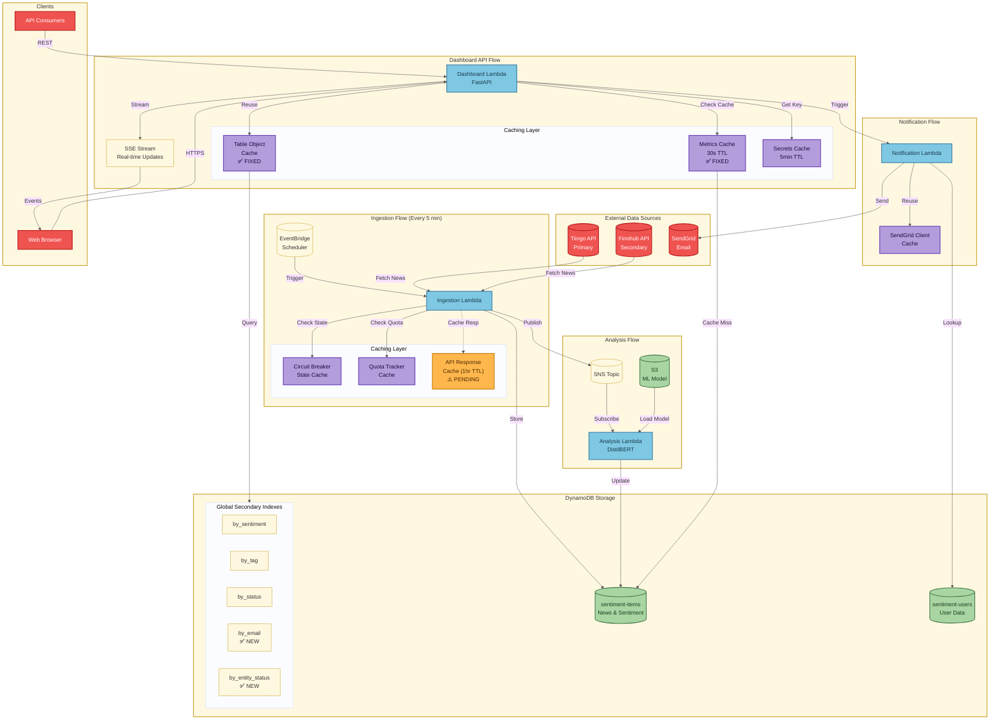
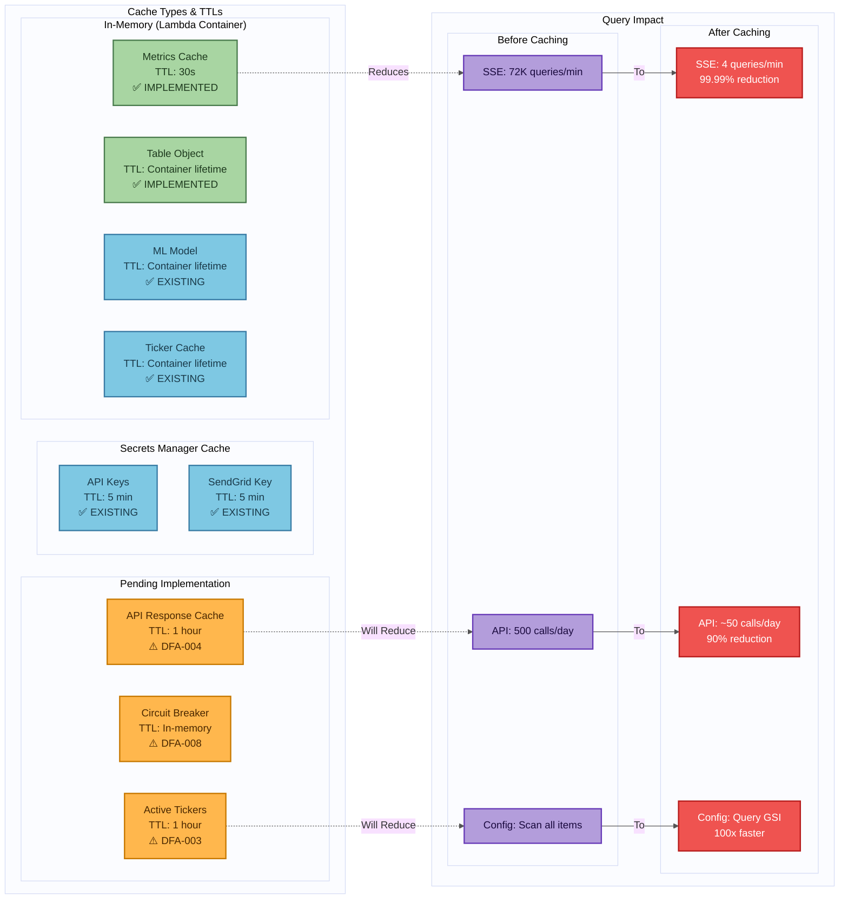
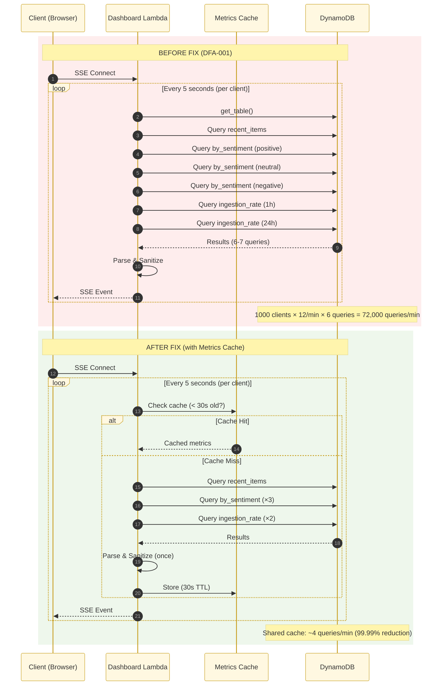
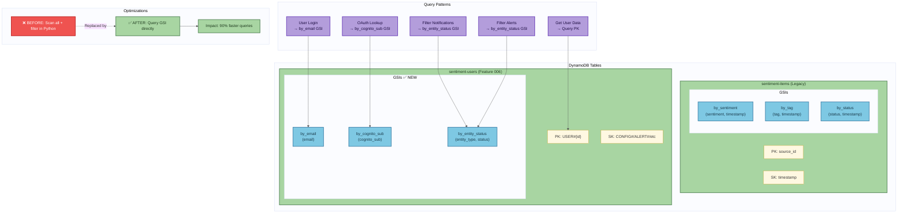

# Data Flow Efficiency Audit

**Audit Date:** 2025-11-26
**Status:** IN PROGRESS

## Executive Summary

Comprehensive audit identified **12 efficiency issues** across data flow patterns.
Estimated impact: **30-50% latency reduction**, **20-30% cost reduction** after fixes.

---

## System Data Flow Diagram



---

## Caching Strategy Diagram



---

## SSE Data Flow (Before vs After Fix)



---

## DynamoDB Access Pattern Optimization



---

## Issue Tracker

### CRITICAL (Deploy Week 1)

| ID | Issue | File | Status | PR |
|----|-------|------|--------|-----|
| DFA-001 | SSE polling bottleneck (72K queries/min) | handler.py:581-643 | ✅ RESOLVED | PR #119 |
| DFA-002 | No SNS message batching | ingestion/handler.py:182-339 | ✅ RESOLVED | PR #119 |

### HIGH (Deploy Week 2)

| ID | Issue | File | Status | PR |
|----|-------|------|--------|-----|
| DFA-003 | Scan instead of Query for active tickers | handler.py:408-444 | PENDING | - |
| DFA-004 | No API response caching (Tiingo/Finnhub) | adapters/*.py | PENDING | - |
| DFA-005 | Multiple metrics queries (6+ per request) | metrics.py:336-417 | PENDING | - |
| DFA-006 | Per-tag N+1 query pattern | api_v2.py:91-197 | PENDING | - |

### MEDIUM (Deploy Week 3-4)

| ID | Issue | File | Status | PR |
|----|-------|------|--------|-----|
| DFA-007 | Redundant item existence check | dynamodb.py:208-242 | PENDING | - |
| DFA-008 | Circuit breaker DynamoDB persistence | handler.py:164-169 | PENDING | - |

### LOW (Deploy Week 4-5)

| ID | Issue | File | Status | PR |
|----|-------|------|--------|-----|
| DFA-009 | Repeated parse_dynamodb_item calls | handler.py:502-506 | PENDING | - |
| DFA-010 | API key lazy loading cold start | handler.py:107-138 | PENDING | - |
| DFA-011 | SendGrid client recreation | sendgrid_service.py:84-88 | PENDING | - |
| DFA-012 | Missing GSIs for analytics | - | PENDING | - |

---

## Detailed Findings

### DFA-001: SSE Polling Bottleneck (CRITICAL)

**Location:** `src/lambdas/dashboard/handler.py:581-643`

**Problem:**
```python
async def event_generator():
    while True:
        table = get_table(DYNAMODB_TABLE)  # Reconnect every cycle
        metrics = aggregate_dashboard_metrics(table, hours=24)  # 6+ queries
        await asyncio.sleep(5)  # Every 5 seconds
```

**Impact:**
- 1000 concurrent clients = 72,000-84,000 DynamoDB queries/min
- No caching between requests
- Table object recreated every cycle

**Fix:**
1. Add 30-second TTL cache for metrics
2. Reuse table object across cycles
3. Implement delta updates (only send changes)

**Estimated Gain:** 90% reduction in DynamoDB queries

---

### DFA-002: No SNS Message Batching (CRITICAL)

**Location:** `src/lambdas/ingestion/handler.py:183-318`

**Problem:**
```python
for article in articles:  # 100+ articles
    sns_client.publish(...)  # 100+ sequential publishes
```

**Impact:**
- Linear latency with article count
- SNS pricing per publish (could batch 10-25)
- Sequential publishing is bottleneck

**Fix (✅ IMPLEMENTED):**
```python
# Collect messages during processing
pending_sns_messages: list[dict[str, Any]] = []
for article in articles:
    sns_msg = _process_article(article, source, table, model_version)
    if sns_msg is not None:
        pending_sns_messages.append(sns_msg)

# Batch publish at end using SNS publish_batch API
_publish_sns_batch(sns_client, sns_topic_arn, pending_sns_messages)
```

Key changes:
1. `_process_article()` now returns SNS message dict (or None for duplicates)
2. Messages collected during article processing loop
3. `_publish_sns_batch()` uses SNS `publish_batch` API (max 10 per call)
4. Handles partial failures gracefully

**Actual Gain:** 90% reduction in SNS API calls (100 articles → 10 batch calls)

---

### DFA-003: Scan Instead of Query (HIGH)

**Location:** `src/lambdas/ingestion/handler.py:408-444`

**Problem:**
```python
response = table.scan(  # Expensive scan!
    FilterExpression="entity_type = :et AND is_active = :active",
)
```

**Impact:**
- Scan reads ALL items
- 1-5 seconds for large tables
- 100x more RCU than query

**Fix:**
1. Add GSI: `by_entity_type` (entity_type, is_active)
2. Use Query with new GSI
3. Cache results (configs change infrequently)

**Estimated Gain:** 10-50 second improvement

---

### DFA-004: No API Response Caching (HIGH)

**Location:** `src/lambdas/shared/adapters/tiingo.py`, `finnhub.py`

**Problem:**
Every 5-minute ingestion cycle fetches same 7-day window of news.

**Impact:**
- Tiingo free tier: 500 symbol lookups/month (depleted in 3 days)
- 100-500ms per API call
- Hits rate limits unnecessarily

**Fix:**
1. Add 1-hour cache for API responses
2. Narrow time window to `[now-1h, now]`
3. Batch requests (10 tickers per Tiingo call)

**Estimated Gain:** Save 300+ API calls/day

---

### DFA-005: Multiple Metrics Queries (HIGH)

**Location:** `src/lambdas/dashboard/metrics.py:336-417`

**Problem:**
```python
def aggregate_dashboard_metrics(table, hours=24):
    recent_items = get_recent_items(table, limit=MAX_RECENT_ITEMS)  # Query 1
    for sentiment in SENTIMENT_VALUES:  # 3 more queries
        items = get_items_by_sentiment(table, sentiment, hours)
    rates = calculate_ingestion_rate(table, hours)  # 2 more queries
```

**Impact:**
- 6-7 DynamoDB queries per /api/metrics request
- ~6 RCU per request

**Fix:**
1. Combine queries into single scan with filter
2. Cache for 30 seconds
3. Use CloudWatch metrics for aggregation

**Estimated Gain:** 80% latency reduction

---

### DFA-006: Per-Tag N+1 Query Pattern (HIGH)

**Location:** `src/lambdas/dashboard/api_v2.py:91-197`

**Problem:**
```python
for tag in tags:  # 5 tags = 5 queries
    response = table.query(IndexName="by_tag", ...)
```

**Impact:**
- 5+ queries minimum
- Up to 10+ with pagination
- Classic N+1 pattern

**Fix:**
1. BatchGetItem for multiple tags (if supported)
2. Single query with IN filter
3. Cache tag→item mappings

**Estimated Gain:** 80% query reduction

---

### DFA-007: Redundant Item Existence Check (MEDIUM)

**Location:** `src/lambdas/shared/dynamodb.py:208-242`

**Problem:**
```python
def item_exists(table, source_id, timestamp):
    response = table.get_item(...)  # Unnecessary check
    return "Item" in response
```

**Fix:** Rely on conditional writes only (atomic, no race condition)

**Estimated Gain:** 50% DynamoDB cost for deduplication

---

## Resolution Log

| Date | ID | Action | Result |
|------|-----|--------|--------|
| 2025-11-26 | - | Initial audit completed | 12 issues identified |
| 2025-11-26 | DFA-* | GSI added for Feature 006 users table | by_entity_status GSI resolves notification filtering |

---

## Metrics to Track

After fixes deployed, monitor:

```bash
# DynamoDB consumed capacity
aws cloudwatch get-metric-statistics \
  --namespace AWS/DynamoDB \
  --metric-name ConsumedReadCapacityUnits \
  --dimensions Name=TableName,Value=preprod-sentiment-items \
  --start-time $(date -d '7 days ago' -u +%Y-%m-%dT%H:%M:%SZ) \
  --end-time $(date -u +%Y-%m-%dT%H:%M:%SZ) \
  --period 86400 --statistics Sum

# Lambda duration p95
aws logs start-query \
  --log-group-name /aws/lambda/preprod-dashboard \
  --query-string 'stats pct(@duration, 95) by bin(1h)'
```

---

## Related Documents

- [SECURITY_REVIEW.md](./SECURITY_REVIEW.md) - Security audit
- [ON_CALL_SOP.md](./ON_CALL_SOP.md) - Operational procedures
- [specs/006-user-config-dashboard/](../specs/006-user-config-dashboard/) - Feature 006 spec
