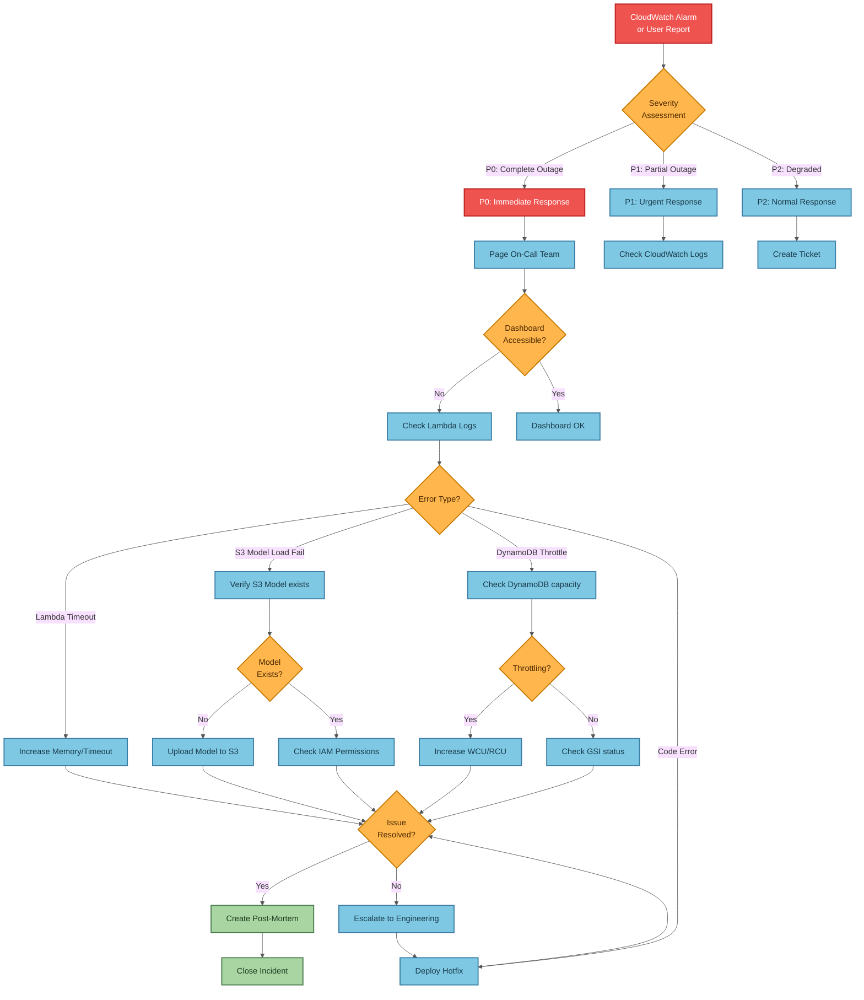

# Operational Flows and Troubleshooting Guide

This document provides operational flow diagrams and troubleshooting guides for the Sentiment Analyzer system. Use these diagrams to understand system behavior, diagnose issues, and respond to incidents.

**Target Audience:**
- On-call engineers responding to incidents
- Operators managing the system
- Contributors understanding operational patterns

---

## Table of Contents

1. [Common Operational Flows](#common-operational-flows)
   - [Normal Operation Flow](#normal-operation-flow)
   - [Metrics Collection Flow](#metrics-collection-flow)
   - [Deployment Flow](#deployment-flow)
   - [Incident Response Flow](#incident-response-flow)
2. [Troubleshooting Guides](#troubleshooting-guides)
   - [Lambda Failures](#lambda-failures)
   - [DynamoDB Issues](#dynamodb-issues)
   - [S3 Model Loading Issues](#s3-model-loading-issues)
   - [Dashboard Not Responding](#dashboard-not-responding)
3. [Monitoring and Alerts](#monitoring-and-alerts)
4. [Recovery Procedures](#recovery-procedures)

---

## Common Operational Flows

### Normal Operation Flow

This shows the happy path for article ingestion and sentiment analysis:


**Key Points:**
- Ingestion runs every 5 minutes via EventBridge
- Duplicate detection prevents reprocessing
- Model lazy loading reduces cold start time
- Model cached in Lambda /tmp for warm starts

---

### Metrics Collection Flow

This shows the operational monitoring flow for detecting stuck items:


**Key Points:**
- Metrics Lambda runs every 1 minute via EventBridge
- Queries `by_status` GSI for items with `status = 'pending'`
- Stuck threshold: items pending for more than 5 minutes
- Emits `SentimentAnalyzer/StuckItems` CloudWatch metric
- CloudWatch Alarm triggers if stuck items > 10 for 3 consecutive periods

**Stuck Items Causes:**
- Analysis Lambda failures (check DLQ)
- SNS/SQS delivery delays
- DynamoDB throttling preventing status updates
- Lambda concurrency limits reached

**Quick Investigation:**
```bash
# Check current stuck items count
aws cloudwatch get-metric-statistics \
  --namespace SentimentAnalyzer \
  --metric-name StuckItems \
  --dimensions Name=Environment,Value=preprod \
  --start-time $(date -u -d '30 minutes ago' +%Y-%m-%dT%H:%M:%S) \
  --end-time $(date -u +%Y-%m-%dT%H:%M:%S) \
  --period 60 \
  --statistics Maximum

# Check Metrics Lambda logs for details
aws logs tail /aws/lambda/preprod-sentiment-metrics --since 30m

# Query DynamoDB directly for stuck items
aws dynamodb query \
  --table-name preprod-sentiment-items \
  --index-name by_status \
  --key-condition-expression "#s = :status" \
  --expression-attribute-names '{"#s": "status"}' \
  --expression-attribute-values '{":status": {"S": "pending"}}' \
  --select COUNT
```

---

### Deployment Flow

This shows the CI/CD deployment process from PR to production:


**Key Points:**
- All deployments go through preprod first
- Integration tests must pass before production deployment
- Manual approval gate protects production
- Rollback procedures in place for both environments

---

### Incident Response Flow

This shows the decision tree for responding to production incidents:



**Key Points:**
- Severity assessment drives response urgency
- Check dashboard accessibility first
- Lambda logs are primary diagnostic tool
- Post-mortem required for all P0/P1 incidents

---

## Troubleshooting Guides

### Lambda Failures

**Common Issues:**

#### 1. Lambda Timeout


**Quick Fix:**
```bash
# Check current timeout setting
terraform output analysis_lambda_arn
aws lambda get-function-configuration --function-name preprod-sentiment-analysis --query 'Timeout'

# Update in infrastructure/terraform/main.tf (module "analysis_lambda")
# Then redeploy
cd infrastructure/terraform
terraform apply
```

#### 2. Out of Memory Error


**Quick Fix:**
```bash
# Check memory usage
aws cloudwatch get-metric-statistics \
  --namespace AWS/Lambda \
  --metric-name MemoryUtilization \
  --dimensions Name=FunctionName,Value=preprod-sentiment-analysis \
  --start-time $(date -u -d '1 hour ago' +%Y-%m-%dT%H:%M:%S) \
  --end-time $(date -u +%Y-%m-%dT%H:%M:%S) \
  --period 300 \
  --statistics Maximum

# Update memory in infrastructure/terraform/main.tf
# analysis_lambda: memory_size = 1024 -> 2048
terraform apply
```

---

### DynamoDB Issues

#### Throttling Errors


**Quick Fix:**
```bash
# Check current capacity
aws dynamodb describe-table --table-name preprod-sentiment-items \
  --query 'Table.ProvisionedThroughput'

# View consumed capacity
aws cloudwatch get-metric-statistics \
  --namespace AWS/DynamoDB \
  --metric-name ConsumedReadCapacityUnits \
  --dimensions Name=TableName,Value=preprod-sentiment-items \
  --start-time $(date -u -d '1 hour ago' +%Y-%m-%dT%H:%M:%S) \
  --end-time $(date -u +%Y-%m-%dT%H:%M:%S) \
  --period 300 \
  --statistics Sum

# Increase capacity in infrastructure/terraform/modules/dynamodb/main.tf
terraform apply
```

---

### S3 Model Loading Issues

#### Model Load Failures


**Quick Fix:**
```bash
# Check if model exists
aws s3 ls s3://sentiment-analyzer-models-218795110243/models/

# Verify model version in Lambda env vars
aws lambda get-function-configuration \
  --function-name preprod-sentiment-analysis \
  --query 'Environment.Variables.MODEL_VERSION'

# Check IAM permissions
aws iam get-role-policy \
  --role-name preprod-sentiment-analysis-role \
  --policy-name analysis-lambda-policy

# Manual upload if missing (use build script)
cd infrastructure/scripts
./build-and-upload-model-s3.sh
```

---

### Dashboard Not Responding

#### Dashboard Debugging Flow


**Quick Fix:**
```bash
# Get dashboard URL
terraform output dashboard_function_url

# Test health endpoint
URL=$(terraform output -raw dashboard_function_url)
curl -i "$URL/health"

# Test metrics endpoint (requires API key)
API_KEY=$(aws secretsmanager get-secret-value \
  --secret-id preprod/sentiment-analyzer/dashboard-api-key \
  --query SecretString --output text | jq -r .api_key)
curl -H "Authorization: $API_KEY" "$URL/api/metrics"

# Check Lambda logs
aws logs tail /aws/lambda/preprod-sentiment-dashboard --follow
```

---

## Monitoring and Alerts

### CloudWatch Alarms

The system has the following CloudWatch alarms configured:


**Alarm Response:**

| Alarm | Severity | Response Time | Action |
|-------|----------|---------------|--------|
| Ingestion Errors | P1 | 15 minutes | Check NewsAPI status, verify API key |
| Analysis Errors | P1 | 15 minutes | Check S3 model, review Lambda logs |
| Analysis Duration | P2 | 1 hour | Review memory/timeout settings |
| Dashboard Errors | P0 | Immediate | Check Function URL, verify dependencies |
| Metrics Errors | P2 | 1 hour | Check Metrics Lambda logs, verify GSI access |
| Stuck Items | P1 | 15 minutes | Check Analysis Lambda, DLQ, SNS delivery |
| DynamoDB Throttle | P1 | 30 minutes | Increase capacity or optimize queries |
| Budget Alert | P2 | 1 business day | Review cost allocation, optimize resources |

---

## Recovery Procedures

### Rollback to Previous Version

```bash
# 1. Identify previous deployment
cd infrastructure/terraform
terraform workspace select preprod
terraform state list

# 2. Find previous Lambda package version
aws s3 ls s3://preprod-sentiment-lambda-deployments/analysis/ --recursive

# 3. Update Terraform to point to previous version
# Edit main.tf module "analysis_lambda" s3_key to previous SHA

# 4. Apply rollback
terraform apply

# 5. Verify rollback
aws lambda get-function --function-name preprod-sentiment-analysis \
  --query 'Code.Location'

# 6. Test functionality
curl $(terraform output -raw dashboard_function_url)/health
```

### Complete System Restart

```bash
# 1. Disable EventBridge schedule
aws events disable-rule --name preprod-sentiment-ingestion-schedule

# 2. Stop all in-flight Lambda executions (wait for completion)
# Check running executions
aws lambda list-functions --query 'Functions[?starts_with(FunctionName, `preprod-sentiment`)].[FunctionName]' --output text | \
  while read func; do
    echo "$func concurrent executions:"
    aws cloudwatch get-metric-statistics \
      --namespace AWS/Lambda \
      --metric-name ConcurrentExecutions \
      --dimensions Name=FunctionName,Value=$func \
      --start-time $(date -u -d '5 minutes ago' +%Y-%m-%dT%H:%M:%S) \
      --end-time $(date -u +%Y-%m-%dT%H:%M:%S) \
      --period 60 \
      --statistics Maximum
  done

# 3. Clear DLQ if needed
aws sqs purge-queue --queue-url $(aws sqs get-queue-url --queue-name preprod-sentiment-dlq --query QueueUrl --output text)

# 4. Restart EventBridge schedule
aws events enable-rule --name preprod-sentiment-ingestion-schedule

# 5. Monitor for normal operation
aws logs tail /aws/lambda/preprod-sentiment-ingestion --follow
```

### Database Recovery

```bash
# DynamoDB point-in-time recovery (if enabled)
# 1. Find recovery point
aws dynamodb describe-continuous-backups --table-name preprod-sentiment-items

# 2. Restore to specific time
aws dynamodb restore-table-to-point-in-time \
  --source-table-name preprod-sentiment-items \
  --target-table-name preprod-sentiment-items-restored \
  --restore-date-time $(date -u -d '1 hour ago' +%Y-%m-%dT%H:%M:%S)

# 3. Update Terraform to use restored table (if needed)
# Edit infrastructure/terraform/modules/dynamodb/main.tf

# 4. Redeploy
cd infrastructure/terraform
terraform apply
```

---

## Quick Reference: Common Commands

### Check System Health

```bash
# Dashboard health
curl -i $(cd infrastructure/terraform && terraform output -raw dashboard_function_url)/health

# Lambda function status
aws lambda get-function --function-name preprod-sentiment-analysis --query 'Configuration.State'

# DynamoDB table status
aws dynamodb describe-table --table-name preprod-sentiment-items --query 'Table.TableStatus'

# Recent errors in logs
aws logs filter-log-events \
  --log-group-name /aws/lambda/preprod-sentiment-analysis \
  --filter-pattern "ERROR" \
  --start-time $(($(date +%s) - 3600))000

# Current throttling metrics
aws cloudwatch get-metric-statistics \
  --namespace AWS/DynamoDB \
  --metric-name UserErrors \
  --dimensions Name=TableName,Value=preprod-sentiment-items \
  --start-time $(date -u -d '30 minutes ago' +%Y-%m-%dT%H:%M:%S) \
  --end-time $(date -u +%Y-%m-%dT%H:%M:%S) \
  --period 300 \
  --statistics Sum
```

### Emergency Contacts

| Role | Responsibility | Contact |
|------|---------------|---------|
| On-Call Engineer | First responder for P0/P1 incidents | PagerDuty rotation |
| DevOps Lead | Infrastructure and deployment issues | Escalation path |
| Engineering Manager | Decision authority for production changes | Escalation path |

---

## Additional Resources

- [README.md](../README.md) - Project overview and architecture
- [TERRAFORM_DEPLOYMENT_FLOW.md](TERRAFORM_DEPLOYMENT_FLOW.md) - Deployment details
- [DASHBOARD_SECURITY_ANALYSIS.md](DASHBOARD_SECURITY_ANALYSIS.md) - Security considerations
- [CloudWatch Console](https://console.aws.amazon.com/cloudwatch/) - Monitoring and logs
- [Lambda Console](https://console.aws.amazon.com/lambda/) - Lambda function management
