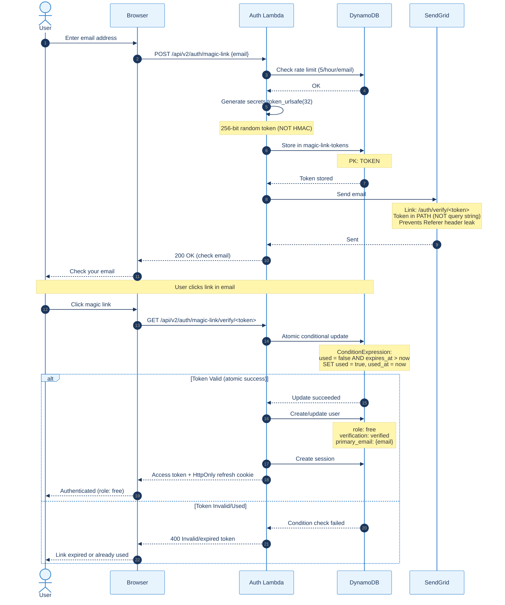
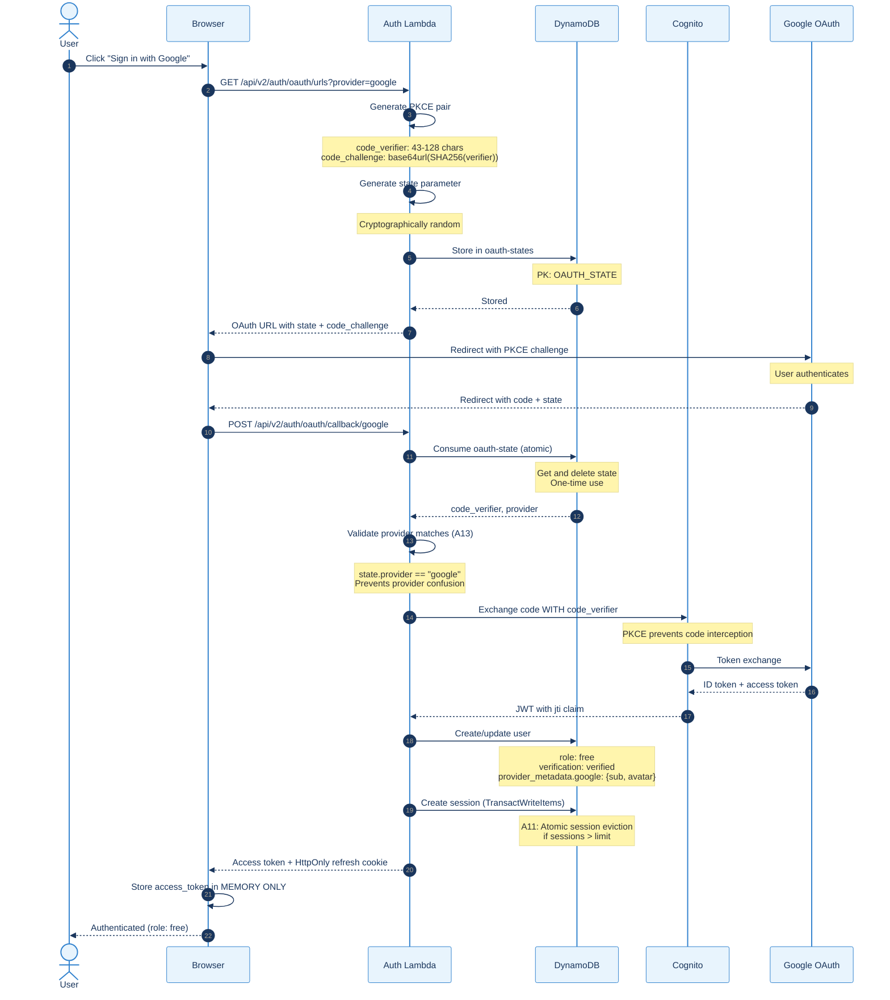
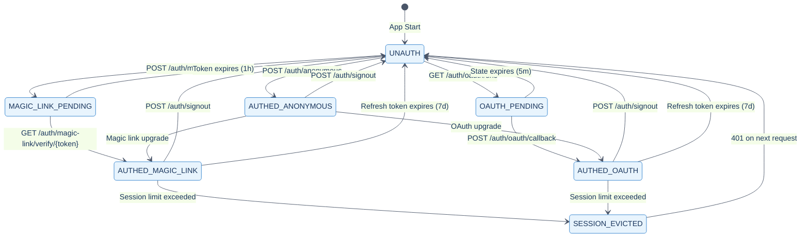

# Use Case Diagrams

This document provides UML sequence diagrams for the top 5 use cases in the Sentiment Analyzer system.

**Target Audience:** All roles (developers, operators, product managers, stakeholders)

---

## Unified Color Palette

All diagrams in this project use a consistent color palette optimized for:
- **Accessibility**: WCAG 2.1 AA contrast ratios (4.5:1 minimum)
- **Consistency**: Same colors across all Mermaid diagrams
- **Readability**: Dark text on light backgrounds

### Mermaid Theme Configuration

```mermaid
%%{init: {
  'theme': 'base',
  'themeVariables': {
    'primaryColor': '#e8f4fd',
    'primaryTextColor': '#1a365d',
    'primaryBorderColor': '#3182ce',
    'lineColor': '#4a5568',
    'secondaryColor': '#f0fff4',
    'tertiaryColor': '#fef3c7'
  }
}}%%
```

### Node Class Definitions

| Class Name | Purpose | Fill | Border | Text | Contrast |
|------------|---------|------|--------|------|----------|
| `userNode` | User/Actor | `#dbeafe` | `#2563eb` | `#1e3a5f` | 7.2:1 |
| `systemNode` | System Component | `#e0e7ff` | `#4f46e5` | `#1e1b4b` | 8.1:1 |
| `apiNode` | API Gateway/Endpoint | `#fef3c7` | `#d97706` | `#78350f` | 6.8:1 |
| `lambdaNode` | Lambda Function | `#ddd6fe` | `#7c3aed` | `#2e1065` | 7.5:1 |
| `storageNode` | Database/Storage | `#d1fae5` | `#059669` | `#064e3b` | 6.2:1 |
| `queueNode` | SNS/SQS Queue | `#fce7f3` | `#db2777` | `#831843` | 5.8:1 |
| `successNode` | Success State | `#bbf7d0` | `#16a34a` | `#14532d` | 5.4:1 |
| `errorNode` | Error State | `#fecaca` | `#dc2626` | `#7f1d1d` | 5.1:1 |
| `decisionNode` | Decision Point | `#fed7aa` | `#ea580c` | `#7c2d12` | 5.6:1 |
| `externalNode` | External Service | `#e5e7eb` | `#6b7280` | `#1f2937` | 9.4:1 |

### Standard Class Definitions (Copy to Diagrams)

```
classDef userNode fill:#dbeafe,stroke:#2563eb,stroke-width:2px,color:#1e3a5f
classDef systemNode fill:#e0e7ff,stroke:#4f46e5,stroke-width:2px,color:#1e1b4b
classDef apiNode fill:#fef3c7,stroke:#d97706,stroke-width:2px,color:#78350f
classDef lambdaNode fill:#ddd6fe,stroke:#7c3aed,stroke-width:2px,color:#2e1065
classDef storageNode fill:#d1fae5,stroke:#059669,stroke-width:2px,color:#064e3b
classDef queueNode fill:#fce7f3,stroke:#db2777,stroke-width:2px,color:#831843
classDef successNode fill:#bbf7d0,stroke:#16a34a,stroke-width:2px,color:#14532d
classDef errorNode fill:#fecaca,stroke:#dc2626,stroke-width:2px,color:#7f1d1d
classDef decisionNode fill:#fed7aa,stroke:#ea580c,stroke-width:2px,color:#7c2d12
classDef externalNode fill:#e5e7eb,stroke:#6b7280,stroke-width:2px,color:#1f2937
```

---

## Table of Contents

1. [UC1: User Configures Sentiment Alerts](#uc1-user-configures-sentiment-alerts)
2. [UC2: System Processes News and Triggers Alerts](#uc2-system-processes-news-and-triggers-alerts)
3. [UC3: Anonymous User Authentication Flow](#uc3-anonymous-user-authentication-flow)
4. [UC4: CI/CD Deployment Pipeline](#uc4-cicd-deployment-pipeline)
5. [UC5: Notification Delivery Flow](#uc5-notification-delivery-flow)

---

## UC1: User Configures Sentiment Alerts

**Primary Actor:** End User (Anonymous or Authenticated)
**Goal:** Create a configuration with tickers and set up sentiment alerts
**Preconditions:** User has access to the dashboard


**Key Points:**
- Anonymous users get JWT tokens automatically
- Ticker search uses cached data for performance
- Configuration quotas enforced (3 configs for anonymous)
- Alert rules stored with configuration

---

## UC2: System Processes News and Triggers Alerts

**Primary Actor:** System (EventBridge Scheduler)
**Goal:** Ingest news, analyze sentiment, trigger alerts when thresholds crossed
**Preconditions:** Users have active configurations with alerts


**Key Points:**
- EventBridge triggers ingestion every 5 minutes
- Dual-source strategy (Tiingo primary, Finnhub secondary)
- Model lazy-loaded and cached in Lambda /tmp
- Alerts checked after each sentiment update
- Email quota enforced before sending

---

## UC3: User Authentication Flow (v3.0)

**Primary Actor:** New/Returning User
**Goal:** Authenticate via anonymous, magic link, or OAuth
**Preconditions:** None (public access)
**Roles:** anonymous → free → paid → operator (v3.0 hierarchy)

### UC3.1: Anonymous Authentication

```mermaid
%%{init: {'theme': 'base', 'themeVariables': {'primaryColor': '#e8f4fd', 'primaryTextColor': '#1a365d', 'primaryBorderColor': '#3182ce', 'lineColor': '#4a5568'}}}%%
sequenceDiagram
    autonumber
    actor User
    participant Browser
    participant Amplify as Amplify<br/>(Next.js SSR)
    participant API as API Gateway
    participant Auth as Auth Lambda
    participant DDB as DynamoDB
    participant SM as Secrets Manager
    participant Cognito as Cognito

    User->>Browser: Visit dashboard URL
    Browser->>Amplify: GET /
    Amplify-->>Browser: Next.js SSR page
    Browser->>Browser: Hydrate React app

    Browser->>API: POST /api/v2/auth/anonymous
    API->>Auth: Invoke handler

    Auth->>SM: Get JWT_SECRET
    SM-->>Auth: Secret value

    alt Rate Limited
        Auth->>DDB: Check rate limit
        DDB-->>Auth: Limit exceeded
        Auth-->>API: 429 Too Many Requests
        API-->>Browser: Rate limit error
        Browser-->>User: Show retry message
    else Within Limits
        Auth->>DDB: Check rate limit
        DDB-->>Auth: OK
        Auth->>DDB: Create anonymous user
        Note over Auth,DDB: PK: USER#{uuid}<br/>SK: PROFILE<br/>role: anonymous<br/>verification: none
        DDB-->>Auth: User created
        Auth->>Cognito: Generate JWT with jti claim
        Note over Auth,Cognito: JWT includes:<br/>sub, role, iat, exp, jti
        Cognito-->>Auth: Access token (15min)
        Auth->>DDB: Create session
        Note over Auth,DDB: sessions table<br/>TTL: 7 days
        Auth-->>API: Body: {access_token, user}
        Note over API,Browser: Set-Cookie: refresh_token<br/>HttpOnly; Secure; SameSite=None<br/>Path=/api/v2/auth
        API-->>Browser: Response + HttpOnly cookie
        Browser->>Browser: Store access_token in MEMORY ONLY
        Note over Browser: Never localStorage/sessionStorage
        Browser-->>User: Dashboard ready (role: anonymous)
    end
```

### UC3.2: Magic Link Authentication



### UC3.3: OAuth Authentication with PKCE (RFC 7636)



### UC3.4: Identity Linking Scenarios (5 Flows)

```mermaid
%%{init: {'theme': 'base', 'themeVariables': {'primaryColor': '#e8f4fd', 'primaryTextColor': '#1a365d', 'primaryBorderColor': '#3182ce', 'lineColor': '#4a5568'}}}%%
stateDiagram-v2
    [*] --> anonymous: App Start

    state "Flow 1: Anonymous → Magic Link" as F1
    anonymous --> F1: POST /auth/magic-link
    F1 --> free_email: Click verify link
    Note right of F1: Merge anonymous data<br/>role: anonymous → free

    state "Flow 2: Anonymous → OAuth" as F2
    anonymous --> F2: OAuth callback
    F2 --> free_oauth: OAuth success
    Note right of F2: Require email_verified: true<br/>Abandon pending magic link

    state "Flow 3: Email → OAuth (Same Domain)" as F3
    free_email --> F3: @gmail.com + Google
    F3 --> linked_both: Auto-link
    Note right of F3: Same domain = auto-link<br/>No manual confirmation

    state "Flow 4: OAuth → Magic Link" as F4
    free_oauth --> F4: POST /auth/magic-link
    F4 --> linked_both: Click verify link
    Note right of F4: Add email verification<br/>Link on success

    state "Flow 5: OAuth → OAuth" as F5
    free_oauth --> F5: Different provider
    F5 --> linked_both: Auto-link
    Note right of F5: Both OAuth verified<br/>Auto-link allowed

    linked_both --> [*]: Full access
```

### UC3.5: Session State Machine



### UC3.6: CSRF Protection (Double-Submit Cookie)

```mermaid
%%{init: {'theme': 'base', 'themeVariables': {'primaryColor': '#e8f4fd', 'primaryTextColor': '#1a365d', 'primaryBorderColor': '#3182ce', 'lineColor': '#4a5568'}}}%%
sequenceDiagram
    autonumber
    actor User
    participant Browser
    participant Auth as Auth Lambda

    Note over Browser,Auth: On authentication success
    Auth-->>Browser: Set-Cookie: csrf_token=xyz
    Note over Browser: HttpOnly: false (JS must read)<br/>Secure; SameSite=None; Path=/api/v2

    User->>Browser: Submit form (POST/PUT/PATCH/DELETE)
    Browser->>Browser: Read csrf_token cookie
    Browser->>Auth: Request with X-CSRF-Token: xyz
    Note over Browser,Auth: Cookie sent automatically<br/>Header set by JS

    Auth->>Auth: Compare cookie vs header
    Note over Auth: secrets.compare_digest()<br/>Timing-safe comparison

    alt Match
        Auth->>Auth: Process request
        Auth-->>Browser: 200 OK
    else Mismatch
        Auth-->>Browser: 403 CSRF validation failed
    end

    Note over Auth: Exempt endpoints:<br/>/auth/refresh (cookie-only)<br/>/auth/oauth/callback (state protection)
```

**Key Points:**
- **Roles:** anonymous (lowest) → free → paid → operator (highest, v3.0)
- **Access token:** MEMORY ONLY (never localStorage/sessionStorage)
- **Refresh token:** HttpOnly; Secure; SameSite=None; Path=/api/v2/auth
- **JWT claims:** sub, role, iat, exp, jti (Cognito generates jti)
- **PKCE:** Required for OAuth (RFC 7636) - prevents code interception
- **State validation (A13):** Provider must match stored state
- **Magic link tokens:** Random (NOT HMAC), in URL path (NOT query string)
- **Session eviction (A11):** TransactWriteItems for atomic eviction
- **CSRF:** Double-submit cookie pattern (exempt: refresh, callback)
- **5 identity linking flows:** All documented with auto-link rules

---

## UC4: CI/CD Deployment Pipeline

**Primary Actor:** Developer
**Goal:** Deploy code changes through preprod to production
**Preconditions:** Code changes committed to feature branch


**Key Points:**
- Parallel CI checks for speed
- Preprod deployment automatic on merge
- Production requires manual approval
- SHA-versioned artifacts for rollback
- Integration tests gate production

---

## UC5: Notification Delivery Flow

**Primary Actor:** System (Alert Trigger)
**Goal:** Deliver alert notification via email with quota management
**Preconditions:** Alert threshold crossed, user has email enabled


**Key Points:**
- User preferences checked first (respect opt-out)
- Quota enforced (100 emails/day free tier)
- Circuit breaker prevents cascade failures
- DLQ enables retry with backoff
- All outcomes logged for debugging

---

## Diagram Legend


---

## Additional Resources

- [OPERATIONAL_FLOWS.md](OPERATIONAL_FLOWS.md) - Troubleshooting flowcharts
- [TERRAFORM_DEPLOYMENT_FLOW.md](TERRAFORM_DEPLOYMENT_FLOW.md) - Infrastructure diagrams
- [docs/diagrams/README.md](diagrams/README.md) - Canva diagram specifications

---

**Last Updated:** 2025-11-29
**Diagram Count:** 5 sequence diagrams + 1 legend
