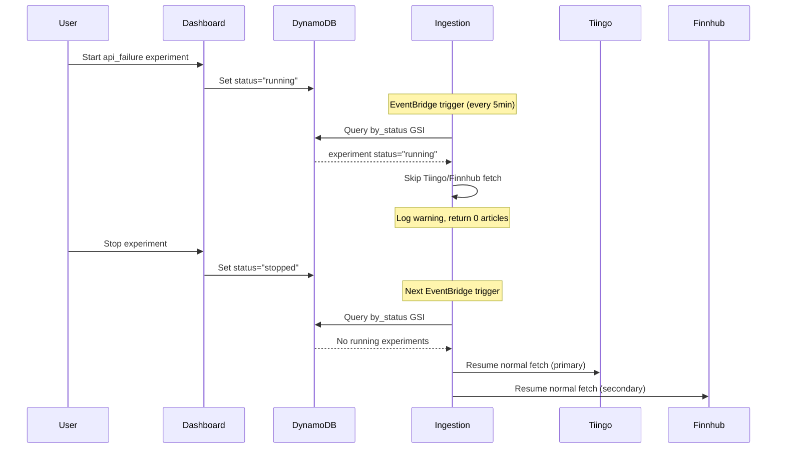

# Phase 3: Financial API Failure Chaos Testing

**Status**: ✅ Implemented
**PR**: #78
**Implementation Date**: 2025-11-24

## Overview

Phase 3 implements chaos testing for financial API (Tiingo/Finnhub) unavailability using DynamoDB-based coordination. Unlike Phase 2 (which uses AWS FIS), Phase 3 uses pure application-level fault injection through DynamoDB status flags.

> **Note**: This document was originally written for NewsAPI. The system now uses Tiingo (primary) and Finnhub (secondary) for financial news ingestion. The chaos injection mechanism remains the same.

## Architecture

### Components

1. **Chaos Injection Helper** (`src/lambdas/shared/chaos_injection.py`)
   - `is_chaos_active(scenario_type)` - Query if experiment is running
   - Fail-safe design: Returns `False` on any errors
   - Environment-aware: Only active in preprod/dev/test
   - Caches DynamoDB client for Lambda container reuse

2. **Ingestion Lambda Integration** (`src/lambdas/ingestion/financial_handler.py`)
   - Checks `is_chaos_active("api_failure")` before Tiingo/Finnhub fetch
   - Gracefully skips API calls if chaos active
   - Circuit breaker integration for real failures
   - Logs warning for CloudWatch visibility
   - Continues processing (0 articles fetched)

3. **Chaos Dashboard** (`src/lambdas/dashboard/chaos.py`)
   - Start: Sets `status="running"` in DynamoDB
   - Stop: Sets `status="stopped"` in DynamoDB
   - No AWS FIS needed - instant activation/deactivation

## How It Works



## Implementation Details

### Start Experiment

```python
elif scenario_type == "api_failure":
    # Phase 3: DynamoDB-based chaos injection
    results = {
        "started_at": datetime.utcnow().isoformat() + "Z",
        "injection_method": "dynamodb_flag",
        "note": "Ingestion Lambda will skip Tiingo/Finnhub calls while experiment is running",
    }
    update_experiment_status(experiment_id, "running", results)
```

### Stop Experiment

```python
elif scenario_type == "api_failure":
    # Phase 3: Stop DynamoDB-based chaos injection
    results = experiment.get("results", {})
    results["stopped_at"] = datetime.utcnow().isoformat() + "Z"
    update_experiment_status(experiment_id, "stopped", results)
```

### Chaos Detection

```python
def is_chaos_active(scenario_type: str) -> bool:
    """Check if chaos experiment is running."""
    if ENVIRONMENT not in ["preprod", "dev", "test"]:
        return False

    if not CHAOS_TABLE:
        return False

    try:
        table = _get_dynamodb().Table(CHAOS_TABLE)
        response = table.query(
            IndexName="by_status",
            KeyConditionExpression="status = :status",
            FilterExpression="scenario_type = :scenario_type",
            ExpressionAttributeValues={
                ":status": "running",
                ":scenario_type": scenario_type,
            },
            Limit=1,
        )
        return len(response.get("Items", [])) > 0
    except Exception:
        return False  # Fail-safe
```

### Ingestion Lambda Check

```python
# Phase 3 Chaos Injection: Check if api_failure experiment is active
if is_chaos_active("api_failure"):
    log_structured(
        "WARNING",
        "Chaos experiment active: skipping Tiingo/Finnhub fetch",
        scenario="api_failure",
        ticker=ticker,
    )
    continue  # Skip this ticker
```

## Safety Features

### 1. Fail-Safe Design
- Returns `False` on any DynamoDB errors
- Never blocks normal operation
- Logs errors but doesn't raise exceptions

### 2. Environment Isolation
- Only active in preprod/dev/test
- Production always returns `False`
- Requires `CHAOS_EXPERIMENTS_TABLE` env var

### 3. Graceful Degradation
- Ingestion Lambda succeeds with 0 articles
- No errors thrown
- CloudWatch logs show chaos is active

### 4. No Infrastructure Changes
- No AWS FIS templates needed
- No Lambda environment variable updates
- Pure DynamoDB coordination

## Benefits

| Feature | Phase 3 (api_failure) | Phase 2 (dynamodb_throttle) |
|---------|---------------------------|------------------------------|
| **Activation** | Instant (status change) | ~1-2 seconds (FIS API) |
| **Infrastructure** | None (DynamoDB only) | AWS FIS templates |
| **Complexity** | Low | Medium |
| **Blast Radius** | Configurable (per ticker) | Configurable (% throttle) |
| **Stop Time** | Instant | ~1-2 seconds |
| **Cost** | Free (DynamoDB queries) | FIS experiment costs |
| **Coordination** | DynamoDB status | AWS FIS |

## Testing

### Unit Tests

**`tests/unit/test_chaos_injection.py`** (18 test cases):
- ✅ Returns True when experiment running
- ✅ Returns False in production (safety)
- ✅ Returns False when chaos table not configured
- ✅ Fail-safe behavior on DynamoDB errors
- ✅ Client caching for Lambda efficiency
- ✅ Environment checks (preprod/dev/test only)
- ✅ Query uses by_status GSI with scenario filter
- ✅ Region detection (CLOUD_REGION or AWS_REGION)
- ✅ Multiple active experiments handled
- ✅ Staging environment returns False

**`tests/unit/test_chaos_fis.py`** (additional):
- ✅ Start experiment sets status="running"
- ✅ Stop experiment sets status="stopped"
- ✅ Start preserves injection_method in results
- ✅ Stop preserves started_at and injection_method

### Integration Testing Checklist

1. **Start Experiment**
   ```bash
   # Via Dashboard UI or API
   POST /api/chaos/experiments
   {
     "scenario_type": "api_failure",
     "duration_seconds": 300,
     "blast_radius": 100
   }
   ```

2. **Verify Ingestion Skips APIs**
   ```bash
   # Check CloudWatch logs
   aws logs tail /aws/lambda/preprod-sentiment-ingestion --since 5m --follow
   # Look for: "Chaos experiment active: skipping Tiingo/Finnhub fetch"
   ```

3. **Verify Graceful Degradation**
   ```bash
   # Check ingestion metrics
   aws cloudwatch get-metric-statistics \
     --namespace SentimentAnalyzer \
     --metric-name ArticlesFetched \
     --start-time $(date -u -d '10 minutes ago' +%Y-%m-%dT%H:%M:%S) \
     --end-time $(date -u +%Y-%m-%dT%H:%M:%S) \
     --period 300 \
     --statistics Sum
   # Should show 0 during chaos
   ```

4. **Stop Experiment**
   ```bash
   POST /api/chaos/experiments/{experiment_id}/stop
   ```

5. **Verify Ingestion Resumes**
   ```bash
   # Check CloudWatch logs
   aws logs tail /aws/lambda/preprod-sentiment-ingestion --since 5m --follow
   # Look for: "Fetched articles for tag"
   # Articles count should be > 0
   ```

## Monitoring

### CloudWatch Logs

**Chaos Active**:
```json
{
  "level": "WARNING",
  "message": "Chaos experiment active: skipping Tiingo/Finnhub fetch",
  "scenario": "api_failure",
  "ticker": "AAPL",
  "environment": "preprod"
}
```

**Chaos Detection Error** (fail-safe triggered):
```json
{
  "level": "ERROR",
  "message": "Failed to check chaos experiment status",
  "scenario_type": "api_failure",
  "error": "ResourceNotFoundException: Table not found"
}
```

### CloudWatch Metrics

- `ArticlesFetched` → 0 during chaos
- `NewItemsIngested` → 0 during chaos
- `DuplicatesSkipped` → 0 during chaos

### Alarms

Consider adding alarm for extended chaos:
```terraform
resource "aws_cloudwatch_metric_alarm" "chaos_api_extended" {
  alarm_name          = "preprod-chaos-api-extended"
  comparison_operator = "LessThanThreshold"
  evaluation_periods  = "6"  # 30 minutes (5min * 6)
  metric_name         = "ArticlesFetched"
  namespace           = "SentimentAnalyzer"
  period              = "300"
  statistic           = "Sum"
  threshold           = "1"
  alarm_description   = "API chaos experiment active for 30+ minutes"
  treat_missing_data  = "notBreaching"
}
```

## Troubleshooting

### Issue: Chaos not activating

**Symptoms**: Ingestion still fetching from Tiingo/Finnhub after starting experiment

**Debug Steps**:
1. Check experiment status in DynamoDB:
   ```bash
   aws dynamodb query \
     --table-name preprod-chaos-experiments \
     --index-name by_status \
     --key-condition-expression "status = :status" \
     --expression-attribute-values '{":status":{"S":"running"}}'
   ```

2. Check Ingestion Lambda environment:
   ```bash
   aws lambda get-function-configuration \
     --function-name preprod-sentiment-ingestion \
     | jq '.Environment.Variables'
   ```
   - Verify `CHAOS_EXPERIMENTS_TABLE` is set
   - Verify `ENVIRONMENT` is "preprod" or "dev"

3. Check CloudWatch logs for errors:
   ```bash
   aws logs filter-log-events \
     --log-group-name /aws/lambda/preprod-sentiment-ingestion \
     --filter-pattern "ERROR chaos"
   ```

### Issue: Chaos won't deactivate

**Symptoms**: Ingestion still skipping Tiingo/Finnhub after stopping experiment

**Debug Steps**:
1. Verify experiment status changed to "stopped":
   ```bash
   aws dynamodb get-item \
     --table-name preprod-chaos-experiments \
     --key '{"experiment_id":{"S":"YOUR_EXP_ID"}}'
   ```

2. Check DynamoDB client caching:
   - First ingestion after stop might use cached "running" status
   - Wait for next invocation (5 minutes)
   - Or manually invoke Lambda to force new check

3. Manual fix if needed:
   ```bash
   # Update experiment status directly
   aws dynamodb update-item \
     --table-name preprod-chaos-experiments \
     --key '{"experiment_id":{"S":"YOUR_EXP_ID"}}' \
     --update-expression "SET #status = :stopped" \
     --expression-attribute-names '{"#status":"status"}' \
     --expression-attribute-values '{":stopped":{"S":"stopped"}}'
   ```

## Future Enhancements

### 1. Per-Ticker Blast Radius
Currently skips all tickers. Could enhance to skip only specific tickers:
```python
{
  "scenario_type": "api_failure",
  "blast_radius": 50,  # Skip 50% of tickers
  "affected_tickers": ["AAPL", "TSLA"]  # Or specific tickers only
}
```

### 2. Partial Fetch (Degraded Mode)
Instead of 0 articles, fetch reduced count:
```python
if is_chaos_active("api_failure"):
    # Fetch 1 article instead of 10
    articles = adapter.fetch_items(ticker, limit=1)
```

### 3. Single-Source Failure
Test resilience when only one source fails:
```python
if is_chaos_active("tiingo_failure"):
    # Skip Tiingo, but Finnhub continues
    tiingo_articles = []
else:
    tiingo_articles = tiingo_adapter.fetch_news(ticker)
```

## References

- [Phase 4: Lambda Cold Start Delays](./PHASE4_LAMBDA_DELAY.md)
- [Chaos Testing Operator Guide](../testing/CHAOS_TESTING_OPERATOR_GUIDE.md)
- [Chaos Engineering Principles](https://principlesofchaos.org/)
