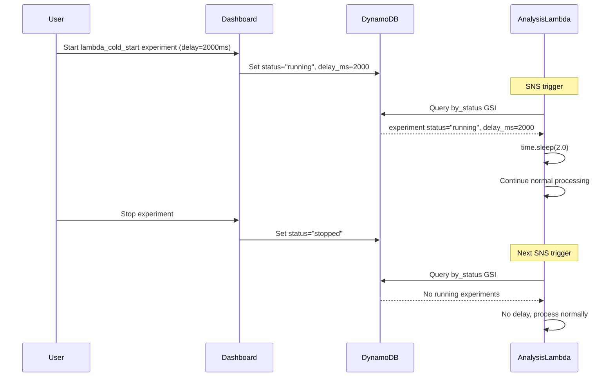

# Phase 4: Lambda Cold Start Delay Chaos Testing

**Status**: 🚧 In Progress
**PR**: TBD
**Implementation Date**: TBD

## Overview

Phase 4 implements chaos testing for Lambda cold start delays using DynamoDB-based coordination (similar to Phase 3). This simulates performance degradation scenarios where Lambda functions experience increased latency.

## Architecture

### Components

1. **Chaos Injection Helper** (`src/lambdas/shared/chaos_injection.py` - REUSE)
   - Reuse existing `is_chaos_active(scenario_type)` function
   - Same fail-safe design as Phase 3
   - No changes needed

2. **Lambda Integration** (Multiple lambdas)
   - Analysis Lambda: Add delay at handler entry
   - Ingestion Lambda: Add delay at handler entry
   - Dashboard Lambda: Add delay at handler entry (optional)
   - Configurable delay duration from experiment parameters

3. **Chaos Dashboard** (`src/lambdas/dashboard/chaos.py`)
   - Start: Sets `status="running"` with delay configuration
   - Stop: Sets `status="stopped"`
   - Store delay_ms in experiment results

## How It Works



## Implementation Details

### 1. Extend chaos_injection.py

Add new function to get delay configuration:

```python
def get_chaos_delay_ms(scenario_type: str) -> int:
    """
    Get delay in milliseconds for chaos experiment.

    Returns:
        Delay in milliseconds, or 0 if no active experiment

    Safety:
        - Returns 0 on any errors (fail-safe)
        - Only checks in preprod/dev/test environments
    """
    environment = os.environ.get("ENVIRONMENT", "dev")
    chaos_table = os.environ.get("CHAOS_EXPERIMENTS_TABLE", "")

    if environment not in ["preprod", "dev", "test"]:
        return 0

    if not chaos_table:
        return 0

    try:
        table = _get_dynamodb().Table(chaos_table)

        response = table.query(
            IndexName="by_status",
            KeyConditionExpression="status = :status",
            FilterExpression="scenario_type = :scenario_type",
            ExpressionAttributeValues={
                ":status": "running",
                ":scenario_type": scenario_type,
            },
            Limit=1,
        )

        if not response.get("Items"):
            return 0

        experiment = response["Items"][0]
        delay_ms = experiment.get("results", {}).get("delay_ms", 0)

        logger.info(
            f"Chaos delay injection active: {delay_ms}ms",
            extra={
                "scenario_type": scenario_type,
                "delay_ms": delay_ms,
            },
        )

        return int(delay_ms)

    except Exception as e:
        logger.error(
            "Failed to get chaos delay",
            extra={"scenario_type": scenario_type, "error": str(e)},
        )
        return 0  # Fail-safe
```

### 2. Analysis Lambda Integration

**File**: `src/lambdas/analysis/handler.py`

```python
from src.lambdas.shared.chaos_injection import get_chaos_delay_ms
import time

def handler(event, context):
    \"\"\"Main Lambda handler for analysis.\"\"\"

    # Phase 4 Chaos Injection: Simulate cold start delay
    delay_ms = get_chaos_delay_ms("lambda_cold_start")
    if delay_ms > 0:
        time.sleep(delay_ms / 1000.0)  # Convert ms to seconds
        log_structured(
            "WARNING",
            f"Chaos experiment active: injected {delay_ms}ms delay",
            scenario="lambda_cold_start",
            delay_ms=delay_ms,
        )

    # Continue with normal processing
    for record in event.get("Records", []):
        # ... existing logic
```

### 3. Ingestion Lambda Integration

**File**: `src/lambdas/ingestion/handler.py`

```python
from src.lambdas.shared.chaos_injection import get_chaos_delay_ms
import time

def handler(event, context):
    \"\"\"Main Lambda handler for ingestion.\"\"\"

    # Phase 4 Chaos Injection: Simulate cold start delay
    delay_ms = get_chaos_delay_ms("lambda_cold_start")
    if delay_ms > 0:
        time.sleep(delay_ms / 1000.0)
        log_structured(
            "WARNING",
            f"Chaos experiment active: injected {delay_ms}ms delay",
            scenario="lambda_cold_start",
            delay_ms=delay_ms,
        )

    # Continue with normal processing
    # ... existing logic
```

### 4. Dashboard Start Experiment

**File**: `src/lambdas/dashboard/chaos.py`

```python
elif scenario_type == "lambda_cold_start":
    # Phase 4: Lambda delay injection
    # Lambdas check chaos_experiments table and inject delay at handler entry
    delay_ms = experiment.get("blast_radius", 2000)  # Default 2 seconds

    results = {
        "started_at": datetime.utcnow().isoformat() + "Z",
        "injection_method": "dynamodb_delay",
        "delay_ms": delay_ms,
        "note": f"Lambdas will inject {delay_ms}ms delay at handler entry",
    }
    update_experiment_status(experiment_id, "running", results)
```

### 5. Dashboard Stop Experiment

**File**: `src/lambdas/dashboard/chaos.py`

```python
elif scenario_type == "lambda_cold_start":
    # Phase 4: Stop delay injection
    results = experiment.get("results", {})
    results["stopped_at"] = datetime.utcnow().isoformat() + "Z"
    update_experiment_status(experiment_id, "stopped", results)
```

## Safety Features

### 1. Fail-Safe Design
- Returns 0 delay on any errors
- Never blocks Lambda execution
- Logs errors but doesn't raise exceptions

### 2. Environment Isolation
- Only active in preprod/dev/test
- Production always returns 0 delay
- Requires `CHAOS_EXPERIMENTS_TABLE` env var

### 3. Configurable Delay
- Delay specified in milliseconds
- Defaults to 2000ms (2 seconds)
- Can be adjusted per experiment

### 4. Lambda Timeout Safety
- Chaos delay counts against Lambda timeout
- Should test with delays well below timeout (15min for analysis)
- Monitor CloudWatch for timeout errors

## Benefits

| Feature | Phase 4 (lambda_cold_start) | Real Cold Start |
|---------|----------------------------|-----------------|
| **Activation** | Instant (status change) | Unpredictable |
| **Duration** | Configurable (500ms-30s) | Variable (1-10s) |
| **Consistency** | Every invocation | Random |
| **Observability** | CloudWatch logs | CloudWatch metrics |
| **Control** | Start/stop on demand | No control |

## Testing

### Unit Tests

**`tests/unit/test_chaos_injection.py`** (extend existing):
- ✅ `test_get_chaos_delay_returns_configured_delay()`
- ✅ `test_get_chaos_delay_returns_zero_when_not_active()`
- ✅ `test_get_chaos_delay_returns_zero_in_production()`
- ✅ `test_get_chaos_delay_handles_missing_delay_ms()`
- ✅ `test_get_chaos_delay_fail_safe_on_error()`

**`tests/unit/test_chaos_fis.py`** (extend existing):
- ✅ Start experiment stores delay_ms in results
- ✅ Stop experiment preserves delay_ms

### Integration Testing Checklist

1. **Start Experiment with 2s delay**
   ```bash
   POST /api/chaos/experiments
   {
     "scenario_type": "lambda_cold_start",
     "duration_seconds": 300,
     "blast_radius": 2000  # 2000ms delay
   }
   ```

2. **Trigger Analysis Lambda (via SNS)**
   ```bash
   # Manually add item to DynamoDB to trigger analysis
   aws dynamodb put-item --table-name preprod-sentiment-items --item '{...}'
   ```

3. **Verify Delay in CloudWatch Logs**
   ```bash
   aws logs tail /aws/lambda/preprod-sentiment-analysis --since 5m --follow
   # Look for: "Chaos experiment active: injected 2000ms delay"
   ```

4. **Check Lambda Duration Metrics**
   ```bash
   aws cloudwatch get-metric-statistics \
     --namespace AWS/Lambda \
     --metric-name Duration \
     --dimensions Name=FunctionName,Value=preprod-sentiment-analysis \
     --start-time $(date -u -d '10 minutes ago' +%Y-%m-%dT%H:%M:%S) \
     --end-time $(date -u +%Y-%m-%dT%H:%M:%S) \
     --period 60 \
     --statistics Maximum,Average
   # Duration should be ~2000ms higher
   ```

5. **Test Variable Delays**
   ```bash
   # Test with 500ms delay
   POST /api/chaos/experiments {"...", "blast_radius": 500}

   # Test with 5s delay
   POST /api/chaos/experiments {"...", "blast_radius": 5000}
   ```

6. **Stop Experiment**
   ```bash
   POST /api/chaos/experiments/{experiment_id}/stop
   ```

7. **Verify No Delay After Stop**
   ```bash
   aws logs tail /aws/lambda/preprod-sentiment-analysis --since 2m
   # Should NOT see delay messages
   # Duration should return to normal (~200-500ms)
   ```

## Monitoring

### CloudWatch Logs

**Delay Active**:
```json
{
  "level": "WARNING",
  "message": "Chaos experiment active: injected 2000ms delay",
  "scenario": "lambda_cold_start",
  "delay_ms": 2000,
  "function": "sentiment-analysis"
}
```

**Delay Detection Error** (fail-safe):
```json
{
  "level": "ERROR",
  "message": "Failed to get chaos delay",
  "scenario_type": "lambda_cold_start",
  "error": "ResourceNotFoundException: Table not found"
}
```

### CloudWatch Metrics

- `Duration` → Increases by delay_ms during chaos
- `Throttles` → May increase if delay causes queue backup
- `Errors` → May increase if delay causes timeouts

### Alarms

Consider alarm for excessive duration:

```terraform
resource "aws_cloudwatch_metric_alarm" "chaos_delay_timeout_risk" {
  alarm_name          = "preprod-chaos-delay-timeout-risk"
  comparison_operator = "GreaterThanThreshold"
  evaluation_periods  = "2"
  metric_name         = "Duration"
  namespace           = "AWS/Lambda"
  period              = "60"
  statistic           = "Maximum"
  threshold           = "300000"  # 5 minutes (well below 15min timeout)
  alarm_description   = "Lambda duration exceeding safe threshold during chaos"

  dimensions = {
    FunctionName = "preprod-sentiment-analysis"
  }
}
```

## Troubleshooting

### Issue: Delay not injecting

**Symptoms**: Lambda processes normally despite active experiment

**Debug Steps**:
1. Check experiment status in DynamoDB
2. Verify `CHAOS_EXPERIMENTS_TABLE` env var set
3. Check CloudWatch logs for error messages
4. Verify environment is preprod/dev/test

### Issue: Lambda timing out

**Symptoms**: Lambda hits 15-minute timeout during chaos

**Root Cause**: Delay too long or combined with slow processing

**Solution**:
```bash
# Stop experiment immediately
POST /api/chaos/experiments/{experiment_id}/stop

# Restart with shorter delay
POST /api/chaos/experiments {"...", "blast_radius": 1000}  # 1s instead of 2s
```

### Issue: Inconsistent delays

**Symptoms**: Some invocations have delay, others don't

**Possible Causes**:
1. DynamoDB eventually consistent read
2. Lambda container reuse with cached "stopped" state
3. Experiment stopped mid-execution

**Solution**: Wait 1-2 minutes for consistency, check experiment status

## Future Enhancements

### 1. Per-Lambda Configuration

Target specific Lambdas:

```python
{
  "scenario_type": "lambda_cold_start",
  "blast_radius": 2000,
  "target_lambdas": ["analysis", "ingestion"]  # Skip dashboard
}
```

### 2. Variable Delay (Jitter)

Add randomness to simulate real cold starts:

```python
# Base delay + random jitter (±30%)
base_delay = 2000
jitter = random.randint(-600, 600)
actual_delay = base_delay + jitter
```

### 3. Progressive Delay

Increase delay over time:

```python
# Delay increases 10% every minute
elapsed_seconds = (datetime.utcnow() - started_at).total_seconds()
multiplier = 1.0 + (elapsed_seconds / 60) * 0.1
actual_delay = base_delay * multiplier
```

## References

- [Phase 3: API Failure Simulation](./PHASE3_API_FAILURE.md)
- [Chaos Testing Operator Guide](../testing/CHAOS_TESTING_OPERATOR_GUIDE.md)
- [AWS Lambda Cold Starts](https://aws.amazon.com/blogs/compute/operating-lambda-performance-optimization-part-1/)
- [Chaos Engineering Principles](https://principlesofchaos.org/)
