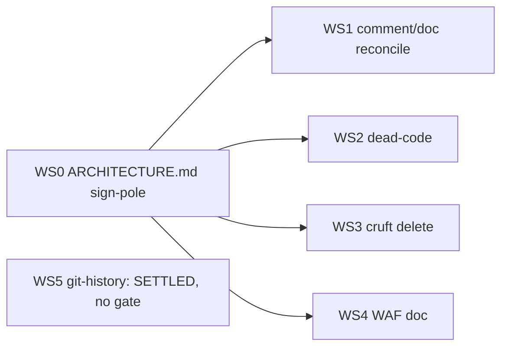

# Cleanup Dependency Map: Workstream DAG

Purpose: sign-post only. Where a WS item goes, what blocks it, whether touching it triggers CI (Lambda packaging / Terraform deploy) or stays local. No fixes prescribed. Every settled claim carries `file:line`; every `UNKNOWN` is an OPEN QUESTION, never a fact.

CI-cost rule used below: touching `src/lambdas/**` repackages + redeploys a Lambda (deploy.yml import smoke tests at deploy.yml:708-715, :1766-1795) and must clear ruff/bandit/pytest-80%, **CI-gated**. Touching `infrastructure/terraform/**` runs validate/plan/deploy, **CI-gated** (comment-only `.tf` edits produce no plan diff but still ride the infra pipeline). Everything under `docs/`, `specs/`, `CLAUDE.md`, `CONTEXT-CARRYOVER*` has no runtime import, **local-only, no CI**.

---

## Workstream register

| WS | Scope | Blocks | Blocked by | CI class |
|----|-------|--------|------------|----------|
| WS0 | Canonical `ARCHITECTURE.md` sign-pole | WS1, WS2, WS3, WS4 |, | local-only |
| WS1 | Misleading-comment / stale-doc reconciliation |, | WS0 | split (see rows) |
| WS2 | Dead-code removal |, | WS0 | CI-gated (Lambda) |
| WS3 | Legacy/cruft deletion (CONTEXT-CARRYOVER etc.) |, | WS0 | local-only |
| WS4 | WAF reconciliation (doc the live perimeter) |, | WS0 | local-only (doc); CI-gated only if `.tf` touched |
| WS5 | Git-history hygiene |, |, | **SETTLED, append-only, no rewrite. Not a gate.** |

WS0 is the sign-pole: every reconciliation points at one architecture truth, so it lands first. WS5 is resolved terrain (append-only history, no rewrite); it is recorded here so nobody re-opens it, but it gates nothing.

---

## WS0: canonical ARCHITECTURE.md (the sign-pole)

Content assembled from the CONFIRMED URL/infra inventory. Building the doc touches no runtime code.

| Surface | State | Anchor |
|---------|-------|--------|
| Amplify production frontend | LIVE | main.tf:1284 (module), 1645 (output `amplify_production_url`), 1640 |
| API Gateway invoke URL → `NEXT_PUBLIC_API_URL` | LIVE | main.tf:1295, 859; modules/amplify/main.tf:63; runtime.ts:22, constants.ts:1, runtime-store.ts:85, sse.ts:187 |
| Dashboard Lambda Function URL | DISABLED (Feature 1300) | main.tf:508 (`create_function_url=false`, comment 504-507), output removed main.tf:1458; `dashboard_api_url`=API GW at 1461-1464 |
| SSE Lambda Function URL | LIVE, IAM-locked, RESPONSE_STREAM, CloudFront-OAC fronted | main.tf:824-826, 957, 961, 1296; modules/amplify/main.tf:64 |
| Cognito Hosted UI / domain | LIVE | main.tf:148, 463, 1299, 1519; modules/cognito/outputs.tf:21-23, 26-29 |
| Cognito↔Amplify circular-dep patch | LIVE, `terraform_data` (NOT `null_resource`) | main.tf:1316, 1325 |
| General/dashboard CloudFront | REMOVED (Feature 1203); only `cloudfront_sse` remains | main.tf:957 (sole cloudfront module), 168-169, 1530 |

Two reconciliations the sign-pole must encode (do not silently carry the old framing):

- **SSE emit→consume is BROKEN.** Terraform emits `NEXT_PUBLIC_SSE_URL = var.sse_cloudfront_url` (modules/amplify/main.tf:64) but no frontend file reads it (`grep -rn NEXT_PUBLIC_SSE_URL frontend/` → rc=1). The stream URL is built from `NEXT_PUBLIC_API_URL` + `/api/stream` at sse.ts:187-188. The emitted var is orphaned at the consumer. Verdict CONFIRMED.
- **`/api/v2/runtime` SSE-URL leak is dev-only, not an unconditional 403.** handler.py:619 gates on `_is_dev_environment()`; :621 returns the raw IAM-locked URL only in dev, :625-628 returns `sse_url:None` in prod. The original "(would 403)" framing is REFUTED (urls domain); the dev-only exposure itself is CONFIRMED (deadcode domain). Anchors: handler.py:109, 139-146, 612-628; main.tf:501, 825, 960.

---

## WS1: misleading-comment / stale-doc reconciliation

| Item | State | CI class | Anchor(s) |
|------|-------|----------|-----------|
| `source_id` example comment `newsapi#abc123…` vs live `dedup:{sha256}` | CONFIRMED misleading | CI-gated (`.tf`) | dynamodb/main.tf:20; live: dedup.py:183, dedup.py:98 |
| `by_status` GSI comment "Minimal storage" vs `projection_type="ALL"` | CONFIRMED self-contradictory | CI-gated (`.tf`) | dynamodb/main.tf:69 (also by_sentiment:50, by_tag:60) |
| Model-load docstrings claim `/opt/model` Lambda layer; live downloads S3→`/tmp/model` | CONFIRMED misleading | **CI-gated (Lambda)** | sentiment.py:10,36; handler.py:43; live: sentiment.py:60,70; no `aws_lambda_layer_version` in TF; `model_layer_arns` unused (variables.tf:56, prod.tfvars:34=[]) |
| `CLAUDE.md:32` two-dashboard trap | CONFIRMED present; doc to annotate, not a false comment | local-only | CLAUDE.md:32 |
| "ALL docs still describe pre-Amplify world" | **REFUTED as bundled** | local-only | README.md:252-253 current; CHANGELOG.md:39 already annotated; high-level-overview.mmd:4,48,51 current |
| `specs/1159-samesite-cors-update` genuinely stale (CloudFront frontend / Function URL backend) | CONFIRMED stale, sole real pre-Amplify doc | local-only | spec.md:5,9,10,48; plan.md:5 |

Note the split: the two `.tf` comment rows and the doc rows can all be authored in Phase A, but the `.tf` edits **land** through the infra pipeline (Phase C). The `/opt/model` docstring row rides the Lambda deploy batch.

---

## WS2: dead-code removal (all CI-gated, Lambda packaging)

| Item | State | Coupling | Anchor(s) |
|------|-------|----------|-----------|
| `store_news_items()` / `store_news_items_with_notification()` orphaned (no prod callers; live path uses `upsert_article_with_source`) | ORPHANED / CONFIRMED | Test-coupled: removal breaks tests/unit/ingestion/test_storage_notification.py + tests/integration/ingestion/test_collection_flow.py; watch the pytest 80% coverage gate | storage.py:50,281; handler.py:87-91,1006; dedup.py:152 |
| `NewsItem.to_dynamodb_item()` emits `PK/SK` shape that never matches live `source_id/timestamp` schema | CONFIRMED mismatch | Latent; shared model | news_item.py:101,106,108,120; dedup.py:183,197,244-251; handler.py:987-1013 |
| LATENT BUG: cross-source dedup merge never fires, Tiingo isoformat carries `+00:00`, Finnhub naive carries none, so timestamp range-keys never match → second row instead of merge | CONFIRMED (via offset-suffix mismatch; prior "wall-clock shift" sub-claim corrected as TZ-dependent, does not hold under Lambda UTC) | Latent bug, **mapped only, not fixed here** | tiingo.py:237-239; finnhub.py:227; handler.py:969,1005; dedup.py:65,88-98,183,197,220,229-230 |

Removing WS2 code and the `/opt/model` docstrings (WS1) both hit `src/lambdas/**`. Batch them into **one** deploy-triggering PR to pay the deploy + coverage + smoke-test cost once.

---

## WS3: legacy / cruft deletion (local-only)

| Item | State | Note | Anchor(s) |
|------|-------|------|-----------|
| CONTEXT-CARRYOVER pile | **~33 REFUTED for tracked**, only 4 tracked files removable | Remaining ~33 are UNTRACKED + gitignored; a tracked-file ledger cannot touch them | CONTEXT-CARRYOVER-2026-02-03-session4.md, -session5.md (root); specs/1219-xray-exclusive-tracing/context-carryover-r21.md, -r22.md; .gitignore patterns `CONTEXT-CARRYOVER*.md`, `*.md.loaded` |
| Root `index.html` + `.nojekyll` Pages stub | ORPHANED by in-repo evidence; redirects to `interview/` (not the HTMX admin dashboard) | See OPEN QUESTION below before deleting | index.html (338 bytes, meta-refresh + JS to `interview/`); .nojekyll (0 bytes); no Pages pipeline: grep `.github/workflows/` pages → rc=1 |
| "TWO index.html" claim | **REFUTED**, there are THREE tracked | root, interview/index.html, src/dashboard/index.html | `git ls-files | grep index.html$` |

---

## WS4: WAF reconciliation (document the live perimeter; local-only unless `.tf` touched)

| Item | State | Anchor(s) |
|------|-------|-----------|
| `module.waf` (Feature 1254, REGIONAL) associated to API Gateway stage | LIVE / CONFIRMED | main.tf:924-949, esp. 929; modules/waf/main.tf:16, 254 (count=1 when REGIONAL + arn≠"") |
| `module.waf_cloudfront` (Feature 1255, CLOUDFRONT) consumed by CloudFront SSE `web_acl_id` | LIVE / CONFIRMED | main.tf:990-1011, 967, 981; modules/waf/outputs.tf:3-5; modules/cloudfront_sse/main.tf:77, variables.tf:14 |

Both perimeters are fully wired and live. WS4 is a **documentation** reconciliation into WS0 (no infra change indicated). Any `.tf` edit would flip it CI-gated and into Phase C.

---

## WS5: git-history hygiene (SETTLED)

Resolved: append-only, no history rewrite. Recorded so it is not re-litigated. **Not a gate, not scheduled.**

---

## DAG / blocking

**Parallel-safe set (after WS0, all local-only, no file contention):** WS1 doc rows (specs/1159, CLAUDE.md), WS3 (4 tracked CONTEXT-CARRYOVER deletions), WS4 (WAF write-up).

**Must serialize / batch:** WS1 `/opt/model` docstrings + WS2 dead-code + WS2 test updates all touch `src/lambdas/**` → one CI batch. WS1 `.tf` comment rows touch `infrastructure/terraform/**` → a separate infra batch.

---

## CI-cost ordering (pay each pipeline once)

| Batch | Files | Pipeline paid |
|-------|-------|---------------|
| Local docs | ARCHITECTURE.md, specs/1159, CLAUDE.md, CONTEXT-CARRYOVER×4, WAF doc | none (no runtime import) |
| Lambda batch | storage.py + its tests, sentiment.py/handler.py docstrings, (NewsItem mapping if touched) | deploy.yml smoke (708-715, 1766-1795) + ruff + bandit + pytest-80% |
| Infra batch | dynamodb/main.tf:20, :69 comments | terraform_fmt/validate + trivy(report-only) + checkov; no plan diff |

Validator context that sets the local gates (branch Q-pin-hcl2):

| Validator | Where it fires | Bearing on batching |
|-----------|----------------|---------------------|
| ruff format + lint (incl. `--select S`) | pre-commit + CI | any src/ edit must pass before push |
| bandit | pre-commit only (CI-dark; installed via requirements-ci.txt:59 but never invoked) | local gate on Lambda batch |
| pytest unit, `--fail-under=80` | pre-commit push hook + CI | dead-code + test removal must keep coverage ≥80% |
| gitleaks | pre-commit + CI | active both sides |
| detect-secrets, trivy, checkov | pre-commit only (CI-dark) | infra batch scanned locally, not in CI |
| semgrep, mutmut | ORPHANED / inert stub | no gate |
| mypy | manual-only, CI-absent | no gate |
| Playwright E2E (customer/frontend) | CI on PR (`--grep-invert @external-api`) | fires on any frontend touch; none in this cleanup set |

---

## 3-phase cadence

**Phase A, no CI (author + delete locally):**
WS0 ARCHITECTURE.md; WS1 doc annotations (specs/1159, CLAUDE.md); WS3 delete the 4 tracked CONTEXT-CARRYOVER files; WS4 WAF write-up into WS0. WS5 already settled, record only.

**Phase B, local tests (pre-push, no deploy):**
Stage WS2 dead-code removal + test edits; run pre-commit pytest(push, tests/unit), ruff, bandit locally; confirm the 80% coverage gate survives the deleted `store_news_items*` tests before anything is pushed. Do NOT touch the tz-aware/naive dedup bug here, it is mapped, not scheduled.

**Phase C, batched CI (deploy-triggering, one pass each):**
(C1) Push the Lambda batch, WS2 removals + WS1 `/opt/model` docstrings, as a single PR; watch deploy.yml import smoke tests + ruff/bandit/coverage + CodeQL. (C2) Push the infra comment batch, dynamodb/main.tf:20 and :69, separately; expect no plan diff, terraform validate/fmt only.

---

## OPEN QUESTIONS (verdict UNKNOWN: evidence still needed, NOT settled facts)

| # | Question | Evidence needed |
|---|----------|-----------------|
| 1 | Is the root `index.html` / `.nojekyll` Pages surface actually LIVE or truly orphaned? | Server-side GitHub Pages setting (Settings→Pages), not observable from the checkout. In-repo evidence supports ORPHANED. |
| 2 | Which of the three tracked `index.html` files does GitHub Pages publish, and is `interview/` the intended public target? | A `.github/workflows` pages-deploy step; none found this run. |
| 3 | Is the src/dashboard HTMX `/` route reachable at all post-Feature-1256 (dashboard Function URL public invokability)? | Route list (main.tf:877-892) has no `/` forward and dev-gate fails closed (handler.py:139-146,384-389); remaining gap = whether the dashboard Function URL is publicly invokable post-1256. |
| 4 | Do any tests exercise the HTMX `/` route as a live HTTP GET vs in-process unit calls? | grep tests/e2e for an HTTP GET to `/` on a deployed Function URL; re-open the 4 cited unit files for line-level assertions. |
| 5 | Is the src/dashboard `/` page vestigial? | STATIC_DIR confined to handler.py (168,170,389,410,444) and no tracked inbound link found; absence-of-linker is suggestive, not proof. |
| 6 | Does any dev-env frontend actually open a direct EventSource on `runtime.sse_url` (vs routing through CloudFront OAC)? | Consumer-side check not performed; determines real-world impact of the dev-only IAM-locked-URL leak. |
| 7 | How many of the 22 `tests/integration/*.py` bind LocalStack fixtures vs pure-moto? | Read each file; LocalStack path is CI-orphaned regardless. |
| 8 | Is the nightly `@external-api` E2E schedule still live? | `gh api .../actions/workflows` run history; GitHub auto-disables scheduled workflows after 60 days inactivity (nightly-e2e.yml:10-13). Only the on-PR job is source-provably active. |
| 9 | Firm processing-order / sequencing for the whitelist ledger | Analyst recommendation, UNKNOWN as a repo fact, needs the actual Python import graph and Terraform module dependency graph before firming the dead-code and infra tiers. |
