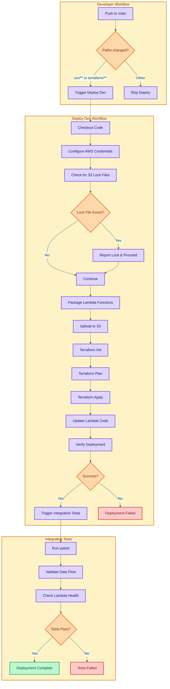
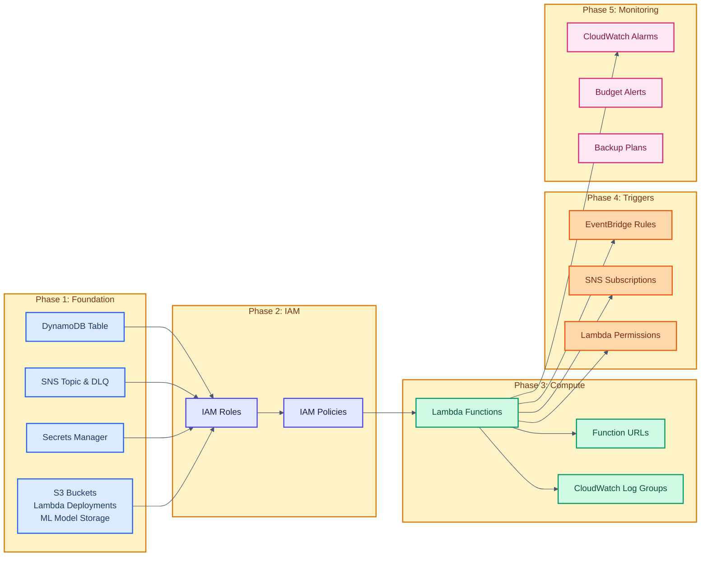
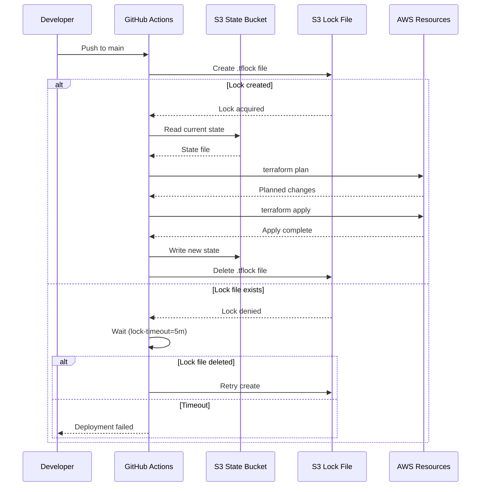
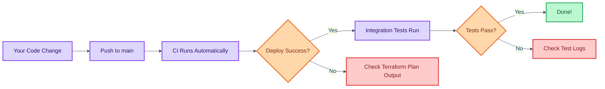
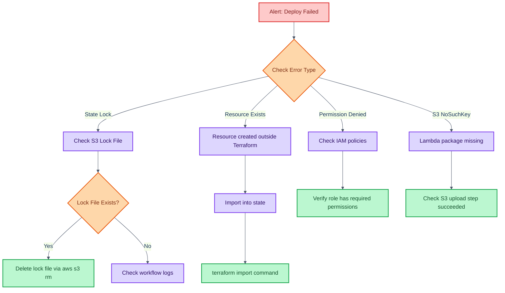
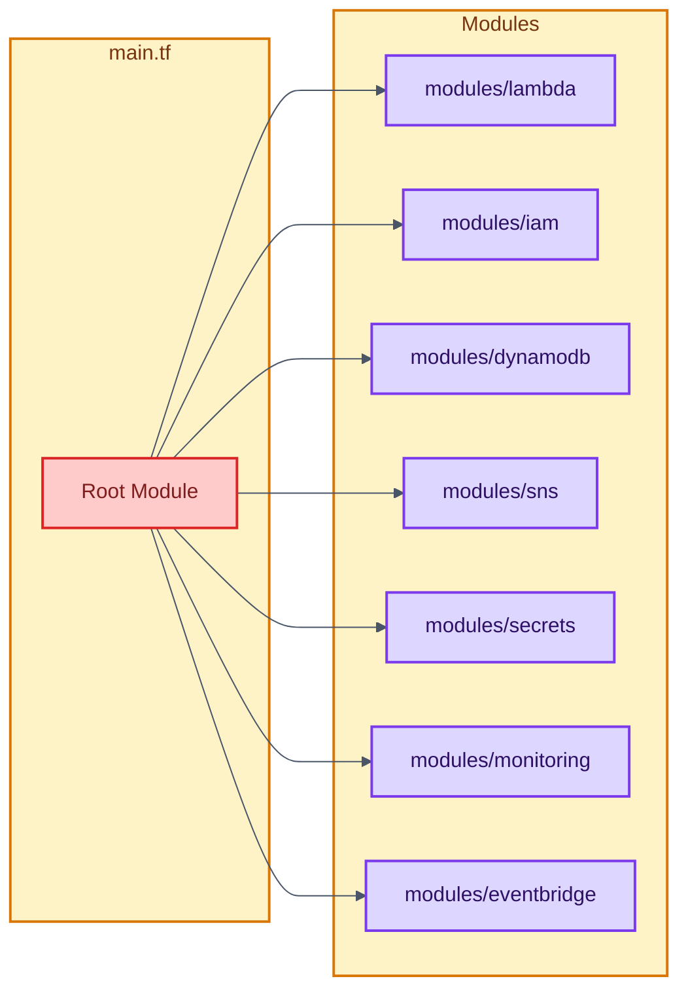
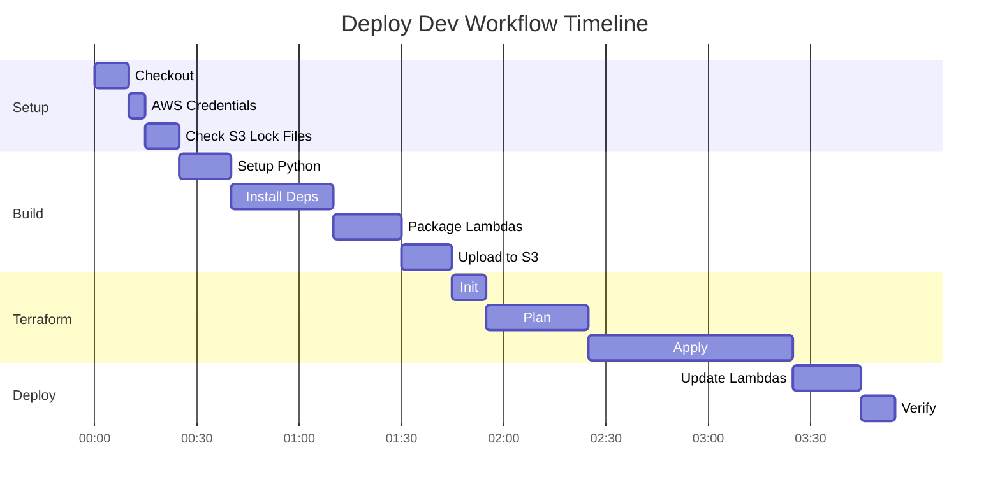
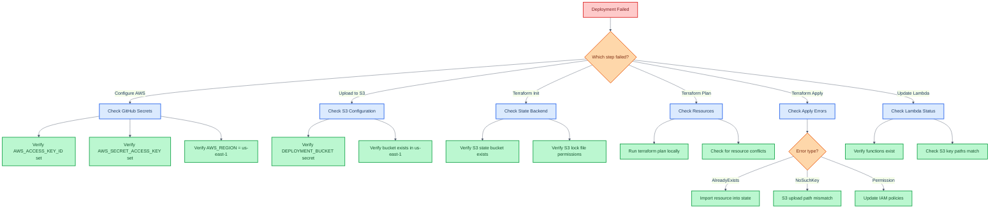

# Terraform Deployment Flow

This document explains the Terraform deployment process with visual diagrams for different roles.

## Overview Diagram



## Resource Creation Order



## State Management Flow



---

## Role-Specific Views

### For Developers

**What you need to know:**



**Key Points:**
- Merging to main triggers automatic deployment
- Watch the Deploy Dev workflow for your changes
- Integration tests validate the deployment worked
- Never run `terraform` locally during CI deployment

### For On-Call Engineers

**Incident Response Flow:**



**Recovery Commands:**

```bash
# Remove orphaned lock file
aws s3 rm s3://sentiment-analyzer-terraform-state-218795110243/dev/terraform.tfstate.tflock

# Or use terraform force-unlock with Lock ID from workflow logs
cd infrastructure/terraform
terraform force-unlock <LOCK_ID>

# Import missing resource
terraform import -var="environment=dev" "RESOURCE_ADDRESS" "RESOURCE_ID"

# Refresh state after manual changes
terraform refresh -var="environment=dev"
```

### For DevOps/Platform Engineers

**Infrastructure Dependencies:**

```mermaid
%%{init: {'theme': 'base', 'themeVariables': {'primaryColor': '#e8f4fd', 'primaryTextColor': '#1a365d', 'primaryBorderColor': '#3182ce', 'lineColor': '#4a5568'}}}%%
graph TB
    subgraph StateBackend["Terraform State Backend"]
        A[S3 Bucket<br/>sentiment-analyzer-terraform-state-*]
        B[S3 Lock Files<br/>*.tfstate.tflock]
    end

    subgraph GHSecrets["GitHub Secrets Required"]
        C[AWS_ACCESS_KEY_ID]
        D[AWS_SECRET_ACCESS_KEY]
        E[AWS_REGION]
        F[DEPLOYMENT_BUCKET]
    end

    subgraph AWSResources["AWS Resources Managed"]
        G[3x Lambda Functions]
        H[1x DynamoDB Table]
        I[2x Secrets Manager]
        J[1x S3 Bucket]
        K[1x SNS Topic + DLQ]
        L[1x EventBridge Rule]
        M[8x CloudWatch Alarms]
        N[1x Budget]
        O[1x Backup Plan]
    end

    A --> G
    B --> G
    C --> G
    D --> G
    E --> G
    F --> G

    classDef stageBox fill:#fef3c7,stroke:#d97706,stroke-width:2px,color:#78350f
    classDef stateNode fill:#ddd6fe,stroke:#7c3aed,stroke-width:2px,color:#2e1065
    classDef secretNode fill:#e0e7ff,stroke:#4f46e5,stroke-width:2px,color:#1e1b4b
    classDef resourceNode fill:#d1fae5,stroke:#059669,stroke-width:2px,color:#064e3b

    class StateBackend,GHSecrets,AWSResources stageBox
    class A,B stateNode
    class C,D,E,F secretNode
    class G,H,I,J,K,L,M,N,O resourceNode
```



**Terraform Module Structure:**



---

## CI/CD Pipeline Timeline



---

## Troubleshooting Decision Tree



---

## Quick Reference

| Workflow | Trigger | Duration | On Failure |
|----------|---------|----------|------------|
| Deploy Dev | Push to main (src/**, terraform/**) | ~2-3 min | Check Terraform logs |
| Integration Tests | After Deploy Dev success | ~2 min | Check pytest output |

| Secret | Purpose | Required By |
|--------|---------|-------------|
| AWS_ACCESS_KEY_ID | AWS authentication | Deploy, Integration |
| AWS_SECRET_ACCESS_KEY | AWS authentication | Deploy, Integration |
| AWS_REGION | Target region (us-east-1) | Deploy, Integration |
| DEPLOYMENT_BUCKET | Lambda package storage | Deploy |

---

*Diagrams created with Mermaid. View in GitHub or any Mermaid-compatible viewer.*
