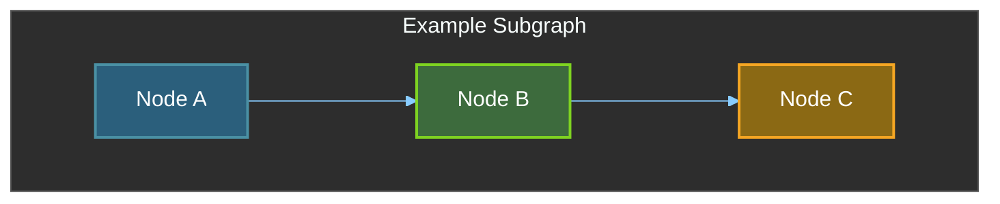

# Mermaid Diagram Templates

Standard dark theme templates for consistent diagram styling across the project.

## Flowchart Template

Use this for architecture diagrams, pipelines, and data flow diagrams.



## Sequence Diagram Template

Use this for interaction flows, API sequences, and authentication flows.

```mermaid
%%{init: {"theme": "dark", "themeVariables": {"primaryColor": "#4A90A4", "lineColor": "#88CCFF", "primaryTextColor": "#FFFFFF", "actorTextColor": "#FFFFFF", "actorBkg": "#2B5F7C", "actorBorder": "#4A90A4", "signalColor": "#88CCFF", "signalTextColor": "#FFFFFF", "noteBkgColor": "#3D3D3D", "noteTextColor": "#FFFFFF", "activationBkgColor": "#2d2d2d"}}}%%
sequenceDiagram
    participant A as Service A
    participant B as Service B
    participant C as Database

    rect rgb(30, 40, 60)
        Note over A,C: Flow Section 1 (blue tint)
        A->>B: Request
        B->>C: Query
        C-->>B: Response
        B-->>A: Result
    end

    rect rgb(60, 40, 30)
        Note over A,C: Flow Section 2 (orange tint)
        A->>C: Direct query
        C-->>A: Data
    end

    rect rgb(30, 50, 30)
        Note over A,C: Flow Section 3 (green tint)
        A->>B: Another request
        B-->>A: Another response
    end
```



## Color Reference

### Node Fill Colors (Dark theme)

| Purpose    | Fill Color | Stroke Color | Usage                    |
| ---------- | ---------- | ------------ | ------------------------ |
| External   | `#8B6914`  | `#F5A623`    | External APIs, services  |
| Lambda     | `#2B5F7C`  | `#4A90A4`    | Lambda functions         |
| Storage    | `#3D6B3D`  | `#7ED321`    | DynamoDB, S3, databases  |
| Messaging  | `#8B4513`  | `#D0021B`    | SNS, SQS, queues         |
| Monitoring | `#4B3D6B`  | `#9013FE`    | CloudWatch, alerts       |
| CDN        | `#6B3D5C`  | `#E91E63`    | CloudFront, edge         |
| Frontend   | `#2B6B6B`  | `#00BCD4`    | S3 static, Amplify       |
| Auth       | `#8B3D3D`  | `#FF5252`    | Cognito, auth services   |
| Gateway    | `#3D3D6B`  | `#3F51B5`    | API Gateway, load balancer|

### Rect Colors for Sequence Diagrams

| Tint   | RGB Value         | Usage              |
| ------ | ----------------- | ------------------ |
| Blue   | `rgb(30, 40, 60)` | Primary flows      |
| Orange | `rgb(60, 40, 30)` | OAuth/auth flows   |
| Green  | `rgb(30, 50, 30)` | Success/data flows |
| Red    | `rgb(50, 30, 35)` | Error/refresh flows|

## mermaid.live URLs

To view diagrams in mermaid.live with full pan/zoom, the URL must be encoded. Use this Python snippet:

```python
import zlib
import base64
import json

def generate_mermaid_url(diagram_code: str) -> str:
    payload = {
        "code": diagram_code,
        "mermaid": {"theme": "dark"},
        "autoSync": True,
        "updateDiagram": True
    }
    json_str = json.dumps(payload)
    compressed = zlib.compress(json_str.encode('utf-8'), 9)
    encoded = base64.urlsafe_b64encode(compressed).decode('utf-8').rstrip('=')
    return f"https://mermaid.live/view#pako:{encoded}"
```
