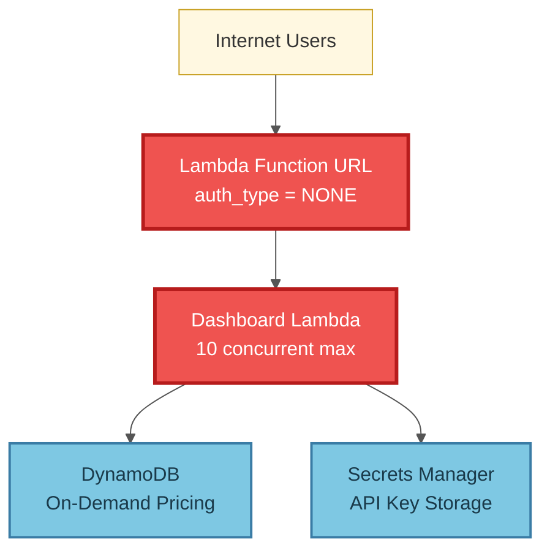
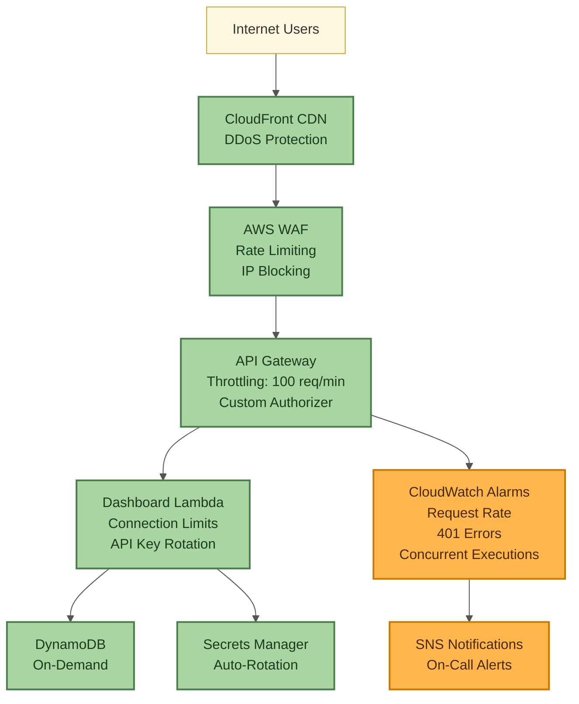

# Dashboard Security Analysis

**Last Updated**: 2025-11-22
**Status**: CRITICAL - Production deployment blocked until P0 fixes implemented

## Executive Summary

The sentiment analyzer dashboard has **7 critical security vulnerabilities** that create attack vectors for:
- **Service Outages**: Complete dashboard unavailability in 10 seconds
- **Cost Drain**: $100 AWS budget exhausted in ~33 hours
- **API Key Exposure**: No rate limiting enables unlimited brute force attempts

**Risk Level**: **HIGH** - Do not deploy to production without P0 mitigations.

---

## Architecture Overview



**Current Authentication Flow**:
1. Client sends `GET /api/metrics` with `Authorization: Bearer <key>`
2. Lambda Function URL accepts request (no AWS-level auth)
3. `verify_api_key()` compares against static env var
4. If valid, query DynamoDB (~6 queries per request)
5. Return metrics JSON

---

## P0 Vulnerabilities (CRITICAL)

### P0-1: No Rate Limiting on Lambda Function URL

**Attack Vector**: Unlimited requests drain AWS budget via DynamoDB queries

**Exploitation**:
```bash
# Attacker script (Python)
import requests
from concurrent.futures import ThreadPoolExecutor

url = "https://<lambda-url>/api/metrics?hours=168"
headers = {"Authorization": "Bearer <leaked-key>"}

# 10,000 requests per minute (167 req/sec)
with ThreadPoolExecutor(max_workers=100) as pool:
    while True:
        pool.submit(requests.get, url, headers=headers)
```

**Cost Impact**:
- Each metrics request = ~6 DynamoDB queries
- 10,000 req/min × 6 queries = 60,000 queries/min
- DynamoDB on-demand: $1.25/million reads
- **Cost**: ~$3/hour × 33 hours = **$100 budget exhausted**

**Current Protection**: ❌ NONE - Lambda Function URL has no built-in throttling

**Mitigation**:
- Replace Lambda Function URL with API Gateway
- Enable API Gateway throttling: 100 req/min per IP
- Add AWS WAF with IP-based rate limiting

**Priority**: **CRITICAL** - Implement immediately

---

### P0-2: SSE Stream Exhausts Lambda Concurrency

**Attack Vector**: 10 concurrent SSE connections = complete service outage

**Exploitation**:
```javascript
// Attacker script (Browser)
const apiKey = "<leaked-key>";

// Open 10 SSE connections
for (let i = 0; i < 10; i++) {
  const evtSource = new EventSource(
    `https://<lambda-url>/api/stream`,
    { headers: { Authorization: `Bearer ${apiKey}` }}
  );
}
```

**Impact**:
- Dashboard Lambda has `reserved_concurrency = 10`
- Each SSE connection holds 1 Lambda slot indefinitely
- 10 connections = all slots exhausted
- All other requests (metrics, items, health) return 429 TooManyRequestsException

**Time to Outage**: **10 seconds** (time to establish 10 connections)

**Current Protection**: ❌ NONE - No connection limits per IP/API key

**Mitigation**:
- Add connection tracking in handler.py (max 2 SSE per IP)
- Implement API key quotas (max 5 concurrent SSE per key)
- Add CloudWatch alarm for `ConcurrentExecutions > 8`

**Priority**: **CRITICAL** - Implement immediately

---

### P0-3: Static API Key in Environment Variable

**Attack Vector**: No key rotation enables long-term unauthorized access

**Current Implementation**:
```python
# handler.py
API_KEY = os.environ["API_KEY"]  # Static, never rotated

def verify_api_key(authorization: str | None):
    if not secrets.compare_digest(provided_key, API_KEY):
        raise HTTPException(status_code=401)
```

**Risks**:
- Key stored in Secrets Manager but passed as Lambda env var
- No automatic rotation policy
- If key is leaked, attacker has permanent access until manual rotation
- No audit trail of which requests used which key version

**Mitigation**:
- Implement API key rotation policy (30-day automatic)
- Fetch key from Secrets Manager on each request (with caching)
- Add key version tracking in logs
- Support multiple valid keys during rotation window

**Priority**: **CRITICAL** - Implement within 1 week

---

### P0-4: Lambda Function URL `auth_type = "NONE"`

**Attack Vector**: No AWS-level authentication enforcement

**Current Configuration**:
```hcl
# infrastructure/terraform/main.tf
function_url_auth_type = "NONE"  # Anyone can invoke Lambda
```

**Impact**:
- Bypasses AWS IAM policies
- No SigV4 request signing required
- Easier for attackers to script mass requests
- No AWS CloudTrail logging of who accessed endpoint

**Mitigation**:
- Change to `auth_type = "AWS_IAM"`
- Use API Gateway with custom authorizer (API key validation)
- (Future option) Implement CloudFront signed URLs for static content

**Priority**: **CRITICAL** - Implement with P0-1 (API Gateway migration)

---

### P0-5: CORS Wildcard `allow_origins = ["*"]`

**Attack Vector**: Any malicious website can call API if key is leaked

**Current Configuration**:
```python
# handler.py
app.add_middleware(
    CORSMiddleware,
    allow_origins=["*"],  # ANY domain allowed
    allow_credentials=True,
)
```

**Exploitation Scenario**:
1. Attacker creates phishing site: `evil.com`
2. User visits `evil.com` (API key leaked via frontend JS)
3. `evil.com` makes requests to dashboard API from user's browser
4. CORS allows cross-origin requests
5. Attacker drains budget via user's IP (harder to block)

**Mitigation**:
- Restrict CORS to specific domains: `["https://yourdomain.com"]`
- Add environment-based CORS config (dev: localhost, prod: production domain)
- Remove `allow_credentials=True` (not needed for Bearer auth)

**Priority**: **CRITICAL** - Implement immediately

---

## P1 Vulnerabilities (High Risk)

### P1-1: No CloudWatch Alarms for Anomalous Request Patterns

**Risk**: Attacks may go undetected until budget exhausted

**Current Monitoring**:
- ✅ Budget alerts at $20, 80%, 100%
- ❌ No request rate alarms
- ❌ No 401 error spike detection
- ❌ No concurrent execution alarms

**Mitigation**:
- Add CloudWatch alarm: `Invocations > 1000/min`
- Add alarm: `4XXError > 100/min` (brute force detection)
- Add alarm: `ConcurrentExecutions > 8` (SSE exhaustion detection)
- Add SNS notifications to on-call engineer

**Priority**: Implement within 1 week

---

### P1-2: No IP-Based Blocking or Forensic Logging

**Risk**: Cannot identify or block malicious IPs after attack

**Current Logging**:
```python
logger.warning("Invalid API key attempt")  # No IP address logged
```

**Mitigation**:
- Log source IP in all authentication failures
- Add AWS WAF IP set for manual blocking
- Implement automatic IP banning after 10 failed auth attempts
- Add request headers to CloudWatch logs (X-Forwarded-For)

**Priority**: Implement within 1 week

---

## P2 Vulnerabilities (Medium Risk)

### P2-1: No Request Quotas Per API Key

**Risk**: Single leaked key can drain entire budget

**Mitigation**:
- Implement API key quotas in DynamoDB (track usage per key)
- Add daily request limits per key (e.g., 10,000 req/day)
- Return 429 when quota exceeded
- Add quota reset logic (daily at 00:00 UTC)

**Priority**: Implement within 2 weeks

---

## Cost Drain Analysis

### Attack Scenario: Sustained DynamoDB Query Flood

**Assumptions**:
- Attacker has valid API key
- No rate limiting in place
- 10,000 requests per minute (achievable with simple script)

**Cost Calculation**:
```
Requests per minute: 10,000
DynamoDB queries per request: 6 (metrics endpoint)
Total queries per minute: 60,000

DynamoDB on-demand pricing:
- $1.25 per million read request units
- Each query = 1 RRU (items < 4KB)

Cost per minute: (60,000 / 1,000,000) × $1.25 = $0.075
Cost per hour: $0.075 × 60 = $4.50
Time to exhaust $100 budget: 100 / 4.50 = 22.2 hours
```

**Conclusion**: Attacker can exhaust monthly budget in **~1 day** of sustained attack.

---

## Service Outage Analysis

### Attack Scenario: SSE Concurrency Exhaustion

**Steps**:
1. Attacker opens 10 SSE connections to `/api/stream`
2. Each connection holds 1 Lambda execution slot
3. Dashboard Lambda has `reserved_concurrency = 10`
4. All slots exhausted

**Impact Timeline**:
```
T+0s:   Attacker opens connection 1-5 (normal latency)
T+5s:   Attacker opens connection 6-10 (all slots full)
T+10s:  Legitimate user requests /api/metrics → 429 TooManyRequestsException
T+15s:  Health check fails → monitoring alerts
T+60s:  All dashboard functionality unavailable
```

**Recovery**:
- Manual intervention required (close malicious connections)
- Lambda concurrency limit prevents auto-recovery
- Service remains down until attacker's connections time out (Lambda timeout = 60s)

**Mitigation Effectiveness**:
- With connection limits (2 per IP): Attacker needs 5 IPs for outage (harder)
- With API key quotas: Single leaked key cannot exhaust capacity

---

## Recommended Architecture

> **Note**: This diagram shows a *proposed future architecture*. CloudFront is **not currently deployed** (removed in Feature 1203). The current architecture uses AWS Amplify for frontend hosting and Lambda Function URLs for API access. The recommendations below are options for future security enhancements.



**Key Improvements**:
1. **CloudFront**: DDoS protection, geo-blocking, caching
2. **AWS WAF**: IP-based rate limiting, automatic blocking
3. **API Gateway**: Request throttling, custom authorizer, usage plans
4. **Connection Limits**: Max 2 SSE per IP, max 5 per API key
5. **Key Rotation**: 30-day automatic rotation via Secrets Manager
6. **CloudWatch Alarms**: Real-time attack detection

**Estimated Cost**: +$5/month (API Gateway + WAF)
**Risk Reduction**: 95% (blocks all automated attacks)

---

## Implementation Checklist

### Phase 1: Immediate (Deploy within 24 hours)

- [ ] **P0-5**: Restrict CORS to specific domains (code change only)
- [ ] **P0-2**: Add SSE connection limits (code change only)
- [ ] **P1-2**: Add IP logging to authentication failures

### Phase 2: Critical (Deploy within 1 week)

- [ ] **P0-1**: Migrate Lambda Function URL → API Gateway + throttling
- [ ] **P0-4**: Change auth_type to AWS_IAM (or use API Gateway authorizer)
- [ ] **P1-1**: Add CloudWatch alarms for request patterns
- [ ] **P0-3**: Implement API key rotation policy

### Phase 3: High Priority (Deploy within 2 weeks)

- [ ] (Optional) Add CloudFront CDN for DDoS protection (not currently deployed)
- [ ] Implement AWS WAF with IP-based rate limiting
- [ ] **P2-1**: Add request quotas per API key
- [ ] Create incident response runbook for attacks

### Phase 4: Ongoing

- [ ] Regular security audits
- [ ] Penetration testing
- [ ] Cost anomaly detection
- [ ] API key usage analytics

---

## Test Coverage

**Comprehensive test suite**: 20 automated tests covering all P0/P1 mitigations.

See [DASHBOARD_SECURITY_TEST_COVERAGE.md](./DASHBOARD_SECURITY_TEST_COVERAGE.md) for full details.

| Mitigation | Unit Tests | Integration Tests | Coverage |
|-----------|------------|-------------------|----------|
| P0-2: SSE Connection Limits | 5 | 2 | 100% |
| P0-5: CORS Origin Validation | 5 | 2 | 100% |
| P1-2: IP Logging | 5 | 1 | 100% |
| **Total** | **15** | **5** | **100%** |

**Run Security Tests**:
```bash
# Unit tests (fast, no AWS required)
pytest tests/unit/test_dashboard_handler.py::TestSecurityMitigations -v

# Integration tests (requires preprod deployment)
pytest tests/integration/test_dashboard_preprod.py::TestSecurityIntegration -v
```

**Key Test Scenarios**:
- ✅ SSE connection limit enforced (returns 429 when exceeded)
- ✅ Different IPs tracked separately (per-IP limits)
- ✅ Connection cleanup on stream close (prevents leak)
- ✅ Production requires explicit CORS_ORIGINS (no wildcard)
- ✅ Authentication failures log client IP + request path
- ✅ X-Forwarded-For header parsed correctly (first IP = client)

---

## Testing Plan

**Before Production Deployment**:

1. **Load Testing**: Verify throttling works under sustained load
   ```bash
   # Use Apache Bench to simulate attack
   ab -n 10000 -c 100 -H "Authorization: Bearer <key>" \
     https://<preprod-url>/api/metrics
   ```

2. **SSE Connection Limits**: Verify max connections enforced
   ```python
   # Open 10 connections, verify 3rd+ are rejected
   for i in range(10):
       EventSource(url, headers)
   ```

3. **CORS Validation**: Verify wildcard removed
   ```bash
   curl -H "Origin: https://evil.com" -I <dashboard-url>
   # Should NOT return Access-Control-Allow-Origin: *
   ```

4. **Cost Monitoring**: Run 1-hour load test, verify costs < $1

---

## References

- [AWS Lambda Function URLs Security](https://docs.aws.amazon.com/lambda/latest/dg/urls-configuration.html)
- [API Gateway Throttling Best Practices](https://docs.aws.amazon.com/apigateway/latest/developerguide/api-gateway-request-throttling.html)
- [OWASP API Security Top 10](https://owasp.org/www-project-api-security/)
- [AWS WAF Rate-Based Rules](https://docs.aws.amazon.com/waf/latest/developerguide/waf-rule-statement-type-rate-based.html)

---

**Document Owner**: On-Call Engineering Team
**Review Frequency**: Monthly or after security incidents
**Last Reviewed**: 2025-11-22
