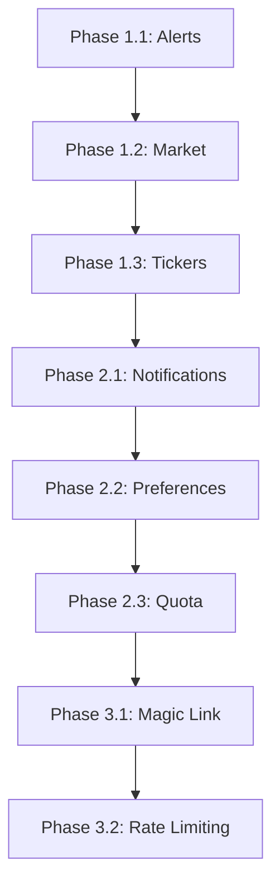

# Implementation Plan: E2E Endpoint Implementation Roadmap

**Branch**: `079-e2e-endpoint-roadmap` | **Date**: 2025-12-10 | **Spec**: [spec.md](./spec.md)
**Input**: Feature specification from `/specs/079-e2e-endpoint-roadmap/spec.md`

## Summary

This roadmap defines a phased implementation plan for ~60 missing API endpoints that are causing E2E tests to skip with "not implemented" messages. The approach uses **TDD with Blackbox Scaffolding** - deriving entity models and API contracts directly from existing E2E test assertions to ensure implementations match expected behavior.

## Technical Context

**Language/Version**: Python 3.13
**Primary Dependencies**: FastAPI, pydantic, boto3, httpx
**Storage**: DynamoDB (existing tables with GSIs for new access patterns)
**Testing**: pytest 8.0+, pytest-asyncio
**Target Platform**: AWS Lambda (via API Gateway)
**Project Type**: Single (serverless API)
**Performance Goals**: P90 ≤ 500ms for all endpoints
**Constraints**: Existing DynamoDB table schema, real AWS in preprod
**Scale/Scope**: ~67 E2E tests to un-skip across 4 phases

## Constitution Check

*GATE: All items PASS - ready for implementation*

| Gate | Status | Notes |
|------|--------|-------|
| Serverless/Event-driven | PASS | Lambda + DynamoDB per constitution |
| TDD requirement | PASS | E2E tests exist as blackbox specs |
| External API mocking | PASS | Tests already mock Tiingo/Finnhub |
| Synthetic test data | PASS | Existing config_generator fixtures |
| Security (auth required) | PASS | Tests verify 401/403 on endpoints |

## Project Structure

### Documentation (this feature)

```text
specs/079-e2e-endpoint-roadmap/
├── plan.md              # This file
├── spec.md              # Feature specification
├── checklists/
│   └── requirements.md  # Quality checklist (PASS)
├── data-model.md        # Entity schemas from test contracts
├── contracts/           # API contracts per phase
│   ├── phase1-alerts.yaml
│   ├── phase1-market.yaml
│   ├── phase1-tickers.yaml
│   ├── phase2-notifications.yaml
│   ├── phase2-preferences.yaml
│   ├── phase2-quota.yaml
│   ├── phase3-magiclink.yaml
│   └── phase3-ratelimit.yaml
└── quickstart.md        # Developer onboarding
```

### Source Code (repository root)

```text
src/
├── models/
│   ├── alert.py           # Phase 1: Alert entity
│   ├── market_status.py   # Phase 1: MarketStatus entity
│   ├── ticker.py          # Phase 1: Ticker entity
│   ├── notification.py    # Phase 2: Notification entity
│   ├── preferences.py     # Phase 2: NotificationPreference entity
│   ├── quota.py           # Phase 2: Quota entity
│   └── magic_link.py      # Phase 3: MagicLinkToken entity
├── routers/
│   ├── alerts.py          # Phase 1: /api/v2/configurations/{id}/alerts
│   ├── market.py          # Phase 1: /api/v2/market/*
│   ├── tickers.py         # Phase 1: /api/v2/tickers/*
│   ├── notifications.py   # Phase 2: /api/v2/notifications/*
│   └── auth_magic.py      # Phase 3: /api/v2/auth/magic-link, /verify
└── services/
    ├── alert_service.py
    ├── market_service.py
    ├── ticker_service.py
    ├── notification_service.py
    └── quota_service.py

tests/e2e/
├── test_alerts.py                    # 10 tests (Phase 1)
├── test_market_status.py             # 7 tests (Phase 1)
├── test_ticker_validation.py         # 8 tests (Phase 1)
├── test_notifications.py             # 8 tests (Phase 2)
├── test_notification_preferences.py  # 13 tests (Phase 2)
├── test_quota.py                     # 8 tests (Phase 2)
├── test_auth_magic_link.py           # 6 tests (Phase 3)
└── test_rate_limiting.py             # 8 tests (Phase 3)
```

**Structure Decision**: Single project structure - all endpoints are part of the existing FastAPI Lambda application.

---

## Phase 0: API Contract Extraction (Research)

### Methodology: TDD with Blackbox Scaffolding

Each phase follows this pattern:
1. **Extract contracts** from E2E test assertions
2. **Scaffold entities** matching test expectations
3. **RED**: Remove `pytest.skip()` → tests fail with 404
4. **GREEN**: Implement minimum code to pass tests
5. **REFACTOR**: Clean up while keeping tests green

---

## Phase 1: Core User Features (~25 tests)

### 1.1 Alerts API

**Source**: `tests/e2e/test_alerts.py` (10 tests: T068-T074 + 3 additional)

#### Entity: Alert (from test assertions)

```python
class Alert(BaseModel):
    alert_id: str           # Returned in create response
    type: Literal["sentiment", "volatility"]  # From test payloads
    ticker: str             # From test payloads
    threshold: float        # Updateable via PATCH
    condition: Literal["above", "below"]      # From test payloads
    enabled: bool           # Toggled via PATCH
    config_id: str          # Parent configuration
    created_at: datetime
    updated_at: datetime
```

#### API Contracts (from HTTP calls in tests)

| Endpoint | Method | Request | Response | Tests |
|----------|--------|---------|----------|-------|
| `/api/v2/configurations/{id}/alerts` | POST | `{type, ticker, threshold, condition, enabled}` | 201 + Alert | T068, T069 |
| `/api/v2/configurations/{id}/alerts` | GET | - | 200 + `[Alert]` | test_alert_list |
| `/api/v2/alerts/{id}` | GET | - | 200 + Alert \| 404 | T072 (verify delete) |
| `/api/v2/alerts/{id}` | PATCH | `{enabled?, threshold?}` | 200 + Alert | T070, T071 |
| `/api/v2/alerts/{id}` | DELETE | - | 200\|204 | T072 |

#### DynamoDB Access Patterns

```
PK: CONFIG#{config_id}  SK: ALERT#{alert_id}  → Alert item
GSI1: PK=USER#{user_id} SK=ALERT#{alert_id}   → User's alerts
```

---

### 1.2 Market Status API

**Source**: `tests/e2e/test_market_status.py` (7 tests: T105-T109 + 2 additional)

#### Entity: MarketStatus (from test assertions)

```python
class MarketStatus(BaseModel):
    status: Literal["OPEN", "CLOSED", "PRE_MARKET", "AFTER_HOURS"]
    is_open: bool           # Alias for status == "OPEN"
    timestamp: datetime     # Server time (as_of)
    next_open: datetime | None
    next_close: datetime | None
    trading_day: bool
    timezone: str = "America/New_York"
```

#### API Contracts

| Endpoint | Method | Response | Tests |
|----------|--------|----------|-------|
| `/api/v2/market/status` | GET | 200 + MarketStatus | T105, T106, T107 |
| `/api/v2/market/schedule` | GET | 200 + `{open_time, close_time, timezone}` | test_market_schedule |
| `/api/v2/market/holidays` | GET | 200 + `[{date, name}]` | T107 |
| `/api/v2/market/premarket` | GET | 200 + data \| 3xx redirect | T109 |

#### Implementation Notes

- Use `exchange_calendars` library for NYSE calendar
- Cache market status (TTL 60s) to avoid repeated calculations
- Pre-market: 4:00 AM - 9:30 AM ET
- After-hours: 4:00 PM - 8:00 PM ET

---

### 1.3 Ticker Validation API

**Source**: `tests/e2e/test_ticker_validation.py` (8 tests: T090-T094 + 3 additional)

#### Entity: Ticker (from test assertions)

```python
class TickerInfo(BaseModel):
    symbol: str             # Uppercase ticker
    company_name: str | None
    exchange: str | None
    is_valid: bool
    is_delisted: bool = False
    successor: str | None   # For renamed tickers (FB → META)
```

#### API Contracts

| Endpoint | Method | Request | Response | Tests |
|----------|--------|---------|----------|-------|
| `/api/v2/tickers/{symbol}` | GET | - | 200 + TickerInfo \| 404 | T090, T091, T092 |
| `/api/v2/tickers/validate` | GET | `?symbol=X` | 200 + TickerInfo | T090 (alt) |
| `/api/v2/tickers/validate` | POST | `{symbols: []}` | 200 + `[TickerInfo]` | test_batch |
| `/api/v2/tickers/search` | GET | `?q=X` | 200 + `[TickerInfo]` | T093, T094 |
| `/api/v2/tickers/autocomplete` | GET | `?q=X` | 200 + `[TickerInfo]` | T093 (alt) |

#### Implementation Notes

- Use Tiingo API for ticker metadata (existing integration)
- Cache valid tickers in DynamoDB (TTL 24h)
- Case-insensitive search (test T094 verifies this)
- Known renames: FB→META, TWTR→X

---

## Phase 2: Notifications System (~29 tests)

### 2.1 Notifications API

**Source**: `tests/e2e/test_notifications.py` (8 tests: T075-T079 + 3 additional)

#### Entity: Notification (from test assertions)

```python
class Notification(BaseModel):
    notification_id: str
    id: str  # Alias for notification_id
    type: str  # "alert_trigger", "system", etc.
    status: Literal["pending", "sent", "delivered", "failed", "read"]
    message: str
    created_at: datetime
    read: bool = False
    read_at: datetime | None
```

#### API Contracts

| Endpoint | Method | Request | Response | Tests |
|----------|--------|---------|----------|-------|
| `/api/v2/notifications` | GET | `?limit&offset` | 200 + `{notifications: []}` | T075, T076, T077 |
| `/api/v2/notifications/{id}` | GET | - | 200 + Notification | T078 |
| `/api/v2/notifications/{id}` | PATCH | `{read: bool}` | 200\|204 | test_mark_read |
| `/api/v2/notifications/quota` | GET | - | 200 + Quota | T079 |

---

### 2.2 Notification Preferences API

**Source**: `tests/e2e/test_notification_preferences.py` (13 tests: T139-T144 + 7 additional)

#### Entity: NotificationPreference (from test assertions)

```python
class NotificationPreference(BaseModel):
    email_enabled: bool
    digest_enabled: bool
    digest_time: str  # "09:00" format
    timezone: str = "America/New_York"

class DigestSettings(BaseModel):
    enabled: bool
    time: str  # "HH:MM" format
    timezone: str
```

#### API Contracts

| Endpoint | Method | Request | Response | Tests |
|----------|--------|---------|----------|-------|
| `/api/v2/notifications/preferences` | GET | - | 200 + Prefs | T139 |
| `/api/v2/notifications/preferences` | PATCH | `{email_enabled?, ...}` | 200 + Prefs | T140 |
| `/api/v2/notifications/disable-all` | POST | - | 200\|204 | test_disable_all |
| `/api/v2/notifications/resubscribe` | POST | - | 200\|204 | test_resubscribe |
| `/api/v2/notifications/digest` | GET | - | 200 + DigestSettings | T144a |
| `/api/v2/notifications/digest` | PATCH | `{enabled, time}` | 200 + DigestSettings | T144b |
| `/api/v2/notifications/digest/test` | POST | - | 202 Accepted | T144c |

---

### 2.3 Quota API

**Source**: `tests/e2e/test_quota.py` (8 tests: T145 + 7 additional)

#### Entity: Quota (from test assertions)

```python
class AlertQuota(BaseModel):
    used: int              # Current usage
    limit: int             # Max allowed
    remaining: int         # limit - used (clamped at 0)
    resets_at: str         # ISO datetime
    is_exceeded: bool      # used >= limit
```

#### API Contracts

| Endpoint | Method | Response | Tests |
|----------|--------|----------|-------|
| `/api/v2/alerts/quota` | GET | 200 + AlertQuota | T145, all quota tests |

#### Validation Rules (from test assertions)

- `remaining == max(0, limit - used)`
- `is_exceeded == (used >= limit)`
- `resets_at` must be valid ISO datetime in future
- Fresh user: `used == 0`, `remaining == limit`
- Limit range: 1-1000 (test_quota_limit_is_reasonable)

---

## Phase 3: Authentication Extensions (~14 tests)

### 3.1 Magic Link API

**Source**: `tests/e2e/test_auth_magic_link.py` (6 tests: T044-T047 + 2 additional)

#### Entity: MagicLinkToken (from test assertions)

```python
class MagicLinkToken(BaseModel):
    token: str
    email: str
    expires_at: datetime
    used: bool = False
```

#### API Contracts

| Endpoint | Method | Request | Response | Tests |
|----------|--------|---------|----------|-------|
| `/api/v2/auth/magic-link` | POST | `{email}` | 200\|202\|204 + `{message_id?}` | T044 |
| `/api/v2/auth/verify` | POST | `{token, anonymous_session_id?}` | 200 + `{access_token, refresh_token, user_id}` | T045, T046 |

#### Implementation Notes

- Rate limit: 1 magic link per email per minute (test validates rate limiting)
- Token expiry: 15 minutes
- Anonymous data merge: merge anonymous session configs when `anonymous_session_id` provided

---

### 3.2 Rate Limiting Feedback

**Source**: `tests/e2e/test_rate_limiting.py` (8 tests: T080-T084 + 3 additional)

#### Response Headers (from test assertions)

```
X-RateLimit-Limit: <number>
X-RateLimit-Remaining: <number>
Retry-After: <seconds>  (on 429)
```

#### API Behavior

- All endpoints should include `X-RateLimit-*` headers
- 429 responses MUST include `Retry-After` header or body field
- Rate limits apply per-user, per-endpoint
- Magic link endpoint has separate (lower) rate limit

---

## Phase 4: Dashboard Enhancements (~2 tests)

### 4.1 Heatmap/Metrics (deferred)

No E2E tests currently exist for heatmap/metrics endpoints. These should be:
- Added as new E2E tests first
- Then implemented following TDD pattern

---

## Implementation Order



Each phase should:
1. Be implemented as separate feature (080, 081, etc.)
2. Follow TDD: remove skip → implement → verify
3. Update E2E test count after each merge

---

## Complexity Tracking

| Violation | Why Needed | Simpler Alternative Rejected Because |
|-----------|------------|-------------------------------------|
| None | N/A | All implementations follow existing patterns |

---

## Success Criteria Verification

| Criteria | Measurement | Target |
|----------|-------------|--------|
| SC-001 | Phase 1 E2E skips reduced | ≥20 tests |
| SC-002 | Phase 2 E2E skips reduced | ≥25 tests |
| SC-003 | Phase 3 E2E skips reduced | ≥15 tests |
| SC-004 | Phase 4 E2E skips reduced | ≥2 tests |
| SC-005 | HTTP status codes | No 404/500 on implemented |
| SC-006 | Regression | Existing tests still pass |
| SC-007 | pytest.skip() removed | E2E tests execute fully |
