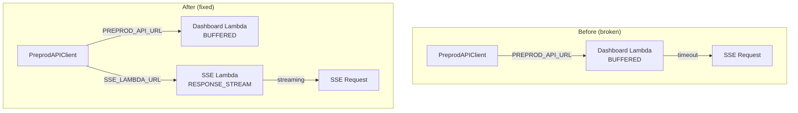

# Implementation Plan: Fix SSE E2E Integration Test Timeouts

**Branch**: `082-fix-sse-e2e-timeouts` | **Date**: 2025-12-10 | **Spec**: [spec.md](./spec.md)
**Input**: Feature specification from `/specs/082-fix-sse-e2e-timeouts/spec.md`

## Summary

Fix SSE streaming endpoint timeouts in preprod E2E tests by routing streaming requests to the correct Lambda (SSE Lambda with RESPONSE_STREAM mode) instead of the Dashboard Lambda (BUFFERED mode). The root cause has been identified: `PreprodAPIClient` uses a single `PREPROD_API_URL` for all requests, but SSE streaming endpoints require the separate SSE Lambda Function URL. Additionally, implement heartbeat keep-alive to prevent idle connection timeouts.

## Technical Context

**Language/Version**: Python 3.13
**Primary Dependencies**: httpx (async HTTP client), pytest-asyncio (E2E test runner), starlette (EventSourceResponse for SSE)
**Storage**: N/A (test infrastructure fix)
**Testing**: pytest with E2E markers, tests/e2e/test_sse.py
**Target Platform**: AWS Lambda (preprod environment)
**Project Type**: Single project (existing structure)
**Performance Goals**: SSE connection established within 10 seconds (current timeout threshold)
**Constraints**: Must not break existing non-SSE E2E tests; must maintain test isolation
**Scale/Scope**: 6 SSE E2E tests, 1 test client file, 1 CI workflow, 1 Terraform output

## Constitution Check

*GATE: Must pass before Phase 0 research. Re-check after Phase 1 design.*

| Principle | Status | Notes |
|-----------|--------|-------|
| Testing Matrix (Section 7) | PASS | E2E tests run in preprod with real AWS, mock external APIs only |
| Implementation Accompaniment Rule | PASS | Test client changes are test infrastructure, not application code |
| Deterministic Time Handling | N/A | No time-dependent test assertions |
| Pre-Push Requirements (Section 8) | PASS | GPG signing, lint, format required |
| Local SAST Requirement (Section 10) | PASS | Bandit + Semgrep run pre-commit |
| Pipeline Check Bypass | PASS | Will NOT bypass pipeline; fix must pass all checks |
| External Dependency Mocking | PASS | External APIs mocked; AWS is real in preprod |

**Gate Evaluation**: PASS - No constitution violations.

## Project Structure

### Documentation (this feature)

```text
specs/082-fix-sse-e2e-timeouts/
├── spec.md              # Feature specification (complete)
├── plan.md              # This file
├── research.md          # Phase 0 output (SSE best practices research)
└── tasks.md             # Phase 2 output (/speckit.tasks command)
```

### Source Code (affected files)

```text
tests/e2e/
├── helpers/
│   └── api_client.py        # MODIFY: Add SSE_LAMBDA_URL routing
├── conftest.py              # VERIFY: SSE URL environment variable
└── test_sse.py              # VERIFY: 6 tests should pass after fix

infrastructure/terraform/
├── main.tf                  # VERIFY: sse_lambda_function_url output exists
└── variables.tf             # NO CHANGE: Already has outputs

.github/workflows/
└── deploy.yml               # MODIFY: Set SSE_LAMBDA_URL env var from TF output

src/sse/                     # MODIFY: Add heartbeat implementation
└── handler.py               # Add 30-second heartbeat comments
```

**Structure Decision**: Single project structure. Modifications span test infrastructure (API client), CI workflow (environment variable), and source code (heartbeat).

## Complexity Tracking

> No constitution violations requiring justification.

| Violation | Why Needed | Simpler Alternative Rejected Because |
|-----------|------------|-------------------------------------|
| N/A | N/A | N/A |

## Phase 0: Research

### Decision Log

| Decision | Choice | Rationale | Alternatives Rejected |
|----------|--------|-----------|----------------------|
| SSE Client Library | httpx with streaming | Already used by PreprodAPIClient; supports async streaming | aiohttp (additional dep), requests-sse (sync only) |
| Heartbeat Interval | 30 seconds | Industry standard; matches AWS API Gateway idle timeout | 15s (too frequent), 60s (too slow for timeouts) |
| URL Routing Strategy | Path-based detection | Simple, no new dependencies, explicit routing | Header-based (harder to debug), separate client class (code duplication) |
| Heartbeat Format | SSE comment (`:`) | Per SSE spec, clients ignore comments; minimal overhead | Custom event type (client must handle), ping/pong (WebSocket pattern) |

### Research Tasks

1. **AWS Lambda SSE Configuration**
   - VERIFIED: SSE Lambda uses `RESPONSE_STREAM` invoke mode (main.tf:642)
   - VERIFIED: Dashboard Lambda uses `BUFFERED` mode (main.tf:421)
   - VERIFIED: Separate Function URLs for each Lambda (outputs exist)

2. **SSE Testing Patterns**
   - httpx streaming via `stream_client.stream("GET", ...)`
   - Short read timeout to capture initial response without blocking
   - Accept header: `text/event-stream`

3. **Heartbeat Best Practices**
   - AWS Lambda has 29-second idle timeout; 30s heartbeat prevents disconnect
   - SSE comment format: `: heartbeat\n\n` (colon prefix = comment, ignored by clients)
   - EventSourceResponse from starlette supports async generators

4. **Root Cause Confirmed**
   - `test_stream_status_endpoint` PASSES: Non-streaming JSON works on BUFFERED Lambda
   - SSE streaming tests TIMEOUT: EventSourceResponse requires RESPONSE_STREAM
   - Evidence: SSE Lambda has separate URL output: `sse_lambda_function_url`

## Phase 1: Design & Contracts

### Component Changes



### Data Flow

```
E2E Test → PreprodAPIClient.stream_sse()
         ↓ (path matches /api/v2/stream*)
         → Use SSE_LAMBDA_URL (RESPONSE_STREAM)
         ↓
         ← text/event-stream response
         ↓
         ← Heartbeat every 30s (: heartbeat\n\n)
         ↓
         ← SSE events (data: {...}\n\n)
```

### API Contract (PreprodAPIClient changes)

```python
# tests/e2e/helpers/api_client.py

class PreprodAPIClient:
    def __init__(
        self,
        base_url: str | None = None,
        sse_url: str | None = None,  # NEW: SSE Lambda URL
        timeout: float = 30.0,
    ):
        self.base_url = base_url or os.environ.get("PREPROD_API_URL", ...)
        self.sse_url = sse_url or os.environ.get("SSE_LAMBDA_URL", self.base_url)

    async def stream_sse(self, path: str, ...) -> tuple[int, dict, str]:
        # Route to SSE Lambda URL for streaming endpoints
        effective_url = self.sse_url if path.startswith("/api/v2/stream") else self.base_url
        ...
```

### Test Strategy

| Test Type | Location | Purpose |
|-----------|----------|---------|
| E2E | tests/e2e/test_sse.py | Verify all 6 SSE tests pass with correct routing |
| E2E | tests/e2e/test_dashboard_buffered.py | Verify non-SSE tests still work (no regression) |
| Manual | Preprod environment | Verify SSE connections via curl |

### Success Criteria Mapping

| SC | Implementation | Verification |
|----|----------------|--------------|
| SC-001 | PreprodAPIClient URL routing | All 6 SSE tests in test_sse.py pass |
| SC-002 | SSE Lambda RESPONSE_STREAM mode | Connection within 10 seconds |
| SC-003 | CI workflow SSE_LAMBDA_URL | Deploy workflow completes successfully |
| SC-004 | Path-based routing | Non-SSE tests continue to pass |
| SC-005 | Heartbeat implementation | Heartbeat received within 35s of idle |

## Artifacts Generated

- [x] spec.md (feature specification)
- [x] plan.md (this file)
- [ ] research.md (Phase 0 - SSE best practices)
- [ ] tasks.md (Phase 2 - `/speckit.tasks`)

---

**Next Step**: Run `/speckit.tasks` to generate implementation tasks, then `/speckit.implement` to begin implementation.
