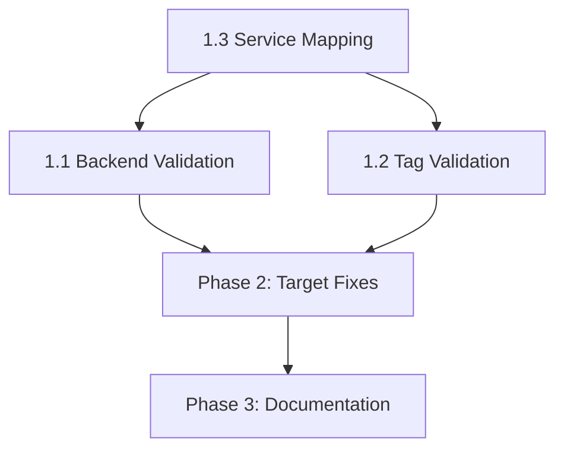

# Feature 092: Implementation Plan

**Status**: Draft
**Created**: 2025-12-11
**Spec**: [spec.md](./spec.md)

---

## Architecture Decision: Unified PR Approach

Per clarification Q4, implementing operational fixes AND validator enhancements in a single comprehensive PR. This ensures:

1. Pipeline unblocked after PR merge
2. Methodology gap cannot recur (validator catches future regressions)
3. Coherent audit trail in git history

---

## Implementation Phases

### Phase 1: Template Repo - Validator Enhancements

#### 1.1 Extend IAMResourceAlignmentValidator for Backend Files (GAP-001)

**File**: `src/validators/iam_resource_alignment.py`

**Changes**:

1. Add constant `BACKEND_PATTERNS = ["backend*.hcl", "backend.tf"]`
2. Create `_extract_backend_buckets(repo_path)` method:
   - Glob for `backend*.hcl` files
   - Parse HCL to extract `bucket = "..."` attribute
   - Return list of `(file_path, bucket_name)` tuples
3. Extend `_check_alignment()` to validate backend buckets against S3 IAM patterns
4. Add finding rule `ALIGN-003: Backend S3 bucket not allowed by IAM policy`

**Test**: `tests/unit/test_iam_resource_alignment.py`

- Add fixture `tests/fixtures/validators/backend-mismatch/`
- Test `test_backend_bucket_mismatch_detected()`

#### 1.2 Extend IAMResourceAlignmentValidator for Tag Conditions (GAP-003)

**File**: `src/validators/iam_resource_alignment.py`

**Changes**:

1. Add `_extract_tag_conditions(arn_patterns)` method:
   - Parse IAM policy statements for `Condition.StringLike["aws:ResourceTag/*"]`
   - Return dict of `{service: {tag_key: tag_pattern}}`
2. Add `_check_resource_tags(tf_resources, tag_conditions)` method:
   - For each Terraform resource, verify `tags` block contains required tags
   - Match tag values against IAM condition patterns
3. Add finding rules:
   - `ALIGN-004: Resource missing tag required by IAM condition`
   - `ALIGN-005: Resource tag value doesn't match IAM condition pattern`

**Test**: `tests/unit/test_iam_resource_alignment.py`

- Add fixture `tests/fixtures/validators/tag-condition-mismatch/`
- Test `test_missing_name_tag_detected()`
- Test `test_tag_pattern_mismatch_detected()`

#### 1.3 SERVICE_TO_TERRAFORM Mapping Updates

**File**: `src/validators/iam_resource_alignment.py`

**Changes**:
Add missing service mappings:

```python
SERVICE_TO_TERRAFORM = {
    # ... existing ...
    "cloudfront": {
        "distribution": ["aws_cloudfront_distribution"],
        "response-headers-policy": ["aws_cloudfront_response_headers_policy"],
    },
    "fis": {
        "experiment-template": ["aws_fis_experiment_template"],
    },
}
```

---

### Phase 2: Target Repo - Operational Fixes

#### 2.1 Fix S3 State Bucket Policy Pattern (FIX-001)

**File**: `infrastructure/terraform/ci-user-policy.tf`

**Change** (lines 831-834):

```hcl
# BEFORE
resources = [
  "arn:aws:s3:::*-sentiment-tfstate",
  "arn:aws:s3:::*-sentiment-tfstate/*"
]

# AFTER
resources = [
  "arn:aws:s3:::sentiment-analyzer-terraform-state-*",
  "arn:aws:s3:::sentiment-analyzer-terraform-state-*/*"
]
```

**Rationale**: Bucket was created with legacy naming; renaming S3 requires recreation. Safer to update policy pattern.

#### 2.2 Add Name Tags to CloudFront Resources (FIX-003)

**File**: `modules/cloudfront/main.tf`

**Changes**:

1. Find `aws_cloudfront_distribution` resource
2. Add `Name` tag to `tags` block:

```hcl
tags = merge(var.tags, {
  Name = "${var.environment}-sentiment-dashboard"
})
```

3. Find `aws_cloudfront_response_headers_policy` resource
4. Add comment noting tag limitations (response headers policies may not support tagging directly)

#### 2.3 Add Name Tags to FIS Resources (FIX-003 extended)

**File**: `modules/chaos/main.tf`

**Changes**:

1. Add `Name` tag to `aws_iam_role` for FIS execution:

```hcl
tags = {
  Name = "${var.environment}-sentiment-fis-execution"
}
```

2. Add `Name` tag to `aws_cloudwatch_log_group` for FIS:

```hcl
tags = {
  Name = "${var.environment}-sentiment-fis-logs"
}
```

---

### Phase 3: Bootstrap Documentation

#### 3.1 Create Migration Guide (SC-004)

**File**: `docs/iam-migration.md` (template repo)

**Content**:

1. Overview of naming convention migration
2. Step-by-step CI user rename procedure (FIX-002)
3. Pre-flight checklist before running pipeline
4. Rollback procedure if migration fails
5. Validation commands to verify migration success

---

## Test Strategy

### Template Repo Tests

| Test                                    | File                             | Purpose         |
| --------------------------------------- | -------------------------------- | --------------- |
| `test_backend_bucket_mismatch_detected` | `test_iam_resource_alignment.py` | SC-001          |
| `test_missing_name_tag_detected`        | `test_iam_resource_alignment.py` | SC-003          |
| `test_tag_pattern_mismatch_detected`    | `test_iam_resource_alignment.py` | SC-003          |
| `test_cloudfront_service_mapping`       | `test_iam_resource_alignment.py` | Service mapping |

### Target Repo Validation

After PR merge, run:

```bash
/iam-resource-alignment-validate --repo /path/to/sentiment-analyzer-gsk
```

Expected: Zero findings (all mismatches fixed)

---

## Dependency Order



**Critical Path**: Service mapping (1.3) must be done first since CloudFront validation depends on it.

---

## Risks and Mitigations

### Risk 1: HCL Parsing Complexity

**Risk**: `backend.hcl` files use HCL syntax which may require `python-hcl2` dependency.
**Mitigation**: Use regex fallback for simple `bucket = "..."` extraction. Full HCL parsing only if regex insufficient.

### Risk 2: Bootstrap Chicken-and-Egg

**Risk**: CI user rename (FIX-002) cannot be done by the CI user being renamed.
**Mitigation**: Document as manual bootstrap step. Provide AWS CLI commands in migration guide.

### Risk 3: Tag Support Varies by Resource

**Risk**: Not all AWS resources support tags (e.g., some CloudFront policy types).
**Mitigation**: Tag validation only for resources in `SERVICE_TO_TERRAFORM` mapping. Unknown resources skipped with INFO log.

---

## Rollback Plan

### If Template Validator Breaks

1. Revert validator changes
2. Pin validate-runner to previous version

### If Target IAM Fixes Break Pipeline Further

1. Revert `ci-user-policy.tf` changes
2. Use previous S3/IAM patterns until root cause identified

### If Bootstrap Fails

1. Recreate legacy CI user from backup
2. Restore GitHub Actions secrets
3. Document failure for post-mortem

---

## Success Metrics

| Metric             | Target                          | Measurement             |
| ------------------ | ------------------------------- | ----------------------- |
| Pipeline unblocked | 0 IAM AccessDenied errors       | Deploy Pipeline success |
| Validator coverage | 3 new rules (ALIGN-003,004,005) | Unit test pass          |
| Test coverage      | ≥80% for new code               | Coverage report         |
| Documentation      | Migration guide exists          | File check              |

---

## File Manifest

### Template Repo (terraform-gsk-template)

- `src/validators/iam_resource_alignment.py` - Modify
- `tests/unit/test_iam_resource_alignment.py` - Modify
- `tests/fixtures/validators/backend-mismatch/` - Add
- `tests/fixtures/validators/tag-condition-mismatch/` - Add
- `docs/iam-migration.md` - Add

### Target Repo (sentiment-analyzer-gsk)

- `infrastructure/terraform/ci-user-policy.tf` - Modify
- `modules/cloudfront/main.tf` - Modify
- `modules/chaos/main.tf` - Modify
