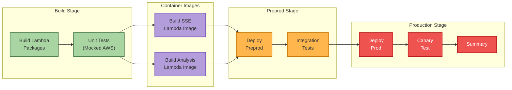

# Feature 1028: Fix README Mermaid Diagram

## Problem Statement

The CI/CD Pipeline Status section in README.md has two issues:

1. **Rendering Failure**: The Mermaid diagram uses `%%{init: {'theme':'base', 'themeVariables': {...}}}%%` directives that GitHub's native Mermaid renderer does not fully support, causing the diagram to render as raw code instead of a visual flowchart.

2. **Inaccurate Content**: The diagram shows a "Dev Stage" that was removed from the pipeline (per deploy.yml architectural note). The actual pipeline is:
   - Build → Test (mocked) → Build Container Images → Deploy Preprod → Test Preprod → Build Prod Images → Deploy Prod → Canary → Summary

## Root Cause

- GitHub's Mermaid renderer uses an iframe pointing to GitHub's Viewscreen service
- Complex `themeVariables` with many custom colors may cause silent rendering failures
- The `classDef` statements with custom colors are supported, but the `%%{init:...}%%` directive may be interfering

## Acceptance Criteria

- [ ] AC-1: Mermaid diagram renders as a visual flowchart (not raw code) on GitHub
- [ ] AC-2: Diagram accurately represents the current deploy.yml pipeline stages
- [ ] AC-3: Diagram uses GitHub-compatible Mermaid syntax
- [ ] AC-4: Diagram is visually appealing for potential employers viewing the landing page

## Solution Design

### Option A: Remove Init Directive, Keep classDef (Recommended)

Remove the `%%{init:...}%%` directive but keep `classDef` for styling. GitHub supports `classDef` but may not support complex `themeVariables`.

### Option B: Remove All Custom Styling

Use GitHub's default Mermaid theme with no custom colors.

### Chosen Approach: Option A

The `classDef` statements should work without the `%%{init:...}%%` directive.

## Implementation

### Updated Pipeline Diagram (Accurate to deploy.yml)

## Files Modified

- `README.md` - Update Mermaid diagram in CI/CD Pipeline Status section

## Testing

- Manual verification: Push to branch and view README on GitHub
- Confirm diagram renders as visual flowchart
- Confirm diagram matches deploy.yml job structure

## References

- [GitHub Blog: Include diagrams with Mermaid](https://github.blog/developer-skills/github/include-diagrams-markdown-files-mermaid/)
- [Mermaid Documentation](https://mermaid.js.org/syntax/flowchart.html)
- deploy.yml architectural note (lines 1-20)
