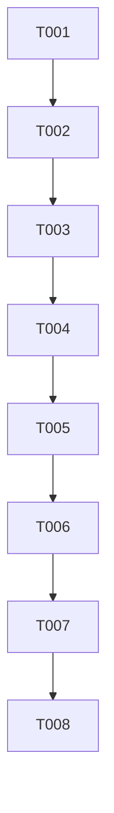

# Implementation Tasks: SSE Runtime URL Discovery

**Feature**: 1100-sse-runtime-url
**Generated**: 2025-12-29
**Plan**: [plan.md](./plan.md)
**Spec**: [spec.md](./spec.md)

## Overview

Fix 502 error on SSE stream by fetching runtime config to get correct SSE Lambda URL.

**Total Tasks**: 8
**Estimated Complexity**: Low (frontend-only, ~6 files)

## Dependencies

## Phase 1: Setup

- [ ] T001 Create runtime config type definitions in `frontend/src/types/runtime.ts`

## Phase 2: Foundational

- [ ] T002 Create runtime config fetch function in `frontend/src/lib/api/runtime.ts`
- [ ] T003 [P] Create runtime config store in `frontend/src/stores/config-store.ts`

## Phase 3: User Story 1 - Real-time Dashboard Updates (P1)

**Goal**: SSE connection uses correct Lambda URL
**Independent Test**: Load dashboard, verify SSE connects to SSE Lambda (not Dashboard Lambda)

- [ ] T004 [US1] Modify SSE client factory to accept optional baseUrl in `frontend/src/lib/api/sse.ts`
- [ ] T005 [US1] Modify use-sse hook to use config store SSE URL in `frontend/src/hooks/use-sse.ts`
- [ ] T006 [US1] Add runtime config initialization to app providers in `frontend/src/app/providers.tsx` or `layout.tsx`

## Phase 4: User Story 2 - Graceful Fallback (P2)

**Goal**: Dashboard works even when SSE Lambda is unreachable
**Independent Test**: Block SSE Lambda URL, verify dashboard still loads without errors

- [ ] T007 [US2] Add fallback logic and error state handling in `frontend/src/hooks/use-sse.ts`

## Phase 5: Polish

- [ ] T008 Manual E2E validation: Load dashboard, check Network tab for correct SSE URL

## Implementation Strategy

### MVP Scope (Phase 1-3)
Implement T001-T006 to fix the 502 error. This delivers full value for User Story 1.

### Parallel Opportunities
- T002 and T003 can be done in parallel (different files, no dependencies)
- T004 and T005 can be done in parallel after T002/T003 complete

### File Summary

| File | Action | Task |
|------|--------|------|
| `frontend/src/types/runtime.ts` | CREATE | T001 |
| `frontend/src/lib/api/runtime.ts` | CREATE | T002 |
| `frontend/src/stores/config-store.ts` | CREATE | T003 |
| `frontend/src/lib/api/sse.ts` | MODIFY | T004 |
| `frontend/src/hooks/use-sse.ts` | MODIFY | T005, T007 |
| `frontend/src/app/providers.tsx` | MODIFY | T006 |

## Acceptance Criteria

1. ✅ `/api/v2/runtime` fetched on app load
2. ✅ SSE connection uses returned `sse_url`
3. ✅ No 502 errors in Network tab
4. ✅ "Connected" status displayed
5. ✅ Fallback to `NEXT_PUBLIC_API_URL` if runtime fetch fails
