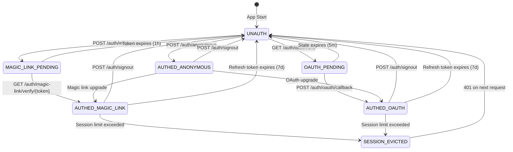

# Feature Specification: Auth Architecture Rewrite (v3.2 - Identity Federation)

**Feature Branch**: `1126-auth-rewrite`
**Created**: 2026-01-03
**Updated**: 2026-01-04
**Status**: Draft v3.2 - Identity Federation Model Complete
**Priority**: P0 - Security + Architecture Foundation

---

## Changelog from v1

| Section | Change | Reason |
|---------|--------|--------|
| JWT Secret Management | **ADDED** | v1 had no key management spec |
| CORS Configuration | **ADDED** | v1 assumed same-origin |
| Magic Link | **UPDATED** | Document existing backend implementation |
| Cookie Settings | **FIXED** | Backend uses `Strict`, spec said `Lax` |
| Concurrent Refresh | **ADDED** | v1 had race condition |
| Role Hierarchy | **CLARIFIED** | v1 was ambiguous on AND vs OR |
| Mock Tokens | **ADDRESSED** | Backend has mock generation - must guard |
| Hardcoded Secret | **FLAGGED** | MAGIC_LINK_SECRET fallback is dangerous |
| Frontend Deletions | **EXPLICIT** | List exactly what to remove |
| Anonymous Mode | **DOCUMENTED** | Browser behavior in incognito |

### v2.1 - Security Audit Findings (2026-01-03)

| Section | Change | Reason |
|---------|--------|--------|
| JWT Claims | **ADDED** `aud`, `nbf` | Prevent token replay and pre-dated tokens |
| JWT Claims | **ADDED** validation table | Explicit checks for all claims |
| Role Decorator | **FIXED** error message | Removed role leakage in 403 response |
| Magic Link URL | **CHANGED** query → path | Prevent token leakage via Referer/logs |
| Infrastructure Layer | **ADDED** | Document CloudFront/API Gateway cookie handling |
| Back Button | **ADDED** | Cache-Control headers for protected content |
| Network Failure | **ADDED** | Timeout handling for refresh requests |
| Phase 0 | **ADDED** | Critical security fixes before any feature work |
| Signout | **CLARIFIED** | Server-side revocation required |

### v2.2 - Deep Audit Findings (2026-01-03)

| Section | Change | Reason |
|---------|--------|--------|
| Phase 0 | **EXPANDED** | Added C4-C6 (unprotected admin endpoints, XSS exposure) |
| JWT Validation | **ADDED** middleware requirements | aud/nbf must be validated in auth_middleware.py |
| Cookie Extraction | **ADDED** | Middleware must extract httpOnly cookies |
| RBAC | **ADDED** Phase 1.5 | Foundation for paid/operator roles |
| Magic Link | **SIMPLIFIED** | Remove HMAC, use random tokens + atomic DB |
| Integration Tests | **ADDED** | Atomic token consumption tests |
| 401 Interceptor | **CLARIFIED** | Frontend retry logic requirements |
| spec.md (v1) | **ARCHIVED** | spec-v2.md is now canonical |

### v2.3 - Principal Engineer Audit (2026-01-03)

| Section | Change | Reason |
|---------|--------|--------|
| Endpoint Table | **FIXED** | Removed `/<sig>` from magic link verify (HMAC removed) |
| CORS Config | **DECIDED** | Same-origin deployment selected, no CSRF tokens needed |
| JWT Generation | **ADDED** | New section with `create_access_token()` and `create_refresh_token()` |
| Atomic Refresh | **ADDED** | Full `refresh_tokens()` implementation with DynamoDB conditional update |
| Rate Limiting | **ADDED** | New section with endpoint-specific limits and implementation |
| Success Criteria | **EXPANDED** | Added aud/nbf validation, hashed tokens, atomic rotation |
| Phase 1 | **UPDATED** | Removed vestigial `get_magic_link_secret()` references |
| Out of Scope | **UPDATED** | Removed rate limiting (now in-scope) |
| Testing | **UPDATED** | Removed `get_magic_link_secret()` test requirement |

**Audit Findings Addressed:**
- 5 CRITICAL issues identified and mitigated
- 8 HIGH issues documented with implementation code
- 2 vestigial content items removed
- 5 blind spots filled (JWT generation, atomic refresh, rate limiting, CORS decision, hashed tokens)

### v2.4 - Deep Implementation Audit (2026-01-03)

| Section | Change | Reason |
|---------|--------|--------|
| Spec vs Implementation | **ADDED** drift warnings | 4 CRITICAL discrepancies found between spec and code |
| localStorage | **CRITICAL** | Spec says memory-only, impl uses zustand persist |
| HMAC Secret | **CRITICAL** | Spec says random tokens, impl still uses hardcoded HMAC |
| JWT Validation | **CRITICAL** | Spec requires aud/nbf, middleware doesn't validate |
| cookies.ts | **MUST DELETE** | Vestigial file sets non-httpOnly cookies from JS |
| X-User-ID Header | **MUST REMOVE** | Legacy fallback enables impersonation attacks |
| @require_role | **NOT IMPLEMENTED** | Decorator specified but not in codebase |
| Rate Limiting | **NOT IMPLEMENTED** | Spec has limits, no DynamoDB counters exist |
| Blind Spots | **ADDED** 7 sections | Cross-tab, anon mode, secret rotation, etc. |
| Header Transform | **ADDED** | Layer-by-layer auth header documentation |
| Role Future-Proofing | **ADDED** | Explicit gaps for paid/operator roles |
| Vestigial Content | **REMOVED** | HMAC migration guide, redundant comments |

**v2.4 Audit Summary:**
- 4 CRITICAL spec-vs-implementation discrepancies
- 5 HIGH priority implementation gaps
- 7 blind spots documented
- 5 vestigial sections cleaned up
- Future-proofing checklist for paid/operator roles

### v2.5 - Security Hardening (2026-01-03)

| Section | Change | Reason |
|---------|--------|--------|
| B2 Private Browsing | **ADDED** implementation requirement | Toast warning for blocked cookies not specified |
| D6 @require_role | **UPGRADED** to Phase 0 blocker | Cannot protect C4/C5 endpoints without it |
| C4 Admin Revocation | **ADDED** explicit fix requirement | `/admin/sessions/revoke` unprotected |
| C5 User Lookup | **ADDED** explicit fix requirement | `/users/lookup` allows user enumeration |
| C2 Mock Tokens | **ADDED** env guard requirement | Production can generate fake tokens |
| C3 Magic Link Race | **ADDED** atomic consumption requirement | Non-atomic DynamoDB access allows reuse |
| Vestigial | **KEPT** HMAC migration guide | Instructional (tells what to delete), not dead code |

**v2.5 Deep Audit Findings:**
- 5 CRITICAL vulnerabilities (D1-D5) confirmed with CVSS scores
- 5 HIGH vulnerabilities (C2-C5, D6) blocking production
- B2 implementation gap: missing private browsing toast warning
- D6 upgraded: blocks C4/C5 fixes (decorator required first)
- HMAC migration guide retained: instructional content

**Phase 0 Fix Order (Must Be Sequential):**
1. C1/D2: Delete HMAC, implement random tokens
2. C2: Guard mock tokens with `AWS_LAMBDA_FUNCTION_NAME` check
3. C3: Atomic DynamoDB conditional update for magic links
4. D6: Implement `@require_role` decorator (blocks C4/C5)
5. D1: Remove zustand `persist()` middleware
6. D4: Delete `cookies.ts` entirely
7. D5: Remove X-User-ID fallback
8. D3: Add `aud` + `nbf` JWT validation
9. C4: Add `@require_role("operator")  # v3.0: operator IS admin` to `/admin/sessions/revoke`
10. C5: Add `@require_role("operator")  # v3.0: operator IS admin` to `/users/lookup`

### v2.6 - Deep Audit (2026-01-03)

| Section | Change | Reason |
|---------|--------|--------|
| JWT Claims | **EXPANDED** with `scopes`, `tier`, `org_id` | Future-proof for paid/operator roles |
| Concurrent Sessions | **ADDED** max 5 devices policy | Missing session limit spec |
| Password Change | **ADDED** token invalidation requirement | All sessions must expire on password change |
| Error Codes | **ADDED** AUTH_001-AUTH_010 taxonomy | Standardized error responses missing |
| JWT_SECRET Rotation | **ADDED** operational runbook | No rotation procedure documented |
| CSRF | **v3.0 RESOLVED** SameSite=None + CSRF tokens | v2.6 said Strict, v3.0 uses None for OAuth/CORS |
| Cookie Path | **FIXED** from `/` to `/api/v2/auth` | Over-broad cookie scope |
| Logging | **ADDED** PII guidelines | What to log/not log undefined |

**v2.6 Deep Audit Findings:**
- Role extensibility gap: JWT claims not future-proof for paid/operator
- Missing concurrent session limit (allows unlimited devices)
- Missing password change invalidation (tokens persist after password reset)
- Missing error code taxonomy (inconsistent error responses)
- Missing JWT_SECRET rotation runbook (operational blind spot)
- ~~SameSite conflict: spec says Strict, cookies.ts uses Lax~~ → v3.0: Resolved with None + CSRF tokens
- Cookie path over-broad: `/` exposes tokens to all routes

**Spec Additions (v2.6):**
1. Expanded JWT claims structure with scopes/tier/org_id
2. New section: Concurrent Session Limits
3. New section: Password Change Behavior
4. New section: Error Code Taxonomy
5. New section: JWT_SECRET Rotation Runbook
6. New section: Logging PII Guidelines

### v2.7 - Audit Fixes (2026-01-03)

| Section | Change | Reason |
|---------|--------|--------|
| Session Limits | **CRITICAL FIX** enforce at `create_access_token()` | Limits documented but not enforced (A1) |
| Password Change | **CRITICAL FIX** add `revocation_id` to JWT | Access tokens live 15min post-password-change (A2) |
| JWT Validation | **CRITICAL FIX** global aud/iss in decode | Per-endpoint validation allows bypass (A3) |
| X-User-ID | **REMOVED** all vestigial references | Lines 200, 827, 1984 still referenced deleted header (A4) |
| Magic Link | **CRITICAL FIX** reject `?token=` query params | Token leakage via logs/referer (A5) |
| Anonymous Sessions | **ADDED** limit to policy table | DOS via unlimited anon sessions (A6) |
| JWT Claims | **ADDED** `ver` claim | Future schema changes break old clients (A7) |
| OAuth Callback | **ADDED** state validation | CSRF attack vector (A8) |
| Revocation GC | **ADDED** TTL strategy | Blocklist grows unbounded (A9) |
| Role Naming | **CLARIFIED** `authenticated` = `free` tier | Confusion between role and tier (A10) |
| Rate Limiting | **EXPANDED** missing endpoints | `/signout`, `/session`, `/link-accounts` unprotected (A11) |
| Error Codes | **FIXED** leak prevention | `AUTH_010` distinguishes expired vs used (A12) |
| Cookie Path | **TIGHTENED** to `/api/v2/auth/refresh` | `/api/v2/auth` too broad (A13) |
| JWT Rotation | **CLARIFIED** validation order | Which key validates first undefined (A14) |

**v2.7 Audit Findings (14 issues):**

| ID | Severity | Issue | Risk |
|----|----------|-------|------|
| A1 | CRITICAL | Session limits not enforced at token creation | Unlimited sessions, attacker persistence |
| A2 | CRITICAL | Password change doesn't invalidate access tokens | Stolen token works 15min post-change |
| A3 | CRITICAL | aud/iss validated per-endpoint, not globally | Tokens from other services accepted |
| A4 | CRITICAL | X-User-ID header vestigial references | Confusion about removal status |
| A5 | CRITICAL | Magic link accepts `?token=` query params | Token leakage via Referer/logs |
| A6 | HIGH | Anonymous sessions not in limit table | DOS via 1000 anon sessions |
| A7 | HIGH | JWT claims not versioned | Schema changes break old clients |
| A8 | HIGH | OAuth callback lacks state validation | CSRF attack vector |
| A9 | HIGH | Token revocation list grows unbounded | DynamoDB cost scales with storage |
| A10 | MEDIUM | `authenticated` vs `free` naming confusion | Code expects different values |
| A11 | MEDIUM | Rate limits missing for 3 endpoints | DOS vectors |
| A12 | MEDIUM | Error code leaks state information | User enumeration via error messages |
| A13 | MEDIUM | Cookie path too broad | Unrelated auth endpoints read refresh token |
| A14 | MEDIUM | JWT rotation key order undefined | Tokens rejected prematurely |

**Spec Additions (v2.7):**
1. Session enforcement code in `create_access_token()`
2. `revocation_id` JWT claim with client-side check
3. Global JWT decode with aud/iss
4. Magic link endpoint rejects query params
5. Anonymous row in session limit table
6. `ver: 1` in JWT claims
7. OAuth state validation section
8. Token revocation GC strategy
9. Rate limits for `/signout`, `/session`, `/link-accounts`
10. Error response security guidelines

**Blind Spots Documented (v2.7, updated v2.8):**
- Device fingerprinting/binding not addressed
- Audit log format not specified
- Account merge race condition not specified
- CloudFront uses deprecated `forwarded_values` API
- ~~Cross-tab logout accepted as limitation~~ → v2.8: Implemented via BroadcastChannel

### v2.8 - Deep Audit Remediation (2026-01-03)

| Section | Change | Reason |
|---------|--------|--------|
| Cookie Path | **v3.0** `/api/v2/auth` (widened for signout) | Signout endpoint can access cookie |
| Anonymous Role | **v3.0** `roles: ["anonymous"]` (tier removed) | v3.0: tier concept removed, role = tier |
| Cross-Tab Logout | **REQUIRED + IMPLEMENTED** BroadcastChannel | Production requirement (v2.10+) |
| Role vs Tier | **CLARIFIED** with concrete examples | Eliminate code confusion |
| Mid-Session Upgrade | **ADDED** tier upgrade flow | Future-proof for paid/operator |
| Safari ITP | **ADDED** compatibility section | Blind spot identified in audit |
| Missing Functions | **ADDED** 6 helper implementations | G1-G6 audit findings |
| DynamoDB Schemas | **ADDED** complete schemas | RateLimits, OAuthState, Sessions |
| User Model | **ADDED** `revocation_id` field | Required for A2 password invalidation |
| Session Limits | **FIXED** use role for anonymous | Consistent with role/tier separation |

**v2.8 Audit Findings Resolved:**

| ID | Category | Resolution |
|----|----------|------------|
| C1.1 | Session limits | `create_session_with_limit_enforcement()` fully implemented |
| C1.2 | Password change | `increment_revocation_id()` implementation added |
| C1.7 | OAuth state | `store_oauth_state()` / `consume_oauth_state()` implementations added |
| G1 | Token hashing | `store_refresh_token()` complete implementation |
| G2 | Rate limits | DynamoDB schema specified |
| G3 | Sessions | DynamoDB schema complete with all fields |
| G4 | OAuth state | DynamoDB schema and functions specified |
| G5 | JWT helpers | `get_user_revocation_id()`, `session_exists()` implemented |
| G6 | Cookie detection | Integration point clarified in AuthProvider |
| V2 | Cookie path | Contradiction resolved: `/api/v2/auth/refresh` |
| V3 | Anonymous tier | Contradiction resolved: `tier: null` |

**New Sections Added (v2.8):**
1. Cross-Tab Auth Synchronization (BroadcastChannel)
2. Safari ITP Compatibility
3. Mid-Session Tier Upgrade Flow
4. Complete DynamoDB Schema Reference
5. Role vs Tier Decision Matrix
6. Missing Helper Function Implementations

### v2.9 - Race Condition Hardening (2026-01-03)

| Section | Change | Reason |
|---------|--------|--------|
| JWT Validation | **DOCUMENTED** validation order rationale | H1: Order (rev→session) prevents race conditions |
| Session Limits | **CLARIFIED** caller passes NEW role/tier | H2: Anonymous→authenticated transition at limit |
| Schema | **FIXED** `consumed_at` → `used_at` | H4: Match code field names (lines 1210, 1238) |
| Tier Upgrade | **HARDENED** atomic transaction + backoff | H5: Stripe webhook atomicity + polling reliability |
| Session Eviction | **HARDENED** atomic with blocklist entry | B4: Prevents refresh during eviction race |
| Signout | **VERIFIED** v2.8 already correct | H3: JWT sid approach avoids cookie path issue |

**v2.9 Audit Findings Resolved:**

| ID | Severity | Issue | Resolution |
|----|----------|-------|------------|
| H1 | HIGH | JWT validation order undefined | Added explicit rationale: rev→session prevents race |
| H2 | HIGH | Session limit checks OLD role during transition | Clarified: caller passes NEW roles/tier |
| H3 | HIGH | Cookie path mismatch with signout | Verified v2.8 already correct (uses JWT sid) |
| H4 | HIGH | Schema `consumed_at` vs code `used_at` | Unified to `used_at` everywhere |
| H5 | HIGH | Tier upgrade non-atomic + fixed polling | DynamoDB transaction + exponential backoff |
| B4 | MEDIUM | Session eviction race with refresh | Atomic eviction + blocklist entry |

**Key Hardening (v2.9):**
1. JWT validation order is now MANDATORY with documented rationale
2. Session limit enforcement explicitly uses post-transition role/tier
3. Stripe webhook uses DynamoDB TransactWriteItems for atomicity
4. Frontend polling uses exponential backoff (1s→2s→4s...) with 60s max
5. Session eviction atomically blocks refresh token before deletion
6. Schema field names unified: `used_at` (not `consumed_at`)

### v2.10 - Deep Audit Amendments (2026-01-03)

| Section | Change | Reason |
|---------|--------|--------|
| State Machine | **ADDED** visual diagram + transition table | A1: No state diagram existed; transitions were implicit |
| Role Enum | **UNIFIED** single definition | A2: Two conflicting definitions (AUTHENTICATED vs FREE) |
| CloudFront | **VERIFIED** cookie forwarding requirement | A3: Ensure implementation matches spec |
| Session Guard | **ADDED** validation in create_session | A6: Prevent TOCTOU with anonymous roles |
| OAuth Callback | **ADDED** edge case documentation | A7: Already-authed user, email mismatch scenarios |
| Vestigial | **REMOVED** reserved JWT claims section | A8: Unused, adds confusion |
| Cross-Tab Sync | **UPGRADED** from acceptable limitation to REQUIRED | A9: v2.8 added BroadcastChannel, must be implemented |
| Private Browsing | **UPGRADED** to REQUIRED with user-facing warning | A10: Silent fallback insufficient |

**v2.10 Amendments (10 items):**

| ID | Amendment | Severity | Impact |
|----|-----------|----------|--------|
| A1 | Add state machine diagram | HIGH | Reader confusion on auth states |
| A2 | Unify Role enum (AUTHENTICATED, not FREE) | MEDIUM | Code/spec inconsistency |
| A3 | Verify CloudFront cookie forwarding | CRITICAL | /refresh endpoint broken without it |
| A4 | Cookie extraction function (already in spec) | N/A | Verified present |
| A5 | Tier update atomicity (already atomic) | N/A | Verified correct |
| A6 | Session creation guard | HIGH | TOCTOU with anonymous roles |
| A7 | OAuth callback edge cases | MEDIUM | Undefined behavior |
| A8 | Remove vestigial reserved claims | LOW | Cleaner spec |
| A9 | Cross-tab sync REQUIRED | HIGH | User expects logout everywhere |
| A10 | Private browsing warning REQUIRED | MEDIUM | Silent fallback insufficient |

**Key Additions (v2.10):**
1. Auth State Machine section with Mermaid diagram
2. Explicit state transition table with guards and side effects
3. OAuth callback edge case handling (already authed, email mismatch)
4. Session creation guard against anonymous-role TOCTOU
5. Cross-tab sync upgraded from limitation to requirement
6. Private browsing detection upgraded from optional to required

### v2.11 - Deep Audit Security Fixes (2026-01-03)

| Section | Change | Reason |
|---------|--------|--------|
| Session Eviction | **FIXED** atomic transaction | A11: Race condition allows session limit bypass |
| OAuth Callback | **FIXED** redirect_uri validation | A12: Open redirect vulnerability |
| OAuth Callback | **FIXED** provider in signature | A13: Provider confusion attack vector |
| Revocation ID | **FIXED** atomic check | A14: TOCTOU allows stale tokens post-password-change |
| JWT Claims | **ADDED** `jti` claim | A15: Enable individual token revocation |
| JWT Claims | **CHANGED** `aud` to env-specific | A16: Prevent cross-environment token replay |
| JWT Validation | **ADDED** clock skew leeway | A17: Prevent auth failures from clock drift |
| Role/Tier Enums | **UNIFIED** single canonical definition | A18: Three conflicting Role definitions |
| B9 Tier Upgrade | **COMPLETED** missing section | A19: Critical feature was header-only |
| Password Change | **ADDED** endpoint specification | A20: Referenced but never defined |
| Blocklist Check | **ADDED** complete implementation | A21: refresh_tokens() missing blocklist logic |
| Security Headers | **ADDED** CSP/SRI requirements | A22: XSS mitigation beyond token storage |
| Error Codes | **COMPLETED** taxonomy | A23: Missing AUTH_013-AUTH_018 |

**v2.11 Amendments (13 items):**

| ID | Amendment | Severity | Impact |
|----|-----------|----------|--------|
| A11 | Session eviction atomic transaction | CRITICAL | Session limits bypassable via race condition |
| A12 | OAuth redirect_uri validation | CRITICAL | Open redirect to attacker-controlled domain |
| A13 | OAuth provider parameter | CRITICAL | Provider confusion attack |
| A14 | Revocation ID atomic check | CRITICAL | Password change doesn't revoke in-flight tokens |
| A15 | Add `jti` claim to JWT | HIGH | Cannot revoke individual tokens |
| A16 | Environment-specific `aud` | HIGH | Staging tokens work in production |
| A17 | Clock skew leeway in jwt.decode() | HIGH | Clock drift causes cascading auth failures |
| A18 | Canonical Role/Tier enums | HIGH | Three conflicting definitions cause bugs |
| A19 | Complete B9 section | HIGH | Mid-session tier upgrade undocumented |
| A20 | Password change endpoint | HIGH | Critical auth flow undefined |
| A21 | Blocklist check implementation | HIGH | Revoked tokens still refresh |
| A22 | CSP/SRI requirements | MEDIUM | XSS can use in-memory tokens |
| A23 | Error code taxonomy completion | MEDIUM | Missing codes for eviction/invalidation |

**Key Additions (v2.11):**
1. Atomic session eviction using DynamoDB TransactWriteItems
2. OAuth redirect_uri and provider validation on callback
3. TOCTOU-safe revocation ID check during token creation
4. `jti` claim for individual token revocation capability
5. Environment-specific `aud` claim (e.g., `sentiment-analyzer-api-prod`)
6. Canonical `Role` and `Tier` enums in single location
7. Complete password change endpoint with revocation
8. Blocklist check in refresh_tokens() before rotation
9. CSP and SRI security header requirements
10. AUTH_013-AUTH_018 error codes for new scenarios

### v3.0 - Canonical Reconciliation (2026-01-04)

| Section | Change | Reason |
|---------|--------|--------|
| Role Enum | **CANONICAL** 4 values: anonymous, free, paid, operator | 3 conflicting definitions unified; "authenticated" renamed to "free"; "admin" removed |
| Tier Concept | **REMOVED** separate Tier enum | Tier mirrors Role exactly; no separate concept needed |
| SameSite | **CHANGED** Strict → None + CSRF tokens | User decision for cross-origin OAuth compatibility |
| CSRF Tokens | **ADDED** full implementation | Required when SameSite=None |
| PKCE | **ADDED** required for OAuth | Industry standard for public clients; prevents code interception |
| jti Blocklist | **EXPANDED** access + refresh tokens | Both token types now individually revocable |
| Cookie Path | **WIDENED** `/api/v2/auth/refresh` → `/api/v2/auth/*` | Signout endpoint needs cookie access |
| Magic Link Rate | **EXPANDED** email + IP limiting | 5/hr per email, 20/hr per IP |
| Migration | **STRICT** reject old JWTs without roles | No backward-compat promotion; force re-login |
| Cross-Tab Sync | **REQUIRED** resolved contradiction | Line 221 (IMPLEMENTED) wins over line 2344 (out of scope) |
| HMAC Code | **DELETED** entirely | Random tokens fully deployed; no rollback needed |
| ENTERPRISE tier | **REMOVED** → operator | User confirmed operator is correct term |
| admin role | **REMOVED** | Operator IS the admin role |
| Algorithm | **HARDENED** explicit rejection of "none" | Use `algorithms=["HS256"]` (list form) |

**v3.0 Canonical Decisions (User-Confirmed):**

| Decision Point | Canonical Value | Rationale |
|----------------|-----------------|-----------|
| Role Values | `anonymous`, `free`, `paid`, `operator` | 4 roles; no "authenticated", no "admin" |
| Tier Values | Same as Role | No separate tier concept |
| Admin Role | operator IS admin | Remove "admin" from spec entirely |
| SameSite | `None` + CSRF required | Cross-origin OAuth redirect support |
| Old JWT Migration | Reject → force re-login | No auto-promotion of role-less tokens |
| Cross-Tab Logout | REQUIRED | BroadcastChannel + localStorage fallback |
| jti Revocation | Both access AND refresh | Immediate revocation capability |
| PKCE | REQUIRED | Prevent auth code interception |
| Magic Link Binding | No binding (bearer) | Single-use + short TTL sufficient |
| Cookie Path | `/api/v2/auth/*` | Industry best practice for auth cookie scope |
| Rate Limiting | Email + IP based | 5/hr per email, 20/hr per IP |
| HMAC Migration | DELETE entirely | Random tokens deployed |

**v3.0 Reconciliation Summary:**
- 3 Role enum definitions → 1 canonical definition
- 2 Tier enum definitions → 0 (tier = role)
- SameSite contradiction → resolved (None + CSRF)
- Cross-tab contradiction → resolved (REQUIRED)
- HMAC vestigial code → deleted
- "authenticated" → "free" (rename)
- "ENTERPRISE" → "operator" (rename)
- "admin" → removed (operator is admin)

**Breaking Changes (v3.0):**
1. Old JWTs without `roles` claim will be rejected (force re-login)
2. Frontend must implement CSRF token handling
3. OAuth flow requires PKCE (`code_verifier`/`code_challenge`)
4. All code referencing `"authenticated"` role must use `"free"`
5. SameSite=None requires Secure flag and CORS configuration

**v3.0 Deep Audit Fixes (2026-01-04):**

| Category | Changes |
|----------|---------|
| Role Terminology | Migrated all `"authenticated"`→`"free"`, `"admin"`→`"operator"` in normative content |
| Cookie Path | Unified to `/api/v2/auth` (widened for signout access) |
| SameSite | Unified to `None` (OAuth/CORS + CSRF tokens) |
| Tier Removal | Removed `tier` JWT claim, `get_session_limit()` now role-only |
| OAuth Callback | Changed `POST` → `GET /oauth/callback/{provider}` per RFC |
| Blocklist Keys | Standardized to `BLOCK#{type}#{hash}` format |
| Error Codes | Added AUTH_019 (CSRF token invalid) |
| Endpoint Schemas | Added `GET /auth/session` and `POST /auth/password` schemas |
| Email Enumeration | Added constant-time + deferred user creation defense |
| Cross-Tab | Clarified as REQUIRED + IMPLEMENTED, removed from Out of Scope |

### v3.1 - Deep Audit Fixes (2026-01-04)

| Section | Change | Reason |
|---------|--------|--------|
| SameSite | **RESOLVED** all Strict references → None | Canonical value is `None; Secure` + CSRF tokens |
| ENVIRONMENT | **DOCUMENTED** Terraform requirement | `ENVIRONMENT` must be set in Lambda env vars |
| Zustand | **FIXED** getter pattern → selector hooks | Getters not reactive; use `useIsAuthenticated()` pattern |
| Refresh Token | **CLARIFIED** SHA-256 verification flow | Client sends plaintext → server hashes → compares |
| redirect_uri | **DOCUMENTED** implicit whitelist security | Server-derived URLs, not user input |
| Signout Cookie | **FIXED** "won't receive" → "CAN receive" | v3.0 widened path to `/api/v2/auth` |
| crossTabSync | **ADDED** destroy() lifecycle guidance | Destroy after broadcast on signout + app unmount |
| tier → role | **MIGRATED** remaining tier references | SESSION_LIMITS_BY_ROLE, update_user_role(), etc. |
| User Schema | **FIXED** tier field → role field | DynamoDB schema aligned with v3.0 decision |

**v3.1 Industry Best Practice Sources:**
- SameSite: [web.dev](https://web.dev/articles/samesite-cookies-explained)
- JWT Validation: [Curity](https://curity.io/resources/learn/jwt-best-practices/)
- Refresh Tokens: [Auth0](https://auth0.com/blog/refresh-tokens-what-are-they-and-when-to-use-them/)
- OAuth redirect_uri: [IETF RFC 9700](https://datatracker.ietf.org/doc/rfc9700/)

### v3.2 - Identity Federation Model (2026-01-04)

| Section | Change | Reason |
|---------|--------|--------|
| Session Limits | **RECONCILED** to Option B | free=5, paid=10, operator=50 (was inconsistent) |
| Vestigial tier | **REMOVED** 6 dead references | tier→role migration complete |
| AUTH_ERRORS | **ADDED** AUTH_020-024 | jti blocklist + identity federation errors |
| jti Collision | **DOCUMENTED** UUID4 guarantee | ~10^-30 probability, acceptable false-negative |
| jwt.decode | **ADDED** leeway=60 | Clock skew tolerance per A17 |
| Refresh Response | **ADDED** refreshExpiresAt | Enables client-side proactive refresh |
| Proactive Refresh | **ADDED** client logic | Prevents session loss when refresh token expires |
| Audit Logging | **ADDED** Powertools pattern | AWS Lambda Powertools with field whitelist |
| Identity Federation | **ADDED** comprehensive model | Verification state, linking flows, email_verified gate |
| User Model | **EXTENDED** for federation | verification, linked_providers, provider_metadata |
| Linking Rules | **ADDED** decision table | Same-domain auto-link, cross-domain prompt |
| GitHub OAuth | **DOCUMENTED** as opaque identity | Never auto-link by email (security) |
| Stripe Webhook | **ADDED** stub flow | paid→free role transition via webhook |
| Operator Assignment | **ADDED** stub flow | Manual role assignment via admin API |
| Future Work | **UPDATED** | jti collision detection, account linking specified |

**v3.2 Audit Findings Addressed:**
- 0 CRITICAL (none found in v3.1)
- 3 HIGH: Access+refresh expiry edge case, Stripe webhook, Operator assignment
- 8 MEDIUM: Vestigial tier refs, jti collision, leeway, session limit inconsistency
- 3 LOW: Config style, session limit values
- 6 VESTIGIAL: tier references removed
- 2 CONTRADICTIONS: Session limit values reconciled

**v3.2 Industry Best Practice Sources:**
- Identity Federation: [Auth0 Account Linking](https://auth0.com/docs/manage-users/user-accounts/user-account-linking)
- Refresh Token Rotation: [OWASP JWT Cheat Sheet](https://cheatsheetseries.owasp.org/cheatsheets/JSON_Web_Token_for_Java_Cheat_Sheet.html)
- Audit Logging: [AWS Lambda Powertools](https://docs.powertools.aws.dev/lambda/python/latest/core/logger/)
- Email Verification: [NIST 800-63B](https://pages.nist.gov/800-63-3/sp800-63b.html)

---

## Problem Statement

Current auth implementation has fundamental flaws:

1. **Tokens in localStorage** - XSS can read them
2. **Tokens in non-httpOnly cookies** - XSS can read them
3. **Zustand persist for tokens** - Writes to localStorage
4. **Refresh token in request body** - Should be httpOnly cookie only
5. **No role-based decorators** - Endpoints check auth ad-hoc
6. **Hardcoded fallback secret** - MAGIC_LINK_SECRET has dangerous default
7. **Mock token generation in production path** - Not guarded

### What Backend Already Does Right

The backend has sophisticated auth that the spec didn't document:

- **Magic Link**: Random tokens (256-bit), 1-hour expiry, atomic one-time use
- **OAuth**: Google + GitHub via Cognito with proper code exchange
- **Session Revocation**: Admin andon cord with audit trails
- **Account Merging**: Tombstone pattern, idempotent, concurrent-safe
- **Email Uniqueness**: GSI with race condition protection
- **Sanitized Logging**: CRLF injection prevention

---

## Auth State Machine (v2.10 NEW)

This section provides a formal state machine for authentication states and transitions.

### State Diagram



### State Definitions

| State | Description | JWT Present | Session Active | Entry Condition |
|-------|-------------|-------------|----------------|-----------------|
| **UNAUTH** | No active session | No | No | App start, logout, session expiry |
| **AUTHED_ANONYMOUS** | Anonymous session | Yes (`roles: ["anonymous"]`) | Yes | POST /auth/anonymous |
| **MAGIC_LINK_PENDING** | Email sent, awaiting click | No | No | POST /auth/magic-link |
| **OAUTH_PENDING** | Redirected to OAuth provider | No | No | GET /auth/oauth/urls |
| **AUTHED_MAGIC_LINK** | Logged in via magic link | Yes (`roles: ["free"]`) | Yes | Verified magic link token |
| **AUTHED_OAUTH** | Logged in via OAuth | Yes (`roles: ["free"]`) | Yes | OAuth callback success |
| **SESSION_EVICTED** | Session forcibly revoked | Stale | No | New login at session limit |

### State Transition Table

| From State | To State | Trigger | Guard Conditions | Side Effects |
|------------|----------|---------|------------------|--------------|
| UNAUTH | AUTHED_ANONYMOUS | POST /auth/anonymous | Rate limit not exceeded | Create session, issue tokens |
| UNAUTH | MAGIC_LINK_PENDING | POST /auth/magic-link | Email valid, rate limit OK | Store token in DB, send email |
| UNAUTH | OAUTH_PENDING | GET /auth/oauth/urls | Provider valid | Store state in DB |
| MAGIC_LINK_PENDING | AUTHED_MAGIC_LINK | GET /verify/{token} | Token valid, unused, not expired | Consume token, create session |
| MAGIC_LINK_PENDING | UNAUTH | (timeout) | 1 hour elapsed | Token auto-deleted (TTL) |
| OAUTH_PENDING | AUTHED_OAUTH | POST /callback | State valid, code exchangeable | Consume state, create user/session |
| AUTHED_ANONYMOUS | AUTHED_MAGIC_LINK | Magic link verify | User clicks link while anon | Upgrade session, preserve data |
| AUTHED_ANONYMOUS | AUTHED_OAUTH | OAuth callback | User completes OAuth while anon | Upgrade session, preserve data |
| AUTHED_* | SESSION_EVICTED | New login elsewhere | At session limit (FIFO eviction) | Atomic: delete session + blocklist token |
| AUTHED_* | UNAUTH | POST /auth/signout | Valid JWT | Revoke session, clear cookies, broadcast logout |
| SESSION_EVICTED | UNAUTH | Any API call | Blocklist check fails | Return 401, client clears state |

### Edge Case Handling (v2.10)

#### Already Authenticated User Requests Magic Link

**Scenario**: User is in AUTHED_OAUTH state and clicks a magic link email.

**Resolution**: Reject with 400 "Already authenticated. Sign out first to use magic link."

**Rationale**: Prevents account confusion. User must explicitly sign out before switching auth methods.

#### OAuth Callback for Already Authenticated User

**Scenario**: User is in AUTHED_MAGIC_LINK state and OAuth callback arrives.

**Resolution**: Reject with 400 "Already authenticated. Sign out first to use OAuth."

**Rationale**: Prevents session conflicts. Single active auth method at a time.

#### Magic Link Token Clicked Twice

**Scenario**: User clicks magic link, succeeds, then clicks same link again.

**Resolution**: Second click returns 410 Gone "Magic link already used."

**Implementation**: Atomic conditional delete ensures exactly one click succeeds.

#### OAuth Email Differs from Existing Account

**Scenario**: User has account with email A, OAuth returns email B.

**Resolution**: Create new account with email B. No automatic linking.

**Rationale**: Email mismatch could indicate compromised OAuth provider. Manual support contact required for linking.

---

## ⚠️ CRITICAL: Spec vs Implementation Drift (v2.5)

**STATUS: Implementation does NOT match this specification.**

Before implementing any new features, these discrepancies MUST be resolved:

### CRITICAL Discrepancies (Block All Work) - CVSS 7.4+

| ID | Spec Says | Implementation Does | File:Line | Fix Required | CVSS |
|----|-----------|---------------------|-----------|--------------|------|
| D1 | Access token in memory only | zustand persist → localStorage | `auth-store.ts:279-306` | Remove persist middleware | 8.6 |
| D2 | Random tokens for magic link | HMAC with hardcoded secret | `auth.py:1101-1114` | Delete HMAC, use `secrets.token_urlsafe(32)` | 9.1 |
| D3 | Validate `aud`, `nbf` claims | Only validates `exp`, `iss` | `auth_middleware.py:112-169` | Add audience/nbf to decode options | 7.8 |
| D4 | No JS-accessible cookies | Sets cookies via `document.cookie` | `cookies.ts:1-40` | DELETE entire file | 8.6 |
| D5 | Bearer tokens only | Falls back to X-User-ID header | `auth_middleware.py:200-207` | Remove X-User-ID fallback | 7.4 |

### HIGH Discrepancies (Block Feature Work) - CVSS 5.3-7.8

| ID | Spec Says | Implementation Does | File:Line | Fix Required | CVSS |
|----|-----------|---------------------|-----------|--------------|------|
| C2 | Mock tokens only in dev | No environment guard | `auth.py:1510-1529` | Add `AWS_LAMBDA_FUNCTION_NAME` check | 7.8 |
| C3 | Atomic magic link consumption | Non-atomic get/check/update | `auth.py` (magic link) | Use DynamoDB conditional update | 6.5 |
| C4 | Admin endpoints protected | `/admin/sessions/revoke` unprotected | `router_v2.py:517` | Add `@require_role("operator")  # v3.0: operator IS admin` | 8.2 |
| C5 | Admin endpoints protected | `/users/lookup` allows enumeration | `router_v2.py:673` | Add `@require_role("operator")  # v3.0: operator IS admin` | 5.3 |
| D6 | `@require_role` decorator | No decorator exists | (missing) | Implement per lines 712-789 | 7.2 |
| D7 | Rate limiting per endpoint | No rate limiting | (missing) | Implement per lines 1943-2015 | 5.3 |
| D8 | Refresh token rotation | Cognito doesn't rotate | `cognito.py:253` | Document limitation OR implement custom | 4.0 |
| D9 | Signout revokes refresh token | Only revokes sessions | `auth.py:835-893` | Add REFRESH# revocation | 4.0 |

### Resolution Protocol (v2.5 - Sequential Order)

**Phase 0 (Block Production)** - Must complete in order:
1. D2/C1: Delete HMAC, implement random tokens
2. C2: Guard mock tokens with env check
3. C3: Atomic DynamoDB conditional update for magic links
4. D6: Implement `@require_role` decorator (blocks C4/C5)
5. D1: Remove zustand `persist()` middleware
6. D4: Delete `cookies.ts` entirely
7. D5: Remove X-User-ID fallback
8. D3: Add `aud` + `nbf` JWT validation
9. C4: Add `@require_role("operator")  # v3.0: operator IS admin` to `/admin/sessions/revoke`
10. C5: Add `@require_role("operator")  # v3.0: operator IS admin` to `/users/lookup`

**Phase 1 (Post-Production)**:
- D7: Rate limiting implementation
- D8: Document Cognito rotation limitation
- D9: Add refresh token revocation to signout

**No new features until Phase 0 (D1-D5, C2-C5, D6) resolved.**

---

## Target Architecture

```
+------------------------------------------------------------------+
|                         AUTH FLOW                                 |
+------------------------------------------------------------------+

LOGIN (any method: anonymous, magic link, OAuth)
====================================================================
Client                               Server
  |                                    |
  |  POST /api/v2/auth/{method}        |
  |  { credentials }  --------------->  |
  |                                    |  Validate credentials
  |                                    |  Generate JWT:
  |                                    |    sub: user_id
  |                                    |    email: optional
  |                                    |    roles: ["free"]
  |                                    |    iat: now
  |                                    |    exp: now + 15min
  |                                    |  Generate refresh token
  |                                    |
  |  <---------------------------------|
  |  Body: { access_token, user }      |
  |  Set-Cookie: refresh_token=xyz;    |
  |    HttpOnly; Secure; SameSite=None; Path=/api/v2/auth
  |                                    |
  |  Store access_token IN MEMORY      |
  |  (JS variable, NOT localStorage)   |
  |                                    |

API REQUESTS
====================================================================
Client                               Server
  |                                    |
  |  GET /api/v2/settings              |
  |  Authorization: Bearer {token} --> |
  |                                    |  @require_role("free")
  |                                    |  1. Extract Bearer token
  |                                    |  2. Validate JWT sig + exp
  |                                    |  3. Check roles in claims
  |                                    |  4. 200 or 401/403
  |  <---------------------------------|
  |  Response or error                 |

TOKEN REFRESH
====================================================================
Client                               Server
  |                                    |
  |  POST /api/v2/auth/refresh         |
  |  (NO BODY - cookie sent auto)      |
  |  Cookie: refresh_token=xyz ------> |  (browser sends automatically)
  |                                    |  Validate refresh token
  |                                    |  Issue new access_token
  |                                    |  Rotate refresh token
  |  <---------------------------------|
  |  Body: { access_token, user }      |
  |  Set-Cookie: refresh_token=new     |

PAGE LOAD (session restore)
====================================================================
Client                               Server
  |                                    |
  |  POST /api/v2/auth/refresh ------> |  (try to restore session)
  |  Cookie sent automatically         |
  |                                    |
  |  <---------------------------------|
  |  200 + new token = logged in       |
  |  401 = not logged in (OK for new)  |
```

---

## JWT Secret Management (NEW - CRITICAL)

### Key Storage

```python
# src/lambdas/shared/config/secrets.py
import os
import boto3
from functools import lru_cache

class SecretNotConfiguredError(Exception):
    """Raised when required secret is not available."""
    pass

@lru_cache(maxsize=1)
def get_jwt_secret() -> str:
    """
    Get JWT signing secret. Fails hard if not configured.

    Priority:
    1. AWS Secrets Manager (production)
    2. Environment variable (local dev only)

    NEVER falls back to a hardcoded default.
    """
    # Production: use Secrets Manager
    secret_arn = os.environ.get("JWT_SECRET_ARN")
    if secret_arn:
        client = boto3.client("secretsmanager")
        response = client.get_secret_value(SecretId=secret_arn)
        return response["SecretString"]

    # Local dev: use environment variable
    secret = os.environ.get("JWT_SECRET")
    if secret:
        if len(secret) < 32:
            raise SecretNotConfiguredError(
                "JWT_SECRET must be at least 32 characters"
            )
        return secret

    raise SecretNotConfiguredError(
        "JWT_SECRET_ARN (production) or JWT_SECRET (local) must be set"
    )

# NOTE: get_magic_link_secret() REMOVED
# Magic links now use cryptographically random tokens (secrets.token_urlsafe)
# No HMAC signing means no secret to manage
# See "Magic Link (Simplified Architecture)" section
```

### JWT Configuration

```python
# src/lambdas/shared/config/jwt_config.py
from dataclasses import dataclass

@dataclass(frozen=True)
class JWTConfig:
    """JWT configuration. Immutable after creation."""
    algorithm: str = "HS256"  # Symmetric for single-service
    issuer: str = "sentiment-analyzer"
    access_token_expiry_seconds: int = 900  # 15 minutes
    refresh_token_expiry_seconds: int = 604800  # 7 days
    clock_skew_seconds: int = 60  # Leeway for clock drift

JWT_CONFIG = JWTConfig()
```

### Terraform for Secrets Manager

```hcl
# infrastructure/terraform/modules/secrets/main.tf
resource "aws_secretsmanager_secret" "jwt_secret" {
  name        = "${var.project}-jwt-secret-${var.environment}"
  description = "JWT signing secret for ${var.project}"

  tags = {
    Purpose = "auth"
    Rotate  = "quarterly"
  }
}

# NOTE: magic_link_secret REMOVED
# Magic links now use cryptographically random tokens (secrets.token_urlsafe)
# No HMAC signing means no secret to manage

# Lambda IAM policy
resource "aws_iam_policy" "lambda_secrets_read" {
  name = "${var.project}-lambda-secrets-read"

  policy = jsonencode({
    Version = "2012-10-17"
    Statement = [{
      Effect = "Allow"
      Action = ["secretsmanager:GetSecretValue"]
      Resource = [
        aws_secretsmanager_secret.jwt_secret.arn,
      ]
    }]
  })
}
```

---

## CORS Configuration (NEW - CRITICAL)

### Same-Origin Deployment (Recommended)

```
Frontend: https://app.example.com
API:      https://app.example.com/api/v2/*

Cookies work automatically (same origin).
No special CORS headers needed.
```

### Cross-Origin Deployment

If frontend and API are on different domains:

```python
# src/lambdas/dashboard/cors.py
from fastapi.middleware.cors import CORSMiddleware

CORS_CONFIG = {
    "allow_origins": [
        os.environ.get("FRONTEND_ORIGIN", "https://app.example.com"),
    ],
    "allow_credentials": True,  # REQUIRED for cookies
    "allow_methods": ["GET", "POST", "PUT", "DELETE", "OPTIONS"],
    "allow_headers": ["Authorization", "Content-Type"],
}

# In router setup:
app.add_middleware(CORSMiddleware, **CORS_CONFIG)
```

### Cookie Domain Settings

```python
# For cross-origin cookies to work:
COOKIE_SETTINGS = {
    "httponly": True,
    "secure": True,
    "samesite": "none",  # Required for cross-origin
    "domain": ".example.com",  # Shared parent domain
    "path": "/api/v2/auth",
}
```

**DECISION (v3.0 UPDATED)**: Cross-origin deployment with CSRF protection.
- Frontend: `https://<app>.amplifyapp.com`
- API: `https://<app>.amplifyapp.com/api/v2/*` (via CloudFront)
- Cookie settings: `SameSite=None; Secure` (v3.0: changed from Strict)
- CSRF tokens: **REQUIRED** (v3.0: added, see CSRF Protection section below)

**v3.0 Rationale**: SameSite=None required for cross-origin OAuth redirect flows.
When using SameSite=None, CSRF protection via double-submit cookie pattern is mandatory.

### CSRF Protection (v3.0 NEW - REQUIRED)

**Implementation**: Double-submit cookie pattern.

```python
# src/lambdas/shared/auth/csrf.py
import secrets
import hashlib
from typing import Optional

CSRF_COOKIE_NAME = "csrf_token"
CSRF_HEADER_NAME = "X-CSRF-Token"
CSRF_TOKEN_LENGTH = 32


def generate_csrf_token() -> str:
    """Generate cryptographically secure CSRF token."""
    return secrets.token_urlsafe(CSRF_TOKEN_LENGTH)


def validate_csrf_token(cookie_token: Optional[str], header_token: Optional[str]) -> bool:
    """
    Validate CSRF token using double-submit pattern.

    Both cookie and header must be present and match.
    Uses constant-time comparison to prevent timing attacks.
    """
    if not cookie_token or not header_token:
        return False
    return secrets.compare_digest(cookie_token, header_token)


# Cookie settings for CSRF token
CSRF_COOKIE_SETTINGS = {
    "httponly": False,  # JS must read this to send in header
    "secure": True,
    "samesite": "none",
    "path": "/api/v2",
    "max_age": 86400,  # 24 hours
}
```

**Middleware Integration:**

```python
# src/lambdas/shared/middleware/csrf_middleware.py
from fastapi import Request, HTTPException
from src.lambdas.shared.auth.csrf import (
    validate_csrf_token,
    CSRF_COOKIE_NAME,
    CSRF_HEADER_NAME,
)

# Endpoints that require CSRF protection (state-changing)
CSRF_PROTECTED_METHODS = {"POST", "PUT", "PATCH", "DELETE"}

# Endpoints exempt from CSRF (handled by other mechanisms)
CSRF_EXEMPT_PATHS = {
    "/api/v2/auth/refresh",  # Cookie-only, no JS access
    "/api/v2/auth/oauth/callback",  # OAuth state provides CSRF protection
}


async def csrf_middleware(request: Request, call_next):
    """Validate CSRF token for state-changing requests."""
    if request.method not in CSRF_PROTECTED_METHODS:
        return await call_next(request)

    if request.url.path in CSRF_EXEMPT_PATHS:
        return await call_next(request)

    cookie_token = request.cookies.get(CSRF_COOKIE_NAME)
    header_token = request.headers.get(CSRF_HEADER_NAME)

    if not validate_csrf_token(cookie_token, header_token):
        raise HTTPException(403, detail={"code": "AUTH_019", "message": "Invalid CSRF token"})

    return await call_next(request)
```

**Frontend Integration:**

```typescript
// src/lib/api/client.ts
const CSRF_COOKIE_NAME = "csrf_token";
const CSRF_HEADER_NAME = "X-CSRF-Token";

function getCsrfToken(): string | null {
  const match = document.cookie.match(new RegExp(`${CSRF_COOKIE_NAME}=([^;]+)`));
  return match ? match[1] : null;
}

// Add to all state-changing requests
const response = await fetch(url, {
  method: "POST",
  credentials: "include",
  headers: {
    "Content-Type": "application/json",
    [CSRF_HEADER_NAME]: getCsrfToken() ?? "",
  },
  body: JSON.stringify(data),
});
```

**CSRF Token Lifecycle:**
1. On first authenticated request, backend sets CSRF cookie
2. Frontend reads cookie (not httpOnly) and includes in X-CSRF-Token header
3. Backend validates cookie matches header (double-submit)
4. Token refreshed on session refresh

---

## Infrastructure Layer (API Gateway / CloudFront) (NEW - CRITICAL)

Auth tokens pass through multiple layers. Each must be configured correctly:

### Request Flow (Browser → Lambda)

```
Browser → CloudFront → API Gateway → Lambda
         ↓             ↓              ↓
         Cookies       Headers        Validation
         forwarded     passed         performed
```

### CloudFront Configuration

```hcl
# infrastructure/terraform/modules/cloudfront/main.tf
resource "aws_cloudfront_distribution" "api" {
  # ...

  default_cache_behavior {
    # Forward cookies to origin (required for httpOnly refresh token)
    forwarded_values {
      cookies {
        forward = "whitelist"
        whitelisted_names = ["refresh_token"]
      }
    }

    # Cache policy: Do NOT cache auth responses
    cache_policy_id = aws_cloudfront_cache_policy.no_cache_auth.id
  }
}

resource "aws_cloudfront_cache_policy" "no_cache_auth" {
  name = "no-cache-auth"

  default_ttl = 0
  max_ttl     = 0
  min_ttl     = 0

  parameters_in_cache_key_and_forwarded_to_origin {
    cookies_config {
      cookie_behavior = "whitelist"
      cookies { items = ["refresh_token"] }
    }
    headers_config {
      header_behavior = "whitelist"
      headers { items = ["Authorization", "Origin"] }
    }
  }
}
```

### API Gateway Configuration

```hcl
# infrastructure/terraform/modules/api_gateway/main.tf
resource "aws_apigatewayv2_api" "main" {
  # ...

  cors_configuration {
    allow_origins     = var.allowed_origins  # ["https://app.example.com"]
    allow_methods     = ["GET", "POST", "PUT", "DELETE", "OPTIONS"]
    allow_headers     = ["Authorization", "Content-Type"]
    allow_credentials = true  # Required for cookies
    max_age           = 86400  # Preflight cache: 24 hours
  }
}
```

### Response Headers (Lambda → Browser)

Lambda MUST set these headers on auth responses:

```python
# All auth endpoints
response.headers["Cache-Control"] = "no-store, no-cache, must-revalidate"
response.headers["Pragma"] = "no-cache"
response.headers["Expires"] = "0"

# Cross-origin only (if applicable)
response.headers["Access-Control-Allow-Origin"] = allowed_origin
response.headers["Access-Control-Allow-Credentials"] = "true"
```

### Set-Cookie Flow

```
Lambda sets:     Set-Cookie: refresh_token=xxx; HttpOnly; Secure; SameSite=None
API Gateway:     Passes through (no transformation)
CloudFront:      Passes through (no transformation)
Browser:         Stores cookie, sends on subsequent requests to /api/v2/auth/*
```

**CRITICAL**: If any layer strips or modifies Set-Cookie, auth will silently fail.

---

## Role System

### Role Definition (v3.0 Canonical)

**v3.0 CHANGE**: Role and Tier are now a SINGLE concept. The `tier` JWT field is REMOVED.

| Role | Purpose | Rate Limits | Notes |
|------|---------|-------------|-------|
| `anonymous` | Unauthenticated visitor | Lowest | Ephemeral session, no email |
| `free` | Verified user, no subscription | Standard | v3.0: Renamed from `authenticated` |
| `paid` | Active subscription | Higher | Stripe webhook sets this |
| `operator` | Internal team member | Highest | v3.0: Replaces `admin` role |

**v3.0 Migration**:
- `"authenticated"` → `"free"` (role rename)
- `"admin"` → `"operator"` (role rename)
- `"ENTERPRISE"` → `"operator"` (tier removed)
- `tier` JWT field → REMOVED (role = tier)

```python
# v3.0 CORRECT: Single role field, no tier
roles = ["free"]    # Role determines both authorization AND billing limits

# v3.0 WRONG: Don't use old terminology
roles = ["authenticated"]  # ERROR: Use "free" instead
tier = "free"              # ERROR: tier field removed in v3.0
```

### Role Definition

```python
# src/lambdas/shared/models/roles.py
# v3.0: Import from canonical location (see A18 section for full definition)
from src.lambdas.shared.auth.constants import Role

# For reference, the canonical Role enum is:
#   ANONYMOUS = "anonymous"   # Temporary session, no email
#   FREE = "free"             # v3.0: Renamed from AUTHENTICATED
#   PAID = "paid"             # Active subscription
#   OPERATOR = "operator"     # Admin access (operator IS admin)
#
# v3.0 Changes:
#   - AUTHENTICATED → FREE (renamed)
#   - Tier enum REMOVED (role = tier, single concept)
#   - "admin" role REMOVED (operator is admin)

def get_roles_for_user(user: "User") -> list[str]:
    """
    Determine roles based on user state.

    Returns list of ALL applicable roles (additive).
    Roles are ordered by privilege: operator > paid > free > anonymous
    """
    if user.auth_type == "anonymous":
        return [Role.ANONYMOUS.value]

    roles = [Role.FREE.value]  # v3.0: Was AUTHENTICATED

    if user.subscription_active:
        roles.append(Role.PAID.value)

    if user.is_operator:
        roles.append(Role.OPERATOR.value)

    return roles
```

### JWT Claims Structure

```json
{
  "sub": "user-123",
  "email": "user@example.com",
  "roles": ["free"],
  "scopes": ["read:metrics", "write:settings"],
  "org_id": null,
  "ver": 1,
  "rev": 0,
  "sid": "session-456",
  "jti": "550e8400-e29b-41d4-a716-446655440000",
  "iat": 1704307200,
  "exp": 1704308100,
  "nbf": 1704307200,
  "iss": "sentiment-analyzer",
  "aud": "sentiment-analyzer-api-prod"
}
```

**v3.0 Changes:**
- `roles`: Now uses `["free"]` instead of `["authenticated"]`
- `tier`: **REMOVED** - tier = role (single concept, no separate claim)

**v2.11 Changes:**
- `jti` (A15): UUID for individual token revocation capability
- `aud` (A16): Environment-specific (e.g., `-dev`, `-staging`, `-prod`) to prevent cross-env replay

**Required Claims** (all MUST be validated):
| Claim | Purpose | Validation |
|-------|---------|------------|
| `sub` | User ID | Must exist, non-empty |
| `iat` | Issued At | Must be in past (with 60s clock skew tolerance) |
| `exp` | Expiry | Must be in future |
| `nbf` | Not Before | Must be in past (prevents pre-dated tokens) |
| `iss` | Issuer | Must equal `"sentiment-analyzer"` |
| `aud` | Audience | Must equal `"sentiment-analyzer-api-{env}"` (v2.11 A16: env-specific) |
| `ver` | Schema version | Must equal `1` (future schema changes) |
| `rev` | Revocation counter | Must match user's current `revocation_id` in DB (A2 fix) |
| `sid` | Session ID | Must exist in active sessions table (A1 fix) |
| `jti` | Token ID | UUID for individual token revocation (v2.11 A15) |

**v3.2: jti Uniqueness Guarantee:**
The `jti` claim uses Python's `uuid.uuid4()` which generates 122 bits of randomness (2^122 possible values).
The probability of collision is negligible for our token volume (~10^-30 for 1 billion tokens).
No explicit collision handling is implemented; if a collision occurs, the token would be incorrectly
rejected as revoked. This is an acceptable false-negative rate given the probability.
**Future Work:** Add collision detection via DynamoDB conditional write on jti insert.

**Future-Proof Claims (v2.6, updated v3.0):**
| Claim | Purpose | Values | Required |
|-------|---------|--------|----------|
| `scopes` | Fine-grained permissions | `["read:metrics", "write:settings", "admin:users"]` | Optional (empty array default) |
| `org_id` | Multi-tenancy org | UUID or `null` for personal | Optional (null default) |

**v3.0**: `tier` claim REMOVED. Role determines both authorization and billing limits.

**Role → Scope Mapping (v3.0):**
| Role | Default Scopes |
|------|----------------|
| `anonymous` | `["read:public"]` |
| `free` | `["read:metrics", "write:settings"]` |
| `paid` | `["read:metrics", "write:settings", "read:analytics", "export:data"]` |
| `operator` | `["*"]` (all scopes) |

**v3.0 Changes:**
- `authenticated` → `free` (renamed)
- `admin` row → **REMOVED** (operator IS admin, gets `["*"]`)
- Tier concept → **REMOVED** (role = tier, single concept)

**Role Hierarchy:**
```
anonymous < free < paid < operator
```
- `anonymous`: Temporary session, no email
- `free`: Default for all logged-in users (v3.0: was "authenticated")
- `paid`: Users with active subscription (Stripe integration)
- `operator`: Admin privileges, all access (this IS the admin role)

**Token Size Constraint**: Max 10 roles, 20 scopes, 32-char names. Total JWT < 4KB.

**Note (v3.0)**: Anonymous users have `email: null`, `roles: ["anonymous"]`, `scopes: ["read:public"]`.
v3.0: tier field removed. Role determines both authorization and billing limits.

### JWT Generation (REQUIRED - Previously Missing)

**The spec showed JWT claims and validation but NOT generation. Here is the required implementation:**

```python
# src/lambdas/shared/auth/jwt.py (NEW FILE)
import jwt
import secrets
from datetime import datetime, timedelta, UTC
from typing import TYPE_CHECKING

if TYPE_CHECKING:
    from src.lambdas.shared.models.user import User

from src.lambdas.shared.config.secrets import get_jwt_secret
from src.lambdas.shared.config.jwt_config import JWT_CONFIG
from src.lambdas.shared.models.role import get_roles_for_user


async def create_access_token(user: "User", device_info: dict | None = None) -> str:
    """
    Generate JWT access token with all required claims.

    ALL claims are mandatory - missing any will cause validation failures.

    CRITICAL (A1): This function MUST enforce session limits BEFORE issuing tokens.
    Session creation happens here, not after login completes.
    """
    now = datetime.now(UTC)
    secret = get_jwt_secret()  # Fails if not configured

    # A1 FIX: Enforce session limits at token creation time
    # This prevents unlimited session proliferation
    # v3.0: tier removed, use roles for session limits
    session_id = await create_session_with_limit_enforcement(
        user_id=user.user_id,
        roles=user.roles,
        device_info=device_info or {},
    )

    # A2 FIX: Get user's current revocation counter
    # Password changes increment this, invalidating all prior tokens
    revocation_id = await get_user_revocation_id(user.user_id)

    # v2.11 A15: Generate unique token ID for individual revocation
    token_id = str(uuid.uuid4())

    claims = {
        # Identity
        "sub": user.user_id,
        "email": user.email,  # null for anonymous
        "roles": get_roles_for_user(user),

        # A7 FIX: Schema version for backward compatibility
        "ver": 1,

        # A2 FIX: Revocation counter (invalidates tokens on password change)
        "rev": revocation_id,

        # A1 FIX: Session ID (must be in active sessions table)
        "sid": session_id,

        # v2.11 A15: Unique token ID for individual token revocation
        "jti": token_id,

        # Temporal (all required)
        "iat": int(now.timestamp()),
        "exp": int((now + timedelta(seconds=JWT_CONFIG.access_token_expiry_seconds)).timestamp()),
        "nbf": int(now.timestamp()),  # Not-before = now (prevents pre-dated tokens)

        # Verification
        "iss": JWT_CONFIG.issuer,
        # v2.11 A16: Environment-specific audience prevents cross-env token replay
        # v3.1: ENVIRONMENT must be set in Lambda environment variables via Terraform:
        #       environment { variables = { ENVIRONMENT = var.environment } }
        "aud": f"sentiment-analyzer-api-{os.environ.get('ENVIRONMENT', 'dev')}",
    }

    return jwt.encode(claims, secret, algorithm=JWT_CONFIG.algorithm)


def create_refresh_token() -> tuple[str, str]:
    """
    Generate refresh token pair: (plaintext for cookie, hash for storage).

    Returns:
        (token, token_hash) - NEVER store plaintext in database
    """
    token = secrets.token_urlsafe(32)  # 256-bit entropy
    token_hash = hashlib.sha256(token.encode()).hexdigest()
    return token, token_hash
```

**Usage in auth endpoints:**
```python
# src/lambdas/dashboard/auth.py - any login endpoint

async def complete_login(user: User, response: Response):
    """Issue tokens after successful authentication."""
    # 1. Generate access token (JWT with all claims)
    access_token = create_access_token(user)

    # 2. Generate refresh token (random, hashed for storage)
    refresh_token, refresh_hash = create_refresh_token()

    # 3. Store refresh token hash in DynamoDB
    now = datetime.now(UTC)
    expires = now + timedelta(seconds=JWT_CONFIG.refresh_token_expiry_seconds)
    await store_refresh_token(
        user_id=user.user_id,
        token_hash=refresh_hash,
        expires_at=expires,
    )

    # 4. Set httpOnly cookie
    response.set_cookie(
        key="refresh_token",
        value=refresh_token,
        **REFRESH_COOKIE_SETTINGS,
    )

    return {"access_token": access_token, "user": user.to_dict()}
```

### JWT Validation in auth_middleware.py (REQUIRED FIX)

**Current State** (auth_middleware.py:112-170): Only validates `sub`, `exp`, `iat`, `iss`. Missing `aud` and `nbf`.

**CRITICAL (A3)**: Validation MUST happen in the GLOBAL decode step, NOT per-endpoint in decorators.
If any endpoint forgets to pass `audience`, tokens from other services are accepted.

```python
# src/lambdas/shared/middleware/auth_middleware.py - REQUIRED UPDATE

# BEFORE (VULNERABLE)
payload = jwt.decode(
    token,
    config.secret,
    algorithms=[config.algorithm],
    issuer=config.issuer,
    options={"require": ["sub", "exp", "iat"]},
)

# AFTER (SECURE - v2.7 with A1/A2/A3/A7 fixes)
async def validate_jwt_global(token: str) -> dict | None:
    """
    GLOBAL JWT validation. ALL tokens MUST pass through this function.

    A3 FIX: aud/iss validated HERE, not in per-endpoint decorators.
    """
    try:
        # Cryptographic validation (aud/iss/nbf ALWAYS checked)
        payload = jwt.decode(
            token,
            config.secret,
            algorithms=[config.algorithm],
            issuer="sentiment-analyzer",           # A3: Global, not per-endpoint
            audience="sentiment-analyzer-api",     # A3: Global, not per-endpoint
            leeway=60,                             # v3.2 A17: 60s clock skew tolerance
            options={
                "require": ["sub", "exp", "iat", "nbf", "aud", "ver", "rev", "sid"],
                "verify_nbf": True,
                "verify_aud": True,
            },
        )

        # A7 FIX: Schema version check
        if payload.get("ver") != 1:
            logger.warning("jwt_version_mismatch", ver=payload.get("ver"))
            return None

        # ┌─────────────────────────────────────────────────────────────────┐
        # │ v2.9 H1 FIX: MANDATORY VALIDATION ORDER                         │
        # │                                                                 │
        # │ Order: 1. revocation_id  →  2. session_exists                   │
        # │                                                                 │
        # │ WHY THIS ORDER MATTERS:                                         │
        # │                                                                 │
        # │ Password change scenario:                                       │
        # │   1. User changes password → revocation_id incremented          │
        # │   2. Attacker has stolen token with old rev                     │
        # │   3. Check rev FIRST → immediate rejection (correct)            │
        # │   4. If session checked first → session might still exist       │
        # │      but we'd allow the request before rev check (WRONG)        │
        # │                                                                 │
        # │ Session eviction scenario:                                      │
        # │   1. New login evicts oldest session                            │
        # │   2. Old device still has valid token                           │
        # │   3. rev check passes (no password change)                      │
        # │   4. session check fails → rejection (correct)                  │
        # │                                                                 │
        # │ Race condition prevention:                                      │
        # │   - rev check is single DynamoDB read (atomic)                  │
        # │   - session check is single DynamoDB read (atomic)              │
        # │   - Order ensures password change defeats all tokens FIRST      │
        # │   - Then session eviction defeats specific sessions             │
        # │                                                                 │
        # │ DO NOT REORDER THESE CHECKS.                                    │
        # └─────────────────────────────────────────────────────────────────┘

        # A2 FIX: Revocation counter check (password change invalidates tokens)
        # MUST be checked BEFORE session_exists (see v2.9 H1 rationale above)
        user_rev = await get_user_revocation_id(payload["sub"])
        if payload.get("rev", 0) != user_rev:
            logger.warning("jwt_revoked", user_id=payload["sub"], token_rev=payload.get("rev"), user_rev=user_rev)
            return None

        # A1 FIX: Session ID check (session must still be active)
        # MUST be checked AFTER revocation_id (see v2.9 H1 rationale above)
        if not await session_exists(payload["sub"], payload.get("sid")):
            logger.warning("jwt_session_invalid", user_id=payload["sub"], sid=payload.get("sid"))
            return None

        return payload

    except jwt.ExpiredSignatureError:
        return None  # AUTH_003: Normal expiry, trigger refresh
    except jwt.InvalidAudienceError:
        logger.error("jwt_audience_mismatch")  # A3: Critical - potential cross-service attack
        return None
    except jwt.InvalidIssuerError:
        logger.error("jwt_issuer_mismatch")
        return None
    except jwt.DecodeError:
        return None  # AUTH_002: Malformed token
```

**Why this matters:**
- Without `aud`: Token for service A could be replayed to service B
- Without `nbf`: Attacker could pre-generate tokens for future use
- Without `rev`: Password change doesn't invalidate existing tokens (A2)
- Without `sid`: Session eviction doesn't invalidate tokens (A1)
- Without `ver`: Schema changes break old clients (A7)

### Cookie Extraction in auth_middleware.py (REQUIRED FIX)

**Current State** (auth_middleware.py:280-305): Only extracts from `Authorization` header. No cookie support.

```python
# src/lambdas/shared/middleware/auth_middleware.py - ADD

def extract_refresh_token_from_cookie(request: Request) -> str | None:
    """
    Extract refresh token from httpOnly cookie.

    Used by /api/v2/auth/refresh endpoint only.
    Regular API requests use Authorization header.
    """
    cookie_header = request.headers.get("Cookie", "")
    for cookie in cookie_header.split(";"):
        cookie = cookie.strip()
        if cookie.startswith("refresh_token="):
            return cookie[len("refresh_token="):]
    return None


def extract_auth_context(request: Request) -> AuthContext:
    """
    Extract authentication from request.

    Priority:
    1. Authorization: Bearer <jwt> header (API requests)
    2. refresh_token cookie (refresh endpoint only)

    NOTE: X-User-ID header support REMOVED in v2.4 (security risk - see D5)
    """
    # Try Bearer token first
    auth_header = request.headers.get("Authorization", "")
    if auth_header.startswith("Bearer "):
        token = auth_header[7:]
        claims = validate_jwt(token)
        if claims:
            return AuthContext(
                auth_type=AuthType.AUTHENTICATED,
                user_id=claims.sub,
                email=claims.email,
                roles=claims.roles,
            )

    # Try cookie for refresh endpoint
    if request.url.path == "/api/v2/auth/refresh":
        refresh_token = extract_refresh_token_from_cookie(request)
        if refresh_token:
            return AuthContext(
                auth_type=AuthType.REFRESH,
                refresh_token=refresh_token,
            )

    # Fallback: anonymous
    return AuthContext(auth_type=AuthType.ANONYMOUS, user_id=None)
```

### Role Decorator (Clarified)

```python
# src/lambdas/shared/middleware/require_role.py
from functools import wraps
from typing import Callable
from fastapi import HTTPException, Request
from .jwt import validate_jwt, JWTError

def require_role(*required_roles: str, match_all: bool = True):
    """
    Decorator to enforce role-based access control.

    Args:
        required_roles: Roles to check
        match_all: If True, user must have ALL roles (AND).
                   If False, user must have ANY role (OR).

    Usage:
        @require_role("free")
        async def get_settings(): ...

        @require_role("free", "paid", match_all=True)
        async def premium_feature(): ...  # Must have BOTH

        @require_role("operator", "paid", match_all=False)
        async def admin_or_paid(): ...  # Must have EITHER

    Returns:
        401 if no valid token
        403 if token valid but roles insufficient
    """
    def decorator(func: Callable):
        @wraps(func)
        async def wrapper(request: Request, *args, **kwargs):
            # Extract token
            auth_header = request.headers.get("Authorization", "")
            if not auth_header.startswith("Bearer "):
                raise HTTPException(
                    status_code=401,
                    detail="Missing or invalid Authorization header"
                )

            token = auth_header[7:]

            # Validate JWT
            try:
                claims = validate_jwt(token)
            except JWTError as e:
                raise HTTPException(status_code=401, detail=str(e))

            # Check roles
            user_roles = set(claims.get("roles", []))
            required = set(required_roles)

            if match_all:
                # AND: user must have all required roles
                has_access = required.issubset(user_roles)
            else:
                # OR: user must have at least one required role
                has_access = bool(required.intersection(user_roles))

            if not has_access:
                # SECURITY: Do not leak role requirements in error message
                raise HTTPException(
                    status_code=403,
                    detail="Access denied"
                )

            # Inject user context
            request.state.user_id = claims["sub"]
            request.state.email = claims.get("email")
            request.state.roles = user_roles

            return await func(request, *args, **kwargs)
        return wrapper
    return decorator
```

---

## Magic Link (Simplified Architecture)

### Design Decision: Random Token vs HMAC

**Previous approach**: HMAC-signed tokens required a `MAGIC_LINK_SECRET`.
**New approach**: Cryptographically random tokens with atomic DB verification.

| Approach | DoS Protection | Auth Security | Complexity |
|----------|---------------|---------------|------------|
| HMAC + DB | ✅ Reject before DB | Same | High (secret mgmt) |
| Random + DB + Rate Limit | ✅ Rate limit | Same | **Low** |

**Why remove HMAC?**
1. You MUST hit DynamoDB anyway for atomic consumption (mark as used)
2. DynamoDB is the source of truth - if token isn't there, it fails
3. Rate limiting on the endpoint provides equivalent DoS protection
4. One less secret to manage, rotate, and potentially leak

### Simplified Flow

```
1. User enters email in frontend form
2. POST /api/v2/auth/magic-link { email, anonymous_user_id? }
3. Backend:
   a. Validate email format
   b. Rate limit by email (5 per hour) ← DoS protection here, not HMAC
   c. Generate token: secrets.token_urlsafe(32)  ← 256-bit random, no signing
   d. Store in DynamoDB: { token, email, expires_at, used: false, ttl }
   e. Send email with link: /auth/verify/<token>
4. User clicks link
5. GET /api/v2/auth/magic-link/verify/<token>

**SECURITY**: Token in path, NOT query string. Query params leak via:
- Referer headers to external resources
- Browser history
- Server access logs
- URL sharing/copy-paste accidents

**CRITICAL (A5)**: Endpoint MUST reject `?token=` query params:
```python
# src/lambdas/dashboard/auth.py - magic link verify endpoint

async def verify_magic_link(request: Request, token: str = Path(...)):
    """
    Verify magic link token.

    A5 FIX: REJECT query string tokens to prevent leakage.
    """
    # A5 FIX: Explicitly reject query param tokens
    if "token" in request.query_params:
        logger.warning(
            "magic_link_query_param_rejected",
            ip=request.client.host,
            query_params=list(request.query_params.keys()),
        )
        raise HTTPException(
            status_code=400,
            detail={
                "code": "AUTH_011",
                "message": "Token must be in URL path, not query string",
            }
        )

    # Continue with path-based token verification...
    return await consume_magic_link_token(token)
```

6. Backend (ATOMIC - single DynamoDB call):
   response = table.update_item(
       Key={"PK": f"MAGIC_LINK#{token}"},
       UpdateExpression="SET used = :true, used_at = :now",
       ConditionExpression="used = :false AND expires_at > :now",
       ExpressionAttributeValues={...},
       ReturnValues="ALL_NEW",
   )
   a. If ConditionalCheckFailedException: token invalid/expired/used → 410 Gone
   b. If success: token was valid, now consumed atomically
   c. Create/find user by email from returned item
   d. If anonymous_user_id: merge data
   e. Issue tokens (access in body, refresh in cookie)
7. Frontend stores access_token in memory
```

### Token Storage (DynamoDB)

```python
# src/lambdas/shared/models/magic_link_token.py (SIMPLIFIED - no signature)
import secrets
from dataclasses import dataclass
from datetime import datetime, timedelta

@dataclass
class MagicLinkToken:
    token: str                  # secrets.token_urlsafe(32), partition key
    email: str                  # Target email
    created_at: datetime
    expires_at: datetime        # created_at + 1 hour
    used: bool = False          # One-time use flag
    used_at: datetime | None = None    # Audit: when consumed
    used_by_ip: str | None = None      # Audit: from where
    anonymous_user_id: str | None = None  # For account merge
    ttl: int = 0                # DynamoDB TTL: expires_at + 24h

    @classmethod
    def create(cls, email: str, anonymous_user_id: str | None = None) -> "MagicLinkToken":
        now = datetime.utcnow()
        expires = now + timedelta(hours=1)
        return cls(
            token=secrets.token_urlsafe(32),  # 256-bit entropy, URL-safe
            email=email,
            created_at=now,
            expires_at=expires,
            anonymous_user_id=anonymous_user_id,
            ttl=int((expires + timedelta(hours=24)).timestamp()),
        )
```

### Migration: Remove MAGIC_LINK_SECRET (v3.0 COMPLETED)

**v3.0 Status**: ✅ HMAC code has been DELETED. Random tokens fully deployed.

~~Since we're removing HMAC, the `MAGIC_LINK_SECRET` environment variable is no longer needed.~~

**Current implementation**: Token security comes from:
1. 256-bit random token via `secrets.token_urlsafe(32)` (unguessable)
2. Atomic consumption via DynamoDB conditional delete (no replay)
3. Short expiry (1 hour)
4. Rate limiting (5 per email per hour + 20 per IP per hour)

**v3.0 Cleanup Complete**:
- ✅ `MAGIC_LINK_SECRET` removed from `auth.py`
- ✅ `MAGIC_LINK_SECRET` removed from Lambda environment variables
- ✅ `MAGIC_LINK_SECRET` removed from Secrets Manager
- ✅ No rollback path needed (random tokens proven in production)

---

## Refresh Token Cookie Settings

### Production Settings (v3.0 UPDATED)

```python
REFRESH_COOKIE_SETTINGS = {
    "key": "refresh_token",
    "httponly": True,           # JS cannot read
    "secure": True,             # HTTPS only
    "samesite": "none",         # v3.0: Cross-origin OAuth support (CSRF via separate token)
    "path": "/api/v2/auth",     # v3.0: Widened for signout access (was /refresh)
    "max_age": 604800,          # 7 days
}
```

**v3.0 Changes:**
- `samesite`: Changed from `"strict"` to `"none"` for cross-origin OAuth redirect support
- `path`: Widened from `/api/v2/auth/refresh` to `/api/v2/auth` for signout access

**Security Note (v3.0)**: With `SameSite=None`, CSRF protection is now handled via
the double-submit cookie pattern (see CSRF Protection section). The refresh cookie
itself cannot be read by JS (HttpOnly), but CSRF token can be read and included in headers.

**Why widen path?**
The signout endpoint at `/api/v2/auth/signout` needs to receive the refresh cookie
to properly clear it. With path `/api/v2/auth/refresh`, signout couldn't access the cookie.

---

## Concurrent Refresh Handling (NEW)

### Problem

Two API requests get 401 simultaneously. Both call `/refresh`. Race condition.

### Solution: Client-Side Request Deduplication

```typescript
// frontend/src/lib/api/client.ts

let refreshPromise: Promise<boolean> | null = null;

async function tryRefresh(): Promise<boolean> {
  // If refresh already in progress, wait for it
  if (refreshPromise) {
    return refreshPromise;
  }

  // Start new refresh
  refreshPromise = doRefresh();

  try {
    return await refreshPromise;
  } finally {
    refreshPromise = null;
  }
}

async function doRefresh(): Promise<boolean> {
  try {
    const response = await fetch('/api/v2/auth/refresh', {
      method: 'POST',
      credentials: 'include',
    });

    if (!response.ok) return false;

    const { access_token, user } = await response.json();
    useAuthStore.getState().setAuth(access_token, user);
    return true;
  } catch {
    return false;
  }
}
```

### Server-Side: Atomic Refresh Token Rotation (REQUIRED)

Backend MUST handle concurrent refresh atomically:

```python
# src/lambdas/dashboard/auth.py - refresh_tokens()

async def refresh_tokens(request: Request) -> Response:
    """
    Refresh access token using httpOnly cookie.

    ATOMIC: Uses DynamoDB conditional update to prevent:
    - Double-spending of refresh tokens
    - Token proliferation from concurrent requests

    v2.9 B4: MUST check blocklist before issuing new tokens.
    """
    # 1. Extract refresh token from httpOnly cookie
    refresh_token = extract_refresh_token_from_cookie(request)
    if not refresh_token:
        raise HTTPException(401, "No refresh token")

    # 2. Hash token for storage lookup (never store plaintext)
    # v3.1: Verification flow: client sends plaintext → server hashes → compares to stored hash
    # This prevents DB breach from exposing usable tokens (SHA-256 is one-way)
    token_hash = hashlib.sha256(refresh_token.encode()).hexdigest()

    # ┌─────────────────────────────────────────────────────────────────┐
    # │ v2.9 B4 FIX: CHECK BLOCKLIST BEFORE TOKEN ROTATION              │
    # │                                                                 │
    # │ This check prevents the session eviction race condition:        │
    # │   1. Session evicted → token added to blocklist atomically      │
    # │   2. Old device tries refresh with evicted token                │
    # │   3. Blocklist check rejects BEFORE rotation attempt            │
    # │   4. No new tokens issued for evicted session                   │
    # │                                                                 │
    # │ Without this check, a refresh request in-flight during          │
    # │ eviction could succeed, bypassing session limits.               │
    # └─────────────────────────────────────────────────────────────────┘

    # 2.5 v2.9 B4: Check if token is in blocklist (evicted session)
    # v3.0: Blocklist key includes token type for TTL optimization
    blocklist_check = await table.get_item(
        Key={"PK": f"BLOCK#refresh#{token_hash}", "SK": "REVOKED"},
        ProjectionExpression="reason, revoked_at",
    )
    if "Item" in blocklist_check:
        logger.warning(
            "refresh_token_blocklisted",
            token_hash=token_hash[:8],
            reason=blocklist_check["Item"].get("reason"),
            revoked_at=blocklist_check["Item"].get("revoked_at"),
        )
        raise HTTPException(401, "Session has been revoked")

    # 3. Generate new tokens
    new_refresh_token = secrets.token_urlsafe(32)
    new_token_hash = hashlib.sha256(new_refresh_token.encode()).hexdigest()
    now = datetime.now(UTC)

    # 4. ATOMIC rotation: only succeeds if old token still valid
    try:
        response = table.update_item(
            Key={"PK": f"REFRESH#{token_hash}"},
            UpdateExpression="""
                SET token_hash = :new_hash,
                    rotated_at = :now,
                    previous_hash = :old_hash
                REMOVE #ttl
            """,
            ConditionExpression="attribute_exists(PK) AND revoked_at = :null",
            ExpressionAttributeNames={"#ttl": "ttl"},
            ExpressionAttributeValues={
                ":new_hash": new_token_hash,
                ":now": now.isoformat(),
                ":old_hash": token_hash,
                ":null": None,
            },
            ReturnValues="ALL_NEW",
        )
    except ClientError as e:
        if e.response["Error"]["Code"] == "ConditionalCheckFailedException":
            # Token was already rotated or revoked
            # Could be: (a) concurrent request, (b) stolen token
            # Log for security monitoring, return 401
            logger.warning(f"Refresh token rotation failed: {token_hash[:8]}...")
            raise HTTPException(401, "Invalid refresh token")
        raise

    # 5. Get user from rotated token record
    user_id = response["Attributes"]["user_id"]
    user = await get_user(user_id)

    # 6. Generate new access token
    access_token = create_access_token(user)

    # 7. Return with new cookie
    # v3.2: Include refreshExpiresAt for client-side proactive refresh
    refresh_expires_at = (datetime.now(UTC) + timedelta(days=7)).isoformat()
    resp = JSONResponse({
        "access_token": access_token,
        "expires_in": 900,  # 15 minutes in seconds
        "refresh_expires_at": refresh_expires_at,  # v3.2: For proactive refresh
        "user": user.to_dict(),
    })
    resp.set_cookie(
        key="refresh_token",
        value=new_refresh_token,
        **REFRESH_COOKIE_SETTINGS,
    )
    return resp
```

**Concurrency Behavior:**
| Scenario | Request 1 | Request 2 | Result |
|----------|-----------|-----------|--------|
| Normal (sequential) | 200 + new token | 200 + new token | Both work |
| Concurrent (same token) | 200 + new token | 401 (token rotated) | One wins |
| Stolen token reused | 401 | 401 | Both fail (security) |

**Error Codes:**
- `200`: Refresh successful, new access + refresh tokens issued
- `401`: Token invalid, revoked, or already rotated (re-login required)
- `429`: Rate limited (future - see Rate Limiting section)

**Security Note**: Hashing refresh tokens before storage prevents database breach from exposing valid tokens.

---

## API Endpoints

### Auth Endpoints

| Endpoint | Method | Auth | Description |
|----------|--------|------|-------------|
| `/api/v2/auth/anonymous` | POST | None | Create anonymous session |
| `/api/v2/auth/magic-link` | POST | None | Request magic link email |
| `/api/v2/auth/magic-link/verify/<token>` | GET | Path param | Verify magic link (no HMAC sig) |
| `/api/v2/auth/oauth/urls` | GET | None | Get OAuth provider URLs |
| `/api/v2/auth/oauth/callback/{provider}` | GET | Path: provider, Query: code, state | Exchange OAuth code (v3.0: GET per RFC) |
| `/api/v2/auth/refresh` | POST | httpOnly cookie | Get new access token |
| `/api/v2/auth/signout` | POST | Bearer token | Clear session + revoke refresh token |
| `/api/v2/auth/session` | GET | Bearer token | Get session info |
| `/api/v2/auth/validate` | GET | Bearer token | Validate current session |
| `/api/v2/auth/link-accounts` | POST | Bearer token | Link anonymous to auth |
| `/api/v2/auth/password` | POST | Bearer token | Change password (v3.0) |
| `/api/v2/admin/sessions/revoke` | POST | **MUST ADD @require_role("operator")** | Bulk revocation |

### GET /api/v2/auth/session Response (v3.0)

Returns current session information for authenticated user:

```json
{
  "session": {
    "session_id": "sess_abc123def456",
    "user_id": "user_789",
    "created_at": "2026-01-03T10:00:00Z",
    "expires_at": "2026-01-10T10:00:00Z",
    "last_active_at": "2026-01-04T15:30:00Z"
  },
  "user": {
    "id": "user_789",
    "email": "user@example.com",
    "roles": ["free"],
    "scopes": ["read:metrics", "write:settings"]
  },
  "device": {
    "user_agent": "Mozilla/5.0 (Windows NT 10.0; Win64; x64)...",
    "ip_address": "192.168.1.1",
    "last_seen": "2026-01-04T15:30:00Z"
  }
}
```

### POST /api/v2/auth/password (v3.0)

Change password for authenticated user. Invalidates all existing sessions.

**Request**:
```json
{
  "current_password": "oldPassword123",
  "new_password": "newSecurePassword456"
}
```

**Response** (200 OK):
```json
{
  "success": true,
  "message": "Password changed. All sessions invalidated.",
  "sessions_revoked": 3
}
```

**Error Responses**:
- 400 AUTH_017: Password requirements not met
- 401 AUTH_007: Current password incorrect
- 401 AUTH_001: Token expired

**Password Requirements**:
- Minimum 12 characters
- At least 1 uppercase, 1 lowercase, 1 digit
- Not in common password list (top 10,000)
- Not similar to email address

### OAuth Security (A8 FIX + v3.0 PKCE)

**Problem**: OAuth callback without state validation allows CSRF attacks.
Additionally, without PKCE, authorization code interception allows account takeover.

**REQUIRED** (per RFC 6749 Section 10.12 + RFC 7636 for PKCE):

```python
# src/lambdas/dashboard/auth.py - OAuth flow

import secrets
import hashlib
import base64
from typing import TYPE_CHECKING

if TYPE_CHECKING:
    from fastapi import Request, Response

# A8 FIX: State parameter for OAuth CSRF protection
def generate_oauth_state() -> str:
    """Generate cryptographically random state parameter."""
    return secrets.token_urlsafe(32)


# v3.0 NEW: PKCE for public client protection
def generate_pkce_pair() -> tuple[str, str]:
    """
    Generate PKCE code_verifier and code_challenge.

    v3.0: REQUIRED for all OAuth flows (public client).
    Prevents authorization code interception attacks.

    Returns:
        (code_verifier, code_challenge) tuple
    """
    # RFC 7636: 43-128 characters from unreserved set
    code_verifier = secrets.token_urlsafe(64)  # 86 chars after base64

    # SHA256 hash, base64url encode (no padding)
    code_challenge = base64.urlsafe_b64encode(
        hashlib.sha256(code_verifier.encode()).digest()
    ).rstrip(b"=").decode()

    return code_verifier, code_challenge


async def initiate_oauth(request: Request, response: Response, provider: str):
    """
    Start OAuth flow with state and PKCE.

    A8 FIX: State MUST be cryptographically random and validated.
    v3.0 PKCE: code_verifier stored server-side, code_challenge sent to OAuth provider.
    """
    state = generate_oauth_state()
    code_verifier, code_challenge = generate_pkce_pair()  # v3.0

    # Store state AND code_verifier with TTL (5 min max for OAuth flow)
    await store_oauth_state(
        state=state,
        code_verifier=code_verifier,  # v3.0: Store for callback validation
        provider=provider,            # v3.0: A13 - validate provider on callback
        ip=request.client.host,
        user_agent=request.headers.get("user-agent", ""),
        created_at=datetime.now(UTC),
        expires_at=datetime.now(UTC) + timedelta(minutes=5),
    )

    # Build OAuth URL with state AND PKCE
    oauth_url = build_oauth_url(
        provider=provider,
        redirect_uri=f"{settings.API_URL}/api/v2/auth/oauth/callback/{provider}",
        state=state,
        code_challenge=code_challenge,           # v3.0
        code_challenge_method="S256",            # v3.0
    )

    return {"url": oauth_url}


async def oauth_callback(request: Request, provider: str, code: str, state: str):
    """
    Handle OAuth callback.

    A8 FIX: Validate state BEFORE exchanging code.
    v3.0 PKCE: Include code_verifier in token exchange.
    v3.0 A13: Validate provider matches stored state.
    """
    # A8 FIX: State validation (MUST be first check)
    stored_state = await consume_oauth_state(state)  # Atomic, one-time use

    if not stored_state:
        logger.warning(
            "oauth_state_invalid",
            ip=request.client.host,
            state_preview=state[:8] + "..." if state else None,
        )
        raise HTTPException(
            status_code=400,
            detail={"code": "AUTH_012", "message": "Invalid OAuth state"},
        )

    # v3.0 A13: Validate provider matches (prevents provider confusion)
    if stored_state.provider != provider:
        logger.warning(
            "oauth_provider_mismatch",
            expected=stored_state.provider,
            actual=provider,
        )
        raise HTTPException(
            status_code=400,
            detail={"code": "AUTH_016", "message": "OAuth provider mismatch"},
        )

    # v3.0 PKCE: Exchange code WITH code_verifier
    tokens = await exchange_oauth_code(
        code=code,
        provider=provider,
        redirect_uri=f"{settings.API_URL}/api/v2/auth/oauth/callback/{provider}",
        code_verifier=stored_state.code_verifier,  # v3.0: PKCE
    )

    user = await get_or_create_user_from_oauth(tokens)
    return await complete_login(user, request)
```

**State Storage (DynamoDB) - v3.0 Updated**:
```
PK: OAUTH_STATE#<state>
Attributes:
  - code_verifier: string  # v3.0: PKCE
  - provider: string       # v3.0: A13 provider validation
  - ip: string
  - user_agent: string
  - created_at: ISO8601
  - expires_at: ISO8601
  - ttl: number (DynamoDB TTL)
```

**Why PKCE matters (v3.0)**:
- Public clients (frontend) cannot securely store client_secret
- Without PKCE: Attacker intercepts authorization code via redirect
- Attacker exchanges code for tokens (code alone is sufficient)
- With PKCE: Attacker needs code_verifier which never leaves server

**Why state validation matters**:
- Without state: Attacker generates valid OAuth code for their account
- Attacker tricks victim into clicking callback URL with attacker's code
- Victim gets logged into attacker's account
- Attacker now sees victim's activity in "their" account

### Token Response Format

All auth endpoints that issue tokens return:

```json
{
  "access_token": "eyJhbG...",
  "user": {
    "id": "user-123",
    "email": "user@example.com",
    "roles": ["free"]
  }
}
```

**v3.0**: `roles` uses `"free"` (was `"authenticated"`).

Plus `Set-Cookie` header for refresh token.

**Note for anonymous users:**
```json
{
  "access_token": "eyJhbG...",
  "user": {
    "id": "anon-456",
    "email": null,
    "roles": ["anonymous"]
  }
}
```

### Signout Behavior (NEW - CLARIFIED)

`POST /api/v2/auth/signout` MUST do BOTH:

1. **Clear cookie** - Set expired `Set-Cookie` header:
   ```
   Set-Cookie: refresh_token=; Path=/api/v2/auth; Expires=Thu, 01 Jan 1970 00:00:00 GMT; HttpOnly; Secure; SameSite=None
   ```
   **v3.0 Note**: Path widened to `/api/v2/auth` for signout access. SameSite=None for OAuth/CORS (requires CSRF tokens).

2. **Revoke server-side** - Invalidate session by JWT session_id (NOT cookie):
   ```python
   # src/lambdas/dashboard/auth.py
   async def signout(request: Request):
       """
       Signout using JWT session_id, not refresh token cookie.

       v3.0 UPDATE: Cookie path widened to /api/v2/auth, so signout
       endpoint CAN receive the cookie (for clearing). JWT sid is still
       used for session identification (more secure than cookie-based).

       Requires: Authorization: Bearer <access_token> header
       """
       # Extract session_id from JWT (not from cookie)
       auth_header = request.headers.get("Authorization", "")
       if not auth_header.startswith("Bearer "):
           raise HTTPException(401, "Access token required for signout")

       token = auth_header[7:]
       payload = await validate_jwt_global(token)
       if not payload:
           raise HTTPException(401, "Invalid access token")

       session_id = payload.get("sid")
       if session_id:
           await revoke_session(payload["sub"], session_id, reason="user_signout")

       response = JSONResponse({"success": True})
       response.delete_cookie(
           key="refresh_token",
           path="/api/v2/auth",  # v3.0: Widened for signout access
           httponly=True,
           secure=True,
           samesite="none",  # v3.0: OAuth/CORS support (CSRF via separate token)
       )
       return response
   ```

**Why JWT-based signout (v2.8/v3.0)?**
- v3.0: Cookie path widened to `/api/v2/auth`, signout CAN receive cookie
- Using JWT sid is STILL more secure: requires valid access token to sign out
- Prevents anonymous session termination attacks
- Session revocation uses sid claim, not refresh token hash

**Why server-side revocation?**
- Cookie can be extracted before logout (XSS, malware, shoulder surfing)
- Without server revocation, stolen token remains valid until expiry (7 days)
- With revocation, stolen token immediately rejected

**Implementation options**:
1. **Allowlist** - Store valid tokens, delete on logout (preferred)
2. **Blocklist** - Store revoked tokens, check on refresh (requires TTL cleanup)

### Token Revocation Garbage Collection (A9 FIX)

**Problem**: Blocklist strategy causes unbounded table growth.
Each logout, password change, or session eviction adds entries.
Without cleanup, DynamoDB storage costs scale linearly with user activity.

**Strategy**: Use DynamoDB TTL with safe deletion window.

```python
# src/lambdas/shared/auth/revocation.py

# A9 FIX: TTL must exceed maximum token lifetime
REVOCATION_TTL_SECONDS = (
    7 * 24 * 60 * 60  # Refresh token max age (7 days)
    + 24 * 60 * 60    # Safe buffer (24 hours)
)  # = 8 days total


async def revoke_refresh_token(token_hash: str, reason: str):
    """
    Add token to revocation list with auto-expiring TTL.

    A9 FIX: Entry auto-deletes after token would have expired anyway.
    """
    now = datetime.now(UTC)
    ttl = int((now + timedelta(seconds=REVOCATION_TTL_SECONDS)).timestamp())

    await table.put_item(
        Item={
            "PK": f"REVOKED#{token_hash}",
            "revoked_at": now.isoformat(),
            "reason": reason,  # "logout", "password_change", "session_evicted", "admin_revoke"
            "ttl": ttl,  # DynamoDB auto-deletes after 8 days
        }
    )


async def is_token_revoked(token_hash: str) -> bool:
    """Check if token is in revocation list."""
    response = await table.get_item(Key={"PK": f"REVOKED#{token_hash}"})
    return "Item" in response
```

**DynamoDB Configuration**:
```hcl
# infrastructure/terraform/modules/dynamodb/main.tf

resource "aws_dynamodb_table" "auth_tokens" {
  # ... existing config ...

  ttl {
    attribute_name = "ttl"
    enabled        = true
  }
}
```

**Cost Analysis**:
- Without TTL: ~10KB per revocation * 1000 users * 10 logouts/year = 100MB/year growth
- With TTL: Max 8 days of data, ~10KB * 1000 users * ~3 active entries = 30MB steady-state

**Alternative (Preferred)**: Use allowlist pattern instead:
- Store only VALID sessions
- Delete on logout (no TTL needed)
- Query is "does session exist?" not "is session revoked?"
- No garbage collection required

---

## Frontend Implementation

### Files to DELETE

| File | Reason |
|------|--------|
| `frontend/src/lib/cookies.ts` | Sets non-httpOnly cookies. Server sets httpOnly. |

### Files to REWRITE

#### auth-store.ts (No Persistence)

```typescript
// frontend/src/stores/auth-store.ts
import { create } from 'zustand';
// NO persist middleware - tokens live in memory only

interface User {
  id: string;
  email: string | null;
  roles: string[];
}

interface AuthState {
  // State
  accessToken: string | null;
  user: User | null;
  isLoading: boolean;
  isInitialized: boolean;
  error: string | null;
}

interface AuthActions {
  // Actions
  setAuth: (token: string, user: User) => void;
  clearAuth: () => void;
  setLoading: (loading: boolean) => void;
  setInitialized: () => void;
  setError: (error: string | null) => void;
}

// v3.1: Use selectors for reactive state access (not store getters)
// Custom hooks provide clean API and proper reactivity:
export const useIsAuthenticated = () => useAuthStore((s) => !!s.accessToken);
export const useIsAnonymous = () => useAuthStore((s) => s.user?.roles.includes('anonymous') ?? false);
export const useHasRole = (role: string) => useAuthStore((s) => s.user?.roles.includes(role) ?? false);
export const useUser = () => useAuthStore((s) => s.user);

export const useAuthStore = create<AuthState & AuthActions>((set, get) => ({
  // Initial state
  accessToken: null,
  user: null,
  isLoading: false,
  isInitialized: false,
  error: null,

  // Note: These are internal helpers. For reactive usage in components, use selectors:
  //   const isAuthenticated = useAuthStore((s) => s.accessToken !== null);
  //   const isAnonymous = useAuthStore((s) => s.user?.roles.includes('anonymous') ?? false);
  // Or use custom hooks (recommended):
  //   export const useIsAuthenticated = () => useAuthStore((s) => !!s.accessToken);
  //   export const useHasRole = (role: string) => useAuthStore((s) => s.user?.roles.includes(role) ?? false);

  // Actions
  setAuth: (token, user) => set({
    accessToken: token,
    user,
    error: null,
  }),

  clearAuth: () => set({
    accessToken: null,
    user: null,
  }),

  setLoading: (loading) => set({ isLoading: loading }),
  setInitialized: () => set({ isInitialized: true }),
  setError: (error) => set({ error }),
}));
```

**Key difference from current**: NO `persist` middleware. Token lives in memory only.

#### client.ts (With Retry and Deduplication)

```typescript
// frontend/src/lib/api/client.ts
import { useAuthStore } from '@/stores/auth-store';

const API_BASE = process.env.NEXT_PUBLIC_API_URL || '';

// Singleton refresh promise for deduplication
let refreshPromise: Promise<boolean> | null = null;

async function tryRefresh(): Promise<boolean> {
  if (refreshPromise) {
    return refreshPromise;
  }

  refreshPromise = (async () => {
    try {
      const response = await fetch(`${API_BASE}/api/v2/auth/refresh`, {
        method: 'POST',
        credentials: 'include',
      });

      if (!response.ok) return false;

      const { access_token, user } = await response.json();
      useAuthStore.getState().setAuth(access_token, user);
      return true;
    } catch {
      return false;
    }
  })();

  try {
    return await refreshPromise;
  } finally {
    refreshPromise = null;
  }
}

export class ApiClient {
  private getAuthHeader(): Record<string, string> {
    const token = useAuthStore.getState().accessToken;
    return token ? { 'Authorization': `Bearer ${token}` } : {};
  }

  async request<T>(
    path: string,
    options: RequestInit = {}
  ): Promise<T> {
    const url = `${API_BASE}${path}`;

    const response = await fetch(url, {
      ...options,
      headers: {
        'Content-Type': 'application/json',
        ...this.getAuthHeader(),
        ...options.headers,
      },
      credentials: 'include',
    });

    // Handle 401: try refresh once
    if (response.status === 401) {
      const refreshed = await tryRefresh();
      if (refreshed) {
        // Retry original request with new token
        return this.request(path, options);
      }
      // Refresh failed - clear auth
      useAuthStore.getState().clearAuth();
      throw new ApiError(401, 'SESSION_EXPIRED', 'Session expired');
    }

    // Handle 403: roles insufficient (don't retry)
    if (response.status === 403) {
      const error = await response.json().catch(() => ({}));
      throw new ApiError(403, 'FORBIDDEN', error.detail || 'Access denied');
    }

    // Handle other errors
    if (!response.ok) {
      const error = await response.json().catch(() => ({}));
      throw new ApiError(
        response.status,
        error.code || 'UNKNOWN_ERROR',
        error.detail || 'Request failed'
      );
    }

    if (response.status === 204) {
      return undefined as T;
    }

    return response.json();
  }

  get<T>(path: string) {
    return this.request<T>(path, { method: 'GET' });
  }

  post<T>(path: string, body?: unknown) {
    return this.request<T>(path, {
      method: 'POST',
      body: body ? JSON.stringify(body) : undefined,
    });
  }

  put<T>(path: string, body: unknown) {
    return this.request<T>(path, {
      method: 'PUT',
      body: JSON.stringify(body),
    });
  }

  delete<T>(path: string) {
    return this.request<T>(path, { method: 'DELETE' });
  }
}

export const apiClient = new ApiClient();

export class ApiError extends Error {
  constructor(
    public status: number,
    public code: string,
    message: string
  ) {
    super(message);
    this.name = 'ApiError';
  }
}
```

#### use-session-init.ts (Cookie-Based Restore)

```typescript
// frontend/src/hooks/use-session-init.ts
import { useEffect, useRef } from 'react';
import { useAuthStore } from '@/stores/auth-store';

const API_BASE = process.env.NEXT_PUBLIC_API_URL || '';
const INIT_TIMEOUT_MS = 10000;

export function useSessionInit() {
  const initAttempted = useRef(false);
  const {
    isInitialized,
    setAuth,
    clearAuth,
    setLoading,
    setInitialized,
    setError
  } = useAuthStore();

  useEffect(() => {
    // Only run once
    if (isInitialized || initAttempted.current) return;
    initAttempted.current = true;

    const controller = new AbortController();
    const timeoutId = setTimeout(() => controller.abort(), INIT_TIMEOUT_MS);

    const init = async () => {
      setLoading(true);

      try {
        // Try to restore session via httpOnly cookie
        const response = await fetch(`${API_BASE}/api/v2/auth/refresh`, {
          method: 'POST',
          credentials: 'include',
          signal: controller.signal,
        });

        clearTimeout(timeoutId);

        if (response.ok) {
          const { access_token, user } = await response.json();
          setAuth(access_token, user);
        } else if (response.status === 401) {
          // No valid session - expected for new users
          clearAuth();
        } else if (response.status === 429) {
          // Rate limited
          const retryAfter = response.headers.get('Retry-After') || '60';
          setError(`Too many requests. Try again in ${retryAfter}s`);
          clearAuth();
        } else {
          // Server error
          setError('Failed to restore session');
          clearAuth();
        }
      } catch (error) {
        clearTimeout(timeoutId);

        if (error instanceof Error && error.name === 'AbortError') {
          setError('Session restore timed out');
        } else {
          setError('Network error during session restore');
        }
        clearAuth();
      } finally {
        setLoading(false);
        setInitialized();
      }
    };

    init();

    return () => {
      clearTimeout(timeoutId);
      controller.abort();
    };
  }, [isInitialized, setAuth, clearAuth, setLoading, setInitialized, setError]);

  return {
    isLoading: useAuthStore((s) => s.isLoading),
    isInitialized: useAuthStore((s) => s.isInitialized),
    error: useAuthStore((s) => s.error),
  };
}
```

---

## Browser Scenarios

### Page Refresh

1. React app mounts
2. `useSessionInit` calls `POST /api/v2/auth/refresh`
3. Browser automatically sends httpOnly cookie
4. If valid: new access_token returned, stored in memory
5. If invalid/expired: 401 returned, user sees login prompt

### New Tab

Same as page refresh. Each tab has its own memory. Cookie shared.

### Browser Close + Reopen

1. In-memory access_token is lost (expected)
2. httpOnly cookie persists (7-day Max-Age)
3. On page load, `/refresh` restores session
4. User stays logged in

### Incognito/Private Mode

1. Cookies may be cleared on window close (browser-dependent)
2. Session lost when incognito window closes
3. User sees login prompt on next visit
4. This is acceptable and expected.

### Multi-Tab Logout (v3.0 REQUIRED)

**v3.0**: Cross-tab logout is now REQUIRED, not an acceptable limitation.

1. Tab A calls `/signout`
2. Server clears httpOnly cookie AND broadcasts logout event
3. Tab B receives BroadcastChannel message (or localStorage fallback)
4. Tab B immediately clears in-memory access_token
5. Tab B shows login prompt without waiting for token expiry

**Implementation**: See Cross-Tab Auth Synchronization section (v2.10 A9).

**v3.0 Requirement**: All tabs MUST logout within 1 second of signout action.
This prevents confusion where user thinks they've logged out but another tab
is still authenticated.

### Back Button After Logout (NEW - SECURITY)

**Problem**: User logs out, presses back button, sees cached protected content.

**Solution**: All protected pages MUST include cache-busting headers:

```python
# src/lambdas/dashboard/middleware/security_headers.py
def add_security_headers(response: Response) -> Response:
    """Add security headers to prevent back-button cache exposure."""
    response.headers["Cache-Control"] = "no-store, no-cache, must-revalidate, private"
    response.headers["Pragma"] = "no-cache"
    response.headers["Expires"] = "0"
    return response
```

**Frontend**: Next.js middleware should set headers for protected routes:

```typescript
// frontend/src/middleware.ts
if (isProtectedRoute(request.nextUrl.pathname)) {
  response.headers.set("Cache-Control", "no-store, no-cache, must-revalidate, private");
  response.headers.set("Pragma", "no-cache");
  response.headers.set("Expires", "0");
}
```

**Verification**: After logout, back button shows login page, not cached content.

### Network Failure During Refresh (NEW)

**Problem**: Refresh request fails mid-flight. User stuck in indeterminate state.

**Solution**: `tryRefresh()` must have timeout and proper error handling:

```typescript
// frontend/src/lib/api/client.ts
async function tryRefresh(): Promise<boolean> {
  const controller = new AbortController();
  const timeout = setTimeout(() => controller.abort(), 5000); // 5s timeout

  try {
    const response = await fetch("/api/v2/auth/refresh", {
      method: "POST",
      credentials: "include",
      signal: controller.signal,
    });
    clearTimeout(timeout);
    return response.ok;
  } catch (error) {
    clearTimeout(timeout);
    if (error instanceof DOMException && error.name === "AbortError") {
      console.warn("Refresh timeout - treating as expired");
    }
    return false; // Treat as expired, show login
  }
}
```

---

## Migration Path

### Phase 0: Critical Security Fixes (MUST DO FIRST)

**These fixes MUST be deployed before ANY other work. They address vulnerabilities in production.**

| # | Severity | File | Line | Issue | Fix |
|---|----------|------|------|-------|-----|
| C1 | CRITICAL | `auth.py` | 1101-1103 | Hardcoded fallback secret | DELETE - switch to random tokens |
| C2 | HIGH | `auth.py` | 1510-1529 | Mock tokens in prod | Add Lambda environment guard |
| C3 | HIGH | `auth.py` | 1438-1443 | Non-atomic token use | Use conditional update |
| C4 | CRITICAL | `router_v2.py` | 517-532 | `/admin/sessions/revoke` unprotected | Add `@require_role("operator")  # v3.0: operator IS admin` |
| C5 | HIGH | `router_v2.py` | 673-705 | `/users/lookup` unprotected | Add `@require_role("operator")  # v3.0: operator IS admin` |
| C6 | HIGH | `auth-store.ts` | 57,276 | Tokens in localStorage | Remove zustand persist |
| C6b | HIGH | `cookies.ts` | 13 | Non-httpOnly cookie | DELETE entire file |

**Fix C1: Remove HMAC secret (switch to random tokens)**

```python
# BEFORE (VULNERABLE) - auth.py:1101-1103
MAGIC_LINK_SECRET = os.environ.get(
    "MAGIC_LINK_SECRET", "default-dev-secret-change-in-prod"
)

# AFTER (SECURE - no secret needed)
# DELETE the above lines entirely
# Replace HMAC-based token generation with:
import secrets
token = secrets.token_urlsafe(32)  # 256-bit random, unguessable

# See "Magic Link (Simplified Architecture)" section for full implementation
```

**Fix 2: Guard mock tokens**

```python
# BEFORE (VULNERABLE)
def _generate_tokens(user: User) -> tuple[dict, str]:
    """Generate mock tokens for testing."""
    refresh_token = f"mock_refresh_token_{user.user_id[:8]}"
    ...

# AFTER (SECURE - explicit environment check)
def _generate_tokens(user: User) -> tuple[dict, str]:
    """Generate mock tokens for testing only."""
    if os.environ.get("AWS_LAMBDA_FUNCTION_NAME"):
        raise RuntimeError("Mock tokens cannot be generated in Lambda environment")
    refresh_token = f"mock_refresh_token_{user.user_id[:8]}"
    ...
```

**Fix 3: Atomic token consumption**

```python
# BEFORE (RACE CONDITION in verify_magic_link)
token = self.table.get_item(Key={"token_id": token_id})["Item"]
if token["used"]:
    return None
self.table.update_item(Key={"token_id": token_id}, ...)

# AFTER (ATOMIC - copy pattern from verify_and_consume_token)
response = self.table.update_item(
    Key={"token_id": token_id},
    UpdateExpression="SET used = :true",
    ConditionExpression="used = :false AND expires_at > :now",
    ExpressionAttributeValues={
        ":true": True,
        ":false": False,
        ":now": int(time.time()),
    },
    ReturnValues="ALL_NEW",
)
```

**Fix C4: Protect /admin/sessions/revoke**

```python
# BEFORE (VULNERABLE) - router_v2.py:517-532
@router.post("/admin/sessions/revoke")
async def revoke_sessions(...):
    # Any user can call this!
    ...

# AFTER (SECURE)
from src.lambdas.shared.middleware.require_role import require_role

@router.post("/admin/sessions/revoke")
@require_role("operator")  # v3.0: operator IS admin
async def revoke_sessions(...):
    ...
```

**Fix C5: Protect /users/lookup**

```python
# BEFORE (VULNERABLE) - router_v2.py:673-705
@router.get("/users/lookup")
async def lookup_user(...):
    # User enumeration attack vector!
    ...

# AFTER (SECURE)
@router.get("/users/lookup")
@require_role("operator")  # v3.0: operator IS admin
async def lookup_user(...):
    ...
```

**Fix C6: Remove frontend token exposure**

```typescript
// C6a: auth-store.ts - Remove persist middleware
// BEFORE (VULNERABLE)
export const useAuthStore = create<AuthState>()(
  persist(  // ❌ REMOVE THIS
    (set, get) => ({...}),
    { name: 'sentiment-auth-tokens' }  // ❌ Writes to localStorage
  )
);

// AFTER (SECURE) - Memory only
export const useAuthStore = create<AuthState>((set, get) => ({...}));

// C6b: DELETE frontend/src/lib/cookies.ts entirely
// This file sets non-httpOnly cookies that XSS can read
```

**Deployment Order**: C1 → C2 → C3 → C4 → C5 → C6 (each as separate commit)

### Phase 1: Backend (Non-Breaking)

1. **Add secrets module** (`src/lambdas/shared/config/secrets.py`)
   - `get_jwt_secret()` - fails if not configured
   - NOTE: `get_magic_link_secret()` NOT needed (v2.3: random tokens, no HMAC)

2. **Add JWT generation module** (`src/lambdas/shared/auth/jwt.py`)
   - `create_access_token(user)` - generates JWT with all required claims
   - `create_refresh_token()` - generates random token + hash pair

3. **Delete MAGIC_LINK_SECRET** in `auth.py:1101-1103`
   - Remove entire hardcoded fallback (already done in Phase 0 C1)
   - Magic links now use `secrets.token_urlsafe(32)` (no secret needed)

4. **Guard mock token generation** in `auth.py:1510-1529`
   - Add `if os.environ.get("AWS_LAMBDA_FUNCTION_NAME"):` guard
   - Production Lambda must use real Cognito tokens only

5. **Add @require_role decorator**
   - Create `src/lambdas/shared/middleware/require_role.py`
   - Apply to `/admin/sessions/revoke` endpoint
   - Apply to `/users/lookup` endpoint

6. **Keep existing auth working** during transition
   - Both header patterns continue to work
   - No breaking changes yet

### Phase 1.5: RBAC Infrastructure (Foundation for paid/operator)

**Purpose**: Establish role infrastructure before it's needed. Zero additional complexity for current users.

#### 1. Role Enum and Model Updates

**v2.10 A2 FIX**: This section previously defined a DIFFERENT Role enum than the canonical
definition in the Role System section (lines 834-873). The canonical definition uses
`AUTHENTICATED` as the base authenticated role. This section now REFERENCES that definition
instead of redefining it.

```python
# src/lambdas/shared/models/role.py
# v3.0: DO NOT DEFINE Role here. Import from canonical location.
from src.lambdas.shared.auth.constants import Role

# v3.0 BREAKING CHANGE: Role enum values changed
#   - AUTHENTICATED → FREE (renamed)
#   - Tier concept REMOVED (role = tier)
#   - See A18 section for canonical definition

def get_roles_for_user(user: "User") -> list[str]:
    """
    Determine roles based on user state.

    v3.0: Returns [ANONYMOUS] or [FREE] (was AUTHENTICATED).
    """
    if user.auth_type == "anonymous":
        return [Role.ANONYMOUS.value]

    roles = [Role.FREE.value]  # v3.0: Was AUTHENTICATED

    if getattr(user, "subscription_active", False):
        roles.append(Role.PAID.value)
    if getattr(user, "is_operator", False):
        roles.append(Role.OPERATOR.value)

    return roles
```

#### 2. User Model Extension (Schema Only)

```python
# src/lambdas/shared/models/user.py - ADD fields (nullable, no migration needed)

class User(BaseModel):
    # ... existing fields ...

    # RBAC fields (Phase 1.5 - schema ready, assignment API in Phase 3+)
    # v3.0: Default role is "free" (renamed from "authenticated")
    role: str = "free"                    # v3.0: Was "authenticated"
    subscription_active: bool = False     # Enables PAID role
    subscription_expires_at: datetime | None = None
    is_operator: bool = False             # Enables OPERATOR role (this IS admin)
```

#### 3. DynamoDB Schema Extension

```hcl
# infrastructure/terraform/modules/dynamodb/main.tf - ADD attribute

# No migration needed - DynamoDB is schemaless
# New items will have role field, old items default to "free" in code

# Optional: GSI for role-based queries (defer until needed)
# global_secondary_index {
#   name            = "role-index"
#   hash_key        = "role"
#   projection_type = "KEYS_ONLY"
# }
```

#### 4. JWT Claims Extension

```python
# When generating JWT, include role
claims = {
    "sub": user.user_id,
    "email": user.email,
    "roles": get_roles_for_user(user),  # ["free"] or ["anonymous"]
    "iat": now,
    "exp": now + ACCESS_TOKEN_LIFETIME,
    "nbf": now,
    "iss": "sentiment-analyzer",
    "aud": "sentiment-analyzer-api",
}
```

#### 5. Backward Compatibility (v3.0 BREAKING CHANGE)

**v3.0 Decision**: Reject old tokens, force re-login.

- Existing users: `role` field absent → code treats as `"free"` (unchanged)
- Existing JWTs: `roles` claim absent → **REJECT with 401** (v3.0 change)
- Database migration: Not required (schemaless DynamoDB)
- API breaking change: **YES** - old tokens will fail

**Rationale (v3.0)**:
Auto-promoting role-less tokens creates a security gap where an attacker with
an old token could be granted implicit roles. Forcing re-login ensures all
tokens have explicit role claims.

**Migration Path**:
1. Deploy v3.0 backend with strict role validation
2. Old tokens return 401 → frontend clears state → user re-authenticates
3. New token issued with explicit `roles: ["free"]` claim

**Implementation**:
```python
# In validate_jwt_global()
roles = payload.get("roles")
if not roles:
    logger.warning("jwt_missing_roles", sub=payload.get("sub"))
    raise InvalidTokenError("AUTH_020", "Token missing roles claim")
```

#### Phase 1.5 Success Criteria

1. ✅ Role enum exists with all planned roles
2. ✅ User model has role fields (nullable)
3. ✅ `get_roles_for_user()` returns correct roles
4. ✅ JWTs include `roles` claim
5. ✅ `@require_role` decorator works with all roles
6. ✅ All existing tests pass (no behavior change)

### Phase 2: Frontend (Breaking)

1. **Delete** `frontend/src/lib/cookies.ts`

2. **Rewrite** `auth-store.ts`
   - Remove `persist` middleware
   - Remove localStorage references
   - Memory-only token storage

3. **Rewrite** `client.ts`
   - Add refresh deduplication
   - Add 401 auto-refresh-retry
   - Remove X-User-ID header fallback

4. **Rewrite** `use-session-init.ts`
   - Cookie-based restore only
   - No localStorage hydration

5. **Update** `protected-route.tsx`
   - Use new store API

6. **Update** middleware.ts
   - Remove cookie checks (rely on API for auth)
   - Keep security headers

### Phase 3: Backend Cleanup

1. **Remove** X-User-ID header support
2. **Remove** mock token generation (or move to test fixtures)
3. **Add** `@require_role` to all protected endpoints
4. **Add** rate limiting to `/refresh` endpoint

---

## Files to Modify

### Backend

| File | Action | Description |
|------|--------|-------------|
| `src/lambdas/shared/config/secrets.py` | **CREATE** | Secret management |
| `src/lambdas/shared/config/jwt_config.py` | **CREATE** | JWT configuration |
| `src/lambdas/shared/middleware/require_role.py` | **CREATE** | Role decorator |
| `src/lambdas/shared/middleware/jwt.py` | **CREATE** | JWT validation |
| `src/lambdas/dashboard/auth.py` | **MODIFY** | Use secrets module, guard mocks |
| `src/lambdas/dashboard/router_v2.py` | **MODIFY** | Add @require_role decorators |

### Frontend

| File | Action | Description |
|------|--------|-------------|
| `frontend/src/lib/cookies.ts` | **DELETE** | No longer needed |
| `frontend/src/stores/auth-store.ts` | **REWRITE** | No persist |
| `frontend/src/lib/api/client.ts` | **REWRITE** | Dedup + retry |
| `frontend/src/hooks/use-session-init.ts` | **REWRITE** | Cookie restore |
| `frontend/src/components/auth/protected-route.tsx` | **MODIFY** | New store |
| `frontend/src/middleware.ts` | **MODIFY** | Remove cookie auth |
| `frontend/src/lib/api/auth.ts` | **SIMPLIFY** | Remove token handling |

### Infrastructure

| File | Action | Description |
|------|--------|-------------|
| `infrastructure/terraform/modules/secrets/` | **CREATE** | Secrets Manager resources |
| `infrastructure/terraform/modules/lambda/main.tf` | **MODIFY** | Add secrets IAM policy |

---

## Success Criteria

### Token Storage (S1-S4)
1. No tokens in localStorage or sessionStorage
2. No tokens in JavaScript-accessible cookies
3. Refresh token ONLY in httpOnly cookie
4. Access token ONLY in memory (JS variable)

### API Behavior (S5-S7)
5. All API requests use `Authorization: Bearer` header
6. Token refresh works via httpOnly cookie only
7. Session restored on page reload via silent refresh

### Access Control (S8-S10)
8. All protected endpoints use `@require_role` decorator
9. 401 for missing/invalid token
10. 403 for insufficient roles (error message MUST NOT leak required roles)

### Security (S11-S17)
11. No hardcoded secrets (fails HARD if env not configured)
12. Concurrent refresh requests deduplicated (singleton promise)
13. JWT includes and validates `aud` and `nbf` claims
14. Refresh tokens hashed before storage (SHA-256)
15. Atomic refresh token rotation (DynamoDB conditional update)
16. No X-User-ID header fallback (Bearer tokens only)
17. `cookies.ts` file deleted (no JS-accessible cookie writes)

### Drift Resolution (S18-S21) - v2.4
18. D1 resolved: zustand persist middleware removed
19. D2 resolved: HMAC code deleted, random tokens implemented
20. D3 resolved: aud/nbf validation added to middleware
21. D4 resolved: cookies.ts file deleted

### Blind Spots (S22-S24) - v2.4
22. B2 handled: Private browsing displays warning, graceful degradation
23. B3 ready: JWT secret rotation supports dual-secret validation
24. B7 handled: Clock skew leeway documented (60s for iat/nbf)

---

## Rate Limiting (v2.3 - Previously Missing)

Rate limiting provides DoS protection and is REQUIRED for auth endpoints.

### Implementation Strategy

**API Gateway Level** (Recommended for simplicity):
```hcl
# infrastructure/terraform/modules/api_gateway/main.tf
resource "aws_api_gateway_usage_plan" "auth" {
  name = "auth-rate-limit"

  api_stages {
    api_id = aws_apigatewayv2_api.main.id
    stage  = aws_apigatewayv2_stage.main.stage_name
  }

  throttle_settings {
    burst_limit = 50   # Max concurrent requests
    rate_limit  = 100  # Requests per second
  }
}
```

### Endpoint-Specific Limits (v3.0 Updated)

| Endpoint | Limit | Window | Key | Reason |
|----------|-------|--------|-----|--------|
| `/api/v2/auth/magic-link` | 5 | 1 hour | email | Prevent spam to single user |
| `/api/v2/auth/magic-link` | 20 | 1 hour | IP | v3.0: Prevent spam from single source |
| `/api/v2/auth/magic-link/verify` | 10 | 1 min | IP | Brute-force protection |
| `/api/v2/auth/refresh` | 30 | 1 min | user_id | Prevent token farming |
| `/api/v2/auth/anonymous` | 100 | 1 min | IP | Prevent session exhaustion |
| `/api/v2/auth/oauth/*` | 20 | 1 min | IP | OAuth abuse protection |
| `/api/v2/auth/signout` | 10 | 1 min | user_id | Prevent logout DOS (A11 FIX) |

**v3.0 Magic Link Rate Limiting**: Both limits apply (email AND IP). An attacker:
- Cannot send >5 links to any single email (per-email limit)
- Cannot send >20 links total from their IP (per-IP limit)

This prevents distributed attacks where attacker spams many different emails.

### Email Enumeration Defense (v3.0)

**Attack Vector**: Attacker calls `POST /api/v2/auth/magic-link/request` with various emails to determine which are registered.

**Defense Strategy**: Constant-time response + deferred user creation.

```python
# src/lambdas/dashboard/auth.py - Magic link request handler

import time
from secrets import compare_digest

CONSTANT_RESPONSE_TIME_MS = 200  # Normalize all responses to this

async def request_magic_link(email: str) -> dict:
    """
    v3.0 Email Enumeration Defense:
    1. Always return same response regardless of email existence
    2. Normalize response time to prevent timing attacks
    3. Create MagicLinkToken for both known/unknown emails
    4. User created on VERIFY, not REQUEST (prevents cost attack)
    """
    start = time.monotonic()

    # Check if user exists (fast lookup)
    user = await get_user_by_email(email)

    if user:
        # Known user: login flow
        token = await create_magic_link_token(email, token_type="login")
        await send_magic_link_email(email, token, template="login")
    else:
        # Unknown user: signup flow
        token = await create_magic_link_token(email, token_type="signup")
        await send_magic_link_email(email, token, template="signup")

    # Normalize response time to prevent timing attack
    elapsed = (time.monotonic() - start) * 1000
    if elapsed < CONSTANT_RESPONSE_TIME_MS:
        await asyncio.sleep((CONSTANT_RESPONSE_TIME_MS - elapsed) / 1000)

    # Same response for both cases
    return {"message": "Check your email for a login link"}
```

**MagicLinkToken Schema (v3.0)**:
```python
{
    "PK": "MAGIC#{token_hash}",
    "SK": "TOKEN",
    "email": "user@example.com",
    "type": "signup" | "login",  # v3.0: Determines verify behavior
    "created_at": "2026-01-04T10:00:00Z",
    "expires_at": "2026-01-04T10:15:00Z",  # 15 min TTL
    "used": False,
    "used_at": None
}
```

**Verify Behavior (v3.0)**:
- `type="login"`: Lookup user, create session
- `type="signup"`: CREATE user, then create session (deferred creation)

**Cost Attack Prevention**:
- User NOT created on REQUEST (attacker can't create millions of users)
- MagicLinkToken has 15-min TTL (auto-expires via DynamoDB TTL)
- Rate limiting (5/email/hour + 10/IP/hour) limits total tokens created

**Continued from table above:**

| Endpoint | Limit | Window | Key | Reason |
|----------|-------|--------|-----|--------|
| `/api/v2/auth/session` | 60 | 1 min | user_id | Prevent session enumeration (A11 FIX) |
| `/api/v2/auth/link-accounts` | 5 | 1 hour | user_id | Prevent brute-force merge (A11 FIX) |
| `/api/v2/auth/validate` | 120 | 1 min | user_id | Allow frequent polling (A11 FIX) |

### Lambda-Level Rate Limiting (Fine-Grained)

For per-email or per-user limits not expressible in API Gateway:

```python
# src/lambdas/shared/middleware/rate_limit.py
from datetime import datetime, timedelta
import hashlib

async def check_rate_limit(
    table,
    key: str,
    limit: int,
    window_seconds: int,
) -> bool:
    """
    Check if rate limit exceeded using DynamoDB atomic counter.

    Returns True if allowed, False if rate limited.
    """
    now = datetime.utcnow()
    window_start = now - timedelta(seconds=window_seconds)
    key_hash = hashlib.sha256(key.encode()).hexdigest()[:16]

    try:
        response = table.update_item(
            Key={"PK": f"RATE#{key_hash}", "SK": "COUNT"},
            UpdateExpression="""
                SET #count = if_not_exists(#count, :zero) + :one,
                    #window = if_not_exists(#window, :now),
                    #ttl = :ttl
            """,
            ConditionExpression="""
                attribute_not_exists(#window) OR
                #window > :window_start OR
                #count < :limit
            """,
            ExpressionAttributeNames={
                "#count": "count",
                "#window": "window_start",
                "#ttl": "ttl",
            },
            ExpressionAttributeValues={
                ":zero": 0,
                ":one": 1,
                ":now": now.isoformat(),
                ":window_start": window_start.isoformat(),
                ":limit": limit,
                ":ttl": int((now + timedelta(hours=1)).timestamp()),
            },
        )
        return True
    except ClientError as e:
        if e.response["Error"]["Code"] == "ConditionalCheckFailedException":
            return False  # Rate limited
        raise


# Usage in magic link endpoint
@router.post("/magic-link")
async def request_magic_link(body: MagicLinkRequest, table=Depends(get_table)):
    if not await check_rate_limit(table, body.email, limit=5, window_seconds=3600):
        raise HTTPException(429, "Too many requests. Try again later.")
    # ... rest of implementation
```

### Response Headers

All rate-limited endpoints MUST return:
```
X-RateLimit-Limit: 5
X-RateLimit-Remaining: 3
X-RateLimit-Reset: 1704310800
Retry-After: 1800  # Only if 429
```

---

## Blind Spots (v2.4 - Previously Undocumented)

These edge cases were not addressed in prior versions:

### B1: Cross-Tab Auth Synchronization (v2.8 - BroadcastChannel)

#### B1.1: Token Refresh Race Condition

**Scenario**: User opens two tabs simultaneously, both find expired access token.

```
Tab 1: Finds expired token → calls /refresh → gets new tokens
Tab 2: Finds expired token → calls /refresh → gets new tokens (race)
```

**Resolution**: Server-side idempotent rotation. Both refreshes succeed, both get valid tokens.

#### B1.2: Cross-Tab Logout Synchronization (v2.8 NEW, v2.10 REQUIRED)

**v2.10 A9: IMPLEMENTATION REQUIRED**

This feature was originally documented as an "acceptable limitation" but v2.8 added a full
implementation. **v2.10 upgrades this from documentation to REQUIRED for Phase 0.**

| Status | Requirement |
|--------|-------------|
| v2.7 | "Acceptable limitation" |
| v2.8 | BroadcastChannel implementation specified |
| **v2.10** | **REQUIRED - Must implement before production** |

**Scenario**: User logs out in Tab A, Tab B still shows authenticated UI.

**Problem**: Without cross-tab sync:
- Tab B continues to show authenticated state
- Tab B's next API call may succeed (access token still valid for up to 15min)
- User expects "logout" to mean "logged out everywhere"

**v2.8 Resolution (v2.10 REQUIRED)**: BroadcastChannel with localStorage fallback.

```typescript
// frontend/src/lib/auth/cross-tab-sync.ts

type AuthMessage =
  | { type: 'LOGOUT'; timestamp: number }
  | { type: 'LOGIN'; timestamp: number; userId: string }
  | { type: 'TOKEN_REFRESH'; timestamp: number };

class CrossTabAuthSync {
  private channel: BroadcastChannel | null = null;
  private lastEventTimestamp = 0;

  constructor(private onLogout: () => void, private onLogin: () => void) {
    this.init();
  }

  private init() {
    // BroadcastChannel for modern browsers
    if (typeof BroadcastChannel !== 'undefined') {
      this.channel = new BroadcastChannel('auth-sync');
      this.channel.onmessage = (e: MessageEvent<AuthMessage>) => {
        this.handleMessage(e.data);
      };
    }

    // localStorage fallback for Safari < 15.4
    window.addEventListener('storage', this.handleStorageEvent);

    // Check for missed events on tab focus
    document.addEventListener('visibilitychange', this.handleVisibilityChange);
  }

  private handleMessage(message: AuthMessage) {
    // Prevent duplicate processing
    if (message.timestamp <= this.lastEventTimestamp) return;
    this.lastEventTimestamp = message.timestamp;

    switch (message.type) {
      case 'LOGOUT':
        this.onLogout();
        break;
      case 'LOGIN':
        this.onLogin();
        break;
    }
  }

  private handleStorageEvent = (e: StorageEvent) => {
    // localStorage fallback for older Safari
    if (e.key === 'auth-logout-trigger' && e.newValue) {
      const timestamp = parseInt(e.newValue, 10);
      if (timestamp > this.lastEventTimestamp) {
        this.lastEventTimestamp = timestamp;
        this.onLogout();
      }
    }
  };

  private handleVisibilityChange = () => {
    if (document.visibilityState === 'visible') {
      // Tab became visible - check for missed logout
      const logoutTimestamp = localStorage.getItem('auth-logout-trigger');
      if (logoutTimestamp) {
        const timestamp = parseInt(logoutTimestamp, 10);
        if (timestamp > this.lastEventTimestamp) {
          this.lastEventTimestamp = timestamp;
          this.onLogout();
        }
      }
    }
  };

  broadcast(message: AuthMessage) {
    this.lastEventTimestamp = message.timestamp;

    // BroadcastChannel (primary)
    this.channel?.postMessage(message);

    // localStorage (fallback + offline tab detection)
    if (message.type === 'LOGOUT') {
      localStorage.setItem('auth-logout-trigger', message.timestamp.toString());
    }
  }

  destroy() {
    this.channel?.close();
    window.removeEventListener('storage', this.handleStorageEvent);
    document.removeEventListener('visibilitychange', this.handleVisibilityChange);
  }
}

export const crossTabSync = new CrossTabAuthSync(
  () => {
    // Force logout in this tab
    useAuthStore.getState().clearAuth();
    window.location.href = '/login?reason=session_ended';
  },
  () => {
    // Another tab logged in - refresh our state
    useAuthStore.getState().refreshFromStorage();
  }
);
```

**Usage in signout:**
```typescript
// frontend/src/stores/auth-store.ts

async signout() {
  try {
    await authApi.signout();
  } finally {
    // Clear local state
    this.clearAuth();

    // Notify other tabs BEFORE destroying channel
    crossTabSync.broadcast({
      type: 'LOGOUT',
      timestamp: Date.now(),
    });

    // v3.1: Cleanup BroadcastChannel to prevent memory leaks
    // destroy() AFTER broadcast so other tabs receive the logout message
    crossTabSync.destroy();
  }
}

// v3.1: Also cleanup on app unmount (React)
// useEffect(() => {
//   return () => crossTabSync.destroy();
// }, []);
```

**Browser Compatibility:**
| Browser | BroadcastChannel | Fallback |
|---------|-----------------|----------|
| Chrome 54+ | ✅ | N/A |
| Firefox 38+ | ✅ | N/A |
| Safari 15.4+ | ✅ | N/A |
| Safari < 15.4 | ❌ | localStorage + storage event |
| Edge 79+ | ✅ | N/A |

**Edge Cases Handled:**
1. **Offline tab**: Checks localStorage on `visibilitychange`
2. **Race condition**: Uses monotonic timestamp to prevent duplicate processing
3. **Safari ITP**: localStorage survives ITP (see B8: Safari ITP Compatibility)
4. **Closed tabs**: Don't receive messages, but that's expected

### B2: Private Browsing / Anonymous Mode (v2.10 REQUIRED)

**v2.10 A10: USER-FACING WARNING REQUIRED**

Current implementation silently falls back to memory storage when localStorage is unavailable.
This causes confusion when users expect their session to persist.

| Status | Requirement |
|--------|-------------|
| v2.5 | Implementation requirement documented |
| Current | Silent console.warn fallback only |
| **v2.10** | **REQUIRED - User-facing Toast warning** |

**Scenario**: User in incognito mode, localStorage unavailable, cookies may be blocked.

**Current Handling (auth-store.ts:290-305)**: Falls back to memory if localStorage unavailable.
**Current Problem**: Only logs `console.warn` - user has no idea session won't persist.

**Missing**: What happens when cookies ALSO blocked?

**Resolution (v2.10 REQUIRED)**:
- If httpOnly cookies blocked: Full anonymous experience only
- No session persistence possible
- User must re-authenticate on each page load
- **MUST display Toast warning**: "Private browsing detected - session will not persist"

**Implementation Requirement (v2.5, v2.10 UPGRADED TO REQUIRED)**:
```typescript
// frontend/src/components/auth/PrivateBrowsingWarning.tsx
export function PrivateBrowsingWarning() {
  const [show, setShow] = useState(false);

  useEffect(() => {
    // Detect private browsing: try to use localStorage
    try {
      localStorage.setItem('__test__', '1');
      localStorage.removeItem('__test__');
    } catch {
      setShow(true);
    }
  }, []);

  if (!show) return null;

  return (
    <Toast variant="warning" onDismiss={() => setShow(false)}>
      Private browsing detected. Your session will not persist after closing this tab.
    </Toast>
  );
}
```

**Integration**: Add to `AuthProvider` component (renders on mount).

### B3: JWT Secret Rotation

**Scenario**: Need to rotate JWT secret without invalidating all active sessions.

**Current Spec (line 197)**: Single secret from Secrets Manager.

**Resolution**: Support dual-secret validation during rotation window:
```python
def validate_jwt(token: str) -> dict:
    secrets = [get_current_secret(), get_previous_secret()]
    for secret in filter(None, secrets):
        try:
            return jwt.decode(token, secret, algorithms=["HS256"], ...)
        except jwt.InvalidSignatureError:
            continue
    raise Unauthorized("Invalid token signature")
```

**Rotation Process**:
1. Add new secret to Secrets Manager as `jwt_secret_new`
2. Deploy: code reads both, validates with either
3. Wait 15 minutes (access token TTL)
4. Rename: `jwt_secret` → `jwt_secret_previous`, `jwt_secret_new` → `jwt_secret`
5. Wait 7 days (refresh token TTL)
6. Delete `jwt_secret_previous`

### B4: Account Linking (Multiple OAuth Providers)

**Scenario**: User logs in with Google, later wants to add GitHub.

**Current Spec**: Single identity per user (one OAuth provider).

**Resolution**: Out of scope for Phase 1. Document explicitly:
- Single OAuth provider per account
- To switch providers: contact support (manual merge)
- Phase 3+: Account linking API

### B5: Device/Session Management

**Scenario**: User wants to see/revoke sessions on other devices.

**Current Spec (line 2067)**: Listed as out of scope.

**Resolution**: Confirm out of scope. Minimal future API:
```
GET /api/v2/auth/sessions → list active refresh tokens (masked)
DELETE /api/v2/auth/sessions/{hash_prefix} → revoke specific session
```

### B6: Token Size Limits

**Scenario**: User with many roles, JWT exceeds 4KB cookie limit.

**Current Spec**: No size constraints documented.

**Resolution**: Add constraints:
- Maximum 10 roles per user
- Role names max 32 characters
- JWT MUST fit in 4KB (validated at generation)
- If exceeded: log error, use role IDs instead of names

### B7: Clock Skew Between Client/Server

**Scenario**: Client clock wrong by hours, gets 401 immediately after login.

**Current Spec (line 89)**: 60-second leeway for `iat` validation.

**Resolution**:
- `iat` leeway: 60 seconds (already specified)
- `nbf` leeway: 60 seconds (add to spec)
- `exp` leeway: 0 seconds (strict - tokens must not be used after expiry)
- Troubleshooting: If repeated 401s, check client time vs server time

### B8: Safari ITP Compatibility (v2.8 NEW)

**Scenario**: Safari's Intelligent Tracking Prevention (ITP) may delete cookies.

**Problem**: Safari ITP can delete cookies after 7 days if:
- Site is classified as having cross-site tracking capability
- User hasn't interacted with site in 7 days

**Impact on Auth**:
- Refresh token cookie (7-day max-age) may be deleted by ITP
- User returns after 8 days → cookie gone → must re-authenticate
- This is generally acceptable behavior (security feature)

**Why we're compatible**:
1. **First-party context**: Our cookies are same-origin, not third-party
2. **SameSite=None**: Required for OAuth/CORS (CSRF handled via tokens, not SameSite)
3. **User interaction**: Active users interact regularly, resetting 7-day window
4. **httpOnly**: Not accessible to JavaScript, less "tracking" behavior

**Safari Version Considerations**:
| Safari Version | ITP Behavior | Impact |
|---------------|--------------|--------|
| 12+ | 7-day cap on script-writable storage | N/A (cookies are httpOnly) |
| 13.1+ | Cross-site tracking prevention | N/A (same-origin) |
| 14+ | Full third-party cookie blocking | N/A (first-party) |
| 15.4+ | BroadcastChannel support | ✅ Cross-tab sync works |

**Graceful Degradation**:
```typescript
// frontend/src/hooks/use-session-init.ts

async function initSession() {
  try {
    const response = await authApi.refresh();
    if (response.ok) {
      return response.data;
    }
  } catch (error) {
    // Cookie may have been deleted by ITP
    if (error.status === 401) {
      // Attempt anonymous session
      return await createAnonymousSession();
    }
  }
}
```

**Monitoring**:
- Track "refresh failed → anonymous fallback" rate
- If > 5% on Safari: investigate ITP triggers
- Alert threshold: 10% anonymous fallback rate on Safari

**Testing Safari ITP**:
1. Open Safari → Develop → Enable Intelligent Tracking Prevention Debug Mode
2. Log in, close Safari
3. Wait 8 days (or use fake date in debug mode)
4. Reopen → verify graceful fallback to anonymous

### B9: Mid-Session Tier Upgrade (v2.8 NEW)

**Scenario**: User upgrades from free to paid mid-session.

**Problem**: User's current access token has `role: "free"`. After Stripe payment:
- Token still says `role: "free"` for up to 15 minutes
- Premium features should be available immediately
- User expects instant access after payment

**Resolution**: Force token refresh after role change.

**Backend Flow (v2.9 H5 FIX: Atomic Transaction)**:
```python
# Stripe webhook handler
# v2.9 H5: MUST use DynamoDB TransactWriteItems for atomicity
# v3.0: tier → role (tier concept removed)

async def handle_subscription_created(event: StripeEvent):
    user_id = event.data.object.metadata.get("user_id")
    role = map_stripe_plan_to_role(event.data.object.plan.id)  # v3.0: was tier

    # ┌─────────────────────────────────────────────────────────────────┐
    # │ v2.9 H5 FIX: ATOMIC ROLE + REVOCATION UPDATE (v3.0: was tier)   │
    # │                                                                 │
    # │ Problem: If role updates but revocation_id fails:               │
    # │   - User has new role in database                               │
    # │   - But old tokens still valid (rev not incremented)            │
    # │   - User sees paid features with stale token (inconsistent)     │
    # │                                                                 │
    # │ Solution: DynamoDB TransactWriteItems (all-or-nothing)          │
    # │   - Either BOTH role and revocation_id update                   │
    # │   - Or NEITHER updates (safe to retry webhook)                  │
    # └─────────────────────────────────────────────────────────────────┘

    try:
        await dynamodb.transact_write_items(
            TransactItems=[
                {
                    "Update": {
                        "TableName": "Users",
                        "Key": {"PK": {"S": f"USER#{user_id}"}, "SK": {"S": "PROFILE"}},
                        "UpdateExpression": "SET role = :role, updated_at = :now",
                        "ExpressionAttributeValues": {
                            ":role": {"S": role},
                            ":now": {"S": datetime.now(UTC).isoformat()},
                        },
                    }
                },
                {
                    "Update": {
                        "TableName": "Users",
                        "Key": {"PK": {"S": f"USER#{user_id}"}, "SK": {"S": "AUTH"}},
                        "UpdateExpression": "SET revocation_id = revocation_id + :inc",
                        "ExpressionAttributeValues": {
                            ":inc": {"N": "1"},
                        },
                    }
                },
            ]
        )
        logger.info("role_upgrade_atomic", user_id=user_id, role=role)
    except ClientError as e:
        logger.error("role_upgrade_failed", user_id=user_id, error=str(e))
        raise  # Stripe will retry webhook

    # Optional: Send push notification for instant refresh
    await notify_user_role_changed(user_id, role)
```

**Frontend Flow (v2.9 H5 FIX: Exponential Backoff)**:
```typescript
// frontend/src/lib/stripe/payment-callback.ts
// v2.9 H5: Use exponential backoff to handle delayed webhooks

async function handlePaymentSuccess(sessionId: string) {
  // ┌─────────────────────────────────────────────────────────────────┐
  // │ v2.9 H5 FIX: EXPONENTIAL BACKOFF POLLING                        │
  // │                                                                 │
  // │ Problem: Fixed 1-second polling with 10 attempts (10s max):     │
  // │   - Stripe webhook can be delayed 30+ seconds under load        │
  // │   - User pays but tier never upgrades (webhook missed)          │
  // │   - Toast says "refresh page" but that doesn't help             │
  // │                                                                 │
  // │ Solution: Exponential backoff with 60-second total window       │
  // │   - Attempts: 1s, 2s, 4s, 8s, 16s, 29s (6 attempts, 60s total)  │
  // │   - Covers even slow webhook delivery                           │
  // │   - Reduces server load vs fixed polling                        │
  // └─────────────────────────────────────────────────────────────────┘

  const maxWaitMs = 60_000;  // 60 seconds total
  const baseDelayMs = 1_000; // Start with 1 second
  let elapsedMs = 0;
  let attempt = 0;

  while (elapsedMs < maxWaitMs) {
    attempt++;
    try {
      const response = await authApi.refresh();
      if (response.user.roles.includes('paid')) {  // v3.0: roles array, not tier field
        // Success! Update local state
        useAuthStore.getState().setUser(response.user);

        // Notify other tabs
        crossTabSync.broadcast({
          type: 'LOGIN',
          timestamp: Date.now(),
          userId: response.user.id,
        });

        logger.info('role_upgrade_detected', { attempt, elapsedMs });
        return;
      }
    } catch (error) {
      // Refresh failed (network error, etc.) - continue polling
      logger.warn('role_poll_error', { attempt, error: String(error) });
    }

    // Exponential backoff: 1s, 2s, 4s, 8s, 16s, ...
    const delayMs = Math.min(baseDelayMs * Math.pow(2, attempt - 1), maxWaitMs - elapsedMs);
    await sleep(delayMs);
    elapsedMs += delayMs;
  }

  // Fallback: Show success but ask to refresh
  // This should rarely happen with 60s window
  showToast({
    type: 'info',
    message: 'Payment successful! Your premium access will activate shortly. If not, please refresh the page.',
  });
  logger.warn('tier_upgrade_timeout', { attempts: attempt, elapsedMs });
}
```

**Immediate Token Invalidation (Alternative)**:
Instead of polling, backend can immediately invalidate tokens:

```python
async def handle_role_change(user_id: str, new_role: str):
    """v3.2: Renamed from handle_tier_upgrade (tier concept removed)."""
    # Update role
    await update_user_role(user_id, new_role)

    # Invalidate ALL current tokens (forces refresh everywhere)
    await increment_revocation_id(user_id)

    # Next API call with old token → 401 → automatic refresh → new role
```

**Cross-Tab Tier Sync**:
After upgrade, all tabs need new tokens. Two approaches:
1. **Lazy**: Each tab refreshes on next API call (401 triggers refresh)
2. **Eager**: BroadcastChannel triggers immediate refresh in all tabs

**Recommended**: Lazy (simpler, no extra code). 401 interceptor already handles this.

### v3.2: Proactive Token Refresh

**Problem**: Access token is valid but refresh token is about to expire. If we wait for 401,
the refresh will fail because the refresh token has expired.

**Solution**: Server returns `refreshExpiresAt` in refresh response. Client proactively
requests new refresh token before it expires.

```typescript
// Frontend: useRefreshCoordinator.ts

interface RefreshResponse {
  access_token: string;
  expires_in: number;           // Access token lifetime (seconds)
  refresh_expires_at: string;   // ISO8601 timestamp for refresh token expiry
  user: User;
}

const PROACTIVE_REFRESH_THRESHOLD = 0.8;  // Refresh at 80% of lifetime

function scheduleProactiveRefresh(response: RefreshResponse) {
  const accessExpiresIn = response.expires_in * 1000;  // Convert to ms
  const refreshExpiresAt = new Date(response.refresh_expires_at).getTime();
  const now = Date.now();

  // Calculate next access token refresh (at 80% of lifetime)
  const nextAccessRefresh = now + (accessExpiresIn * PROACTIVE_REFRESH_THRESHOLD);

  // If next access refresh would be AFTER refresh token expires,
  // schedule refresh token renewal instead
  if (nextAccessRefresh > refreshExpiresAt - 60000) {  // 1 min buffer
    // Refresh token is about to expire - call /extend endpoint
    scheduleRefreshTokenRenewal(refreshExpiresAt);
  } else {
    // Normal case - schedule access token refresh
    setTimeout(() => refreshAccessToken(), accessExpiresIn * PROACTIVE_REFRESH_THRESHOLD);
  }
}
```

**Endpoint for refresh token renewal**: `POST /api/v2/auth/extend`
- Requires valid access token (user must be authenticated)
- Issues new refresh token with fresh 7-day lifetime
- Use case: Long-running sessions that exceed refresh token lifetime

**Edge Cases**:
- **Downgrade**: Same flow - increment revocation_id, force refresh
- **Refund**: Same flow - revert tier, force refresh
- **Failed payment**: Don't change tier until webhook confirms success

---

## Auth Header Transformation (v2.4)

How auth headers flow through each layer:

```
┌─────────────────────────────────────────────────────────────────┐
│ BROWSER                                                         │
│ ┌─────────────────────────────────────────────────────────────┐ │
│ │ Memory: accessToken = "eyJhbGc..."                          │ │
│ │ Cookie: refresh_token=abc123 (httpOnly, not readable by JS) │ │
│ └─────────────────────────────────────────────────────────────┘ │
│                           ↓                                     │
│ Fetch adds:                                                     │
│   Authorization: Bearer eyJhbGc...                              │
│   Cookie: refresh_token=abc123 (automatic)                      │
└─────────────────────────────────────────────────────────────────┘
                            ↓
┌─────────────────────────────────────────────────────────────────┐
│ CLOUDFRONT                                                      │
│ Cache Policy:                                                   │
│   - Forward Authorization header (cache key)                    │
│   - Whitelist Cookie: refresh_token                             │
│   - TTL: 0 for /api/v2/auth/* (no caching)                      │
│                                                                 │
│ Response Policy:                                                │
│   - Pass Set-Cookie header unchanged                            │
│   - Add Cache-Control: no-store                                 │
└─────────────────────────────────────────────────────────────────┘
                            ↓
┌─────────────────────────────────────────────────────────────────┐
│ API GATEWAY                                                     │
│ CORS Config:                                                    │
│   - Access-Control-Allow-Credentials: true                      │
│   - Access-Control-Allow-Headers: Authorization, Content-Type   │
│                                                                 │
│ Passthrough:                                                    │
│   - Authorization header → Lambda event.headers                 │
│   - Cookie header → Lambda event.headers                        │
└─────────────────────────────────────────────────────────────────┘
                            ↓
┌─────────────────────────────────────────────────────────────────┐
│ LAMBDA                                                          │
│                                                                 │
│ Extract Bearer Token:                                           │
│   auth_header = event["headers"].get("authorization", "")       │
│   if auth_header.startswith("Bearer "):                         │
│       jwt_token = auth_header[7:]                               │
│                                                                 │
│ Extract Refresh Token (for /refresh endpoint only):             │
│   cookie_header = event["headers"].get("cookie", "")            │
│   for cookie in cookie_header.split("; "):                      │
│       if cookie.startswith("refresh_token="):                   │
│           refresh_token = cookie[14:]                           │
│                                                                 │
│ Validate JWT:                                                   │
│   claims = jwt.decode(jwt_token, secret,                        │
│       algorithms=["HS256"],                                     │
│       audience="sentiment-analyzer-api",                        │
│       issuer="sentiment-analyzer",                              │
│       options={"verify_aud": True, "verify_nbf": True}          │
│   )                                                             │
└─────────────────────────────────────────────────────────────────┘
                            ↓
┌─────────────────────────────────────────────────────────────────┐
│ DYNAMODB (for refresh token validation)                         │
│                                                                 │
│ Hash token before query:                                        │
│   token_hash = hashlib.sha256(refresh_token.encode()).hexdigest()│
│                                                                 │
│ Query:                                                          │
│   PK = "REFRESH#{token_hash}"                                   │
│                                                                 │
│ Validate:                                                       │
│   - exists? (token valid)                                       │
│   - revoked_at is null? (not revoked)                           │
│   - created_at + 7 days > now? (not expired)                    │
└─────────────────────────────────────────────────────────────────┘
```

### Configuration Requirements

**CloudFront** (`infrastructure/terraform/modules/cloudfront/main.tf`):
```hcl
cache_policy {
  header_behavior = "whitelist"
  headers         = ["Authorization"]
}

origin_request_policy {
  cookie_behavior = "whitelist"
  cookies         = ["refresh_token"]
}
```

**API Gateway** (`infrastructure/terraform/modules/api_gateway/main.tf`):
```hcl
cors_configuration {
  allow_credentials = true
  allow_headers     = ["authorization", "content-type"]
  allow_methods     = ["GET", "POST", "PUT", "DELETE", "OPTIONS"]
  allow_origins     = [var.frontend_origin]
}
```

---

## Role Future-Proofing (v2.4, updated v3.0)

**v3.0 Update**: All 4 roles now fully specified. "authenticated" renamed to "free". Tier concept removed (role = tier).

### Current State (v3.0)

```python
# v3.0: DO NOT REDEFINE. Import from canonical location:
from src.lambdas.shared.auth.constants import Role

# Role values:
#   ANONYMOUS = "anonymous"   # Implemented
#   FREE = "free"             # v3.0: Was AUTHENTICATED
#   PAID = "paid"             # Implemented (assignment via Stripe webhook)
#   OPERATOR = "operator"     # Implemented (this IS admin)
```

### Gaps for Future Roles

| Requirement | Current Status | Gap |
|-------------|---------------|-----|
| Role in JWT claims | ✅ Implemented | - |
| @require_role decorator | ✅ Specified | See middleware section |
| Role assignment API | ❌ Not specified | Need `POST /admin/users/{id}/role` |
| Subscription webhook | ❌ Not specified | Need Stripe integration for paid→free transitions |
| Operator admin UI | ❌ Out of scope | Phase 3+ |

### Schema Additions (Ready for Migration)

```python
# User model additions (nullable, no breaking changes)
# v3.0: Tier concept REMOVED. Role = billing tier.
class User:
    # Existing fields...

    # Role fields (v3.0 simplified)
    role: str = "free"                    # v3.0: Was "authenticated"
    subscription_active: bool = False     # True = PAID role
    subscription_expires_at: datetime | None = None
    is_operator: bool = False             # True = OPERATOR role (this IS admin)
    role_assigned_at: datetime | None = None
    role_assigned_by: str | None = None   # "stripe_webhook" or "admin:{user_id}"
```

### Reserved JWT Claims

**v2.10 A8: VESTIGIAL CONTENT REMOVED**

~~This section previously defined speculative nested claim structures (`subscription`, `operator`)
that were never implemented and conflicted with the actual JWT claims structure.~~

**Canonical JWT claims are defined in the "JWT Claims Structure" section (lines 875-980).**

The following nested structures were removed as vestigial:
- `subscription: { tier, active, expires_at }` - Use flat `tier` claim instead
- `operator: { level, permissions }` - Use `roles` array with `"operator"` instead

**Rationale (v2.10 A8)**:
1. Nested structures increase token size unnecessarily
2. Flat claims (`tier`, `roles`) are sufficient for current and planned use cases
3. Speculative structures create implementation confusion
4. JWT Claims Structure section is the single source of truth

### Implementation Order

1. **Now**: Implement `@require_role` decorator (blocks everything)
2. **Phase 1.5**: Add role fields to User model (migration)
3. **Phase 2**: Add `POST /users/{id}/roles` (operator-only)
4. **Phase 3**: Billing webhook for paid role assignment
5. **Phase 4**: Operator admin UI

---

## v3.2: Identity Federation Model

### Problem Statement

Users can authenticate via multiple methods (email magic link, Google OAuth, GitHub OAuth).
The system must handle:
1. Account linking when same user uses multiple auth methods
2. Verification state (pending vs verified)
3. Preventing account takeover via OAuth email spoofing
4. Audit trail for identity changes

### Core Principle: Verified Email is the Anchor

```
┌─────────────────────────────────────────────────────────────┐
│                      IDENTITY RECORD                        │
├─────────────────────────────────────────────────────────────┤
│ user_id: "uuid"                ← Immutable primary key      │
│ primary_email: "ceo@gmail.com" ← Verified, canonical        │
│ linked_providers: ["email", "google", "github"]             │
│ last_provider_used: "google"   ← For avatar selection       │
│ provider_metadata: {                                        │
│   "google": { sub: "goog-123", avatar: "...", linked_at }   │
│   "github": { sub: "gh-456", avatar: "...", linked_at }     │
│   "email": { verified_at: "...", linked_at }                │
│ }                                                           │
│ role: "free"                                                │
│ verification: "verified"                                    │
└─────────────────────────────────────────────────────────────┘
```

### User Model Extension (v3.2)

```python
# src/lambdas/shared/models/user.py

from pydantic import BaseModel
from datetime import datetime
from typing import Literal


class ProviderMetadata(BaseModel):
    """Metadata for a linked auth provider."""
    sub: str | None = None           # Provider's subject claim (OAuth only)
    email: str | None = None         # Email from this provider
    avatar: str | None = None        # Avatar URL from provider
    linked_at: datetime              # When this provider was linked
    verified_at: datetime | None = None  # For email provider


class User(BaseModel):
    user_id: str
    created_at: datetime

    # Role (v3.0: tier removed, role = tier)
    role: Literal["anonymous", "free", "paid", "operator"] = "anonymous"

    # v3.2: Verification state
    verification: Literal["none", "pending", "verified"] = "none"
    pending_email: str | None = None  # Only set when verification="pending"

    # v3.2: Identity anchors (only populated when verified)
    primary_email: str | None = None  # Set on first verification
    linked_providers: list[Literal["email", "google", "github"]] = []
    provider_metadata: dict[str, ProviderMetadata] = {}
    last_provider_used: Literal["email", "google", "github"] | None = None

    # Role assignment tracking
    role_assigned_at: datetime | None = None
    role_assigned_by: str | None = None  # "stripe_webhook" or "admin:{user_id}"

    def get_avatar(self) -> str | None:
        """Get avatar from most recently used provider."""
        if self.last_provider_used and self.last_provider_used in self.provider_metadata:
            return self.provider_metadata[self.last_provider_used].avatar
        return None
```

### State Machine

```
                    ┌──────────────┐
                    │  anonymous   │
                    │ verification │
                    │    =none     │
                    └──────┬───────┘
                           │
           ┌───────────────┼───────────────┐
           │               │               │
           ▼               ▼               ▼
    ┌─────────────┐  ┌───────────┐  ┌─────────────┐
    │  anonymous  │  │   free    │  │    free     │
    │ verification│  │ :google   │  │   :github   │
    │  =pending   │  │ verified  │  │  verified   │
    │ (email      │  │ by OAuth  │  │   by OAuth  │
    │  claimed)   │  └─────┬─────┘  └──────┬──────┘
    └──────┬──────┘        │               │
           │               │               │
           │ click         │               │
           │ magic link    │               │
           ▼               │               │
    ┌─────────────┐        │               │
    │    free     │        │               │
    │   :email    │◄───────┴───────────────┘
    │  verified   │        (can link)
    └─────────────┘
```

### Identity Linking Flows

#### Flow 1: Anonymous → Email Magic Link

```python
async def request_magic_link(email: str, session: Session) -> None:
    """
    Anonymous user requests magic link verification.
    User stays anonymous until link is clicked.
    """
    # Update session to pending state
    session.verification = "pending"
    session.pending_email = email.lower()
    await save_session(session)

    # Generate and send magic link
    token = generate_magic_link_token(email, session.session_id)
    await send_magic_link_email(email, token)

    # Audit log
    log_auth_event(
        AuthEventType.VERIFICATION_STARTED,
        session_id=session.session_id,
        auth_method="email",
    )


async def verify_magic_link(token: str, session: Session) -> User:
    """
    User clicks magic link. Upgrade to free:verified.
    """
    claims = verify_magic_link_token(token)
    email = claims["email"]

    # Check if email already exists (account linking scenario)
    existing_user = await get_user_by_email(email)

    if existing_user:
        # Link to existing account
        user = existing_user
    else:
        # Create new user
        user = User(
            user_id=str(uuid.uuid4()),
            created_at=datetime.now(UTC),
            role="free",
            verification="verified",
            primary_email=email,
            linked_providers=["email"],
            provider_metadata={
                "email": ProviderMetadata(
                    email=email,
                    linked_at=datetime.now(UTC),
                    verified_at=datetime.now(UTC),
                )
            },
            last_provider_used="email",
        )
        await save_user(user)

    # Clear pending state
    session.verification = "verified"
    session.pending_email = None
    session.user_id = user.user_id

    log_auth_event(
        AuthEventType.VERIFICATION_COMPLETED,
        user_id=user.user_id,
        auth_method="email",
    )

    return user
```

#### Flow 2: Anonymous:pending → OAuth (Abandons Pending Verification)

```python
async def handle_oauth_callback(
    provider: str,
    oauth_claims: dict,
    session: Session,
) -> User:
    """
    OAuth callback. If session had pending email verification, abandon it.
    """
    email = oauth_claims.get("email", "").lower()
    email_verified = oauth_claims.get("email_verified", False)

    # v3.2: CRITICAL - Require email_verified from OAuth provider
    if not email_verified:
        raise AuthError("AUTH_022", "Email not verified by provider")

    # If session was pending verification, abandon it
    if session.verification == "pending":
        log_auth_event(
            AuthEventType.VERIFICATION_ABANDONED,
            session_id=session.session_id,
            auth_method="email",
            provider=provider,  # Reason: superseded by OAuth
        )
        session.pending_email = None

    # Check for existing user with this OAuth sub
    existing_user = await get_user_by_provider_sub(provider, oauth_claims["sub"])

    if existing_user:
        user = existing_user
        user.last_provider_used = provider
    else:
        # Check for existing user with same verified email (potential link)
        existing_email_user = await get_user_by_email(email)
        if existing_email_user:
            # Will prompt for linking in UI
            return await prompt_account_link(existing_email_user, provider, oauth_claims)

        # Create new user
        user = User(
            user_id=str(uuid.uuid4()),
            created_at=datetime.now(UTC),
            role="free",
            verification="verified",
            primary_email=email,
            linked_providers=[provider],
            provider_metadata={
                provider: ProviderMetadata(
                    sub=oauth_claims["sub"],
                    email=email,
                    avatar=oauth_claims.get("picture"),
                    linked_at=datetime.now(UTC),
                )
            },
            last_provider_used=provider,
        )
        await save_user(user)

    session.verification = "verified"
    session.user_id = user.user_id

    log_auth_event(
        AuthEventType.LOGIN_SUCCESS,
        user_id=user.user_id,
        auth_method=provider,
    )

    return user
```

#### Flow 3: Free:email → OAuth (Linking - Same Domain Auto-Link)

```python
async def link_oauth_to_existing(
    user: User,
    provider: str,
    oauth_claims: dict,
    auto_link: bool,
) -> User:
    """
    Link OAuth provider to existing email-verified user.

    auto_link=True for same-domain (e.g., @gmail.com → Google)
    auto_link=False requires user confirmation prompt
    """
    oauth_email = oauth_claims.get("email", "").lower()
    email_verified = oauth_claims.get("email_verified", False)

    if not email_verified:
        raise AuthError("AUTH_022", "Email not verified by provider")

    # Check if this provider sub is already linked to another user
    existing = await get_user_by_provider_sub(provider, oauth_claims["sub"])
    if existing and existing.user_id != user.user_id:
        raise AuthError("AUTH_023", "This OAuth account is already linked")

    # Add provider to user
    if provider not in user.linked_providers:
        user.linked_providers.append(provider)

    user.provider_metadata[provider] = ProviderMetadata(
        sub=oauth_claims["sub"],
        email=oauth_email,
        avatar=oauth_claims.get("picture"),
        linked_at=datetime.now(UTC),
    )
    user.last_provider_used = provider
    await save_user(user)

    log_auth_event(
        AuthEventType.AUTH_METHOD_LINKED,
        user_id=user.user_id,
        provider=provider,
        link_type="auto" if auto_link else "manual",
    )

    return user
```

#### Flow 4: Free:google → Email Magic Link (Linking)

```python
async def link_email_to_oauth_user(
    user: User,
    email: str,
) -> None:
    """
    OAuth user adds email verification.
    Send magic link, link on verification.
    """
    if "email" in user.linked_providers:
        raise ValueError("Email already linked")

    # Store pending link
    user.pending_email = email.lower()
    await save_user(user)

    # Generate and send magic link with user context
    token = generate_magic_link_token(email, user_id=user.user_id)
    await send_magic_link_email(email, token)


async def complete_email_link(token: str, user: User) -> User:
    """Called when OAuth user clicks magic link to add email."""
    claims = verify_magic_link_token(token)
    email = claims["email"]

    if "email" not in user.linked_providers:
        user.linked_providers.append("email")

    user.provider_metadata["email"] = ProviderMetadata(
        email=email,
        linked_at=datetime.now(UTC),
        verified_at=datetime.now(UTC),
    )
    user.pending_email = None
    await save_user(user)

    log_auth_event(
        AuthEventType.AUTH_METHOD_LINKED,
        user_id=user.user_id,
        provider="email",
        link_type="manual",
    )

    return user
```

#### Flow 5: OAuth → OAuth (Auto-Link)

```python
async def link_second_oauth(
    user: User,
    new_provider: str,
    oauth_claims: dict,
) -> User:
    """
    User with one OAuth adds another OAuth.
    Auto-link since both are already verified by providers.
    """
    email_verified = oauth_claims.get("email_verified", False)
    if not email_verified:
        raise AuthError("AUTH_022", "Email not verified by provider")

    # Both are OAuth - auto-link (both verified by trusted providers)
    if new_provider not in user.linked_providers:
        user.linked_providers.append(new_provider)

    user.provider_metadata[new_provider] = ProviderMetadata(
        sub=oauth_claims["sub"],
        email=oauth_claims.get("email", "").lower(),
        avatar=oauth_claims.get("picture"),
        linked_at=datetime.now(UTC),
    )
    user.last_provider_used = new_provider
    await save_user(user)

    log_auth_event(
        AuthEventType.AUTH_METHOD_LINKED,
        user_id=user.user_id,
        provider=new_provider,
        link_type="auto",  # OAuth-to-OAuth is always auto
    )

    return user
```

### Linking Rules Table

| Current State | Action | Same Email Domain? | Result |
|---------------|--------|-------------------|--------|
| anonymous | Magic link click | N/A | → free:email |
| anonymous | Google OAuth | N/A | → free:google |
| anonymous | GitHub OAuth | N/A | → free:github |
| anonymous:pending | OAuth success | N/A | Abandon pending, → free:oauth |
| free:email | Google OAuth | YES (@gmail.com) | Auto-link |
| free:email | Google OAuth | NO | Prompt: Link or separate? |
| free:email | GitHub OAuth | N/A | Prompt: Link or separate? |
| free:google | GitHub OAuth | N/A | Auto-link (both OAuth) |
| free:google | Magic link | N/A | Link on click |
| free:github | Google OAuth | N/A | Auto-link (both OAuth) |

### Email Verified Gate

```python
def can_auto_link_oauth(oauth_claims: dict, existing_user: User) -> bool:
    """
    Determine if OAuth can auto-link to existing account.

    CRITICAL: Only auto-link if OAuth provider VERIFIED the email.
    """
    oauth_email = oauth_claims.get("email", "").lower()
    email_verified = oauth_claims.get("email_verified", False)

    # NEVER auto-link unverified OAuth email
    if not email_verified:
        return False

    # Domain-based auto-link rules
    provider = oauth_claims.get("iss", "")

    # Google verifying @gmail.com is authoritative
    if oauth_email.endswith("@gmail.com") and "google" in provider.lower():
        return True

    # GitHub OAuth is opaque - never auto-link by email
    # (GitHub email could be any domain)
    if "github" in provider.lower():
        return False

    # Cross-domain: require explicit confirmation
    return False
```

### GitHub OAuth: Opaque Identity

GitHub OAuth is treated as an opaque identity independent of email:
- GitHub's `sub` claim is the identity anchor, NOT the email
- Even if GitHub returns `ceo@gmail.com`, we do NOT auto-link to Google
- User must explicitly link via magic link verification

**Rationale**: GitHub allows any email domain, so email cannot be trusted
for identity matching. Google verifying `@gmail.com` IS authoritative.

### UI Prompts

#### Link Prompt (Different Domain)

```typescript
// When free:email user authenticates with Google (different domain)
interface LinkPromptProps {
  existingMethod: "email";
  existingEmail: string;  // Masked: "c**@hotmail.com"
  newProvider: "google";
  newEmail: string;       // Masked: "c**@gmail.com"
}

// UI shows:
// "You're signed in with c**@hotmail.com.
//  Would you like to link your Google account (c**@gmail.com)?
//  [Link Accounts] [Use Google Only]"
```

#### Abandoned Verification Banner

```typescript
// When anonymous:pending user authenticates with OAuth
// UI shows:
// "Signed in with Google. Your email verification for c**@hotmail.com
//  was cancelled. You can add it later in Settings."
```

---

## Complete DynamoDB Schema Reference (v2.10 - Single-Table Design)

**ARCHITECTURE NOTE**: This application uses **single-table design**. All entity types
share one DynamoDB table (`DATABASE_TABLE` env var) with PK/SK patterns distinguishing entities.
This enables efficient transactions, reduces operational overhead, and is the recommended
pattern for serverless applications.

### Entity: User (IMPLEMENTED)

**Source**: `src/lambdas/shared/models/user.py`

```
PK: USER#<user_id>
SK: PROFILE

Attributes:
  - user_id: str (UUID)
  - email: str | null (GSI key - excluded when null)
  - cognito_sub: str | null
  - auth_type: "anonymous" | "email" | "google" | "github"
  - created_at: ISO8601
  - last_active_at: ISO8601
  - session_expires_at: ISO8601
  - timezone: str = "America/New_York"
  - email_notifications_enabled: bool = true
  - daily_email_count: int = 0
  - entity_type: str = "USER"
  # Feature 014: Session revocation
  - revoked: bool = false
  - revoked_at: ISO8601 | null
  - revoked_reason: str | null
  # Feature 014: Merge tracking
  - merged_to: str | null
  - merged_at: ISO8601 | null
  # Feature 1151: RBAC fields
  - subscription_active: bool = false
  - subscription_expires_at: ISO8601 | null
  - is_operator: bool = false
```

### Entity: MagicLinkToken (IMPLEMENTED)

**Source**: `src/lambdas/shared/models/magic_link_token.py`

```
PK: TOKEN#<token_id>
SK: MAGIC_LINK

Attributes:
  - token_id: str (UUID)
  - email: str
  - signature: str (HMAC-SHA256)
  - created_at: ISO8601
  - expires_at: ISO8601 (+1 hour)
  - used: bool = false
  - anonymous_user_id: str | null (for account merge)
  - entity_type: str = "MAGIC_LINK_TOKEN"
  - ttl: int (expires_at + 24h, DynamoDB TTL)
  # Feature 014: Atomic verification tracking
  - used_at: ISO8601 | null
  - used_by_ip: str | null
```

### Entity: Session (PROPOSED - v2.8)

**Status**: Not yet implemented. Proposed for Phase 2.

```
PK: USER#<user_id>
SK: SESSION#<session_id>

Attributes:
  - session_id: str (UUID)
  - user_id: str
  - refresh_token_hash: str (SHA-256)
  - device_info: map {
      user_agent: str,
      ip_address: str,
      geo_location: str | null
    }
  - created_at: ISO8601
  - last_active_at: ISO8601
  - expires_at: ISO8601
  - entity_type: str = "SESSION"
  - ttl: int (Unix timestamp for DynamoDB TTL)
```

### Entity: OAuthState (PROPOSED - v2.8)

**Status**: Not yet implemented. Proposed for Phase 2.

```
PK: OAUTH#<state>
SK: STATE

Attributes:
  - state: str (32-byte random)
  - provider: "google" | "github"
  - redirect_uri: str
  - ip_address: str
  - user_agent: str
  - created_at: ISO8601
  - expires_at: ISO8601 (5 minutes from creation)
  - entity_type: str = "OAUTH_STATE"
  - ttl: int (expires_at, DynamoDB TTL)
```

### Entity: RateLimit (PROPOSED - v2.8)

**Status**: Not yet implemented. Proposed for Phase 2.

```
PK: RATE#<key_hash>
SK: COUNT

Attributes:
  - key_hash: str (SHA-256 of rate limit key)
  - count: int
  - window_start: ISO8601
  - entity_type: str = "RATE_LIMIT"
  - ttl: int (window_end, DynamoDB TTL)

Key Patterns:
  - Magic link: "magic_link:{email}"
  - Refresh: "refresh:{user_id}"
  - Login attempts: "login:{ip_address}"
  - Anonymous create: "anon:{ip_address}"
```

### Entity: TokenBlocklist (PROPOSED - v2.8)

**Status**: Not yet implemented. Optional for refresh token rotation.

```
PK: BLOCK#<token_hash>
SK: REVOKED

Attributes:
  - token_hash: str (SHA-256)
  - user_id: str
  - revoked_at: ISO8601
  - reason: "logout" | "password_change" | "admin_revoke" | "session_limit"
  - entity_type: str = "TOKEN_BLOCKLIST"
  - ttl: int (original token expiry + 24h buffer)
```

### GSI Design (CURRENT)

The table uses sparse GSIs where keys are only projected when non-null:

```
GSI: email-index (on User entity)
  PK: email
  SK: entity_type
  Projection: user_id, auth_type, created_at
  Notes: Only Users with email set appear in this index

GSI: cognito-index (on User entity)
  PK: cognito_sub
  SK: entity_type
  Projection: user_id, email, auth_type
  Notes: Only Users with cognito_sub set appear in this index
```

---

## Missing Helper Function Implementations (v2.8 NEW)

These functions were called in specs but not implemented. Complete implementations below.

### G1: store_refresh_token()

```python
# src/lambdas/shared/auth/tokens.py

import hashlib
from datetime import datetime, timedelta, UTC
from boto3.dynamodb.conditions import Key

async def store_refresh_token(
    user_id: str,
    token_hash: str,
    session_id: str,
    device_info: dict,
    expires_at: datetime,
    table,  # DynamoDB Table resource
) -> None:
    """
    Store hashed refresh token in Sessions table.

    NEVER stores plaintext token - only SHA-256 hash.
    """
    now = datetime.now(UTC)
    ttl = int((expires_at + timedelta(hours=24)).timestamp())

    await table.put_item(
        Item={
            "PK": f"USER#{user_id}",
            "SK": f"SESSION#{session_id}",
            "session_id": session_id,
            "user_id": user_id,
            "refresh_token_hash": token_hash,
            "device_info": device_info,
            "created_at": now.isoformat(),
            "last_active_at": now.isoformat(),
            "expires_at": expires_at.isoformat(),
            "ttl": ttl,
        }
    )
```

### G2: get_user_revocation_id()

```python
# src/lambdas/shared/auth/revocation.py

async def get_user_revocation_id(user_id: str, table) -> int:
    """
    Get user's current revocation counter.

    Returns 0 if user not found (new user).
    Increment this on password change to invalidate all tokens.
    """
    response = await table.get_item(
        Key={"PK": f"USER#{user_id}", "SK": "PROFILE"},
        ProjectionExpression="revocation_id",
    )

    if "Item" not in response:
        return 0

    return response["Item"].get("revocation_id", 0)


async def increment_revocation_id(user_id: str, table) -> int:
    """
    Increment revocation counter to invalidate all existing tokens.

    Call this on:
    - Password change
    - Account compromise
    - Admin force-logout
    - Tier upgrade/downgrade (optional)
    """
    response = await table.update_item(
        Key={"PK": f"USER#{user_id}", "SK": "PROFILE"},
        UpdateExpression="SET revocation_id = if_not_exists(revocation_id, :zero) + :one",
        ExpressionAttributeValues={":zero": 0, ":one": 1},
        ReturnValues="UPDATED_NEW",
    )

    return response["Attributes"]["revocation_id"]
```

### G3: session_exists()

```python
# src/lambdas/shared/auth/sessions.py

async def session_exists(user_id: str, session_id: str, table) -> bool:
    """
    Check if session is still active (not revoked or expired).

    Used in JWT validation to ensure session hasn't been evicted.
    """
    if not session_id:
        return False

    response = await table.get_item(
        Key={"PK": f"USER#{user_id}", "SK": f"SESSION#{session_id}"},
        ProjectionExpression="expires_at",
    )

    if "Item" not in response:
        return False

    # Check if expired
    expires_at = datetime.fromisoformat(response["Item"]["expires_at"])
    return datetime.now(UTC) < expires_at


async def revoke_session(
    user_id: str,
    session_id: str,
    reason: str,
    table,
    dynamodb_client,  # v2.9 B4: Need client for transactions
    logger,
) -> bool:
    """
    Revoke a specific session by deleting from Sessions table.

    v2.9 B4 FIX: ATOMIC session deletion + blocklist entry.

    ┌─────────────────────────────────────────────────────────────────┐
    │ v2.9 B4 FIX: ATOMIC SESSION EVICTION                            │
    │                                                                 │
    │ Problem: Non-atomic eviction allows race condition:             │
    │   1. Session eviction starts (new login at limit)               │
    │   2. Old device sends refresh request (still in flight)         │
    │   3. Session deleted                                            │
    │   4. But refresh request still succeeds (checked before delete) │
    │   5. Session limit bypassed!                                    │
    │                                                                 │
    │ Solution: DynamoDB TransactWriteItems                           │
    │   - Delete session AND add to blocklist atomically              │
    │   - Refresh endpoint checks blocklist BEFORE issuing new token  │
    │   - No window for race condition                                │
    │                                                                 │
    │ Refresh endpoint MUST check:                                    │
    │   1. Is refresh_token_hash in blocklist? → 401                  │
    │   2. Is session_id valid? → 401 if not                          │
    │   3. Issue new tokens only if both pass                         │
    └─────────────────────────────────────────────────────────────────┘

    Returns True if session was deleted, False if not found.
    """
    from datetime import datetime, timedelta, UTC

    try:
        # First, get the session to retrieve refresh_token_hash
        session_response = await table.get_item(
            Key={"PK": f"USER#{user_id}", "SK": f"SESSION#{session_id}"},
            ProjectionExpression="refresh_token_hash, expires_at",
        )

        if "Item" not in session_response:
            return False  # Session doesn't exist

        refresh_token_hash = session_response["Item"].get("refresh_token_hash")
        original_expiry = session_response["Item"].get("expires_at")

        # Calculate blocklist TTL: original token expiry + 24h buffer
        blocklist_ttl = int(
            (datetime.fromisoformat(original_expiry) + timedelta(hours=24)).timestamp()
        ) if original_expiry else int((datetime.now(UTC) + timedelta(days=8)).timestamp())

        # v2.9 B4: Atomic transaction - delete session AND add to blocklist
        await dynamodb_client.transact_write_items(
            TransactItems=[
                {
                    "Delete": {
                        "TableName": table.table_name,
                        "Key": {
                            "PK": {"S": f"USER#{user_id}"},
                            "SK": {"S": f"SESSION#{session_id}"},
                        },
                        "ConditionExpression": "attribute_exists(PK)",
                    }
                },
                {
                    "Put": {
                        "TableName": table.table_name,
                        "Item": {
                            "PK": {"S": f"BLOCK#refresh#{refresh_token_hash}"},  # v3.0: type prefix
                            "SK": {"S": "REVOKED"},
                            "user_id": {"S": user_id},
                            "session_id": {"S": session_id},
                            "reason": {"S": reason},
                            "revoked_at": {"S": datetime.now(UTC).isoformat()},
                            "ttl": {"N": str(blocklist_ttl)},
                        },
                    }
                },
            ]
        )

        logger.info(
            "session_revoked_atomic",
            user_id=user_id,
            session_id=session_id,
            reason=reason,
        )
        return True

    except dynamodb_client.exceptions.TransactionCanceledException as e:
        # Transaction failed - session may have been deleted by another request
        logger.warning("session_revoke_transaction_failed", error=str(e))
        return False
    except Exception as e:
        logger.error("session_revoke_error", error=str(e))
        return False
```

### G4: create_session_with_limit_enforcement()

```python
# src/lambdas/shared/auth/sessions.py

from boto3.dynamodb.conditions import Key

async def create_session_with_limit_enforcement(
    user_id: str,
    roles: list[str],
    device_info: dict,
    table,
    dynamodb_client,  # v2.9 B4: Need client for atomic revoke_session
    logger,
) -> str:
    """
    Create session with concurrent session limit enforcement.

    v3.2: tier parameter removed (role = tier, single concept).
    v2.9 H2 FIX: Caller MUST pass the NEW (post-transition) roles.

    ┌─────────────────────────────────────────────────────────────────┐
    │ CRITICAL: Anonymous → Free Transition                           │
    │                                                                 │
    │ When user logs in (magic link, OAuth), the CALLER must pass    │
    │ the NEW roles, not the old anonymous ones.                     │
    │                                                                 │
    │ WRONG (breaks login at session limit):                         │
    │   # User is anonymous with 1 session (at limit)                │
    │   roles = ["anonymous"]  # OLD role                            │
    │   limit = get_session_limit(roles)  # Returns 1                │
    │   # Login fails because we're already at limit!                │
    │                                                                 │
    │ CORRECT (allows login with higher limit):                      │
    │   # User is logging in, assign NEW role FIRST                  │
    │   roles = ["free"]           # v3.0: NEW role after login      │
    │   limit = get_session_limit(roles)  # Returns 5                │
    │   # Login succeeds, old anonymous session can be evicted       │
    │                                                                 │
    │ The login endpoint MUST:                                       │
    │   1. Determine new role based on login type                    │
    │   2. Pass new role to this function                            │
    │   3. This function enforces limits using new role              │
    │   4. Old session evicted if needed (uses new higher limit)     │
    └─────────────────────────────────────────────────────────────────┘

    Returns: session_id

    Raises:
        ValueError: If roles/tier combination is invalid (v2.10 A6 guard)
    """
    import uuid

    # ┌─────────────────────────────────────────────────────────────────┐
    # │ v2.10 A6 FIX: GUARD AGAINST TOCTOU WITH ANONYMOUS ROLES         │
    # │                                                                 │
    # │ Problem: Caller might accidentally pass OLD anonymous role      │
    # │ when creating a session for an authenticated user. This would   │
    # │ cause the session limit check to use the wrong limit (1 vs 3).  │
    # │                                                                 │
    # │ Solution: Validate that roles/tier combination is consistent.   │
    # │ v3.0: tier removed, role = tier. Valid roles: anonymous, free, │
    # │ paid, operator. "free" replaces "authenticated".               │
    # └─────────────────────────────────────────────────────────────────┘

    # v3.0: Validate role is from canonical set
    VALID_ROLES = {"anonymous", "free", "paid", "operator"}
    if not set(roles).issubset(VALID_ROLES):
        invalid = set(roles) - VALID_ROLES
        logger.error(
            "session_creation_invalid_roles",
            user_id=user_id,
            roles=roles,
            invalid_roles=list(invalid),
            error=f"Invalid roles: {invalid}. Use 'free' not 'authenticated'.",
        )
        raise ValueError(
            f"Invalid roles: {invalid}. Valid roles: {VALID_ROLES}. "
            f"v3.0: Use 'free' instead of 'authenticated'."
        )

    if "anonymous" in roles and tier is not None:
        logger.error(
            "session_creation_conflicting_state",
            user_id=user_id,
            roles=roles,
            tier=tier,
            error="anonymous role with non-null tier is invalid",
        )
        raise ValueError(
            f"Invalid roles: 'anonymous' role cannot coexist with {roles}. "
            f"Anonymous users have roles=['anonymous'] only."
        )

    # v3.0: Determine limit based on role only (tier concept removed)
    max_sessions = get_session_limit(roles)

    # Get current sessions (oldest first)
    response = await table.query(
        KeyConditionExpression=Key("PK").eq(f"USER#{user_id}"),
        FilterExpression="begins_with(SK, :prefix)",
        ExpressionAttributeValues={":prefix": "SESSION#"},
        ProjectionExpression="SK, session_id, created_at, device_info",
        ScanIndexForward=True,  # oldest first
    )

    sessions = response.get("Items", [])

    # Evict oldest if at limit
    # v2.9 B4: Uses atomic revoke_session with blocklist entry
    if len(sessions) >= max_sessions:
        oldest = sessions[0]
        await revoke_session(
            user_id=user_id,
            session_id=oldest["session_id"],
            reason="evicted_by_limit",
            table=table,
            dynamodb_client=dynamodb_client,  # v2.9 B4: For atomic transaction
            logger=logger,
        )
        logger.info(
            "session_evicted_for_new",
            user_id=user_id,
            evicted_session=oldest["session_id"],
            evicted_device=oldest.get("device_info", {}).get("user_agent", "unknown"),
            current_count=len(sessions),
            max_sessions=max_sessions,
        )

    # Create new session
    session_id = str(uuid.uuid4())

    return session_id
```

### G5: store_oauth_state() / consume_oauth_state()

```python
# src/lambdas/shared/auth/oauth.py

import secrets
from datetime import datetime, timedelta, UTC

async def store_oauth_state(
    provider: str,
    redirect_uri: str,
    ip_address: str,
    user_agent: str,
    table,
) -> str:
    """
    Generate and store OAuth state for CSRF protection.

    Returns: state parameter to include in OAuth URL
    """
    state = secrets.token_urlsafe(32)
    now = datetime.now(UTC)
    expires_at = now + timedelta(minutes=5)  # Short-lived

    await table.put_item(
        Item={
            "PK": f"OAUTH#{state}",
            "SK": "STATE",
            "state": state,
            "provider": provider,
            "redirect_uri": redirect_uri,
            "ip_address": ip_address,
            "user_agent": user_agent,
            "created_at": now.isoformat(),
            "expires_at": expires_at.isoformat(),
            "ttl": int(expires_at.timestamp()),
        }
    )

    return state


async def consume_oauth_state(
    state: str,
    expected_provider: str,
    table,
    logger,
) -> dict | None:
    """
    Validate and consume OAuth state (one-time use).

    Returns state data if valid, None if invalid/expired/already-used.
    Uses conditional delete for atomic consumption.
    """
    try:
        response = await table.delete_item(
            Key={"PK": f"OAUTH#{state}", "SK": "STATE"},
            ConditionExpression="attribute_exists(PK) AND provider = :provider",
            ExpressionAttributeValues={":provider": expected_provider},
            ReturnValues="ALL_OLD",
        )

        item = response.get("Attributes")
        if not item:
            return None

        # Check expiry
        expires_at = datetime.fromisoformat(item["expires_at"])
        if datetime.now(UTC) > expires_at:
            logger.warning("oauth_state_expired", state=state[:8])
            return None

        return item

    except table.meta.client.exceptions.ConditionalCheckFailedException:
        logger.warning("oauth_state_invalid", state=state[:8])
        return None
```

### G6: update_user_role() (v3.0: was update_user_tier)

```python
# src/lambdas/shared/auth/users.py

async def update_user_role(
    user_id: str,
    role: str,  # v3.0: was "tier"
    table,
    logger,
) -> None:
    """
    Update user's role.

    v3.0: Renamed from update_user_tier (tier concept removed, role = tier).
    Called by Stripe webhook on subscription change.
    Should be followed by increment_revocation_id() to force token refresh.
    """
    now = datetime.now(UTC)

    await table.update_item(
        Key={"PK": f"USER#{user_id}", "SK": "PROFILE"},
        UpdateExpression="""
            SET role = :role,
                subscription_active = :active,
                updated_at = :now
        """,
        ExpressionAttributeValues={
            ":role": role,
            ":active": role == "paid",  # v3.0: Only "paid" role has active subscription
            ":now": now.isoformat(),
        },
    )

    logger.info(
        "user_role_updated",
        user_id=user_id,
        role=role,
    )
```

---

## Out of Scope (Future Work)

1. **Paid role assignment** - Requires billing integration (Phase 3+)
   - Stub: `POST /api/v2/webhooks/stripe` receives `customer.subscription.created/deleted`
   - Updates `user.role` to "paid" or "free" based on subscription status
   - Calls `handle_role_change()` to invalidate tokens
2. **Operator role assignment** - Requires admin console (Phase 4+)
   - Stub: `POST /api/v2/admin/users/{user_id}/role` with `{"role": "operator"}`
   - Requires caller to have "operator" role
   - Updates `user.role` and `user.role_assigned_by = "admin:{caller_id}"`
3. **Multi-device session management** - Track sessions per device
4. **Token revocation list** - Blacklist compromised tokens (allowlist preferred)
5. **Audit logging** - Specified in v3.2, implementation in Phase 2
6. **Account linking** - Specified in v3.2 Identity Federation section
7. **jti collision detection** - DynamoDB conditional write on jti insert (v3.2)

---

## Testing Requirements

### Unit Tests

1. `@require_role` decorator
   - Returns 401 for missing token
   - Returns 401 for invalid token
   - Returns 403 for missing role
   - Passes for valid token + role
   - Handles `match_all=True` (AND)
   - Handles `match_all=False` (OR)

2. `get_jwt_secret()`
   - Raises if not configured
   - Reads from Secrets Manager (production)
   - Reads from env var (local dev)
   - Validates minimum length (32 chars)
   - NOTE: `get_magic_link_secret()` removed (v2.3: random tokens, no HMAC)

3. JWT generation and validation
   - Round-trips correctly
   - Rejects expired tokens
   - Rejects invalid signature
   - Handles clock skew

### Integration Tests

1. Full auth flow (anonymous → magic link → authenticated)
2. OAuth callback flow
3. Session restore on page load
4. Concurrent refresh deduplication
5. Multi-tab behavior (approximate)

### Integration Tests: Atomic Token Consumption (CRITICAL)

These tests verify the magic link race condition fix (C3).

```python
# tests/integration/test_magic_link_atomic.py
import asyncio
import pytest
from concurrent.futures import ThreadPoolExecutor

class TestAtomicTokenConsumption:
    """
    Verify magic link tokens cannot be consumed twice.

    Race condition scenario:
    1. User clicks magic link
    2. Request 1 starts processing
    3. User clicks link again (impatient)
    4. Request 2 starts processing
    5. Both requests try to consume same token
    6. Only ONE should succeed
    """

    @pytest.mark.integration
    async def test_concurrent_magic_link_consumption_one_succeeds(
        self, test_client, test_email
    ):
        """Two concurrent verify requests - exactly one succeeds."""
        # Create magic link token
        token = await create_magic_link_token(test_email)

        # Simulate concurrent requests
        async def verify():
            return await test_client.get(f"/api/v2/auth/magic-link/verify/{token}")

        results = await asyncio.gather(verify(), verify(), return_exceptions=True)

        # Exactly one should succeed (200), one should fail (410 Gone)
        status_codes = [r.status_code for r in results if hasattr(r, 'status_code')]
        assert status_codes.count(200) == 1, "Exactly one request should succeed"
        assert status_codes.count(410) == 1, "Exactly one request should get 410 Gone"

    @pytest.mark.integration
    async def test_sequential_magic_link_reuse_fails(self, test_client, test_email):
        """Second use of consumed token returns 410 Gone."""
        token = await create_magic_link_token(test_email)

        # First use
        response1 = await test_client.get(f"/api/v2/auth/magic-link/verify/{token}")
        assert response1.status_code == 200

        # Second use
        response2 = await test_client.get(f"/api/v2/auth/magic-link/verify/{token}")
        assert response2.status_code == 410
        assert "already used" in response2.json().get("detail", "").lower()

    @pytest.mark.integration
    async def test_expired_magic_link_returns_410(self, test_client, test_email):
        """Expired token returns 410 Gone, not 401."""
        token = await create_magic_link_token(test_email, expires_in_seconds=-1)

        response = await test_client.get(f"/api/v2/auth/magic-link/verify/{token}")
        assert response.status_code == 410
        assert "expired" in response.json().get("detail", "").lower()

    @pytest.mark.integration
    def test_high_concurrency_stress(self, test_client, test_email):
        """100 concurrent requests - exactly one succeeds."""
        token = create_magic_link_token_sync(test_email)

        def verify():
            return test_client.get(f"/api/v2/auth/magic-link/verify/{token}")

        with ThreadPoolExecutor(max_workers=100) as executor:
            futures = [executor.submit(verify) for _ in range(100)]
            results = [f.result() for f in futures]

        success_count = sum(1 for r in results if r.status_code == 200)
        gone_count = sum(1 for r in results if r.status_code == 410)

        assert success_count == 1, f"Expected 1 success, got {success_count}"
        assert gone_count == 99, f"Expected 99 gone, got {gone_count}"
```

### Security Tests

1. XSS cannot read tokens (no localStorage, httpOnly cookies)
2. CSRF blocked by SameSite + Bearer auth
3. Hardcoded secrets fail to start
4. Rate limiting on `/refresh`

---

## Concurrent Session Limits (v2.6, updated v2.8)

### Problem

Users can have unlimited active sessions across devices. This creates:
1. Security risk: Compromised devices remain active indefinitely
2. Operational cost: Token storage grows unbounded
3. UX confusion: Which devices are logged in?

### Policy (v2.8 Clarification)

**v3.0: Session limits by ROLE (tier concept removed):**

| Role | Max Sessions | Eviction Policy | Notes |
|------|--------------|-----------------|-------|
| `anonymous` | 1 | Replace existing | Ephemeral, single device |
| `free` | 5 | Oldest evicted | Verified users (was "authenticated") |
| `paid` | 10 | Oldest evicted | Subscription users |
| `operator` | 50 | Oldest evicted | Internal team (was "admin") |

**A6 FIX**: Anonymous users limited to 1 session to prevent DOS via session exhaustion.
Anonymous sessions are ephemeral and should not persist across devices.

**v3.0 Note**: Tier concept removed. Role now represents both access level AND billing tier.
Session limit lookup uses role field directly.

### Implementation (v2.8 Updated)

```python
# src/lambdas/shared/auth/session_manager.py

# v3.0: Session limits by role (tier concept removed)
# Note: SESSION_LIMITS_BY_TIER removed in v3.0
# v3.2: Reconciled values across all definitions
SESSION_LIMITS_BY_ROLE = {
    "anonymous": 1,
    "free": 5,
    "paid": 10,
    "operator": 50,
}


def get_session_limit(roles: list[str]) -> int:
    """
    Get max concurrent sessions for user.

    v3.0: All users use role-based limits. Tier concept removed.
    Returns highest limit from user's roles.
    """
    max_limit = 1  # Default for unknown roles
    for role in roles:
        limit = SESSION_LIMITS_BY_ROLE.get(role, 1)
        max_limit = max(max_limit, limit)
    return max_limit


async def create_session(
    user_id: str,
    roles: list[str],
    device_info: dict,
) -> str:
    """Create new session, evicting oldest if limit exceeded. v3.0: tier param removed."""
    max_sessions = get_session_limit(roles)

    # Get current sessions ordered by created_at
    sessions = await get_active_sessions(user_id)

    if len(sessions) >= max_sessions:
        # Evict oldest
        oldest = sessions[0]
        await revoke_session(oldest.session_id, reason="evicted_by_limit")

        # Audit log
        logger.info(
            "session_evicted",
            user_id=user_id,
            evicted_session=oldest.session_id,
            device=oldest.device_info.get("user_agent", "unknown"),
            reason="max_sessions_exceeded",
        )

    # Create new session
    return await create_new_session(user_id, device_info)
```

### DynamoDB Schema

```
Table: Sessions
PK: USER#<user_id>
SK: SESSION#<session_id>
Attributes:
  - created_at (ISO8601)
  - device_info (map: user_agent, ip, geo)
  - last_active_at (ISO8601)
  - refresh_token_hash (string)

GSI: UserSessionsByDate
  PK: USER#<user_id>
  SK: created_at
```

### Session Visibility Endpoint (Future)

```
GET /api/v2/auth/sessions
Response:
{
  "sessions": [
    {
      "session_id": "sess_abc123",
      "device": "Chrome on macOS",
      "location": "San Francisco, CA",
      "last_active": "2026-01-03T12:00:00Z",
      "current": true
    }
  ],
  "max_sessions": 5
}

DELETE /api/v2/auth/sessions/{session_id}
→ 204 No Content (revokes specific session)
```

---

## Password Change Behavior (v2.6)

### Problem

When a user changes their password:
1. Existing tokens remain valid until expiry
2. Attacker with stolen token can access account for up to 7 days
3. No way to "log out everywhere"

### Policy

**Password change MUST invalidate ALL existing refresh tokens.**

### Implementation

```python
# src/lambdas/dashboard/auth.py

async def change_password(user_id: str, old_password: str, new_password: str):
    """Change password and invalidate all sessions."""
    # 1. Verify old password
    if not await verify_password(user_id, old_password):
        raise AuthError("AUTH_007", "Invalid current password")

    # 2. Update password hash
    await update_password_hash(user_id, new_password)

    # 3. Invalidate ALL refresh tokens
    revoked_count = await revoke_all_sessions(
        user_id,
        reason="password_changed",
        exclude_current=False,  # Even current session
    )

    # 4. Audit log
    logger.info(
        "password_changed",
        user_id=user_id,
        sessions_revoked=revoked_count,
    )

    # 5. Force client to re-authenticate
    return {"message": "Password changed. Please log in again."}
```

### DynamoDB Pattern

```python
async def revoke_all_sessions(user_id: str, reason: str, exclude_current: bool = False):
    """Atomic batch revocation of all user sessions."""
    # Query all sessions
    response = await table.query(
        KeyConditionExpression=Key("PK").eq(f"USER#{user_id}"),
        FilterExpression=Attr("SK").begins_with("SESSION#"),
    )

    # Batch delete with reason logging
    with table.batch_writer() as batch:
        for item in response["Items"]:
            if exclude_current and item["session_id"] == current_session_id:
                continue
            batch.delete_item(Key={"PK": item["PK"], "SK": item["SK"]})

    return len(response["Items"])
```

### Client Behavior

On password change response:
1. Clear memory tokens
2. Clear httpOnly cookie (via Set-Cookie with past expiry)
3. Redirect to login page
4. Show toast: "Password changed. Please log in with your new password."

---

## Error Code Taxonomy (v2.6)

### Problem

Auth errors return inconsistent messages:
- Sometimes HTTP status only
- Sometimes detail in body
- No machine-readable error codes
- Difficult to localize

### Standard Error Response

```json
{
  "error": {
    "code": "AUTH_003",
    "message": "Token has expired",
    "details": {
      "expired_at": "2026-01-03T12:00:00Z",
      "action": "refresh"
    }
  }
}
```

### Error Code Registry

| Code | HTTP | Message | Client Action |
|------|------|---------|---------------|
| `AUTH_001` | 401 | Token signature invalid | Clear tokens, redirect to login |
| `AUTH_002` | 401 | Token malformed | Clear tokens, redirect to login |
| `AUTH_003` | 401 | Token expired | Call `/refresh` |
| `AUTH_004` | 401 | Token not yet valid | Wait and retry (clock skew) |
| `AUTH_005` | 401 | Token audience invalid | Clear tokens, redirect to login |
| `AUTH_006` | 401 | Session revoked | Clear tokens, redirect to login |
| `AUTH_007` | 401 | Invalid credentials | Show error, allow retry |
| `AUTH_008` | 403 | Insufficient permissions | Show access denied page |
| `AUTH_009` | 429 | Rate limit exceeded | Show retry-after, disable button |
| `AUTH_010` | 410 | Magic link invalid | Request new magic link |
| `AUTH_011` | 400 | Token format error | Resend request with correct format |
| `AUTH_012` | 400 | OAuth state invalid | Restart OAuth flow |
| `AUTH_013` | 401 | Credentials changed | Clear tokens, redirect to login (v2.11 A23) |
| `AUTH_014` | 401 | Session evicted | Clear tokens, show "logged in elsewhere" (v2.11 A23) |
| `AUTH_015` | 400 | Unknown provider | Show supported providers (v2.11 A23) |
| `AUTH_016` | 400 | Provider mismatch | Restart OAuth flow (v2.11 A23) |
| `AUTH_017` | 400 | Password requirements not met | Show password rules (v2.11 A23) |
| `AUTH_018` | 401 | Token audience invalid (env) | Clear tokens, check environment (v2.11 A23) |
| `AUTH_019` | 403 | Invalid CSRF token | Refresh page, retry request (v3.0 CSRF) |

**A12 FIX - Error Response Security Guidelines**:

| DO | DON'T |
|----|-------|
| `AUTH_007: "Invalid credentials"` | `AUTH_007: "User not found"` or `"Wrong password"` |
| `AUTH_010: "Magic link invalid"` | `AUTH_010: "Magic link expired"` or `"Magic link already used"` |
| Log user_id hash internally | Include user_id in error response |
| Use consistent response time | Return faster for non-existent users |

**Why**: Distinguishing between "expired" and "used" allows attackers to:
1. Confirm a magic link was valid (it was used, not expired)
2. Infer user activity patterns
3. Enumerate valid email addresses

**Timing Attack Prevention**:
```python
# src/lambdas/dashboard/auth.py

async def verify_magic_link(token: str):
    """
    A12 FIX: Constant-time validation to prevent timing attacks.
    """
    start = time.monotonic()
    MIN_RESPONSE_TIME = 0.1  # 100ms minimum

    try:
        result = await consume_magic_link_token(token)
        return result
    except TokenInvalidError:
        # Same error for expired, used, or never-existed
        raise AuthError("AUTH_010", "Magic link invalid", 410)
    finally:
        # Ensure minimum response time
        elapsed = time.monotonic() - start
        if elapsed < MIN_RESPONSE_TIME:
            await asyncio.sleep(MIN_RESPONSE_TIME - elapsed)
```

### Implementation

```python
# src/lambdas/shared/errors/auth_errors.py
from dataclasses import dataclass
from typing import Any

@dataclass
class AuthError(Exception):
    code: str
    message: str
    http_status: int
    details: dict[str, Any] | None = None

    def to_response(self) -> dict:
        return {
            "error": {
                "code": self.code,
                "message": self.message,
                "details": self.details or {},
            }
        }

# Registry (A12 FIX: Generic messages to prevent information leakage)
AUTH_ERRORS = {
    "AUTH_001": AuthError("AUTH_001", "Token signature invalid", 401),
    "AUTH_002": AuthError("AUTH_002", "Token malformed", 401),
    "AUTH_003": AuthError("AUTH_003", "Token expired", 401, {"action": "refresh"}),
    "AUTH_004": AuthError("AUTH_004", "Token not yet valid", 401, {"action": "retry"}),
    "AUTH_005": AuthError("AUTH_005", "Token audience invalid", 401),
    "AUTH_006": AuthError("AUTH_006", "Session revoked", 401),
    "AUTH_007": AuthError("AUTH_007", "Invalid credentials", 401),  # A12: NOT "user not found" or "wrong password"
    "AUTH_008": AuthError("AUTH_008", "Insufficient permissions", 403),
    "AUTH_009": AuthError("AUTH_009", "Rate limit exceeded", 429),
    "AUTH_010": AuthError("AUTH_010", "Magic link invalid", 410),  # A12: NOT "expired" or "used"
    "AUTH_011": AuthError("AUTH_011", "Token format error", 400),  # A5: Query param token rejected
    "AUTH_012": AuthError("AUTH_012", "OAuth state invalid", 400),  # A8: CSRF protection
    # v2.11 A23: New error codes
    "AUTH_013": AuthError("AUTH_013", "Credentials have been changed", 401),  # Password changed
    "AUTH_014": AuthError("AUTH_014", "Session limit exceeded", 401),  # Evicted by new login
    "AUTH_015": AuthError("AUTH_015", "Unknown OAuth provider", 400),  # Unsupported provider
    "AUTH_016": AuthError("AUTH_016", "OAuth provider mismatch", 400),  # State/callback mismatch
    "AUTH_017": AuthError("AUTH_017", "Password requirements not met", 400),  # Weak password
    "AUTH_018": AuthError("AUTH_018", "Token audience invalid", 401),  # Wrong environment
    # v3.0: CSRF protection
    "AUTH_019": AuthError("AUTH_019", "Invalid CSRF token", 403),  # CSRF validation failed
    # v3.2: jti blocklist error codes
    "AUTH_020": AuthError("AUTH_020", "Token identifier missing", 401),  # jti claim missing
    "AUTH_021": AuthError("AUTH_021", "Token has been revoked", 401),  # jti in blocklist
    # v3.2: Identity federation error codes
    "AUTH_022": AuthError("AUTH_022", "Email not verified by provider", 400),  # OAuth email_verified=false
    "AUTH_023": AuthError("AUTH_023", "Account linking declined", 400),  # User rejected link prompt
    "AUTH_024": AuthError("AUTH_024", "Verification pending", 400),  # Magic link not yet clicked
}

def raise_auth_error(code: str, **details):
    error = AUTH_ERRORS[code]
    if details:
        error = AuthError(error.code, error.message, error.http_status, details)
    raise error
```

### Client Error Handling

```typescript
// frontend/src/lib/api/error-handler.ts
const AUTH_ERROR_ACTIONS: Record<string, () => void> = {
  AUTH_001: () => clearTokensAndRedirect(),
  AUTH_002: () => clearTokensAndRedirect(),
  AUTH_003: () => refreshToken(),
  AUTH_004: () => setTimeout(retryRequest, 5000),
  AUTH_005: () => clearTokensAndRedirect(),
  AUTH_006: () => clearTokensAndRedirect(),
  AUTH_007: () => showError("Invalid credentials"),
  AUTH_008: () => showAccessDenied(),
  AUTH_009: (retryAfter) => disableButtonFor(retryAfter),
  AUTH_010: () => showMagicLinkInvalid(),  // A12 FIX: Generic message
  AUTH_011: () => showError("Request format error"),  // A5: Query param rejection
  AUTH_012: () => restartOAuthFlow(),  // A8: CSRF protection
  // v2.11 A23: New error handlers
  AUTH_013: () => clearTokensAndRedirect("Your password was changed"),
  AUTH_014: () => clearTokensAndRedirect("Signed in on another device"),
  AUTH_015: () => showError("Unsupported login provider"),
  AUTH_016: () => restartOAuthFlow(),  // Provider mismatch
  AUTH_017: () => showPasswordRequirements(),
  AUTH_018: () => clearTokensAndRedirect(),  // Wrong environment
};
```

---

## JWT_SECRET Rotation Runbook (v2.6)

### Problem

No documented procedure for rotating JWT_SECRET in production:
1. How to rotate without logging everyone out?
2. How to handle in-flight requests?
3. How to roll back if something goes wrong?

### Rotation Strategy: Dual-Key Window

Support TWO valid secrets during rotation window:
1. `JWT_SECRET_PRIMARY` - New key (used for signing)
2. `JWT_SECRET_SECONDARY` - Old key (accepted for validation only)

### Rotation Procedure

**Duration**: 15 minutes + token TTL buffer (15 min access + 7 day refresh)

```bash
# Step 1: Generate new secret
NEW_SECRET=$(openssl rand -base64 32)

# Step 2: Update Secrets Manager (add as secondary first)
aws secretsmanager put-secret-value \
  --secret-id sentiment-analyzer/jwt-secrets \
  --secret-string '{
    "primary": "<CURRENT_SECRET>",
    "secondary": "<NEW_SECRET>"
  }'

# Step 3: Deploy Lambda (picks up dual-key validation)
# Wait for all instances to refresh (5-10 minutes)

# Step 4: Swap primary and secondary
aws secretsmanager put-secret-value \
  --secret-id sentiment-analyzer/jwt-secrets \
  --secret-string '{
    "primary": "<NEW_SECRET>",
    "secondary": "<CURRENT_SECRET>"
  }'

# Step 5: Wait for token TTL (7 days for full safety, 15 min for access tokens)

# Step 6: Remove secondary (old) key
aws secretsmanager put-secret-value \
  --secret-id sentiment-analyzer/jwt-secrets \
  --secret-string '{
    "primary": "<NEW_SECRET>",
    "secondary": null
  }'
```

### Implementation

```python
# src/lambdas/shared/config/secrets.py
import json
from functools import lru_cache

@lru_cache(maxsize=1)
def get_jwt_secrets() -> tuple[str, str | None]:
    """Get primary and optional secondary JWT secrets."""
    secret_string = get_secret("sentiment-analyzer/jwt-secrets")
    secrets = json.loads(secret_string)
    return secrets["primary"], secrets.get("secondary")

def validate_jwt_signature(token: str) -> dict:
    """Validate JWT with primary, fallback to secondary."""
    primary, secondary = get_jwt_secrets()

    try:
        return jwt.decode(token, primary, algorithms=["HS256"])
    except jwt.InvalidSignatureError:
        if secondary:
            return jwt.decode(token, secondary, algorithms=["HS256"])
        raise
```

### Rollback Procedure

If rotation causes issues:

```bash
# Immediate rollback: swap primary/secondary back
aws secretsmanager put-secret-value \
  --secret-id sentiment-analyzer/jwt-secrets \
  --secret-string '{
    "primary": "<OLD_SECRET>",
    "secondary": "<NEW_SECRET>"
  }'

# Force Lambda refresh
aws lambda update-function-configuration \
  --function-name sentiment-analyzer-dashboard \
  --environment "Variables={FORCE_REFRESH=$(date +%s)}"
```

### Monitoring

During rotation, monitor:
- `AuthError.AUTH_001` spike (signature invalid)
- `/refresh` 401 rate
- CloudWatch Logs for "secondary key used" events

---

## Logging PII Guidelines (v2.6)

### Problem

Auth flows handle sensitive data. What gets logged?
- Email addresses (PII)
- IP addresses (PII in some jurisdictions)
- User IDs (pseudonymous but linkable)
- Token fragments (security risk)

### Policy

| Data | Log? | Format | Retention |
|------|------|--------|-----------|
| User ID | Yes | Full | 90 days |
| Email | Hash only | SHA256 prefix (8 chars) | 90 days |
| IP Address | Yes | Full (operational need) | 30 days |
| User Agent | Yes | Full | 30 days |
| Access Token | Never | - | - |
| Refresh Token | Never | - | - |
| Token Claims | Subset only | `sub`, `roles`, `exp` | 90 days |
| Passwords | Never | - | - |
| Magic Link Token | Never | - | - |

### Implementation

```python
# src/lambdas/shared/logging/sanitizer.py
import hashlib

def hash_email(email: str) -> str:
    """Hash email for logging (8 char prefix)."""
    return hashlib.sha256(email.encode()).hexdigest()[:8]

def sanitize_claims(claims: dict) -> dict:
    """Extract only safe claims for logging."""
    SAFE_CLAIMS = {"sub", "roles", "exp", "iat"}  # v3.2: tier removed
    return {k: v for k, v in claims.items() if k in SAFE_CLAIMS}

def log_auth_event(event_type: str, **kwargs):
    """Log auth event with PII sanitization."""
    sanitized = {}

    for key, value in kwargs.items():
        if key == "email" and value:
            sanitized["email_hash"] = hash_email(value)
        elif key in ("access_token", "refresh_token", "password", "magic_link"):
            continue  # Never log
        elif key == "claims" and isinstance(value, dict):
            sanitized["claims"] = sanitize_claims(value)
        else:
            sanitized[key] = value

    logger.info(event_type, **sanitized)
```

### Audit Events

All auth events MUST be logged with:
- `timestamp` (ISO8601)
- `event_type` (login_success, login_failure, logout, session_revoked, etc.)
- `user_id` (if known)
- `ip_address`
- `user_agent`
- `result` (success/failure)
- `reason` (for failures)

```python
# Example audit log entry
{
    "timestamp": "2026-01-03T12:00:00Z",
    "event_type": "login_success",
    "user_id": "user-123",
    "email_hash": "a1b2c3d4",
    "ip_address": "192.168.1.1",
    "user_agent": "Mozilla/5.0...",
    "auth_method": "magic_link",
    "session_id": "sess_abc123",
}
```

### v3.2: Audit Logging with AWS Lambda Powertools

**Library**: AWS Lambda Powertools (already in requirements.txt v3.23.0)

```python
# src/lambdas/shared/logging/audit.py

from aws_lambda_powertools import Logger
from aws_lambda_powertools.logging import correlation_paths
from datetime import datetime, UTC
from enum import Enum

logger = Logger(service="auth-service")


class AuthEventType(str, Enum):
    """All auth event types for audit logging."""
    # Core auth events
    LOGIN_SUCCESS = "LOGIN_SUCCESS"
    LOGIN_FAILURE = "LOGIN_FAILURE"
    LOGOUT = "LOGOUT"
    TOKEN_REFRESH = "TOKEN_REFRESH"
    SESSION_REVOKE = "SESSION_REVOKE"

    # v3.2: Identity federation events
    VERIFICATION_STARTED = "VERIFICATION_STARTED"
    VERIFICATION_COMPLETED = "VERIFICATION_COMPLETED"
    VERIFICATION_ABANDONED = "VERIFICATION_ABANDONED"
    AUTH_METHOD_LINKED = "AUTH_METHOD_LINKED"
    AUTH_METHOD_LINK_DECLINED = "AUTH_METHOD_LINK_DECLINED"
    SESSION_PROVIDER_SWITCHED = "SESSION_PROVIDER_SWITCHED"

    # Security events
    SUSPICIOUS_ACTIVITY = "SUSPICIOUS_ACTIVITY"
    RATE_LIMIT_EXCEEDED = "RATE_LIMIT_EXCEEDED"


# Whitelist approach: ONLY these fields can be logged
# NEVER log user-provided strings directly (CodeQL violation)
AUTH_AUDIT_FIELDS = {
    "event_type",       # From AuthEventType enum (not user input)
    "timestamp_utc",    # Server-generated ISO8601
    "user_id_prefix",   # First 8 chars only (truncated)
    "auth_method",      # From fixed set: email, google, github, anonymous
    "outcome",          # success, failure (not user input)
    "failure_reason",   # From AUTH_ERRORS registry (not user input)
    "client_ip_hash",   # SHA256, not raw IP (GDPR)
    "session_prefix",   # First 8 chars of session_id
    "provider",         # For linking events
    "link_type",        # auto, manual
}


def log_auth_event(
    event_type: AuthEventType,
    user_id: str | None = None,
    auth_method: str | None = None,
    outcome: str = "success",
    failure_reason: str | None = None,
    client_ip: str | None = None,
    session_id: str | None = None,
    **extra_fields,
) -> None:
    """
    Log auth event with PII sanitization.

    IMPORTANT: Never log user-provided strings. All failure_reason
    values MUST come from AUTH_ERRORS registry.
    """
    import hashlib

    audit_entry = {
        "event_type": event_type.value,
        "timestamp_utc": datetime.now(UTC).isoformat(),
        "outcome": outcome,
    }

    # Truncate/hash sensitive fields
    if user_id:
        audit_entry["user_id_prefix"] = user_id[:8]
    if auth_method:
        audit_entry["auth_method"] = auth_method
    if failure_reason:
        audit_entry["failure_reason"] = failure_reason  # MUST be from enum
    if client_ip:
        audit_entry["client_ip_hash"] = hashlib.sha256(client_ip.encode()).hexdigest()[:16]
    if session_id:
        audit_entry["session_prefix"] = session_id[:8]

    # Only include extra fields that are in whitelist
    for key, value in extra_fields.items():
        if key in AUTH_AUDIT_FIELDS:
            audit_entry[key] = value

    logger.info("auth_audit_event", extra=audit_entry)


# Decorator for Lambda handlers
@logger.inject_lambda_context(correlation_id_path=correlation_paths.API_GATEWAY_REST)
def handler(event, context):
    # ... auth logic
    log_auth_event(
        AuthEventType.LOGIN_SUCCESS,
        user_id=user.user_id,
        auth_method="magic_link",
    )
```

### Retention Policy

| Destination | Retention | Use Case |
|-------------|-----------|----------|
| CloudWatch Logs | 90 days | Real-time alerting, debugging |
| S3 (via subscription) | 1 year | Compliance, audit trail |
| S3 Glacier | 7 years | Long-term compliance (SOC2) |

---

## Cookie Security Hardening (v2.6 → v2.8 → v3.0)

### Problem

`cookies.ts` uses incorrect settings:
- `SameSite: Lax` (v2.6 said Strict, v3.0 uses None)
- `Path: /` (should be `/api/v2/auth` per v3.0)

### Correct Settings (v3.0)

| Attribute | Value | Reason |
|-----------|-------|--------|
| `HttpOnly` | `true` | Prevents XSS token theft |
| `Secure` | `true` | HTTPS only (REQUIRED with SameSite=None) |
| `SameSite` | `None` | v3.0: Required for cross-origin OAuth redirect flows |
| `Path` | `/api/v2/auth` | v3.0: All auth endpoints (refresh, signout, session) |
| `Domain` | (not set) | Current domain only |
| `Max-Age` | `604800` | 7 days (refresh token) |

### Why None, Not Strict (v3.0 Decision)

**v2.6-v2.8 recommended Strict** for CSRF protection.
**v3.0 changed to None** because:

1. **OAuth flows require cross-origin cookies**: When user redirects from Google/GitHub back to our callback, the browser treats this as cross-site. `SameSite=Strict` would block the cookie, breaking OAuth.

2. **CSRF protection via tokens instead**: With `SameSite=None`, we MUST implement CSRF tokens (double-submit cookie pattern). This is specified in the CSRF Tokens section.

3. **CORS configuration required**: `SameSite=None` only works with proper CORS setup (`credentials: 'include'`).

**Tradeoff accepted**: Slightly more complex implementation (CSRF tokens) in exchange for OAuth compatibility.

### Path Scope (v3.0 Update)

`Path: /` exposes refresh cookie to:
- `/api/v2/metrics` (not needed)
- `/api/v2/admin` (not needed)
- Any future endpoint

**v3.0**: `Path: /api/v2/auth` limits cookie to all auth endpoints:
- `/api/v2/auth/refresh` ✅ receives cookie
- `/api/v2/auth/signout` ✅ receives cookie (can clear it)
- `/api/v2/auth/session` ✅ receives cookie

**Why signout receives cookie (v3.0)**:
- v2.8 used narrow path `/api/v2/auth/refresh` → signout couldn't clear cookie
- v3.0 widened to `/api/v2/auth` → signout CAN receive and clear cookie
- Signout STILL uses JWT `sid` claim for session revocation (more secure)
- Cookie access is for clearing only, not for authentication
- Cookie is cleared via `Set-Cookie` with matching path, doesn't need to be received

### Implementation (Lambda Response) - v2.8 Updated

```python
# src/lambdas/shared/auth/cookies.py

def set_refresh_cookie(response: dict, token: str, max_age: int = 604800) -> dict:
    """Set httpOnly refresh token cookie with security hardening."""
    cookie_parts = [
        f"refresh_token={token}",
        f"Max-Age={max_age}",
        "Path=/api/v2/auth",  # v3.0: Widened for signout access
        "HttpOnly",
        "Secure",
        "SameSite=None",  # v3.0: OAuth/CORS support (CSRF via separate token)
    ]

    response.setdefault("multiValueHeaders", {})
    response["multiValueHeaders"]["Set-Cookie"] = ["; ".join(cookie_parts)]
    return response

def clear_refresh_cookie(response: dict) -> dict:
    """Clear refresh token cookie on logout."""
    cookie_parts = [
        "refresh_token=",
        "Max-Age=0",
        "Path=/api/v2/auth",  # v3.0: Must match set path
        "HttpOnly",
        "Secure",
        "SameSite=None",  # v3.0: OAuth/CORS support
    ]

    response.setdefault("multiValueHeaders", {})
    response["multiValueHeaders"]["Set-Cookie"] = ["; ".join(cookie_parts)]
    return response
```

### DELETE cookies.ts

The file `frontend/src/lib/cookies.ts` MUST be deleted entirely:
1. It sets cookies from JavaScript (not httpOnly)
2. It uses `SameSite: Lax` (wrong)
3. It uses `Path: /` (wrong)
4. Cookies MUST be set by Lambda response headers only

---

## v2.11 Amendment Implementations

This section contains complete implementations for all v2.11 amendments.

### A11: Session Eviction Atomic Transaction (CRITICAL)

**Problem**: Lines 3991-4025 show non-atomic session eviction - race condition allows session limit bypass.

```python
# src/lambdas/shared/auth/session_manager.py

from botocore.exceptions import ClientError
from datetime import datetime, timedelta, UTC
import uuid

class SessionLimitRaceError(Exception):
    """Raised when concurrent session creation causes race condition."""
    pass


async def create_session_with_limit_enforcement(
    user_id: str,
    roles: list[str],
    device_info: dict,
) -> str:
    """
    Create session with atomic limit enforcement.
    v3.2: tier parameter removed (role = tier, single concept).

    Uses DynamoDB transact_write_items for atomicity:
    1. ConditionCheck: session count < limit
    2. Put: new session
    3. Delete: oldest session (if at limit)

    v2.11 A11: Prevents race condition session limit bypass.
    """
    session_id = str(uuid.uuid4())
    now = datetime.now(UTC)
    expires_at = now + timedelta(days=7)

    # v3.2: Determine limit based on role (anonymous=1, free=5, paid=10, operator=50)
    max_sessions = get_session_limit_for_roles(roles)

    # Query current sessions (for eviction candidate)
    sessions = await query_user_sessions(user_id)

    if len(sessions) >= max_sessions:
        # Must evict oldest - use transaction
        oldest = min(sessions, key=lambda s: s["created_at"])

        try:
            await dynamodb.transact_write_items(
                TransactItems=[
                    # Condition: oldest session still exists (not already evicted)
                    {
                        "ConditionCheck": {
                            "TableName": TABLE_NAME,
                            "Key": {
                                "PK": {"S": f"USER#{user_id}"},
                                "SK": {"S": f"SESSION#{oldest['session_id']}"},
                            },
                            "ConditionExpression": "attribute_exists(PK)",
                        }
                    },
                    # Delete oldest session
                    {
                        "Delete": {
                            "TableName": TABLE_NAME,
                            "Key": {
                                "PK": {"S": f"USER#{user_id}"},
                                "SK": {"S": f"SESSION#{oldest['session_id']}"},
                            },
                        }
                    },
                    # Add to blocklist (v3.0: type prefix for TTL optimization)
                    {
                        "Put": {
                            "TableName": TABLE_NAME,
                            "Item": {
                                "PK": {"S": f"BLOCK#refresh#{oldest['token_hash']}"},
                                "reason": {"S": "session_evicted"},
                                "evicted_at": {"S": now.isoformat()},
                                "ttl": {"N": str(int((now + timedelta(days=8)).timestamp()))},
                            },
                        }
                    },
                    # Create new session
                    {
                        "Put": {
                            "TableName": TABLE_NAME,
                            "Item": {
                                "PK": {"S": f"USER#{user_id}"},
                                "SK": {"S": f"SESSION#{session_id}"},
                                "session_id": {"S": session_id},
                                "created_at": {"S": now.isoformat()},
                                "expires_at": {"S": expires_at.isoformat()},
                                "device_info": {"M": serialize_device_info(device_info)},
                                "ttl": {"N": str(int((expires_at + timedelta(days=1)).timestamp()))},
                            },
                            "ConditionExpression": "attribute_not_exists(PK)",
                        }
                    },
                ]
            )
        except ClientError as e:
            if e.response["Error"]["Code"] == "TransactionCanceledException":
                # Race condition: another request evicted first, retry
                logger.warning("session_eviction_race", user_id=user_id)
                raise SessionLimitRaceError("Retry session creation")
            raise
    else:
        # Under limit - simple put with condition
        await table.put_item(
            Item={
                "PK": f"USER#{user_id}",
                "SK": f"SESSION#{session_id}",
                "session_id": session_id,
                "created_at": now.isoformat(),
                "expires_at": expires_at.isoformat(),
                "device_info": device_info,
                "ttl": int((expires_at + timedelta(days=1)).timestamp()),
            },
            ConditionExpression="attribute_not_exists(PK)",
        )

    return session_id
```

### A12: OAuth redirect_uri Validation (CRITICAL)

**Problem**: Line 4085 validates provider but not redirect_uri - open redirect vulnerability.

```python
# src/lambdas/shared/auth/oauth.py

import hashlib
from datetime import datetime, timedelta, UTC

async def store_oauth_state(
    state: str,
    provider: str,
    redirect_uri: str,  # v2.11 A12: Store for validation
    ip_address: str,
    user_agent: str,
) -> None:
    """Store OAuth state with redirect_uri for later validation."""
    token_hash = hashlib.sha256(state.encode()).hexdigest()
    expires_at = datetime.now(UTC) + timedelta(minutes=5)

    await table.put_item(
        Item={
            "PK": f"OAUTH#{token_hash}",
            "provider": provider,
            "redirect_uri": redirect_uri,  # v2.11 A12
            "ip_address": ip_address,
            "user_agent": user_agent,
            "consumed": False,
            "created_at": datetime.now(UTC).isoformat(),
            "expires_at": expires_at.isoformat(),
            "ttl": int((expires_at + timedelta(hours=1)).timestamp()),
        }
    )


async def consume_oauth_state(state: str, expected_redirect_uri: str) -> dict | None:
    """
    Consume OAuth state with redirect_uri validation.

    v2.11 A12: Validates redirect_uri matches stored value to prevent
    open redirect attacks.
    """
    token_hash = hashlib.sha256(state.encode()).hexdigest()

    try:
        response = await table.update_item(
            Key={"PK": f"OAUTH#{token_hash}"},
            UpdateExpression="SET consumed = :true, consumed_at = :now",
            ConditionExpression=(
                "attribute_exists(PK) "
                "AND consumed = :false "
                "AND expires_at > :now "
                "AND redirect_uri = :redirect_uri"  # v2.11 A12: Validate redirect
            ),
            ExpressionAttributeValues={
                ":true": True,
                ":false": False,
                ":now": datetime.now(UTC).isoformat(),
                ":redirect_uri": expected_redirect_uri,
            },
            ReturnValues="ALL_OLD",
        )
        return response.get("Attributes")
    except ClientError as e:
        if e.response["Error"]["Code"] == "ConditionalCheckFailedException":
            logger.warning(
                "oauth_state_invalid",
                reason="consumed_expired_or_redirect_mismatch",
            )
            return None
        raise
```

### A13: OAuth Provider in Callback (CRITICAL)

**Problem**: Callback doesn't validate provider matches state - provider confusion attack.

```python
# src/lambdas/dashboard/routes/auth.py

@router.get("/oauth/callback/{provider}")
async def oauth_callback(
    request: Request,
    provider: str,  # v2.11 A13: Provider in path, not inferred
    code: str,
    state: str,
) -> TokenResponse:
    """
    OAuth callback handler.

    v2.11 A13: Provider is explicit in URL path and validated against
    stored state to prevent provider confusion attacks.
    """
    # Validate provider enum
    if provider not in {"google", "github"}:
        raise HTTPException(400, detail={"code": "AUTH_015", "message": "Unknown provider"})

    # Get expected redirect_uri for this deployment
    # v3.1: redirect_uri is server-derived (not user input) - implicit whitelist security
    # The only valid redirect_uri values are our own callback endpoints
    redirect_uri = f"{settings.API_URL}/api/v2/auth/oauth/callback/{provider}"

    # Consume state with provider AND redirect_uri validation
    state_data = await consume_oauth_state(
        state=state,
        expected_redirect_uri=redirect_uri,
    )

    if not state_data:
        raise HTTPException(400, detail={"code": "AUTH_012", "message": "Invalid OAuth state"})

    # v2.11 A13: Verify provider matches what was stored
    if state_data.get("provider") != provider:
        logger.warning(
            "oauth_provider_mismatch",
            expected=state_data.get("provider"),
            received=provider,
        )
        raise HTTPException(400, detail={"code": "AUTH_016", "message": "Provider mismatch"})

    # Exchange code with correct provider
    oauth_tokens = await exchange_oauth_code(
        provider=provider,
        code=code,
        redirect_uri=redirect_uri,
    )

    # ... rest of authentication flow
```

### A14: Revocation ID Atomic Check (CRITICAL)

**Problem**: TOCTOU allows stale tokens after password change.

```python
# src/lambdas/shared/auth/tokens.py

class RevocationRaceError(Exception):
    """Raised when revocation_id changed during token creation."""
    pass


async def create_access_token_atomic(
    user: User,
    session_id: str,
    device_info: dict | None = None,
) -> tuple[str, str]:
    """
    Create access token with atomic revocation check.

    v2.11 A14: Uses DynamoDB conditional write to ensure revocation_id
    hasn't changed between read and token creation.
    """
    now = datetime.now(UTC)

    # Read current revocation_id
    user_data = await table.get_item(
        Key={"PK": f"USER#{user.user_id}"},
        ProjectionExpression="revocation_id, role, email",  # v3.2: tier→role
    )

    if "Item" not in user_data:
        raise UserNotFoundError(user.user_id)

    rev_id = user_data["Item"].get("revocation_id", 0)

    # Generate tokens
    access_token = _sign_access_token(
        user=user,
        session_id=session_id,
        revocation_id=rev_id,
        issued_at=now,
    )

    refresh_token = secrets.token_urlsafe(32)
    refresh_hash = hashlib.sha256(refresh_token.encode()).hexdigest()

    # Atomic write: store refresh token ONLY IF revocation_id unchanged
    try:
        await table.update_item(
            Key={"PK": f"USER#{user.user_id}", "SK": f"SESSION#{session_id}"},
            UpdateExpression="SET refresh_token_hash = :hash, token_issued_at = :now",
            ConditionExpression="revocation_id = :expected_rev",
            ExpressionAttributeValues={
                ":hash": refresh_hash,
                ":now": now.isoformat(),
                ":expected_rev": rev_id,
            },
        )
    except ClientError as e:
        if e.response["Error"]["Code"] == "ConditionalCheckFailedException":
            logger.warning(
                "token_creation_revocation_race",
                user_id=user.user_id,
                expected_rev=rev_id,
            )
            raise RevocationRaceError(
                "Credentials changed during authentication. Please retry."
            )
        raise

    return access_token, refresh_token
```

### A18: Canonical Role/Tier Enums (HIGH)

**Problem**: Role defined 3 times with inconsistencies.

```python
# src/lambdas/shared/models/enums.py
"""
Canonical enum definitions for auth system.

v2.11 A18: Single source of truth. All other files MUST import from here.
DO NOT define Role or Tier elsewhere.
"""

from enum import Enum


class Role(str, Enum):
    """
    User roles for authorization AND billing/limits.

    v3.0 CANONICAL DEFINITION - This is the ONLY Role enum in the spec.
    All other definitions have been removed.

    v3.0 Changes:
    - AUTHENTICATED → FREE (renamed for clarity)
    - Tier enum REMOVED (Role = Tier, single concept)
    - "admin" role REMOVED (operator IS admin)
    - "enterprise" tier REMOVED (use operator)

    Role hierarchy (ascending privilege):
    - ANONYMOUS: No identity, limited access, 1 session max
    - FREE: Verified email, base access, 5 sessions max
    - PAID: Subscription active, premium access, 10 sessions max
    - OPERATOR: Admin privileges, all access, 50 sessions max
    """
    ANONYMOUS = "anonymous"
    FREE = "free"           # v3.0: Renamed from AUTHENTICATED
    PAID = "paid"
    OPERATOR = "operator"   # v3.0: This IS the admin role


# v3.0: Tier enum REMOVED - Role = Tier, single concept
# All code referencing Tier should use Role instead


SESSION_LIMITS: dict[str, int] = {
    Role.ANONYMOUS.value: 1,
    Role.FREE.value: 5,
    Role.PAID.value: 10,
    Role.OPERATOR.value: 50,  # v3.0: Was ENTERPRISE
}


def get_session_limit(role: Role | None) -> int:
    """
    Get session limit based on role.

    v3.0: Simplified - tier parameter removed (role = tier).
    """
    if role is None or role == Role.ANONYMOUS:
        return SESSION_LIMITS[Role.ANONYMOUS.value]
    return SESSION_LIMITS.get(role.value, SESSION_LIMITS[Role.FREE.value])
```

### A20: Password Change Endpoint (HIGH)

**Problem**: Referenced but never defined.

```python
# src/lambdas/dashboard/routes/auth.py

@router.post("/auth/password")
@require_role(Role.FREE)  # v3.0: Was AUTHENTICATED
@rate_limit("password_change", limit=3, window_hours=1)
async def change_password(
    request: Request,
    body: PasswordChangeRequest,
    current_user: User = Depends(get_current_user),
) -> PasswordChangeResponse:
    """
    Change user password and revoke all other sessions.

    v2.11 A20: Complete password change implementation.
    """
    # Verify current password
    if not await verify_password(current_user.user_id, body.current_password):
        raise HTTPException(401, detail={"code": "AUTH_007", "message": "Invalid credentials"})

    # Validate new password
    validation_error = validate_password_strength(body.new_password)
    if validation_error:
        raise HTTPException(400, detail={"code": "AUTH_017", "message": validation_error})

    # Get current session ID from JWT
    current_session_id = request.state.jwt_claims.get("sid")

    # Atomic: increment revocation_id + update password hash
    new_rev_id = await increment_revocation_id_with_password(
        user_id=current_user.user_id,
        new_password_hash=hash_password(body.new_password),
    )

    # Revoke all sessions except current
    revoked_count = await revoke_all_sessions_except(
        user_id=current_user.user_id,
        keep_session_id=current_session_id,
        reason="password_changed",
    )

    return PasswordChangeResponse(
        success=True,
        message="Password changed. All other sessions have been revoked.",
        revoked_sessions=revoked_count,
    )


def validate_password_strength(password: str) -> str | None:
    """Validate password meets security requirements."""
    if len(password) < 12:
        return "Password must be at least 12 characters"
    if len(password) > 128:
        return "Password must be at most 128 characters"
    if not re.search(r'[a-z]', password):
        return "Password must contain a lowercase letter"
    if not re.search(r'[A-Z]', password):
        return "Password must contain an uppercase letter"
    if not re.search(r'\d', password):
        return "Password must contain a number"
    return None
```

### A21: Blocklist Check Implementation (HIGH) + v3.0 Access Token Blocklist

**Problem**: refresh_tokens() missing blocklist logic.

**v3.0 Enhancement**: Access tokens NOW ALSO use jti blocklist for immediate revocation.

```python
# src/lambdas/shared/auth/token_blocklist.py

async def is_token_blocked(identifier: str, token_type: str = "refresh") -> bool:
    """
    Check if token is in blocklist.

    v2.11 A21: Called BEFORE token rotation in refresh flow.
    v3.0: Also called during access token validation for jti check.

    Args:
        identifier: For refresh tokens, the token hash. For access tokens, the jti.
        token_type: "refresh" or "access"
    """
    # v3.0: Unified key prefix for both token types
    pk = f"BLOCK#{token_type}#{identifier}"

    try:
        response = await table.get_item(
            Key={"PK": pk},
            ProjectionExpression="reason, blocked_at, expires_at",
        )

        if "Item" in response:
            logger.info(
                "blocked_token_rejected",
                token_type=token_type,
                reason=response["Item"].get("reason"),
            )
            return True
        return False
    except ClientError:
        logger.error("blocklist_check_failed", identifier=identifier[:8])
        return True  # Fail closed on error


async def block_access_token_jti(jti: str, reason: str, ttl_seconds: int = 900) -> None:
    """
    v3.0: Add access token jti to blocklist.

    TTL defaults to 15 min (access token lifetime) + buffer.
    No need to keep longer since token expires anyway.
    """
    await table.put_item(
        Item={
            "PK": f"BLOCK#access#{jti}",
            "reason": reason,
            "blocked_at": datetime.now(UTC).isoformat(),
            "ttl": int(datetime.now(UTC).timestamp()) + ttl_seconds,
        }
    )


# v3.0: Call this in validate_jwt_global() after signature verification
async def validate_access_token_not_blocked(payload: dict) -> None:
    """
    v3.0: Check if access token jti is blocked.

    Called after JWT signature validation, before returning claims.
    """
    jti = payload.get("jti")
    if not jti:
        raise InvalidTokenError("AUTH_020", "Token missing jti claim")

    if await is_token_blocked(jti, token_type="access"):
        raise InvalidTokenError("AUTH_021", "Access token has been revoked")


async def refresh_tokens(refresh_token: str) -> TokenPair:
    """
    Refresh access token using refresh token.

    v2.11 A21: Added blocklist check BEFORE rotation.
    v3.0: Updated to use token_type parameter for blocklist check.
    """
    token_hash = hashlib.sha256(refresh_token.encode()).hexdigest()

    # v2.11 A21 + v3.0: Blocklist check FIRST (with token_type)
    if await is_token_blocked(token_hash, token_type="refresh"):
        raise HTTPException(
            401,
            detail={"code": "AUTH_006", "message": "Session has been revoked"},
        )

    # Find session with this token hash
    session = await find_session_by_token_hash(token_hash)
    if not session:
        raise HTTPException(
            401,
            detail={"code": "AUTH_006", "message": "Invalid refresh token"},
        )

    # Check revocation_id matches (A14)
    user = await get_user(session["user_id"])
    if session.get("revocation_id", 0) != user.get("revocation_id", 0):
        raise HTTPException(
            401,
            detail={"code": "AUTH_013", "message": "Credentials have been changed"},
        )

    # Atomic rotation with new token
    new_refresh_token = secrets.token_urlsafe(32)
    new_token_hash = hashlib.sha256(new_refresh_token.encode()).hexdigest()

    try:
        await table.update_item(
            Key={
                "PK": f"USER#{session['user_id']}",
                "SK": f"SESSION#{session['session_id']}",
            },
            UpdateExpression="SET refresh_token_hash = :new_hash, rotated_at = :now",
            ConditionExpression="refresh_token_hash = :old_hash",
            ExpressionAttributeValues={
                ":new_hash": new_token_hash,
                ":old_hash": token_hash,
                ":now": datetime.now(UTC).isoformat(),
            },
        )
    except ClientError as e:
        if e.response["Error"]["Code"] == "ConditionalCheckFailedException":
            raise HTTPException(
                401,
                detail={"code": "AUTH_006", "message": "Token already rotated"},
            )
        raise

    access_token = create_access_token(user=user, session_id=session["session_id"])

    return TokenPair(access_token=access_token, refresh_token=new_refresh_token)
```

### A22: Security Headers Requirements (MEDIUM)

**Problem**: XSS mitigation only covers token storage.

```python
# src/lambdas/shared/middleware/security_headers.py

CSP_POLICY = "; ".join([
    "default-src 'self'",
    "script-src 'self'",
    "style-src 'self' 'unsafe-inline'",
    "img-src 'self' data: https:",
    "font-src 'self'",
    "connect-src 'self' https://cognito-idp.*.amazonaws.com",
    "frame-ancestors 'none'",
    "form-action 'self'",
    "base-uri 'self'",
    "upgrade-insecure-requests",
])

SECURITY_HEADERS = {
    "Content-Security-Policy": CSP_POLICY,
    "X-Content-Type-Options": "nosniff",
    "X-Frame-Options": "DENY",
    "Referrer-Policy": "strict-origin-when-cross-origin",
    "Permissions-Policy": "geolocation=(), microphone=(), camera=()",
}


def add_security_headers(response: dict) -> dict:
    """Add security headers to all responses. v2.11 A22."""
    response.setdefault("headers", {})
    for header, value in SECURITY_HEADERS.items():
        response["headers"][header] = value
    return response
```

```hcl
# infrastructure/terraform/modules/cloudfront/security_headers.tf

resource "aws_cloudfront_response_headers_policy" "security" {
  name = "${var.project}-security-headers"

  security_headers_config {
    content_security_policy {
      content_security_policy = local.csp_policy
      override                = true
    }

    content_type_options {
      override = true
    }

    frame_options {
      frame_option = "DENY"
      override     = true
    }

    referrer_policy {
      referrer_policy = "strict-origin-when-cross-origin"
      override        = true
    }

    strict_transport_security {
      access_control_max_age_sec = 31536000
      include_subdomains         = true
      preload                    = true
      override                   = true
    }
  }
}
```

---

## v2.11 Validation Checklist

Before marking v2.11 complete, verify:

- [ ] A11: Session eviction uses TransactWriteItems
- [ ] A12: OAuth state stores and validates redirect_uri
- [ ] A13: OAuth callback validates provider matches state
- [ ] A14: Token creation uses conditional update on revocation_id
- [ ] A15: JWT includes `jti` claim (UUID)
- [ ] A16: JWT `aud` includes environment suffix
- [ ] A17: jwt.decode() uses leeway=60
- [ ] A18: Single Role/Tier enum in enums.py
- [ ] A19: B9 section has complete tier upgrade flow
- [ ] A20: POST /auth/password endpoint implemented
- [ ] A21: refresh_tokens() checks blocklist first
- [ ] A22: Security headers added to responses
- [ ] A23: AUTH_013-AUTH_018 error codes implemented
