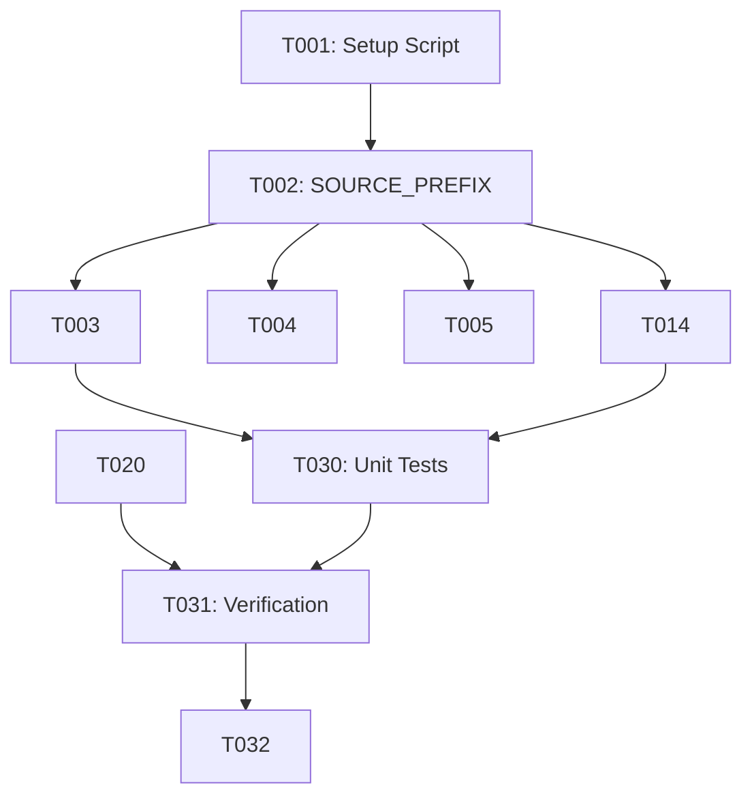

# Implementation Tasks: Complete NewsAPI Reference Purge

**Feature**: 501-purge-newsapi
**Branch**: `501-purge-newsapi`
**Generated**: 2025-12-19
**Total Tasks**: 32

## User Stories Mapping

| Story | Priority | Description | Tasks |
|-------|----------|-------------|-------|
| US1 | P1 | Zero grep matches for newsapi/news_api | T001, T030-T032 |
| US2 | P1 | Source ID uses article# prefix | T002-T019 |
| US3 | P2 | Documentation reflects current architecture | T020-T029 |

---

## Phase 1: Setup

- [ ] T001 Create verification script to count newsapi occurrences in scripts/verify-newsapi-purge.sh

---

## Phase 2: Core Source (US2 - Source ID Prefix)

**Goal**: Change `SOURCE_PREFIX` from "newsapi" to "article" and update all dependent code.

**Independent Test**: `python -c "from src.lib.deduplication import generate_source_id; assert generate_source_id({'url': 'test'}).startswith('article#')"`

### Core Library Files

- [ ] T002 [US2] Update SOURCE_PREFIX constant from "newsapi" to "article" in src/lib/deduplication.py:38
- [ ] T003 [P] [US2] Update all docstring examples in src/lib/deduplication.py (~15 occurrences)
- [ ] T004 [P] [US2] Update CloudWatch filter examples in src/lib/metrics.py (~5 occurrences)

### Lambda Shared Files

- [ ] T005 [P] [US2] Update validator field examples in src/lambdas/shared/schemas.py (lines 47-48, 114-115)
- [ ] T006 [P] [US2] Update docstring examples in src/lambdas/shared/dynamodb.py (~2 occurrences)
- [ ] T007 [P] [US2] Update secret path examples in src/lambdas/shared/secrets.py (~4 occurrences)
- [ ] T008 [P] [US2] Update chaos scenario type in src/lambdas/shared/chaos_injection.py

### Lambda Dashboard Files

- [ ] T009 [P] [US2] Update chaos scenario types in src/lambdas/dashboard/chaos.py (~5 occurrences)
- [ ] T010 [P] [US2] Update API doc example in src/lambdas/dashboard/handler.py

### Lambda Ingestion Files

- [ ] T011 [P] [US2] Update docstring examples in src/lambdas/ingestion/adapters/base.py
- [ ] T012 [P] [US2] Remove legacy comment in src/lambdas/ingestion/__init__.py
- [ ] T013 [P] [US2] Remove legacy comment in src/lambdas/ingestion/adapters/__init__.py

### Test Files (16 files)

- [ ] T014 [P] [US2] Update test fixtures in tests/unit/test_analysis_handler.py (15+ occurrences)
- [ ] T015 [P] [US2] Update mock secrets in tests/unit/test_secrets.py (12+ occurrences)
- [ ] T016 [P] [US2] Update assertions in tests/unit/test_metrics.py (8 occurrences)
- [ ] T017 [P] [US2] Update core assertions in tests/unit/test_deduplication.py (8 occurrences)
- [ ] T018 [P] [US2] Update resource IDs in tests/unit/test_errors.py (4 occurrences)
- [ ] T019 [US2] Update remaining test files: test_schemas.py, test_dynamodb_helpers.py, test_dashboard_handler.py, test_dashboard_metrics.py, test_chaos_injection.py, test_chaos_fis.py, tests/integration/*.py, tests/e2e/*.py, tests/conftest.py, tests/fixtures/synthetic_data.py

---

## Phase 3: Documentation (US3)

**Goal**: Update all documentation to reflect current Tiingo/Finnhub architecture.

**Independent Test**: `grep -ri "newsapi" docs/ --include="*.md" | wc -l` returns 0

### Project Root

- [ ] T020 [P] [US3] Update examples in CLAUDE.md
- [ ] T021 [P] [US3] Update lib overview in src/lib/README.md

### Documentation Files (docs/)

- [ ] T022 [P] [US3] Update chaos scenarios in docs/CHAOS_TESTING_OPERATOR_GUIDE.md
- [ ] T023 [P] [US3] Update secret names in docs/GITHUB_SECRETS_SETUP.md
- [ ] T024 [P] [US3] Update deployment examples in docs/DEPLOYMENT.md
- [ ] T025 [P] [US3] Update historical context in docs/LESSONS_LEARNED.md
- [ ] T026 [US3] Update remaining docs: CLOUD_PROVIDER_PORTABILITY_AUDIT.md, DASHBOARD_TESTING_BACKLOG.md, ZERO_TRUST_PERMISSIONS_AUDIT.md, TEST_LOG_ASSERTIONS_TODO.md, TEST-DEBT.md, PROMOTION_WORKFLOW_DESIGN.md, PRODUCTION_PREFLIGHT_CHECKLIST.md, GITHUB_ENVIRONMENTS_SETUP.md, IAM_TERRAFORM_TROUBLESHOOTING.md, INTEGRATION_TEST_REFACTOR_PLAN.md, DEMO_CHECKLIST.md, ENVIRONMENT_STRATEGY.md, PREPROD_DEPLOYMENT_ANALYSIS.md, PROMOTION_PIPELINE_MASTER_SUMMARY.md, LOG_VALIDATION_STATUS.md, PHASE_1_2_SUMMARY.md, PHASE_3_SUMMARY.md

### Infrastructure Files

- [ ] T027 [P] [US3] Update secret policy examples in infrastructure/terraform/ci-user-policy.tf
- [ ] T028 [P] [US3] Update scripts: demo-setup.sh, demo-validate.sh, setup-credentials.sh, test-credential-isolation.sh, pre-deploy-checklist.sh in infrastructure/scripts/
- [ ] T029 [US3] Update infrastructure docs: terraform/README.md, terraform/bootstrap/README.md, docs/CREDENTIAL_SEPARATION_SETUP.md, docs/TERRAFORM_RESOURCE_VERIFICATION.md

---

## Phase 4: Verification (US1)

**Goal**: Confirm zero newsapi/news_api occurrences anywhere in codebase.

**Independent Test**: grep returns 0 matches

- [ ] T030 [US1] Run unit tests to verify all pass: `python -m pytest tests/unit/ -v`
- [ ] T031 [US1] Run verification script: `bash scripts/verify-newsapi-purge.sh`
- [ ] T032 [US1] Final comprehensive grep verification excluding .git/: `grep -ri "newsapi\|news_api" . --include="*.py" --include="*.md" --include="*.yaml" --include="*.tf" --include="*.sh" | grep -v ".git/" | wc -l` must return 0

---

## Dependencies

### Critical Path

1. T001 → T002 (Setup → Core constant)
2. T002 → T003-T019 (Core → All dependent code/tests)
3. T020-T029 (Documentation - parallel to code)
4. T030 → T031 → T032 (Verification chain)

---

## Parallel Execution Opportunities

### Batch 1 (after T002 completes)
Run in parallel - different files, no dependencies:
- T003, T004, T005, T006, T007, T008, T009, T010, T011, T012, T013

### Batch 2 (test files - parallel)
Run in parallel - independent test files:
- T014, T015, T016, T017, T018

### Batch 3 (documentation - parallel)
Run in parallel - independent docs:
- T020, T021, T022, T023, T024, T025, T027, T028

---

## Implementation Strategy

### MVP Scope (User Story 2 only)
Complete T001-T019 for minimal viable purge:
- Core `SOURCE_PREFIX` changed
- All code references updated
- All tests passing

### Full Scope
Complete all T001-T032:
- MVP + documentation updates
- Infrastructure script updates
- Comprehensive verification

---

## Summary

| Phase | Task Count | Parallel Tasks |
|-------|------------|----------------|
| Setup | 1 | 0 |
| Core Source (US2) | 18 | 16 |
| Documentation (US3) | 10 | 8 |
| Verification (US1) | 3 | 0 |
| **TOTAL** | **32** | **24** |

**Key Metrics**:
- 75% of tasks can run in parallel
- 3 user stories covered
- 93 files affected across 6 categories
- Critical path: 5 sequential tasks (T001 → T002 → T030 → T031 → T032)
