# Implementation Plan: Financial News Sentiment & Asset Volatility Dashboard

**Branch**: `006-user-config-dashboard` | **Date**: 2025-11-26 | **Spec**: [spec.md](./spec.md)
**Input**: Feature specification from `/specs/006-user-config-dashboard/spec.md`

## Summary

Feature 006 pivots the sentiment analyzer from general news (NewsAPI/Guardian) to financial news APIs (Tiingo + Finnhub) for privacy compliance. The dashboard correlates financial news sentiment with asset volatility (ATR) for US stock tickers. Key capabilities include:

- **Dual-source sentiment**: Compare Tiingo news (our model) vs Finnhub built-in sentiment
- **Volatility correlation**: ATR calculation from OHLC price data with trend arrows
- **User configurations**: Up to 2 saved configs with 5 tickers each (US markets only)
- **Authentication**: Anonymous localStorage → AWS Cognito OAuth (Google/GitHub) or magic links via SendGrid
- **Notifications**: Email alerts for sentiment/volatility thresholds via SendGrid
- **Observability**: X-Ray tracing (Day 1), CloudWatch RUM, full metrics suite

## Architecture Diagram

```mermaid
%%{init: {'theme':'base', 'themeVariables': {'primaryColor':'#fff8e1', 'primaryTextColor':'#333', 'primaryBorderColor':'#c9a227', 'lineColor':'#555'}}}%%
graph TB
    subgraph External["External Data Sources"]
        Tiingo[Tiingo API<br/>Financial News<br/>Primary]
        Finnhub[Finnhub API<br/>Market News + Sentiment<br/>Secondary]
        SendGrid[SendGrid<br/>Email Service]
    end

    subgraph Auth["Authentication"]
        Cognito[AWS Cognito<br/>User Pool]
        Google[Google OAuth]
        GitHub[GitHub OAuth]
        MagicLink[Magic Link<br/>Email Auth]
    end

    subgraph AWS["AWS Cloud"]
        subgraph IngestionLayer["Ingestion Layer"]
            EB[EventBridge<br/>5 min schedule]
            IngestionLambda[Ingestion Lambda<br/>financial_handler.py<br/>X-Ray Traced]
            CircuitBreaker[Circuit Breaker<br/>Per-Service]
            QuotaTracker[Quota Tracker<br/>API Limits]
        end

        subgraph ProcessingLayer["Processing Layer"]
            SNS[SNS Topic<br/>sentiment-events]
            AnalysisLambda[Analysis Lambda<br/>Dual-Source Sentiment<br/>ATR Calculator<br/>X-Ray Traced]
            S3Model[S3 Bucket<br/>DistilBERT Model<br/>+ Ticker Cache]
        end

        subgraph APILayer["Dashboard API Layer"]
            CloudFront[CloudFront CDN<br/>Static Assets + API]
            DashboardLambda[Dashboard Lambda<br/>FastAPI + Mangum<br/>X-Ray Traced]
            AuthEndpoints[Auth Endpoints<br/>OAuth, Magic Links]
            ConfigEndpoints[Config API<br/>CRUD Operations]
            DataEndpoints[Data API<br/>Sentiment, Volatility<br/>Heat Maps]
        end

        subgraph NotificationLayer["Notification Layer"]
            AlertSNS[SNS Alert Topic]
            NotificationLambda[Notification Lambda<br/>Alert Evaluator<br/>X-Ray Traced]
            DigestSchedule[EventBridge<br/>Daily Digest]
        end

        subgraph StorageLayer["Storage Layer"]
            DDB[(DynamoDB<br/>Users, Configs<br/>Sentiment Results<br/>Alerts, Notifications)]
            DLQ[SQS DLQ<br/>Failed Messages]
        end

        subgraph ObservabilityLayer["Observability"]
            XRay[AWS X-Ray<br/>Distributed Tracing]
            CW[CloudWatch<br/>Logs & Metrics]
            RUM[CloudWatch RUM<br/>Client Analytics]
            Alarms[CloudWatch Alarms<br/>Tiingo/Finnhub/SendGrid]
        end
    end

    subgraph Users["Users"]
        Browser[Web Browser<br/>React Dashboard]
        Email[Email Client<br/>Alerts & Digests]
    end

    %% Data Flow - Ingestion
    EB -->|Trigger| IngestionLambda
    IngestionLambda -->|Check Quota| QuotaTracker
    IngestionLambda -->|Check Health| CircuitBreaker
    CircuitBreaker -->|If Healthy| Tiingo
    CircuitBreaker -->|If Healthy| Finnhub
    Tiingo -->|News Articles| IngestionLambda
    Finnhub -->|News + Sentiment| IngestionLambda
    IngestionLambda -->|Store Raw| DDB
    IngestionLambda -->|Publish| SNS

    %% Data Flow - Analysis
    SNS -->|Trigger| AnalysisLambda
    AnalysisLambda -->|Load Model| S3Model
    AnalysisLambda -->|Aggregate Sentiment| DDB
    AnalysisLambda -->|Calculate ATR| DDB
    AnalysisLambda -->|Failed| DLQ

    %% Data Flow - API
    Browser -->|HTTPS| CloudFront
    CloudFront -->|Static| S3Model
    CloudFront -->|/api/*| DashboardLambda
    DashboardLambda --> AuthEndpoints
    DashboardLambda --> ConfigEndpoints
    DashboardLambda --> DataEndpoints
    AuthEndpoints -->|Validate| Cognito
    Cognito -->|OAuth| Google
    Cognito -->|OAuth| GitHub
    AuthEndpoints -->|Magic Link| SendGrid
    ConfigEndpoints -->|CRUD| DDB
    DataEndpoints -->|Query| DDB
    DashboardLambda -->|Evaluate| AlertSNS

    %% Data Flow - Notifications
    AlertSNS -->|Trigger| NotificationLambda
    DigestSchedule -->|Daily| NotificationLambda
    NotificationLambda -->|Query Alerts| DDB
    NotificationLambda -->|Send Email| SendGrid
    NotificationLambda -->|Record| DDB
    SendGrid -->|Deliver| Email

    %% Observability
    IngestionLambda -.->|Trace| XRay
    AnalysisLambda -.->|Trace| XRay
    DashboardLambda -.->|Trace| XRay
    NotificationLambda -.->|Trace| XRay
    IngestionLambda -.->|Logs| CW
    AnalysisLambda -.->|Logs| CW
    DashboardLambda -.->|Logs| CW
    NotificationLambda -.->|Logs| CW
    Browser -.->|Analytics| RUM
    CW -.->|Alerts| Alarms

    classDef layerBox fill:#fff8e1,stroke:#c9a227,stroke-width:2px,color:#333
    classDef lambdaStyle fill:#7ec8e3,stroke:#3a7ca5,stroke-width:2px,color:#1a3a4a
    classDef storageStyle fill:#a8d5a2,stroke:#4a7c4e,stroke-width:2px,color:#1e3a1e
    classDef messagingStyle fill:#b39ddb,stroke:#673ab7,stroke-width:2px,color:#1a0a3e
    classDef monitoringStyle fill:#ffb74d,stroke:#c77800,stroke-width:2px,color:#4a2800
    classDef externalStyle fill:#ef5350,stroke:#b71c1c,stroke-width:2px,color:#fff
    classDef authStyle fill:#81d4fa,stroke:#01579b,stroke-width:2px,color:#01579b

    class External,Auth,AWS,IngestionLayer,ProcessingLayer,APILayer,NotificationLayer,StorageLayer,ObservabilityLayer,Users layerBox
    class IngestionLambda,AnalysisLambda,DashboardLambda,NotificationLambda lambdaStyle
    class DDB,DLQ,S3Model storageStyle
    class SNS,AlertSNS messagingStyle
    class CW,XRay,RUM,Alarms,EB,DigestSchedule monitoringStyle
    class Tiingo,Finnhub,SendGrid,Browser,Email externalStyle
    class Cognito,Google,GitHub,MagicLink,AuthEndpoints,ConfigEndpoints,DataEndpoints,CircuitBreaker,QuotaTracker,CloudFront authStyle
```



### Data Flow Summary

1. **Ingestion**: EventBridge triggers → Circuit breaker checks → Tiingo/Finnhub fetch → DynamoDB store → SNS publish
2. **Analysis**: SNS trigger → Load DistilBERT model → Aggregate dual-source sentiment → Calculate ATR → Store results
3. **Dashboard**: CloudFront → Lambda Function URL → Auth validation → Config CRUD → Sentiment/Volatility queries
4. **Notifications**: Alert evaluation → SendGrid email → Daily digest scheduling

## Technical Context

**Language/Version**: Python 3.13
**Primary Dependencies**: FastAPI, boto3, pydantic, aws-lambda-powertools, requests
**Frontend**: React/Next.js with TailwindCSS (mobile-first responsive)
**Storage**: DynamoDB (users, configurations, sentiment results, alerts), S3 (static assets)
**Testing**: pytest with moto (unit), real AWS dev environment (integration)
**Target Platform**: AWS Lambda (4 functions), CloudFront CDN, Cognito
**Project Type**: Web application (Lambda API + static frontend)
**Performance Goals**: 3s dashboard load on 3G, 2s config switch, 10s first sentiment results
**Constraints**: <$100/mo cost, Tiingo 500 symbols/mo, Finnhub 60 calls/min
**Scale/Scope**: 1,000 concurrent anonymous sessions, 90-day data retention (auth users)

## Constitution Check

*GATE: Must pass before Phase 0 research. Re-check after Phase 1 design.*

| Constitution Requirement | Status | Implementation |
|-------------------------|--------|----------------|
| **Functional: Ingest from external APIs** | ✅ PASS | Tiingo + Finnhub adapters with backoff/retry |
| **Functional: Pluggable adapters** | ✅ PASS | Adapter pattern for Tiingo, Finnhub, future sources |
| **Functional: Deduplicate items** | ✅ PASS | Content hash + ticker+timestamp dedup in DynamoDB |
| **Functional: Return sentiment result** | ✅ PASS | pos/neu/neg + score 0-1 + model_version |
| **Security: Auth on admin endpoints** | ✅ PASS | Cognito OAuth + API key auth |
| **Security: Secrets in managed service** | ✅ PASS | Secrets Manager for Tiingo/Finnhub/SendGrid keys |
| **Security: Parameterized queries** | ✅ PASS | boto3 parameterized DynamoDB expressions |
| **Security: TLS in transit** | ✅ PASS | HTTPS enforced via CloudFront + Lambda URLs |
| **Deployment: Serverless on AWS** | ✅ PASS | Lambda + SNS + DynamoDB + S3 |
| **Deployment: Infrastructure as Code** | ✅ PASS | Terraform with S3 backend |
| **Observability: Structured logs** | ✅ PASS | Lambda Powertools JSON logging |
| **Observability: X-Ray tracing** | ✅ PASS | Day 1 mandatory (all 6 Lambdas) |
| **Observability: CloudWatch metrics** | ✅ PASS | Custom metrics + alarms |
| **Testing: Unit + Integration** | ✅ PASS | pytest + moto (unit), real AWS (integration) |
| **Dashboard: External metrics view** | ✅ PASS | CloudWatch RUM + metrics dashboard |
| **Dashboard: Admin feed controls** | ✅ PASS | Config management for tickers/timeframes |

**Constitution Gate**: ✅ **PASSED** - All minimal requirements satisfied.

## Project Structure

### Documentation (this feature)

```text
specs/006-user-config-dashboard/
├── plan.md              # This file
├── research.md          # Phase 0 output - technology decisions
├── data-model.md        # Phase 1 output - entity schemas
├── quickstart.md        # Phase 1 output - local dev setup
├── contracts/           # Phase 1 output - API specifications
│   ├── dashboard-api.md # REST API for dashboard Lambda
│   ├── auth-api.md      # Cognito + magic link flows
│   └── notification-api.md # Alert management endpoints
└── tasks.md             # Phase 2 output (/speckit.tasks)
```

### Source Code (repository root)

```text
# Existing structure (preserved and extended)
src/
├── lambdas/
│   ├── ingestion/       # MODIFY: Add Tiingo + Finnhub adapters
│   │   ├── handler.py
│   │   ├── adapters/    # NEW: tiingo.py, finnhub.py
│   │   └── models.py
│   ├── analysis/        # MODIFY: ATR calculation, dual-source comparison
│   │   ├── handler.py
│   │   ├── atr.py       # NEW: ATR volatility calculation
│   │   └── sentiment.py # MODIFY: Support Finnhub built-in scores
│   ├── dashboard/       # MODIFY: User configs, heat map data
│   │   ├── handler.py
│   │   ├── api_v2.py    # NEW: Config management, alerts API
│   │   └── auth.py      # NEW: Cognito integration
│   ├── notification/    # NEW: Alert evaluation + SendGrid email
│   │   ├── handler.py
│   │   └── sendgrid.py
│   ├── metrics/         # EXISTING: CloudWatch metrics aggregation
│   └── shared/
│       ├── models/      # MODIFY: Add User, Configuration, Alert entities
│       ├── auth/        # NEW: Cognito helpers, magic link validation
│       └── cache/       # NEW: Ticker validation cache (~8K symbols)
├── dashboard/           # MODIFY: React frontend with heat maps
│   ├── components/      # NEW: HeatMap, TickerInput, ConfigSwitcher
│   ├── pages/           # NEW: Dashboard, Settings, Alerts
│   └── services/        # NEW: API client, localStorage manager
└── lib/
    └── logging_utils.py # EXISTING: Structured logging

tests/
├── unit/
│   ├── lambdas/
│   │   ├── ingestion/   # NEW: Tiingo/Finnhub adapter tests
│   │   ├── analysis/    # NEW: ATR calculation tests
│   │   ├── dashboard/   # MODIFY: Config API tests
│   │   └── notification/ # NEW: Alert evaluation tests
│   └── dashboard/       # NEW: React component tests
├── integration/
│   ├── test_ingestion_preprod.py  # MODIFY: Financial API tests
│   └── test_dashboard_preprod.py  # MODIFY: Config flow tests
└── e2e/
    └── test_user_flows.py  # NEW: Anonymous → Auth conversion tests

infrastructure/
└── terraform/
    ├── main.tf          # MODIFY: Add Cognito, CloudFront, new secrets
    ├── modules/
    │   ├── cognito/     # NEW: User pool, OAuth providers
    │   ├── cloudfront/  # NEW: CDN for static assets
    │   └── xray/        # NEW: X-Ray tracing configuration
    └── variables.tf     # MODIFY: Add new API keys, Cognito config
```

**Structure Decision**: Extend existing Lambda-based architecture. Add `notification/` Lambda for alert processing, extend `ingestion/` with financial API adapters, add React frontend components for heat map visualization.

## Complexity Tracking

No constitution violations requiring justification. Architecture follows existing serverless patterns.

## Phase Outputs

### Phase 0: Research ✅ COMPLETE
- [x] research.md - Technology decisions for Tiingo/Finnhub/Cognito/SendGrid

### Phase 1: Design ✅ COMPLETE
- [x] data-model.md - Entity schemas (User, Configuration, SentimentResult, Alert)
- [x] contracts/dashboard-api.md - REST API specification
- [x] contracts/auth-api.md - Authentication flows
- [x] contracts/notification-api.md - Alert management
- [x] quickstart.md - Local development setup

### Phase 2: Tasks (via /speckit.tasks)
- [ ] tasks.md - Implementation task breakdown

---

## Planning Complete

**Branch**: `006-user-config-dashboard`
**Plan File**: `/specs/006-user-config-dashboard/plan.md`
**Status**: Ready for `/speckit.tasks` to generate implementation tasks

### Generated Artifacts

| Artifact | Path | Description |
|----------|------|-------------|
| Research | `research.md` | Technology decisions (APIs, auth, visualization) |
| Data Model | `data-model.md` | Entity schemas with DynamoDB key design |
| Dashboard API | `contracts/dashboard-api.md` | REST API for configs, sentiment, volatility |
| Auth API | `contracts/auth-api.md` | OAuth, magic links, session management |
| Notification API | `contracts/notification-api.md` | Alert rules and email notifications |
| Quickstart | `quickstart.md` | Local development setup guide |

### Next Steps

1. Run `/speckit.tasks` to generate implementation task breakdown
2. Review and prioritize tasks
3. Begin implementation following task order
